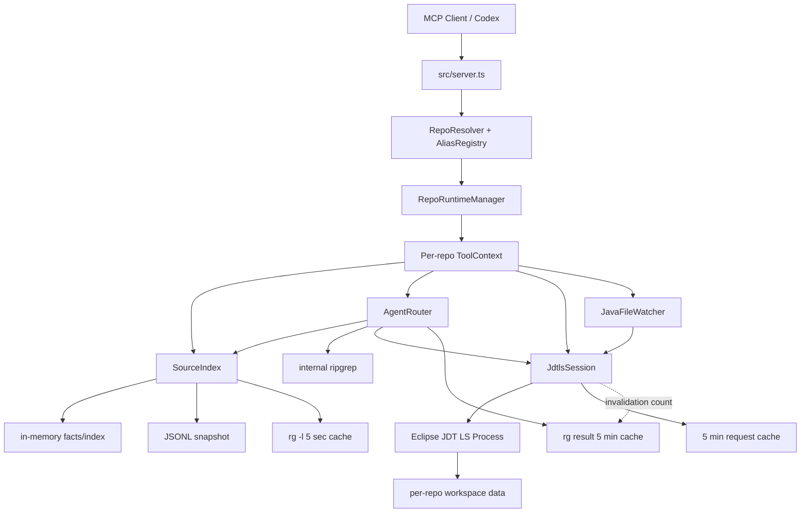
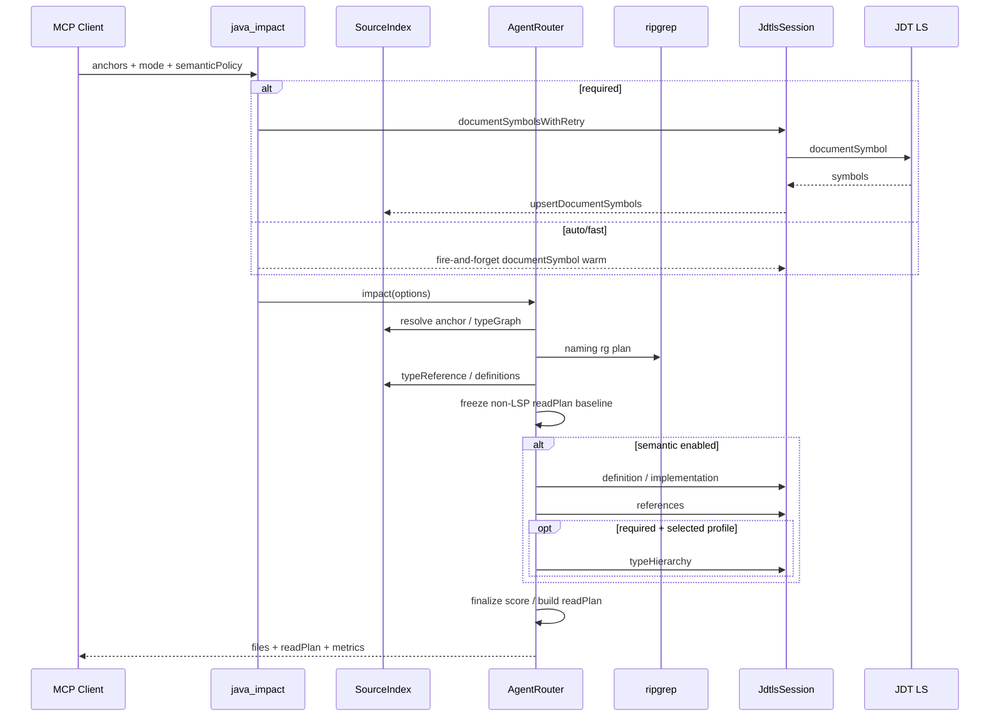
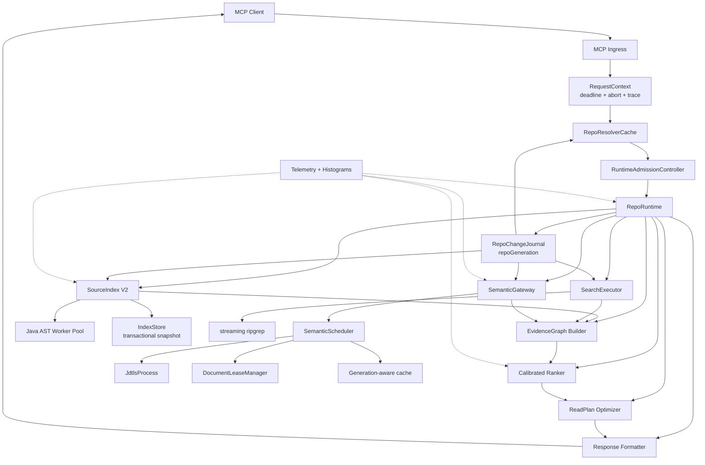
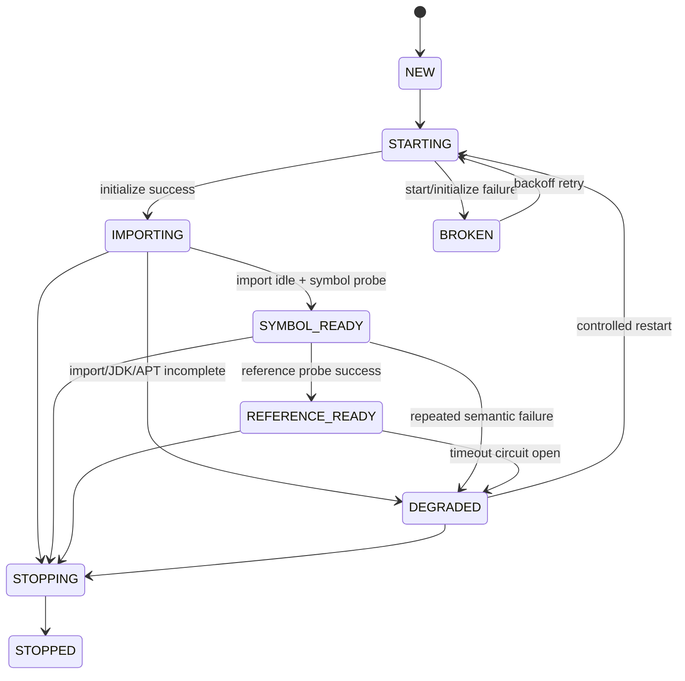

# codex-java-lsp-mcp 深度架构评审与全方位优化改造方案

> 面向性能、识别效果、正确性、通用性、并发与工程化的阶段性改造路线  
> 调研日期：2026-07-23  
> 目标仓库：`lkyprogramer/codex-java-lsp-mcp`  
> 调研基线：`main` 分支，调研时可见最新提交 `03c49bab011d51fcba1bb0efc4b4dc01abc9b498`（2026-07-02）  
> 输出性质：架构评审、风险审计、技术路线和验收方案，不是已经完成的代码改造

---

## 目录

1. [执行摘要](#1-执行摘要)
2. [调研范围、证据口径与限制](#2-调研范围证据口径与限制)
3. [项目现状与最新基线](#3-项目现状与最新基线)
4. [当前整体架构与关键调用链](#4-当前整体架构与关键调用链)
5. [架构成熟度判断](#5-架构成熟度判断)
6. [核心问题总表](#6-核心问题总表)
7. [P0：正确性与运行时稳定性问题](#7-p0正确性与运行时稳定性问题)
8. [P1：性能瓶颈与资源问题](#8-p1性能瓶颈与资源问题)
9. [P1：识别效果与排序问题](#9-p1识别效果与排序问题)
10. [P1：评测体系问题](#10-p1评测体系问题)
11. [目标架构](#11-目标架构)
12. [SourceIndex V2 方案](#12-sourceindex-v2-方案)
13. [JDT LS 语义运行时 V2 方案](#13-jdt-ls-语义运行时-v2-方案)
14. [Evidence Graph、Ranker 与 ReadPlan 方案](#14-evidence-graphranker-与-readplan-方案)
15. [识别能力的分层增强路线](#15-识别能力的分层增强路线)
16. [性能专项优化方案](#16-性能专项优化方案)
17. [评测、测试与回归门禁体系](#17-评测测试与回归门禁体系)
18. [阶段性实施路线](#18-阶段性实施路线)
19. [按文件拆分的改造清单](#19-按文件拆分的改造清单)
20. [建议 SLO/KPI 与发布门槛](#20-建议-slokpi-与发布门槛)
21. [灰度、兼容与回滚策略](#21-灰度兼容与回滚策略)
22. [风险登记与应对](#22-风险登记与应对)
23. [首三个迭代的建议任务包](#23-首三个迭代的建议任务包)
24. [明确不建议做的事情](#24-明确不建议做的事情)
25. [最终结论](#25-最终结论)
26. [附录：数据契约、实验矩阵与参考资料](#附录数据契约实验矩阵与参考资料)

---

# 1. 执行摘要

## 1.1 总体判断

这个项目的产品方向是对的，而且已经越过了“简单 LSP 包装器”的阶段：

- 公共工具面收敛为 7 个 MCP tools，避免把底层 LSP API 原样暴露给 Agent。
- `java_impact` 已形成“SourceIndex/rg 冷路径 + JDT LS 按需语义增强”的双层体系。
- 已经建立候选集、readPlan、token、P50/P95、warm state、golden attribution 等评测概念。
- 现有文档能够诚实记录失败方案：`warm-required` 未达默认门槛；直接扩大 readPlan 会损害 `P_read` 和 payload；纯 `typeReference` 提到 P1 无净收益；强重排 P1 会挤掉 must-hit。
- 已有优化取得实质收益：`warm-auto` 曾从约 1.65 秒降到约 74 毫秒；TypeReference 将 `exam-parent-v3` cold recall 从 `0.5217` 提升到 `0.6300`；已加载 facts 的索引快路将 TypeReference P95 再降低约 35%～50%。

但从底层架构看，项目目前仍处于**“可用、可验证、但还不能稳定放大”**的阶段。继续主要依靠加正则、加候选、调魔数，会快速进入收益递减，并放大陈旧缓存、事件循环阻塞、语义首触抖动和评测过拟合问题。

## 1.2 当前最重要的五个结论

### 结论一：第一优先级不是继续调 ranking，而是修复一致性和生命周期边界

冷路径和热路径没有共享一个可靠的 repo change generation：

- JDT LS 文件监听只在 JDT LS 启动后存在；
- fast/cold 请求可能长期不启动 JDT LS；
- AgentRouter 的 `rg` 缓存 TTL 为 5 分钟，generation 又依赖 JDT LS cache invalidation；
- SourceIndex 的持久化快照和内存索引没有统一的增删改事件流；
- `rg` 超时后的部分 stdout 仍会被解析并写入缓存。

这会造成一种比“慢”更危险的问题：**结果看起来成功，但可能是不完整或陈旧的。**

### 结论二：Node 主事件循环仍承载大量同步工作，并发下会整体冻结

核心路径存在 `spawnSync("rg", ...)`、同步 `stat/read/append/write/rename`、同步 git/JDK 探测、全缓存 `statSync` 扫描和 JSONL compact。单请求 benchmark 可能尚可，但并发 MCP 请求、JDT LS 通知、watcher flush 和大仓库索引同时发生时，Node 事件循环会被整体阻塞。当前没有 event-loop delay、ELU、heap/RSS 等门禁。

### 结论三：`warm-required` 的核心不是“references 单纯很慢”，而是没有完整的语义调度和 readiness 模型

JDT LS 实际至少存在“进程创建、initialize、workspace import、symbol-ready、reference-first-touch、reference-ready、degraded”多个阶段；当前实现只区分 started/not started。源码还存在明确竞态：`start()` 在 initialize 完成前就赋值 `process` 和 `connection`，后续 `ensureStarted()` 可能把“正在初始化”误判为“已启动”，让请求提前进入未 ready 的 server。

后续必须引入显式状态机、原子 start singleflight、end-to-end deadline、per-repo 调度器、请求 singleflight、partial-result/cancel 行为探测和 circuit breaker。

### 结论四：识别效果的下一跳应是“证据图 + 合格排序”，不是继续扩大字符串召回

当前 ranking 仍大量依赖 `lishuedu-legacy` policy、手工正则和加法式魔数；同一事实可能被 `rg`、typeReference、命名规则重复计分；simple name 在不同 package/module 中碰撞；TypeGraph 只覆盖已加载 facts；方法体调用边和框架隐式边不足；references 只取 server 原始顺序前 40 条；readPlan 不是受 token/slot 约束的效用优化。

后续应把候选升级为带来源、边类型、置信度、完整度和代次的 Evidence Graph，再做去相关、饱和、校准和预算优化。

### 结论五：现有 benchmark 足以发现问题，但不足以证明真通用和可发布

目前最强真实基准只有 3 个项目、15 个场景，规则演化又明显受这些项目尤其 lishuedu 影响；没有 repo 级 blind split；warm benchmark 共用 session/cache，存在顺序效应；缺少并发、编辑、rename/delete、watcher 丢事件、JDT LS 崩溃和 rg timeout 系统测试；多个真实仓库测试默认 skip；没有 CI 复现闭环。

因此正确实施顺序是：

> **正确性与观测 → 事件循环与索引底座 → JDT LS 调度与首触 → Evidence Graph 与排序 → ReadPlan 优化 → CI/灰度与长期学习。**

---

# 2. 调研范围、证据口径与限制

## 2.1 覆盖范围

本次审阅了 MCP server、7 个 public tools、repo 解析与 alias、worktree/cache identity、`RepoRuntimeManager`、`JdtlsSession`、`SourceIndex`、`AgentRouter`、routing policy/ranking signals、文件监听与布局探测、JDK/Lombok/APT、benchmark/golden attribution/readPlan、现有测试和全部核心性能报告，并核对了 LSP 3.17、Node child process/perf hooks/worker threads、Eclipse JDT LS 官方约束。

## 2.2 证据等级

| 等级 | 含义 |
|---|---|
| A | 直接来自当前源码 |
| B | 来自仓库内可复现命令和测试报告 |
| C | 基于源码和协议行为的架构推断 |
| D | 待实验验证的优化假设 |

## 2.3 重要限制

本次没有在独立环境中重新运行完整 benchmark：真实 golden 场景依赖本地 `lishuedu`、`cipherlink`、`exam-parent-v3` 业务仓库，warm 测试还依赖匹配的 JDT LS、JDK、Maven/Gradle 缓存和 workspace data。因此现有性能数字来自仓库内测试文档，源码问题来自静态审阅；所有目标值都应在固定 hardware manifest 上重建基线，不能理解为已经完成的实测结果。

---

# 3. 项目现状与最新基线

## 3.1 产品定位

README 的定位清晰：用户级 Java-only Codex MCP，以低 token 成本提供语义导航；SourceIndex 和内部 `rg` 用于快速收敛，JDT LS 用于有界语义增强；`java_impact` 是推荐入口；`repoRoot/repoHash` 是边界；不扩张 public tool 数；`warm-required` 暂不默认。该定位应保持，不建议改造成“暴露全部 LSP API”的通用代理。

## 3.2 最新 cold 基线

2026-07-02 readPlan capacity 报告、默认 `readPlan slots=6`：

| project | recall | precision | R_read_must | P_read | elapsed P50/P95 | shouldBlocksTask hit/full/absent |
|---|---:|---:|---:|---:|---:|---:|
| lishuedu | 0.7756 | 0.4127 | 1.0000 | 0.8000 | 8.33 / 178.66 ms | 4 / 3 / 7 |
| cipherlink | 0.8357 | 0.4411 | 1.0000 | 0.5333 | 4.80 / 120.05 ms | 3 / 12 / 3 |
| exam-parent-v3 | 0.6300 | 0.2977 | 1.0000 | 0.4000 | 4.04 / 131.56 ms | 1 / 7 / 10 |

判断：must 保护有效；candidate recall 已可用；exam precision 和任务阻塞项命中较弱；cipherlink 更偏 readPlan-full；lishuedu/exam 扩 slot 收益有限，说明不是简单容量不足。

## 3.3 TypeReference 收益与代价

2026-07-01 Task 4 报告：

| project | cold recall | cold precision | cold elapsed P50/P95 | TypeReference P50/P95 |
|---|---:|---:|---:|---:|
| lishuedu | 0.7756 | 0.4127 | 125.61 / 463.40 ms | 110 / 350 ms |
| cipherlink | 0.8357 | 0.4411 | 80.82 / 221.83 ms | 71 / 160 ms |
| exam-parent-v3 | 0.6300 | 0.2977 | 137.55 / 194.15 ms | 129 / 162 ms |

exam recall 从 `0.5217` 提升到 `0.6300`，但冷延迟明显上升。后续“已加载 facts 索引快路”将 TypeReference P95 降低：lishuedu 213→135ms、cipherlink 79→50ms、exam 132→85ms、lishuedu warm-auto 229→114ms。方向正确，但当前只是已加载 facts index，不是全仓完整索引，index miss 不能解释为仓库中不存在。

## 3.4 warm 基线必须按代码阶段区分

| 阶段 | 状态 | 代表结果 |
|---|---|---|
| warm 调度修正后、Task 4 前 | warm-auto | P95 从约 1655ms 降到约 73.86ms |
| Task 4 后 | lishuedu warm-auto | P50/P95 约 10.21/306.67ms，semantic timeout=0，主要为本地 TypeReference 首触 |
| warm-required 首触 | 三仓历史 | P95 约 1505～1717ms |
| Task 4 后 exam warm-required | warm-required | P50/P95 约 3.07/2104.25ms，5 次 semantic timeout |

当前有两个独立首触问题：cold/warm-auto 的 SourceIndex/`rg -l` 首触，以及 warm-required 的 JDT LS references/type hierarchy 首触，不能用同一种缓存手段解决。

## 3.5 现有测试覆盖

最新报告为 `77 tests / 73 pass / 0 fail / 4 skipped`。覆盖 Java source facts、documentSymbol 替换、snapshot corruption/legacy/compact、typeGraph/typeReference、routing/readPlan/verbosity、required semantic fallback、fake references/typeHierarchy、runtime eviction、watcher roots、benchmark CLI。缺少并发原子性、缓存一致性、超时后端残留、partial result、进程崩溃、多进程 store、mutation/fault 等系统验证。

---

# 4. 当前整体架构与关键调用链

## 4.1 组件图



## 4.2 `java_impact` 流水线



## 4.3 缓存与一致性域

| 层 | 数据 | TTL/生命周期 | 当前失效来源 | 风险 |
|---|---|---|---|---|
| AliasRegistry | alias/config | mtime+size | resolve 时检查 | 同 mtime/size 改动、临时坏配置 |
| RuntimeManager | ToolContext Map | 进程生命周期 | idle 只 stop session | stopped context 长期保留 |
| SourceIndex memory | facts/type index | runtime | `factsFor` 单文件 stat | delete/rename/未访问文件陈旧 |
| SourceIndex JSONL | facts/method | 跨进程 | append/compact | 并发写、绝对路径、陈旧记录 |
| SourceIndex rg cache | pattern→files | 5 秒 | TTL | timeout/变化 |
| AgentRouter rg cache | section→summary | 5 分钟 | JDT cache invalidation | fast 模式无 watcher |
| JDT LSP cache | semantic result | 5 分钟 | watcher dependency | workspace 依赖不完整 |
| JDT workspace | JDT index/import | 跨会话 | JDT 自身 | readiness 不透明 |
| OpenDocuments | 文件全文 | session | delete/stop | 无 LRU、内存增长 |

本质问题：每层都有自己的新鲜度定义，但没有统一 repo generation 和 completeness 契约。

---

# 5. 架构成熟度判断

## 5.1 已经做对的部分

- **工具面克制**：7 个 public tools 是合理边界。
- **冷/热分层正确**：SourceIndex/rg 保证低成本，JDT LS 补强语义。
- **readPlan 设计有价值**：候选和 Agent 实际阅读分离，能治理 token 与 round-trip。
- **实验记录诚实**：会主动否决默认扩容、强重排和 warm-required 默认化。
- **repo/worktree identity 基本正确**：JDT LS workspace data 按 repo 独立，符合上游要求。

## 5.2 尚未跨越的门槛

1. 从“功能可用”到“结果可信”：缺少统一 generation、completeness、stale handling。
2. 从“单请求快”到“并发稳定”：缺少事件循环、队列、deadline、singleflight 和负载测试。
3. 从“规则有效”到“跨项目泛化”：仍运行 `lishuedu-legacy`，数据与规则来源高度相关。
4. 从“有 benchmark”到“发布门禁”：缺少 blind split、统计置信区间、环境清单、CI 和故障测试。

---

# 6. 核心问题总表

| ID | 严重度 | 问题 | 主要影响 | 建议阶段 |
|---|---|---|---|---|
| C-01 | P0 | JDT LS initialize 前被误判为 started | 协议错误、随机首触失败 | 阶段 0 |
| C-02 | P0 | JDT LS start 失败非事务清理 | 残留进程/连接、后续请求污染 | 阶段 0 |
| C-03 | P0 | fast/cold 无统一文件变更 generation | 陈旧候选和 readPlan | 阶段 0～1 |
| C-04 | P0 | `rg` timeout 的部分结果被缓存 | 把假阴性放大 5 分钟 | 阶段 0 |
| C-05 | P0 | LSP location 未强制 repo containment | 可能返回依赖/JDK/仓库外文件 | 阶段 0 |
| C-06 | P0 | Runtime active slot 非原子预占 | 并发时超过 JDT LS 上限 | 阶段 0～1 |
| C-07 | P0 | end-to-end deadline 缺失 | 多 anchor/多阶段超时相乘 | 阶段 0～1 |
| P-01 | P1 | 主线程同步 fs/process/compact | 并发下事件循环冻结 | 阶段 1～2 |
| P-02 | P1 | SourceIndex 不完整且无 coverage | 首触慢、false negative 不可区分 | 阶段 2 |
| P-03 | P1 | Router `rg` 全量 stdout buffering | 内存、ENOBUFS、延迟 | 阶段 2 |
| P-04 | P1 | LSP 请求无 singleflight/调度器 | 重复首触、拥塞、尾延迟 | 阶段 3 |
| P-05 | P1 | openDocuments 无 LRU/didClose | 长会话内存增长 | 阶段 3 |
| P-06 | P1 | hierarchy 递归串行且无 visited | 重复请求、潜在环和长尾 | 阶段 3 |
| P-07 | P1 | 资源策略只按物理内存 | 容器/实时负载不准确 | 阶段 5 |
| Q-01 | P1 | simple-name 类型索引碰撞 | 错误关联、跨模块误召回 | 阶段 2～4 |
| Q-02 | P1 | regex parser 覆盖有限 | nested/record/interface/body edge 缺失 | 阶段 2～4 |
| Q-03 | P1 | legacy policy 含项目专用知识 | 通用性和过拟合风险 | 阶段 4 |
| Q-04 | P1 | 加法评分重复计算相关证据 | 排序不可校准 | 阶段 4 |
| Q-05 | P1 | references 只取 server 顺序前 40 | 高价值引用可能被截掉 | 阶段 3～4 |
| Q-06 | P1 | readPlan 是启发式选槽 | readPlan-full 与 P_read 冲突 | 阶段 4 |
| M-01 | P1 | 3 repo/15 scenario，无 blind split | 无法证明真通用 | 阶段 1～5 |
| M-02 | P1 | warm benchmark 有顺序/cache 污染 | P95 可比性不足 | 阶段 1 |
| M-03 | P1 | 缺少 mutation/concurrency/fault tests | 系统风险未被门禁捕获 | 阶段 0～5 |
| O-01 | P2 | Runtime Map 停止后不删除 context | 多 repo 使用后内存积累 | 阶段 1 |
| O-02 | P2 | 配置 reload 无 last-known-good | 临时坏文件可让请求失败 | 阶段 1 |
| O-03 | P2 | 布局/JDK/APT 只看有限根目录 | 非标准项目识别不完整 | 阶段 2～4 |
| S-01 | P1 | JDT LS 可触发不可信 build import | 安全和副作用风险 | 阶段 3～5 |

---

# 7. P0：正确性与运行时稳定性问题

## 7.1 C-01：JDT LS “伪 started”竞态

### 证据

`JdtlsSession.ensureStarted()` 当前先判断：

```ts
if (this.connection && this.process && !this.process.killed) {
  return;
}
```

而 `start()` 在 initialize 完成之前就执行：

```ts
this.process = child;
this.connection = connection;
const initializeResult = await connection.sendRequest("initialize", ...);
```

### 竞态过程

1. 请求 A 调用 `ensureStarted()`；
2. A 进入 `start()`，创建 child/connection；
3. initialize 尚未完成；
4. 请求 B 调用 `ensureStarted()`；
5. B 看到 process+connection，直接返回；
6. B 开始发送 `textDocument/*`；
7. LSP 规范要求 initialize 返回前客户端不得发送其他请求。

### 影响

- 随机首触失败或 `ServerNotInitialized`；
- warm-required P95 可能掺入生命周期竞态；
- `status.started` 在 initialize 前报告 true；
- 同一 workspace 在未 ready 状态接收请求，错误表现会被误记为 timeout。

### 修复

引入显式状态机，`ensureStarted()` 必须优先判断 `startPromise/state`，不能以 connection 存在代表 ready：

```ts
type SessionState =
  | "NEW" | "STARTING" | "IMPORTING"
  | "SYMBOL_READY" | "REFERENCE_READY"
  | "DEGRADED" | "BROKEN" | "STOPPING" | "STOPPED";

async ensureStarted(deadline: Deadline): Promise<void> {
  if (this.stateAtLeast("IMPORTING")) return;
  if (this.startPromise) return await this.startPromise;
  this.startPromise = this.startTransactional(deadline);
  try {
    await this.startPromise;
  } finally {
    this.startPromise = undefined;
  }
}
```

### 必须新增的测试

- 100 个并发 `ensureStarted()`；
- 只启动一个 child；
- initialize response 前没有 textDocument/workspace request；
- initialize timeout 后 child/connection/log stream 全释放；
- 第二次请求能干净重启。

## 7.2 C-02：启动失败不是事务性的

`start()` 创建 child、log stream、connection，并赋值成员字段后再 initialize。initialize timeout、空结果或 handler 异常时，没有统一的 `catch -> dispose/kill/reset`。

### 影响

- orphan JDT LS；
- 已失效 connection 残留；
- subsequent `ensureStarted()` 误判；
- workspace data 处于半初始化；
- 资源上限统计失真。

### 修复原则

- 使用局部 pending child/connection；
- initialize 成功、client handlers ready、必要的 initial settings 发送后再 commit 到公开成员；
- 失败统一 dispose、SIGTERM、超时 SIGKILL、清空 open docs/cache/progress；
- workspace data 是否保留由错误类别决定；
- state 转为 BROKEN，采用指数 backoff，而不是每个请求立即重启风暴。

伪代码：

```ts
private async startTransactional(deadline: Deadline): Promise<void> {
  let child: ChildProcessWithoutNullStreams | undefined;
  let connection: MessageConnection | undefined;
  try {
    child = spawn(...);
    connection = createMessageConnection(...);
    connection.listen();
    await requestWithDeadline(connection, "initialize", this.initializeParams(), deadline);
    connection.sendNotification("initialized", {});
    this.commitLiveSession(child, connection);
  } catch (error) {
    connection?.dispose();
    await terminateChild(child);
    this.resetVolatileState();
    this.state = "BROKEN";
    throw error;
  }
}
```

## 7.3 C-03：缺少统一 RepoChangeJournal

### 现状

- FileWatcher 只在 JDT LS session 启动后创建；
- `semanticPolicy=fast` 可能永不启动 session；
- Router `rg` cache generation 来自 `session.cacheStatus().invalidations`；
- 无 JDT LS 时 generation 不随 repo 编辑；
- SourceIndex 只在访问具体文件时比较 mtime/size；
- delete/rename 的旧 facts 可能留在 index；
- `layoutContext` 在 runtime 创建时固定，构建文件改变后不重新探测。

### 建议

建立独立于 JDT LS 的 `RepoChangeJournal`：

```ts
type RepoGeneration = bigint;

interface RepoChangeEvent {
  generation: RepoGeneration;
  kind: "create" | "change" | "delete" | "rename" | "build-config";
  path: string;
  oldPath?: string;
  observedAtNs: bigint;
  source: "watcher" | "periodic-reconcile" | "explicit-open";
}
```

要求：

- RepoRuntime 创建即启动最小 watcher，不依赖 JDT LS；
- watcher 只写 journal，不直接耦合各缓存；
- SourceIndex、Router cache、LSP cache、layout/JDK/APT detector 订阅同一 generation；
- watcher overflow/error 时 `dirtyUnknown=true` 并周期 reconcile；
- build config 变化单独提升 `semanticEpoch`，必要时刷新或重启 JDT LS；
- diagnostic 返回 `repoGeneration/indexedGeneration/completeness`。

## 7.4 C-04：`rg` timeout 的部分结果不应缓存

AgentRouter 的 `rgSummary()` 对 `ETIMEDOUT` 不抛错，仍解析 partial stdout 并写入 5 分钟 cache。该行为会把“本次搜索没跑完”解释为“这些就是全部结果”，将瞬时资源问题放大为稳定假阴性。

所有搜索结果必须携带完整度：

```ts
type SearchCompletion =
  | "COMPLETE"
  | "TIMEOUT_PARTIAL"
  | "ABORTED_PARTIAL"
  | "BUFFER_LIMIT_PARTIAL"
  | "ERROR";

interface SearchResult<T> {
  completion: SearchCompletion;
  items: T[];
  elapsedMs: number;
  bytesRead: number;
  truncatedByPolicy: boolean;
}
```

缓存规则：

| 状态 | 正缓存 | 负缓存 | 当前请求可降级使用 |
|---|---:|---:|---:|
| COMPLETE | 是 | 是 | 是 |
| TIMEOUT_PARTIAL | 否 | 否 | 是，必须标 incomplete |
| ABORTED_PARTIAL | 否 | 否 | 仅调用方允许时 |
| BUFFER_LIMIT_PARTIAL | 否 | 否 | 不作为完整证据 |
| ERROR | 否 | 否 | 否 |

## 7.5 C-05：LSP location 必须强制仓库边界

`locationCandidate()` 将 LSP URI 转为 file path 后直接 `classifyPath()`；repo 外文件的 `relativePath` 为空，但 candidate 仍可保留绝对路径。JDT LS definition/reference 可能返回 Maven/Gradle 依赖源码、JDK source、generated cache 或其他 workspace。

### 修复

```ts
const relative = safeRelativeWithin(repoRoot, filePath);
if (!relative) {
  recordSuppressed("outside-repo", filePath);
  return undefined;
}
```

依赖源码如确有价值，应作为单独 `externalSymbol` 元数据返回，默认不进入 readPlan，且不能暴露任意绝对路径。

## 7.6 C-06：Runtime active slot 需要原子 lease

`RepoRuntimeManager.reserveActiveSlot()` 当前是“统计 started → stop idle → sleep 重试”。两个未启动 repo 并发进入时，可能同时看到空位并各自启动。

建议：

```ts
interface RuntimeLease {
  repoHash: string;
  acquiredAt: number;
  release(): void;
}

interface RuntimeAdmissionController {
  acquire(repoHash: string, deadline: Deadline, signal: AbortSignal): Promise<RuntimeLease>;
}
```

要求：

- `starting + ready` 都占 active slot；
- 同 repo start singleflight；
- FIFO/加权公平；
- waiter 支持 deadline/cancel；
- lease 释放放 finally；
- 从实例数逐步升级为 JVM RSS/Xmx、Node RSS、CPU load、FD 的资源预算；
- idle stop 后真正删除重对象，或使用有上限的 cold-context LRU。

## 7.7 C-07：建立单一绝对 deadline

当前 `semanticTimeoutMs` 只传给部分请求：definition 和 implementation 可分别消费完整 timeout，references 再消费完整 timeout，typeHierarchy 内部默认可到 120 秒，required documentSymbol 对每个 anchor 默认最多 45 秒，anchors 又可达 5 个。

入口应创建统一上下文：

```ts
interface RequestContext {
  requestId: string;
  startedAtNs: bigint;
  deadlineAtNs: bigint;
  signal: AbortSignal;
  repoGeneration: bigint;
}
```

所有阶段只消费 remaining budget。required 的含义应是“语义状态必须明确”，不是无限等待；timeout、cancel、server error、not-ready、unsupported 必须分开记录。

---

# 8. P1：性能瓶颈与资源问题

## 8.1 P-01：主事件循环同步阻塞

### 同步热点

- SourceIndex：`existsSync/statSync/readFileSync`、JSONL append/write/rename/compact、全 cache dirty stat、`spawnSync("rg")`。
- JdtlsSession/基础设施：`findExecutable` shell+spawnSync、file fingerprint statSync、JDK 扫描与 `java -version`、`/usr/libexec/java_home`、同步 git、generated-code 本地 cache 扫描。

Node 官方明确指出 `spawnSync/execSync` 会阻塞事件循环。该阻塞会同时推迟其他 MCP 请求、JDT LS JSON-RPC response、`$/progress`、diagnostics、watcher flush、timeout timer 和 cancellation，从而形成“本地索引越忙，JDT LS 看起来越慢”的耦合。

### 改造原则

- I/O 使用异步 API；
- CPU-heavy parse 放固定 Worker Pool；
- 不为 I/O 密集工作创建 worker；
- snapshot store 由专用 worker/actor 串行写；
- status API 读取预聚合指标，禁止 hot path 全量 stat；
- `rg` 使用异步 spawn + streaming；
- JDK/layout/config detection 缓存并由 change journal 失效。

## 8.2 P-02：SourceIndex 缺少完整覆盖模型

`findImplementers()` 只搜索当前 memory cache；`findTypeReferences/Definitions()` 在 index miss 时 fallback `rg -l`。但 index miss 可能表示“完整扫描后不存在”，也可能表示“从未加载”，当前无法区分，导致无法安全 negative cache，性能又依赖历史查询顺序。

目标：

```ts
interface IndexCoverage {
  repoGeneration: bigint;
  indexedGeneration: bigint;
  roots: Array<{
    root: string;
    state: "COMPLETE" | "PARTIAL" | "DIRTY" | "UNAVAILABLE";
    filesSeen: number;
    filesIndexed: number;
    failures: number;
  }>;
}
```

只有 COMPLETE coverage 下的 miss 才能写 negative cache。

## 8.3 P-03：`rg` 应流式聚合，不应全量缓冲

统一 `SearchExecutor`：

- `rg --json`；
- stdout 按行解析；
- 每 file 只保留前 N 个位置和 match count；
- 达到 top-K/bytes/deadline 主动取消；
- stderr 有界；
- 记录 exit/signal/timeout/bytes/parse errors；
- AbortSignal；
- same query singleflight；
- only-cache-complete。

## 8.4 P-04：缺少语义请求 singleflight 和 bulkhead

当前 JDT cache 只缓存完成值，没有 in-flight promise，并发相同 references/definition 会同时进入 JDT LS。

建议同 key 合并：

```ts
type InflightKey = `${semanticEpoch}:${method}:${paramsHash}`;
```

- waiter 可按自身 deadline 提前退出；
- 不能错误取消其他仍需要结果的 waiter；
- 最后 waiter 取消时再发 server cancel；
- expensive method 使用 per-repo bulkhead；
- background warm 永远低于 foreground impact/reference。

## 8.5 P-05：OpenDocument 需要 lease/LRU

当前每次语义请求读取全文并 didOpen，Map 保存全文直到 session stop。建议 `DocumentLeaseManager`：最近使用 32～128 docs；超限/idle didClose；保存 content hash/version/必要全文；同文件并发更新串行；记录 bytes 而不仅 count。

## 8.6 P-06：Hierarchy 遍历需要 visited、预算和并发边界

当前递归串行、无 visited、每 request 默认 120 秒。应改为 stable key + visited、BFS、per-level bounded concurrency、overall deadline、显式 request budget、complete/truncated 标记。required verify 通常只需要 depth=1，不应默认扩大。

## 8.7 P-07：资源策略从静态阈值升级为实时预算

当前只按物理内存决定 JDT LS 数和 Xmx，未考虑 cgroup、当前 RSS/heap、GC、CPU load、项目规模、build 并发。Admission 应结合：cgroup memory、Node/JDT child RSS、load、Java 文件/module 数、最近 OOM/timeout 和安全 headroom；资源不足时降级 cold，而不是 OOM。

---

# 9. P1：识别效果与排序问题

## 9.1 Q-01：simple name 索引不够可靠

同名 DTO/entity/interface 在多 module/package 中很常见；当前 index 主要按 simpleName，import/package/module 关系不足，泛型、nested type、static import、same-package shadowing 也会歧义。

建议保留 package/import/wildcard/module/source root/top-level owner，并将类型边建模为 exact FQN 或带 resolution confidence 的 unresolved key。

## 9.2 Q-02：regex parser 已接近能力上限

难以可靠覆盖 nested/local/anonymous class、record components、sealed/permits、package-private method、interface implicit method、compact constructor、annotation values、generic bounds、method body local/call、text block/comment/string 假命中等。

建议三层：

1. AST 语法事实：`tree-sitter-java` 或同等级 parser，放 Worker Pool；
2. 轻量解析：基于 imports/package/local symbols 解析 FQN 和 confidence；
3. JDT LS 补强 unresolved/ambiguous edge。

不建议在 Node 内实现完整 Java type checker。

## 9.3 Q-03：`lishuedu-legacy` policy 仍是默认核心

`routing-policy.ts` 仍含 `id: "lishuedu-legacy"`、项目特定测试名、领域词和目录约定。正确迁移不是直接删除，而是：等价抽取为 legacy pack；新增只用结构/通用框架的 `generic-java-v2`；用 repo-level holdout 选择默认。

## 9.4 Q-04：加法式 scoring 会重复计算同一证据

同一个 collaborator 可同时被类名 rg、signature TypeReference、package proximity、task keyword、annotation 命中，每个继续加分，独立证据与同 token 变体未区分。

应按 evidence family 饱和：exact semantic、type relation、static syntax、framework、lexical、task context；同 family 使用 max/log-saturation，而不是简单 sum。semantic exact 应压过 lexical，但不能无限叠加。

## 9.5 Q-05：references 的“前 40 条”不是价值最高 40 条

LSP references 是 project-wide。当前取得数组后 `slice(0,40)`，server 顺序不保证与任务价值一致。应先做 repo containment、file collapse，再按 same module、focus module、main source、reference range、caller profile、task keyword、generated/test policy 排序；若 partial result 实际可用，再在达到高价值覆盖后取消。

## 9.6 Q-06：readPlan 应成为受约束效用优化器

已有实测证明 slot 6→8/10 非普适、P_read/payload 变差、强重排挤 must、TypeReference 提级无净收益。因此目标应是：在固定 item/token/round-trip 下最大化任务完成概率。

建议目标函数：

```text
maximize:
  Σ expectedUtility(file)
  + relationCoverageBonus
  + moduleDiversityBonus
  - redundancyPenalty
  - payloadPenalty

subject to:
  anchor included
  baseline-safe files protected
  itemCount <= maxItems
  estimatedBytes <= byteBudget
  test/exclude/cross-module policy
```

初期可用 safe slots + challenger slots、greedy marginal utility/MMR 或小规模 knapsack，不必上复杂求解器。

---

# 10. P1：评测体系问题

## 10.1 数据集规模与泄漏

3 repo/15 scenario 适合定向迭代，不足以证明通用性。必须 repo-level split：train 允许调规则；dev 选超参；blind 只做发布评估。同 repo 不可拆 scenario 到 train/test，否则目录、命名和框架泄漏。

## 10.2 指标分层

| 指标 | 含义 |
|---|---|
| `R_read_must` | must 进入 readPlan，硬门槛 1.0 |
| `R_task_blocking` | shouldBlocksTask 进入 readPlan |
| `NDCG@6` | 按 must/blocking/should/side 分级的排序质量 |
| `MRR_blocking` | 首个任务阻塞文件排名 |
| `P_read@6` | readPlan 有效文件比例 |
| `R_candidate@20` | 候选池召回 |
| payload bytes/token | Agent 可见成本 |
| roundTrips | 交互成本 |
| stale_result_rate | 编辑后陈旧结果率 |
| incomplete_cache_write | 不完整结果被缓存次数，必须 0 |

## 10.3 latency benchmark 需要真正分布

`runs=5` 的单场景 P95 接近最大值，统计不稳定。建议每 scenario/state 至少 20 次稳定样本，release 聚合至少 100 observations，paired before/after、bootstrap 95% CI、p50/p90/p95/p99、随机 warm 顺序，明确 process-cold/workspace-cold/query-first/cache-hit，并单独区分 filesystem page cache。

## 10.4 warm state 与 readiness 对齐

| 名称 | 条件 |
|---|---|
| `cold-no-process` | 无 JDT LS 进程 |
| `process-initialized` | initialize 完成 |
| `import-idle` | progress idle、无 active build |
| `symbol-ready` | sentinel document/workspace symbol 成功 |
| `reference-first-touch` | 尚未执行 project-wide reference search |
| `reference-ready` | sentinel/reference probe 已完成 |
| `cache-hit` | 相同 request key 命中 |
| `degraded` | import/JDK/APT 不完整 |

不能以“调用过 documentSymbol”推断 references ready。

## 10.5 benchmark 机器清单

至少记录 OS/kernel/arch、CPU、available parallelism、physical/cgroup memory、Node/JDK/JDT LS/rg 版本、repo commit/dirty、MCP commit、workspace data 与 build cache 状态、Node/JDT RSS/heap、ELU/event-loop delay、CPU load、文件数/LOC/module 数。

---

# 11. 目标架构

## 11.1 目标组件图



## 11.2 设计原则

1. 所有结果绑定 repo generation。
2. 所有可能不完整的结果显式标 completeness。
3. 不完整结果不得进入共享正/负缓存。
4. Node 主线程只做编排和轻量聚合。
5. CPU parse 进入 Worker Pool；I/O 使用异步 API。
6. JDT LS 是 readiness state machine，不是 boolean。
7. 每个 MCP 请求只有一个不可扩张的 absolute deadline。
8. expensive work 支持 cancellation、singleflight 和 priority。
9. Evidence 与 policy/ranking 分离。
10. readPlan 在固定预算下优化，不默认扩容。
11. 通用规则通过 blind repo 验证。
12. public tool surface 和核心输出保持兼容。

---

# 12. SourceIndex V2 方案

## 12.1 拆分大类

```text
src/index/
  source-index.ts              # query facade
  repo-change-journal.ts
  index-coordinator.ts
  index-store.ts
  index-store-memory.ts
  index-store-sqlite-worker.ts # 候选实现
  java-parser.ts
  java-parser-worker.ts
  java-facts.ts
  type-resolver.ts
  coverage-tracker.ts
  snapshot-migration.ts
```

## 12.2 持久化模型

不建议长期以多文件 append-only JSONL 作为主存储。其问题包括多进程写竞争、compact 阻塞、schema 演进困难、无事务、无二级索引、delete/rename 表达弱和 absolute path 绑定 worktree。

先定义 `IndexStore` 接口，再做 A/B spike：

### 方案 A：SQLite WAL + 专用 Worker

优点：事务、索引、migration、rename/delete/update、coverage/generation 查询、crash consistency。约束：不能在 Node 主线程使用同步数据库 API；由一个 Worker/actor 独占连接并 batch commit；需要评估 native dependency 和跨平台安装成本。

### 方案 B：内存索引 + 原子 snapshot

优点：依赖少、实现快；缺点：大仓库内存、查询与 schema 扩展有限、增量和 crash consistency 更难。

应以 cold P95、event-loop p99、安装成本、崩溃恢复和 schema 演进为选择标准，不先凭偏好锁死实现。

## 12.3 建议 schema

```sql
files(
  id INTEGER PRIMARY KEY,
  relative_path TEXT UNIQUE,
  source_root TEXT,
  module TEXT,
  source_set TEXT,
  package_name TEXT,
  content_hash TEXT,
  size INTEGER,
  mtime_ns INTEGER,
  indexed_generation INTEGER,
  parse_status TEXT,
  parser_version INTEGER
);

types(
  id INTEGER PRIMARY KEY,
  file_id INTEGER,
  fqn TEXT,
  simple_name TEXT,
  owner_fqn TEXT,
  kind TEXT,
  start_line INTEGER,
  end_line INTEGER
);

members(
  id INTEGER PRIMARY KEY,
  type_id INTEGER,
  name TEXT,
  kind TEXT,
  erased_signature TEXT,
  start_line INTEGER,
  end_line INTEGER
);

edges(
  src_symbol_id INTEGER,
  dst_symbol_key TEXT,
  edge_kind TEXT,
  confidence REAL,
  provenance TEXT,
  file_id INTEGER,
  line INTEGER,
  generation INTEGER
);

coverage(
  root TEXT PRIMARY KEY,
  state TEXT,
  indexed_generation INTEGER,
  files_seen INTEGER,
  files_indexed INTEGER,
  failures INTEGER
);
```

关键索引：`types(fqn)`、`types(simple_name, package/module)`、`edges(dst_symbol_key, edge_kind)`、`files(module, source_set)`、`files(indexed_generation)`。

## 12.4 索引策略

### 启动

- 立即加载 snapshot metadata，不同步解析全部源文件；
- 校验 repo identity、schema/parser version；
- anchor 文件优先 parse；
- 后续按 query miss 和 change journal 增量补齐。

### 全仓 coverage

- 低优先级 sweep；
- 每个 source root 独立完成；
- 可中断/恢复；
- 不阻塞 foreground；
- root=COMPLETE 才允许 negative cache。

### 变更

- create/change：异步 parse，旧 facts 标 stale；
- delete：事务删除 file/types/members/edges；
- rename：inode/file-id 或 create+delete 配对；
- build config：重探 roots，更新 coverage；
- watcher 不确定：DIRTY + reconcile。

## 12.5 Parser Worker Pool

默认 `min(availableParallelism - 1, 4)`，为主线程和 JDT LS/Gradle/Maven 留空间。每个 task 有 deadline/priority；foreground anchor 优先；worker crash 自动重建；parser result 带 parserVersion/contentHash。Worker 只承载 CPU-heavy parse，文件 I/O 仍用异步 API。

## 12.6 TypeReference 查询路径

1. exact FQN index；
2. import/package-resolved key；
3. unique simple name；
4. partial coverage 下仅扫描未覆盖 roots；
5. complete coverage 下允许 negative cache；
6. 按 edge confidence/module/sourceSet 排序。

该路径可避免当前“index miss 就全仓 `rg -l`”的 P95 抖动。

---

# 13. JDT LS 语义运行时 V2 方案

## 13.1 职责拆分

```text
src/semantic/
  jdtls-process.ts
  lsp-connection.ts
  semantic-session.ts
  semantic-scheduler.ts
  semantic-cache.ts
  semantic-readiness.ts
  document-lease-manager.ts
  lsp-progress-router.ts
  semantic-result-normalizer.ts
  semantic-health.ts
  hierarchy-walker.ts
```

当前单类同时承担进程、协议、缓存、文档、watcher、diagnostics、progress、hierarchy，已不利于独立验证。

## 13.2 状态机



`started` 只作为兼容展示，内部逻辑必须使用 state。

## 13.3 SemanticScheduler

每 repo 一个调度器：

| 优先级 | 工作 |
|---|---|
| P0 | 用户直接调用 definition/references/hierarchy |
| P1 | `java_impact required` 的 semantic seed/verify |
| P2 | `java_impact auto` 的高预期收益增强 |
| P3 | documentSymbol/index warm、readiness probe |

功能：bounded concurrency、FIFO within priority、aging、防饿死、deadline-aware admission、same-key singleflight、per-method cost EWMA、circuit breaker、foreground 到来时暂停 background warm。指标至少包括 queueWait、serviceTime、cancelAck、lateCompletion、method outcome。

## 13.4 First-touch readiness 实验

现有报告证明 documentSymbol 预热不等于 references ready。必须拆解：

```text
ensureStart
initialize
workspace import
progress idle
openDocument
documentSymbol
definition
implementation
references
typeHierarchy prepare
typeHierarchy subtypes
```

每阶段测 first、second identical、different symbol same file、different file same module、cross-module、workspace fresh/reused、Maven/Gradle、generated on/off。

待验证假设：

1. references 首触主要由 workspace search index lazy init 引起；
2. progress idle 早于 reference index ready；
3. `workspace/symbol` 或低成本 sentinel 可能触发索引；
4. method/type references 首触成本不同；
5. `partialResultToken` 是否被 JDT LS 实际使用；
6. cancel 后后台搜索是否继续占 server。

这些都必须通过 instrumentation 证明，不能预设某个“预热请求”一定有效。

## 13.5 Partial result 与 cancellation

LSP 3.17 的 `ReferenceParams` 支持 `PartialResultParams`，但 server 可不使用。实现应：

- references 带 `partialResultToken`；
- progress router 按 token 收集；
- partial batch 立即做 repo containment、file collapse 和价值排序；
- 达到 `maxRelevantFiles` 或 deadline 时 cancel；
- final 与 partial 按规范合并；
- server 不发 partial 时自动回退普通请求；
- 能力以行为探测缓存，不凭静态假设。

取消后记录 server 最终返回时间；若持续占用，标 `cancelIgnored`；连续 timeout/cancelIgnored 触发 circuit breaker；断路期间 auto 禁止 references，required 返回明确 degraded reason。

## 13.6 语义缓存

建议 key 包括：

```text
repoHash
semanticEpoch
repoGenerationBucket
method
normalized params
JDT LS build/version
project JDK
build config fingerprint
```

- definition/hover：anchor content hash + generation；
- references/type hierarchy：workspace semanticEpoch + generation；
- documentSymbol：file content hash；
- build/JDK/generated code 变化提升 semanticEpoch；
- value 带 completeness；
- 只缓存完整成功结果；
- TTL 从 compute 完成时开始，而不是 compute 前。

## 13.7 DocumentLeaseManager

```ts
interface DocumentLease {
  uri: string;
  version: number;
  release(): Promise<void>;
}
```

策略：max open docs、idle close、didOpen/didChange/didClose 严格配对、hash 避免重复全文比较、同文件操作互斥、delete 立即 close、restart 清空。记录 open-document bytes。

---

# 14. Evidence Graph、Ranker 与 ReadPlan 方案

## 14.1 Evidence Graph

```ts
type EvidenceKind =
  | "ANCHOR" | "LEXICAL_RG"
  | "TYPE_DEFINITION" | "TYPE_REFERENCE"
  | "IMPLEMENTS" | "EXTENDS" | "IMPORT"
  | "FIELD_TYPE" | "PARAMETER_TYPE" | "RETURN_TYPE" | "LOCAL_TYPE"
  | "METHOD_CALL"
  | "LSP_DEFINITION" | "LSP_IMPLEMENTATION" | "LSP_REFERENCE"
  | "TYPE_HIERARCHY" | "CALL_HIERARCHY"
  | "FRAMEWORK" | "RESOURCE_MAPPING" | "TEST_RELATION";

interface EvidenceEdge {
  source: SymbolKey;
  targetFile: string;
  targetSymbol?: SymbolKey;
  kind: EvidenceKind;
  confidence: number;
  provenance: string;
  generation: bigint;
  completeness: "COMPLETE" | "PARTIAL" | "UNKNOWN";
  positions: Array<{ line: number; column: number }>;
  cost: { elapsedMs: number; bytes: number; semanticCalls: number };
}
```

## 14.2 证据去重与相关性

按 family 分组：exact semantic、structural type、static syntax、framework、lexical、task context。原则：semantic exact > structural > lexical；多个 lexical 命中递减；同 type token 的 rg/typeReference 不双倍满额；不完整证据不能触发强 negative；LSP 必须 repo-contained；generated/source/test 分开。

## 14.3 Ranker V2

### 第一阶段：可解释线性/成对排序

```text
score = intercept(profile)
      + Σ calibrated_feature_weight
      + interaction(profile, relation)
      - redundancy
      - cross_module_cost
      - generated/test penalties
```

权重流程：benchmark 导出 feature matrix → repo-level train/dev → must safety 约束 → 导出 versioned JSON → runtime 纯函数执行 → diagnostic 输出 contributions。可选 constrained logistic/pairwise linear；不建议一开始在线学习或 embedding。

### 第二阶段：置信度校准

当前 high/medium/low 主要是规则标签。应使用 isotonic/Platt 等离线校准，按 evidence family 验证 reliability curve/Brier score，输出 `confidenceScore` 和 bucket。

## 14.4 ReadPlan Optimizer

### 输入

ranked candidates、evidence、estimated bytes、relation group、sourceSet/module、baseline protected set、max items、byte/token budget。

### 约束

- anchor 必选；
- baseline-safe set 不被 challenger 全部挤出；
- 强关系 family 至少保留一个；
- testReadMode/exclude/focus/cross-module；
- generated policy；
- item/bytes 上限。

### safe/challenger slots

不是“整个 baseline 全保护”或“全部重新洗牌”二选一，而是：

```text
safeSlots = baseline readPlan 的高置信核心
challengerSlots = 新证据竞争的剩余槽位
```

marginal utility：candidate utility + uncovered relation bonus + blocking prior - redundancy - payload cost。

### 验收

任何 patch 同时比较 slots 6/8/10、baseline/patch、`R_read_must`、`R_task_blocking`、NDCG@6、P_read、payload、latency，并按 repo 报告。

---

# 15. 识别能力的分层增强路线

## 15.1 L0：现有 lexical recall，作为兜底

保留类名 stem、method/task keyword、profile naming、tests/resources，但降为低置信、policy pack 化、streaming/bounded、显式 incomplete，并避免和强证据重复计分。

## 15.2 L1：完整静态结构事实

优先支持 package/import、class/interface/record/enum/annotation、nested types、extends/implements/permits、field type、param/return/throws、record components、annotations、constructors/method ranges。

## 15.3 L2：方法体轻量边

只构建高价值可控边：local variable type、`new Type()`、static method owner、method invocation name、class literal、return factory、显式 builder type、可解析 receiver。不追求初期 whole-program call graph。

## 15.4 L3：框架适配器

通过 build dependency/annotation 触发，不做全局硬编码。

- Spring：Controller→service/assembler/DTO、constructor/field injection、RequestMapping、Service/Repository、Transactional、EventListener/Publisher、Scheduled、ConfigurationProperties。
- Persistence：Spring Data generic entity、JPA relationship、MyBatis interface↔XML namespace/id/resultMap、migration table/column、QueryDSL Q-type。
- Generated：Lombok、MapStruct、Immutables/AutoValue、Dagger、OpenAPI。Generated edge 必须标 provenance/completeness。

## 15.5 L4：JDT LS 精确语义

用于 unresolved/ambiguous type、exact definition/implementation、project-wide references、type hierarchy、selective call hierarchy、generated symbols。触发依据应是 expected gain，不是固定 profile 全开。

## 15.6 L5：可选语义/文本检索

只有结构图、框架适配和 ranker 完成后，才评估 symbol/doc embedding 或 task text↔symbol。Embedding 不参与 must safety，不能掩盖索引不完整。

---

# 16. 性能专项优化方案

## 16.1 性能模型

```text
T_total =
  T_resolve
+ T_admission_wait
+ T_anchor_parse
+ T_index_query
+ T_rg_queue + T_rg_exec + T_rg_parse
+ T_semantic_queue
+ T_jdt_start/import/readiness
+ T_definition/implementation
+ T_references
+ T_hierarchy
+ T_rank
+ T_readplan
+ T_serialize
+ event_loop_stall
```

当前文档未完整覆盖 admission、event-loop stall、duplicate inflight、cancel 后残留、watcher/index contention、JVM 资源。

## 16.2 观测指标

### Node

- `performance.now()`/`hrtime.bigint()`；
- `monitorEventLoopDelay` p50/p95/p99/max；
- eventLoopUtilization；
- RSS/heap/external/arrayBuffers；
- GC pause（可选）；
- active handles/requests；
- worker queue/depth。

### JDT LS

- state、PID/RSS；
- initialize/import/readiness；
- active progress；
- queue/service；
- timeout/cancel/late completion；
- cache hit；
- open docs/bytes；
- restart/circuit。

### Search/Index

- coverage/generation lag；
- parse queue/time/file size；
- rg complete/partial/error/bytes；
- snapshot commit；
- cache hit/miss/negative hit。

## 16.3 Cold 路径

阶段 2 后：anchor parse 不阻塞主线程；index hit 为亚毫秒～低毫秒；miss 只扫描未覆盖 root；rg 流式受 deadline；status 不全量 stat；相同查询 singleflight；cold P95 不被 compact/JDK probe 污染。

## 16.4 Warm-auto

```text
if semantic unavailable/degraded:
  cold only
else if estimated semantic cost > remaining budget:
  cold only
else if expected gain low:
  cold only
else:
  definition/implementation
  references only when unresolved gap remains
```

expected gain 可由 anchor profile/kind、cold confidence、readPlan uncertainty、index coverage、历史 cost EWMA、task keyword、cross-module gap 估算。避免“service 固定全套语义”。

## 16.5 Warm-required

required 应表示：尝试达到指定 semantic level；deadline 内失败返回明确 `semanticStatus`；不把所有 error 记 timeout；hierarchy 不使用 120 秒默认；references 失败保留 cold baseline；结果说明 complete/partial/degraded。

## 16.6 统一缓存 envelope

```ts
interface CacheEnvelope<T> {
  keyVersion: number;
  repoGeneration: bigint;
  semanticEpoch?: bigint;
  policyVersion: string;
  completeness: "COMPLETE" | "PARTIAL";
  createdAt: number;
  expiresAt: number;
  value: T;
}
```

TTL 从完成时开始；generation 优先于 TTL；complete-only negative；inflight singleflight；LRU/size budget；status 不做 O(N) 扫描。

---

# 17. 评测、测试与回归门禁体系

## 17.1 数据集目标

最低可发布级：8+ 独立 repo、60+ scenario，覆盖 Maven/Gradle single/multi、plain Java、Spring MVC/WebFlux、JPA/MyBatis、Lombok/MapStruct、DDD/传统 layered、Java 8/11/17/21/25 source、record/sealed/nested/generics、小中大仓库。

理想目标：12 repo、120～150 scenario、repo-level train/dev/blind=60/20/20，blind repo 不参与规则命名、特征和阈值设计。

## 17.2 Golden schema

```json
{
  "scenarioVersion": 3,
  "anchor": { "file": "...", "line": 1, "column": 1, "symbolKind": "method" },
  "task": { "description": "...", "profile": "service", "keywords": [] },
  "golden": [
    {
      "file": "...",
      "grade": "must",
      "blocksTask": true,
      "relation": "direct-call",
      "rationale": "...",
      "reviewers": 2
    }
  ],
  "negatives": [{ "file": "...", "reason": "same-name-unrelated" }]
}
```

建议双人 review 或 dispute 字段，减少 golden 过拟合。

## 17.3 测试金字塔

### Unit

parser corpus、type resolution、change journal、cache completeness、ranking pure function、readPlan constraints、path containment、deadline math、session transitions。

### Property/Fuzz

路径不逃逸、score breakdown 等于 final、generation 单调、incomplete 永不进 complete cache、readPlan 不超预算、same input deterministic、rename/delete 后旧 file 不出现、hierarchy 不重复。

### Integration

fake rg、fake JSON-RPC JDT LS、临时 Maven/Gradle fixture、watcher CRUD/rename、multi-process store、100 并发、runtime admission。

### Fault injection

JDT initialize timeout、mid-request kill、cancel ignored、partial+cancel、malformed JSON-RPC、rg partial+timeout、buffer pressure、disk full/read-only、corrupt snapshot、watcher overflow、config 半写、JDK disappearance、low memory。

### Real-repo

cold/warm/readiness/concurrency、mutation、版本 A/B、blind release gate。

## 17.4 必须新增的系统测试

| 场景 | 验收 |
|---|---|
| 100 并发 `ensureStarted` | 一个 JDT LS，initialize 前无其他请求 |
| 两 repo 争一个 slot | `starting+ready` 不超过 limit |
| fast 后修改文件 | 下一次 generation 更新，不命中旧 cache |
| rename Java file | 旧路径消失、新路径进入 index |
| delete implementer | TypeGraph 不再返回旧实现 |
| fake rg timeout | 当前 partial，后续不能 cache hit partial |
| LSP repo 外 source | candidate 被 suppressed |
| references cancel | deadline 返回并记录 cancel/late completion |
| JDT LS 崩溃 | in-flight 明确失败、后续可控重启 |
| watcher callback 抛错 | batch retry/reconcile，不静默丢失 |
| two process write | store 不损坏、generation 一致 |
| open 500 docs | LRU/didClose/内存上限有效 |
| hierarchy cycle | visited/deadline 有效 |
| config 临时无效 | last-known-good + degraded 状态 |

## 17.5 CI

- Node 22 LTS；
- macOS + Linux；
- Java 21 JDT LS runtime；
- Maven/Gradle fixture；
- unit/integration 每 PR；
- deterministic small benchmark 每 PR；
- full real-repo benchmark 在受保护 runner；
- benchmark artifact 上传与自动 diff；
- blind set 仅 release gate 使用。

---

# 18. 阶段性实施路线

工作量采用相对尺度：S=低耦合小改；M=跨模块；L=架构级；XL=多轮实验和迁移。它们用于排序，不是交付承诺。

## 阶段 0：冻结基线并修复 P0 正确性

**目标：性能和识别调优前，先保证结果不会因竞态、陈旧、partial cache 或越界而失真。**

### 工作项

1. 冻结 commit、benchmark manifest 和三仓 baseline；
2. JDT LS start 状态竞态修复；
3. start failure 事务清理；
4. Runtime 原子 active lease；
5. `rg` completeness + 禁止 partial cache；
6. LSP repo containment；
7. absolute deadline 传递到 semantic/hierarchy；
8. timeout/cancel/not-ready/unsupported/server-error 分类；
9. 对以上问题补系统测试。

### 规模与门槛

规模 M。现有测试不回退；新增 P0 test 全通过；三仓 `R_read_must=1.0`；cold quality 无显著回退；`incompleteCacheWrite=0`；`outsideRepoCandidate=0`；100 并发 start 只产生一个 child。

## 阶段 1：统一观测、generation 和运行时治理

**目标：让后续每个瓶颈可定位、每个缓存可解释。**

### 工作项

- `RequestContext`；
- high-resolution timing；
- `RepoChangeJournal`；
- runtime/session state machine；
- event-loop delay/ELU；
- Node/JDT RSS、queue、late completion；
- last-known-good config；
- stopped runtime LRU/delete；
- benchmark hardware/runtime manifest；
- warm readiness 新定义。

规模 L。门槛：diagnostic 可追踪 generation、readiness、queue wait、completeness；fast 模式编辑能失效 cache；event-loop p99 可观测；warm report 可拆 import/reference 首触；benchmark manifest 完整。

## 阶段 2：SourceIndex V2 与主线程去阻塞

**目标：cold/auto 从“按需 regex + 同步 fallback”升级为可声明完整度的增量结构索引。**

### 工作项

- parser worker pool；
- AST facts；
- FQN/import resolution；
- transactional IndexStore；
- coverage tracker；
- incremental changes；
- streaming `rg --json`；
- complete-only negative cache；
- async JDK/layout/generated detection；
- snapshot migration/shadow compare。

规模 XL。门槛：request path 无 `spawnSync`；hot path 无同步全量 compact/stat；mutation stale rate=0；index miss 可区分 incomplete/absent；cold P95 达标；并发 event-loop delay 受控；shadow v2 不伤 must/readPlan。

## 阶段 3：SemanticGateway 与 warm-required 首触治理

**目标：将 JDT LS 从“有缓存的客户端类”升级为有 readiness、队列、预算和健康治理的语义服务。**

### 工作项

- JdtlsProcess/LspConnection/Scheduler 拆分；
- per-repo priority queue；
- singleflight；
- document lease/LRU；
- readiness probes；
- partial-result 行为实验；
- cancellation/late completion；
- hierarchy visited/BFS/deadline；
- circuit breaker/backoff；
- targeted warm policy。

规模 XL。门槛：固定机器上 warm-required first-touch P95≤800ms，stretch≤500ms；cache-hit P95≤100ms；auto 不因低收益 semantic 显著变慢；cancel 后无无限后台堆积；crash/init timeout 可恢复；文档内存有界。

## 阶段 4：Evidence Graph、Ranker V2 与 ReadPlan Optimizer

**目标：不牺牲 must/token 的前提下，提高 shouldBlocksTask 和跨项目通用性。**

### 工作项

- Evidence Graph；
- evidence family 去重/饱和；
- generic-java-v2 policy；
- framework adapters；
- method-body local/type/call edges；
- calibrated ranker；
- safe/challenger slots；
- NDCG/MRR/R_task；
- repo-level train/dev/blind；
- ablation/counterfactual report。

规模 XL。门槛：`R_read_must=1.0`；每 repo `R_task_blocking` 不回退；blind aggregate 显著提升；NDCG@6 提升；P_read/payload 在批准范围；legacy 可作为 fallback，generic-v2 达标后再候选默认。

## 阶段 5：生产化、CI、资源治理与长期演进

**目标：让优化能力变成可持续发布系统。**

工作项：full CI matrix、canary/shadow、resource-aware admission、trust mode、dashboard/alerts、periodic reconcile、JDT LS compatibility matrix、benchmark artifact governance、cache migration/cleanup、policy version 治理。

---

# 19. 按文件拆分的改造清单

## 19.1 `src/server.ts`

- 创建 `RequestContext`；
- 传播 AbortSignal；
- structured error code 与 trace id；
- request deadline；
- 区分 user error/runtime degraded/internal error；
- diagnostic-only runtime metadata。

## 19.2 `src/repo-runtime-manager.ts`

- `RuntimeAdmissionController`；
- starting 计入 active；
- waiter cancel/deadline/fairness；
- stopped context delete/LRU；
- resource budget；
- wait/eviction/start/restart/RSS metrics。

## 19.3 `src/jdtls-session.ts`

建议拆分：`jdtls-process.ts`、`semantic-session.ts`、`semantic-scheduler.ts`、`semantic-cache.ts`、`document-lease-manager.ts`、`semantic-readiness.ts`、`lsp-progress-router.ts`、`hierarchy-walker.ts`。

P0 必修：initialize race、事务清理、hierarchy timeout、error taxonomy、normalize 层 containment、cache TTL 从完成时开始。

## 19.4 `src/source-index.ts`

拆分 parser/store/query/coverage/change/persistence/metrics。P0/P1 必修：移除 `spawnSync`、delete/rename stale、complete-only miss、FQN、parser worker、transactional store。

## 19.5 `src/agent-router/index.ts`

当前单文件承担 anchor、profile、rg plan、type graph/ref、semantic、score、truncation、readPlan、metrics。建议拆为：

```text
src/router/
  impact-orchestrator.ts
  anchor-resolver.ts
  cold-evidence-provider.ts
  semantic-evidence-provider.ts
  evidence-graph.ts
  candidate-ranker.ts
  read-plan-optimizer.ts
  response-formatter.ts
  routing-policy-registry.ts
```

P0 必修：SearchResult completeness、repo containment、absolute deadline、semantic errors 不全部映射 timeout。

## 19.6 `src/routing-policy.ts`

- legacy pack 等价保留；
- generic pack；
- framework pack；
- policy version；
- 业务类名不得进入 generic core；
- weight 由 benchmark artifact 生成；
- schema validation。

## 19.7 `src/agent-router/ranking-signals.ts`

- signal 只输出 feature，不直接改总分；
- 去掉不连续硬阈值的隐式行为；
- tail truncation 与 optimizer 合并；
- structural threshold 用 dev set 校准；
- feature ablation tests。

## 19.8 `src/file-watcher.ts`

- 变为 change journal producer；
- callback failure retry；
- watcher error rebuild；
- periodic reconcile；
- rename pairing；
- source roots 动态更新；
- cold path 启动；
- generated/build/config roots；
- batch generation。

## 19.9 `src/layout-probe.ts`

- 递归 Maven modules；
- Gradle settings include/includeBuild；
- custom sourceSets；
- generated sources；
- source root fingerprint；
- build change re-probe；
- probe version；
- 解析失败状态可见。

## 19.10 `src/project-jdk.ts`

- 异步和缓存；
- Linux/Windows/macOS；
- Maven parent/properties/toolchains；
- Gradle toolchain 多模块；
- JDT LS runtime JDK 与 project JDK 分离；
- build fingerprint 失效；
- 不在每个 runtime 构造时重复扫描本地 JDK。

## 19.11 `src/generated-code.ts`

- module build files；
- processor config；
- generated source roots；
- project-selected Lombok，不随意取 latest；
- MapStruct/QueryDSL/Immutables 等状态；
- generated semantics completeness。

## 19.12 `src/benchmark-agent-impact.ts`

建议拆为 CLI、scenario loader、runner、warm-state controller、metrics、golden evaluator、attribution、machine manifest、statistics、report。加入 randomized order、isolated/reused data dir、repeated runs、bootstrap CI、repo split、NDCG/R_task、concurrency/mutation/fault、process/JVM/event-loop telemetry 和 schema version。

## 19.13 `src/agent-types.ts`

替换大量 `Record<string, unknown>`，建立 semantic status、completeness、generation、evidence、cache metrics、benchmark schema、error code、output version 等强类型。

---

# 20. 建议 SLO/KPI 与发布门槛

所有数值必须绑定固定 hardware manifest。

## 20.1 正确性硬门槛

| 指标 | 门槛 |
|---|---:|
| `R_read_must` | 1.0000 |
| deterministic mutation stale result | 0 |
| incomplete result cached | 0 |
| repo-outside candidate/readPlan | 0 |
| runtime active overcommit | 0 |
| start-before-initialize request | 0 |
| index corruption in multi-process test | 0 |

## 20.2 质量门槛

阶段 4 前：三仓 recall/precision 不显著回退；`R_task_blocking` 每 repo 不回退；P_read 绝对降幅不超过 0.02，除非 blocking recall 有批准的显著收益；payload P95 增长不超过 10%。

阶段 4 后：blind repo `R_task_blocking` 和 NDCG@6 相对提升目标均≥10%；must 仍 1.0；legacy 特定规则 ablation 不应导致 generic blind set 崩溃。

## 20.3 延迟门槛

### 阶段 0/1

- cold P95≤300ms；
- warm-auto P95≤300ms；
- warm-required 暂不默认。

### 阶段 2

- 当前三仓 cold P95≤150ms；
- index-hit TypeReference P95≤20ms；
- event-loop delay p99≤25ms（8 并发 fast 基准）；
- request path 无 `spawnSync`。

### 阶段 3

- warm-required first-touch P95≤800ms；stretch≤500ms；
- cache-hit P95≤100ms；
- 无 import 时 semantic queue wait P95≤100ms；
- cancellation 后 late completion 有界且可观测。

## 20.4 资源门槛

- 1 小时多 repo churn 后 stopped contexts 不无限增长；
- open document bytes 有硬上限；
- index/store queue 有硬上限；
- Worker Pool 固定；
- JDT LS 数严格受 lease；
- Node heap/RSS 相对稳定；
- 资源不足时降级 cold，而不是 OOM。

---

# 21. 灰度、兼容与回滚策略

## 21.1 Feature Flags

```text
JAVA_LSP_CHANGE_JOURNAL_V2
JAVA_LSP_RUNTIME_ADMISSION_V2
JAVA_LSP_INDEX_V2
JAVA_LSP_RG_STREAMING
JAVA_LSP_SEMANTIC_SCHEDULER_V2
JAVA_LSP_PARTIAL_REFERENCES
JAVA_LSP_RANKER_V2
JAVA_LSP_READPLAN_OPTIMIZER_V2
JAVA_LSP_GENERIC_POLICY_V2
```

## 21.2 Shadow Mode

v1 serving、v2 shadow；比较 candidate/readPlan/evidence/latency；保存 diff artifact；只离线 golden 评估；shadow 数据不增加 Agent payload。

## 21.3 分层灰度

开发 fixture → 当前三仓 → 新 blind repo → 单 alias canary → 10% repos → 全量。

## 21.4 回滚

- 保留 v1 snapshot；
- policy/ranker version 可切；
- scheduler 可回退原直连；
- public MCP schema 早期不改；
- 新字段可选；
- cache key 含 implementation version，防跨版本污染。

---

# 22. 风险登记与应对

| 风险 | 可能性 | 影响 | 应对 |
|---|---:|---:|---|
| AST parser native/WASM 兼容 | 中 | 中 | parser interface、regex fallback、CI matrix |
| 全仓索引首次成本 | 中 | 高 | lazy、persisted、低优先级 sweep、coverage |
| SQLite/native 安装复杂 | 中 | 中 | store spike、worker 隔离、snapshot fallback |
| JDT LS 不发 references partial | 高 | 中 | 行为探测、普通请求 fallback、gain gate |
| cancel 被 server 忽略 | 中高 | 高 | circuit breaker、bulkhead、late completion |
| Ranker 过拟合 | 高 | 高 | repo blind split、ablation、简单模型 |
| framework adapter 再专用化 | 中 | 高 | dependency trigger、独立 pack、blind test |
| watcher 丢事件 | 中 | 高 | dirty generation、periodic reconcile |
| store 多进程竞争 | 中 | 高 | single writer lock/transaction |
| build import 执行不可信脚本 | 中 | 高 | trust mode、显式启用、隔离/离线 |
| 观测增加 payload | 中 | 低 | diagnostic-only、内部聚合 |
| 状态机改造回归 | 中 | 高 | model tests、shadow、故障注入 |
| cold 优化抢 Node CPU | 中 | 中 | worker priority、固定 pool、ELU admission |

### 不可信仓库补充

JDT LS 的 Maven/Gradle import 可能加载项目构建逻辑、插件和依赖。建议增加 repo trust policy：未信任仓库默认 cold-only；明确开启 semantic/import；可配置离线、网络、环境变量和工作目录权限；日志不持久化源码正文；外部路径不进入 readPlan。

---

# 23. 首三个迭代的建议任务包

## 迭代 1：先修会让结果“不可信”的问题

### 必做

- initialize/start race；
- transactional cleanup；
- rg completeness/partial cache；
- repo containment；
- hierarchy absolute deadline；
- runtime active lease；
- structured semantic outcome。

### 测试

并发 start、fake rg timeout、outside repo、initialize timeout、active limit race、slow hierarchy。

### 暂停

不调 ranking 权重；不新增 profile；不扩 readPlan；不引入 method-body graph。

## 迭代 2：统一 generation 与观测

### 必做

- `RequestContext`；
- `RepoChangeJournal`；
- fast-mode watcher；
- generation-aware cache；
- last-known-good alias config；
- event-loop/ELU/RSS；
- readiness metrics；
- benchmark manifest v2。

### 测试

edit/create/delete/rename、watcher callback failure、stopped context cleanup、config 半写、cache invalidation。

## 迭代 3：Index V2 技术验证

并行 spike：AST parser worker、SQLite worker vs atomic snapshot、streaming rg、FQN/type resolution、coverage/negative cache。以 cold P95、event-loop p99、增量成本、跨平台、crash recovery、memory、schema evolution 选择。交付 shadow-only v2 和 v1/v2 diff，不立即切 serving。

---

# 24. 明确不建议做的事情

1. **不默认启用 `warm-required`**：first-touch P95 仍约 1.5～2.1 秒，timeout 原因未彻底分解。
2. **不默认扩大 readPlan 到 8/10**：收益集中且 P_read/payload 变差。
3. **不继续大量添加 lishuedu 风格正则**：提高训练项目表现但损害通用性。
4. **不把所有 TypeReference 提到 P1**：已实测无净收益。
5. **不在 coverage 未知时大规模 negative cache**：索引没有不等于仓库没有。
6. **不缓存 timeout/partial**：会把瞬时问题转成稳定错误。
7. **不先上 embedding/LLM reranker**：当前缺口是结构、FQN、method/framework edge、readiness 和 benchmark。
8. **不立即把系统重写成 Java**：Node 仍适合 MCP/JSON-RPC 编排；先隔离同步阻塞和 CPU parse。
9. **不公开 per-repo rules DSL**：policy contract 未稳定，过早公开会永久固化调参细节。
10. **不把 expected timeout 当普通 error 打满 stderr**：应结构化计数和采样日志，避免日志 I/O 放大尾延迟。

---

# 25. 最终结论

项目最值得保护的资产是：克制的 7-tool surface、cold+optional semantic 双层架构、readPlan/token-aware 输出、真实项目 benchmark、对失败实验的诚实记录。

下一阶段必须建立五个基础契约：

1. **Repo generation 与 completeness**：每个结果回答基于哪个仓库版本、是否完整。
2. **Request deadline 与 cancellation**：任何阶段不突破 end-to-end deadline，超时工作不无限残留。
3. **JDT LS readiness 与 lifecycle**：进程存在不等于 ready，initialize/import/symbol/reference 分级。
4. **Evidence 与 ranking**：候选来源明确，相关证据不重复满额，confidence 可校准。
5. **Blind benchmark 与 release gate**：任何通用性提升必须在未参与调优的 repo 上成立。

推荐总路线：

> **阶段 0 修正确性 → 阶段 1 建统一代次和观测 → 阶段 2 做异步 SourceIndex V2 → 阶段 3 治理 JDT LS 首触 → 阶段 4 做 Evidence Graph/Ranker/ReadPlan → 阶段 5 生产化。**

按此顺序，项目可从“为若干已知项目优化得较好的 Java MCP”演进为：

> **具备低延迟冷路径、可控语义增强、结果新鲜度保证、可解释识别和跨项目泛化能力的 Java Code Intelligence MCP Runtime。**

---

# 附录：数据契约、实验矩阵与参考资料

## A. RequestContext

```ts
export interface RequestContext {
  requestId: string;
  repoHash: string;
  repoGeneration: bigint;
  semanticEpoch: bigint;
  startedAtNs: bigint;
  deadlineAtNs: bigint;
  signal: AbortSignal;
  verbosity: "compact" | "standard" | "diagnostic";
}
```

## B. StageOutcome

```ts
export type OutcomeCode =
  | "OK" | "SKIPPED_POLICY" | "SKIPPED_LOW_GAIN"
  | "SKIPPED_NOT_READY" | "DEADLINE_EXHAUSTED"
  | "TIMEOUT" | "CANCELLED" | "UNSUPPORTED"
  | "SERVER_ERROR" | "PROCESS_EXITED" | "PARTIAL" | "STALE";

export interface StageOutcome<T> {
  code: OutcomeCode;
  completeness: "COMPLETE" | "PARTIAL" | "UNKNOWN";
  value?: T;
  elapsedMs: number;
  queueWaitMs: number;
  generation: bigint;
  detail?: string;
}
```

## C. SemanticStatus

```ts
export interface SemanticStatus {
  state:
    | "DISABLED" | "NEW" | "STARTING" | "IMPORTING"
    | "SYMBOL_READY" | "REFERENCE_READY"
    | "DEGRADED" | "BROKEN" | "STOPPED";
  reason?: string;
  pid?: number;
  initializedAt?: string;
  referenceReadyAt?: string;
  queueDepth: number;
  circuitOpen: boolean;
}
```

## D. SearchResult

```ts
export interface SearchResult<T> {
  completion:
    | "COMPLETE" | "TIMEOUT_PARTIAL" | "ABORTED_PARTIAL"
    | "BUFFER_LIMIT_PARTIAL" | "ERROR";
  items: T[];
  elapsedMs: number;
  rawBytes: number;
  scannedRoots: string[];
  cacheable: boolean;
}
```

## E. ImpactResult VNext 增量元数据

不破坏现有核心字段，diagnostic 增加：

```ts
interface ImpactRuntimeMeta {
  repoGeneration: string;
  indexedGeneration: string;
  indexCoverage: "COMPLETE" | "PARTIAL" | "DIRTY";
  semanticState: string;
  semanticEpoch: string;
  outcomeCodes: Record<string, string>;
  eventLoopDelayP99Ms?: number;
}
```

## F. JDT LS first-touch 实验矩阵

| 维度 | 取值 |
|---|---|
| workspace data | fresh / reused |
| build | Maven / Gradle |
| repo scale | small / medium / large |
| readiness | initialized / import-idle / symbol-ready |
| query | definition / implementation / references / typeHierarchy |
| anchor | type / method / field |
| relation | same module / cross module |
| run | first / second same / second different |
| cancel | no / deadline cancel |
| partial token | absent / present |
| generated code | off / Lombok/APT |

输出：queue wait、service time、progress、partial batch、cancel latency、late completion、JDT RSS/CPU、cache hit、quality gain。

## G. SourceIndex V2 实验矩阵

| 维度 | 取值 |
|---|---|
| parser | regex / AST worker |
| store | JSONL / atomic snapshot / SQLite worker |
| coverage | empty / partial / complete / dirty |
| query | implementer / type ref / definition |
| mutation | edit / create / delete / rename |
| concurrency | 1 / 8 / 32 |
| process | single / two MCP processes |
| repo | small / medium / large |

输出：latency、event-loop delay、RSS、stale rate、false negative、index bytes、commit/rebuild cost、crash recovery。

## H. Ranker/ReadPlan 实验矩阵

| 实验 | 必须报告 |
|---|---|
| feature ablation | 每 repo R_must/R_task/NDCG/P_read/payload |
| legacy vs generic | train/dev/blind repo |
| score saturation | duplicate evidence 场景 |
| safe/challenger slots | slots 6/8/10 |
| framework adapters | adapter-on/off |
| method-body edges | gain/cost/noise |
| semantic evidence | cold/auto/required |
| confidence calibration | reliability curve/Brier score |

## I. 仓库核心资料

- [`README.md`](https://github.com/lkyprogramer/codex-java-lsp-mcp/blob/03c49bab011d51fcba1bb0efc4b4dc01abc9b498/README.md)
- [`src/server.ts`](https://github.com/lkyprogramer/codex-java-lsp-mcp/blob/03c49bab011d51fcba1bb0efc4b4dc01abc9b498/src/server.ts)
- [`src/repo-runtime-manager.ts`](https://github.com/lkyprogramer/codex-java-lsp-mcp/blob/03c49bab011d51fcba1bb0efc4b4dc01abc9b498/src/repo-runtime-manager.ts)
- [`src/jdtls-session.ts`](https://github.com/lkyprogramer/codex-java-lsp-mcp/blob/03c49bab011d51fcba1bb0efc4b4dc01abc9b498/src/jdtls-session.ts)
- [`src/source-index.ts`](https://github.com/lkyprogramer/codex-java-lsp-mcp/blob/03c49bab011d51fcba1bb0efc4b4dc01abc9b498/src/source-index.ts)
- [`src/agent-router/index.ts`](https://github.com/lkyprogramer/codex-java-lsp-mcp/blob/03c49bab011d51fcba1bb0efc4b4dc01abc9b498/src/agent-router/index.ts)
- [`src/routing-policy.ts`](https://github.com/lkyprogramer/codex-java-lsp-mcp/blob/03c49bab011d51fcba1bb0efc4b4dc01abc9b498/src/routing-policy.ts)
- [`src/agent-router/ranking-signals.ts`](https://github.com/lkyprogramer/codex-java-lsp-mcp/blob/03c49bab011d51fcba1bb0efc4b4dc01abc9b498/src/agent-router/ranking-signals.ts)
- [`src/file-watcher.ts`](https://github.com/lkyprogramer/codex-java-lsp-mcp/blob/03c49bab011d51fcba1bb0efc4b4dc01abc9b498/src/file-watcher.ts)
- [`src/layout-probe.ts`](https://github.com/lkyprogramer/codex-java-lsp-mcp/blob/03c49bab011d51fcba1bb0efc4b4dc01abc9b498/src/layout-probe.ts)
- [`src/benchmark-agent-impact.ts`](https://github.com/lkyprogramer/codex-java-lsp-mcp/blob/03c49bab011d51fcba1bb0efc4b4dc01abc9b498/src/benchmark-agent-impact.ts)

## J. 仓库测试与报告

- [`docs/java-lsp-mcp-benchmark-guide-2026-06-23.md`](https://github.com/lkyprogramer/codex-java-lsp-mcp/blob/03c49bab011d51fcba1bb0efc4b4dc01abc9b498/docs/java-lsp-mcp-benchmark-guide-2026-06-23.md)
- [`docs/java-lsp-mcp-warm-latency-report-2026-06-27.md`](https://github.com/lkyprogramer/codex-java-lsp-mcp/blob/03c49bab011d51fcba1bb0efc4b4dc01abc9b498/docs/java-lsp-mcp-warm-latency-report-2026-06-27.md)
- [`docs/java-lsp-mcp-warm-instrumentation-report-2026-06-29.md`](https://github.com/lkyprogramer/codex-java-lsp-mcp/blob/03c49bab011d51fcba1bb0efc4b4dc01abc9b498/docs/java-lsp-mcp-warm-instrumentation-report-2026-06-29.md)
- [`docs/java-lsp-mcp-warm-optimization-test-report-2026-06-29.md`](https://github.com/lkyprogramer/codex-java-lsp-mcp/blob/03c49bab011d51fcba1bb0efc4b4dc01abc9b498/docs/java-lsp-mcp-warm-optimization-test-report-2026-06-29.md)
- [`docs/java-lsp-mcp-readplan-semantic-gap-report-2026-06-26.md`](https://github.com/lkyprogramer/codex-java-lsp-mcp/blob/03c49bab011d51fcba1bb0efc4b4dc01abc9b498/docs/java-lsp-mcp-readplan-semantic-gap-report-2026-06-26.md)
- [`docs/java-lsp-mcp-readplan-platform-proof-2026-07-01.md`](https://github.com/lkyprogramer/codex-java-lsp-mcp/blob/03c49bab011d51fcba1bb0efc4b4dc01abc9b498/docs/java-lsp-mcp-readplan-platform-proof-2026-07-01.md)
- [`docs/java-lsp-mcp-readplan-task4-type-reference-report-2026-07-01.md`](https://github.com/lkyprogramer/codex-java-lsp-mcp/blob/03c49bab011d51fcba1bb0efc4b4dc01abc9b498/docs/java-lsp-mcp-readplan-task4-type-reference-report-2026-07-01.md)
- [`docs/java-lsp-mcp-readplan-full-capacity-report-2026-07-02.md`](https://github.com/lkyprogramer/codex-java-lsp-mcp/blob/03c49bab011d51fcba1bb0efc4b4dc01abc9b498/docs/java-lsp-mcp-readplan-full-capacity-report-2026-07-02.md)
- [`docs/java-lsp-mcp-architecture-effectiveness-plan-2026-06-21.md`](https://github.com/lkyprogramer/codex-java-lsp-mcp/blob/03c49bab011d51fcba1bb0efc4b4dc01abc9b498/docs/java-lsp-mcp-architecture-effectiveness-plan-2026-06-21.md)
- [`src/agent-router.test.ts`](https://github.com/lkyprogramer/codex-java-lsp-mcp/blob/03c49bab011d51fcba1bb0efc4b4dc01abc9b498/src/agent-router.test.ts)
- [`src/source-index.test.ts`](https://github.com/lkyprogramer/codex-java-lsp-mcp/blob/03c49bab011d51fcba1bb0efc4b4dc01abc9b498/src/source-index.test.ts)
- [`src/repo-runtime-manager.test.ts`](https://github.com/lkyprogramer/codex-java-lsp-mcp/blob/03c49bab011d51fcba1bb0efc4b4dc01abc9b498/src/repo-runtime-manager.test.ts)
- [`src/file-watcher.test.ts`](https://github.com/lkyprogramer/codex-java-lsp-mcp/blob/03c49bab011d51fcba1bb0efc4b4dc01abc9b498/src/file-watcher.test.ts)

## K. 外部规范与官方实现

- [Language Server Protocol 3.17](https://microsoft.github.io/language-server-protocol/specifications/lsp/3.17/specification/)：request cancellation、partial result progress、`ReferenceParams` 继承 `PartialResultParams`、project-wide references。
- [Eclipse JDT LS](https://github.com/eclipse-jdtls/eclipse.jdt.ls)：Java 21 运行时、Maven/Gradle、references/call/type hierarchy、`-data` 对 workspace 唯一。
- [Node.js child_process](https://nodejs.org/api/child_process.html)：async `spawn` 不阻塞；`spawnSync/execSync` 阻塞事件循环。
- [Node.js perf_hooks](https://nodejs.org/api/perf_hooks.html)：eventLoopUtilization、monitorEventLoopDelay。
- [Node.js worker_threads](https://nodejs.org/download/release/v22.18.0/docs/api/worker_threads.html)：Worker 适合 CPU-intensive JavaScript；I/O 优先异步 API。
