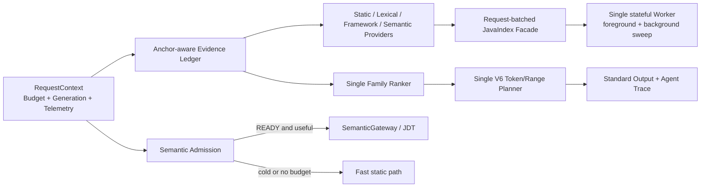
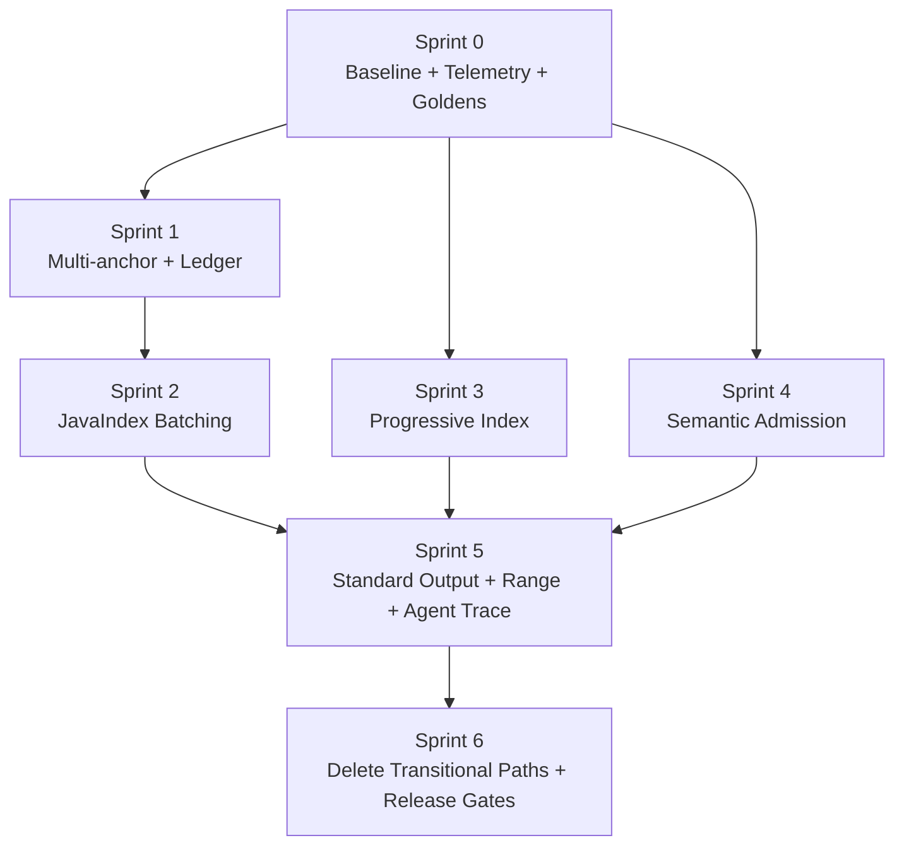

# Java Intelligence V3 价值兑现与后续优化开发计划

> 文档状态：`PROPOSED`
> 日期：2026-08-09
> 适用范围：V3.1 Task 0–36 完成后的 Java-only 架构
> 当前默认策略：`KEEP_EXPLICIT`
> 目标：把已经完成的正确性、索引、语义、worktree 和证据体系，进一步转化为可量化的任务质量、真实 Token、首个有效上下文时间、稳态延迟与资源收益；同时控制当前架构复杂度。

---

## 0. 直接结论

### 0.1 这次大改造的最大收获，不只是 7.72%–12.30% Token

不是。

当前严格可证明的 `7.72% / 12.30% / 11.71%`，只回答了一个很窄的问题：

> 在三仓、每仓 8 个冻结场景、JDT 关闭、JavaIndex 已完成、`fast` 策略、`diagnostic` 输出的 `java_impact` paired cold benchmark 中，相对 Iteration E 后的最新可执行文档基线，候选实现能否在质量不退化的前提下减少估算上下文大小？

答案是能，下降约 `7.7%–12.3%`；但它既不是整个 V3 相对改造前的总收益，也不是实际模型计费 Token，更不是端到端 Agent 完成任务的总成本。

这次改造真正建立的是一套此前不存在的 Java intelligence correctness platform：

1. 请求绝对 deadline、事务式 JDT 生命周期和可恢复的 worker RPC；
2. 单一 watcher / generation / freshness 真源；
3. Tree-sitter JavaIndex V2、稳定 symbol ID、完整度感知的负查询；
4. 原子 snapshot、兄弟 worktree seed、跨进程 JDT / sweep lease；
5. SemanticGateway 全操作 singleflight、调用方独立 deadline、Document LRU；
6. typed evidence、family-saturated ranker、byte/range-aware ReadPlan V6；
7. source-locked matrix、fault、mutation、multiprocess、determinism 证据链。

这些能力主要消除了旧架构的错误结果、陈旧结果、假 READY、无限等待、资源失控和不可归因问题。它们的价值是“以前可能错或挂，现在能诚实降级、恢复并被验证”，而不是直接表现为单一 Token 百分比。

### 0.2 但当前 ROI 仍不够完整

用户对投入产出比的质疑是成立的：

- pre-V3 生产 TypeScript 为 `9,461 LOC / 54 files`；当前候选为 `31,638 LOC / 129 files`，生产规模约为 `3.34×`；
- 当前 cold 质量指标与批准基线完全持平，P95 基本中性；
- fresh JDT references P95 仍为约 `25.8s / 50.6s / 65.8s`；
- `warm-required` 不是稳定增益：lishuedu 的 `R_read_must` 降到 `.95625`，exam recall 下降且 Token 增加；
- 真实 Agent 完成率、MCP 调用数、后续补读次数、实际 input/output/cached Token 和首个有效上下文时间仍未测量；
- range 质量只有 `15/120` attempts/variant/repo 被标注，其余为 `UNMEASURED`。

因此，下一阶段不能继续堆新 adapter、新 scheduler 或新 cache。方向必须从“搭平台”切换到“价值兑现”：

1. 先补齐用户体验和成本真指标；
2. 修正公共多 anchor 合约；
3. 对当前最热的 JavaIndex RPC 做批量化；
4. 把首次可用索引和完整索引解耦测量；
5. 让 `auto` 语义只消费已经 READY 的能力，不在前台冷启动 JDT；
6. 压缩真实 `standard` 输出，而不是只压 benchmark diagnostic payload；
7. 以 Agent 任务结果和实际 Token 决定保留、修改或删除能力。

---

## 1. 证据边界与基线身份

### 1.1 四类基线不能混用

| 身份 | SHA / tree | 可用于什么 | 不可用于什么 |
|---|---|---|---|
| pre-V3 架构参照 | `48e665b` / tree `538661f2...` | 代码规模、旧架构、已确认缺陷 | 三仓严格性能百分比；Phase0 raw 为 0 byte |
| Task 0 文档冻结 | `7f58fd1` | 历史过程 | 生产实现 AB |
| 批准的最新可执行 docs baseline | `7df1a0e` / tree `b096e87a...` | 本轮 source-locked cold old side | 整个 V3 相对 pre-V3 的总收益 |
| immutable remediation baseline | `94c4ebf` / tree `60ae785e...`；来源为 base `4e14756` + patch + 16 个绑定输入 | 当前 cold A 级候选；V3.2 首个 old side | 大体积 raw artifact 仍只由本地 manifest/receipt 绑定，未配置远端对象存储 |

`7df1a0e..4e14756` 在 `src/`、`scripts/`、`package*.json`、`README.md` 和 `install-runtime.sh` 没有实现差异。`94c4ebf` 的 tree 与已验证 candidate executable tree 完全一致。因此本轮数字实际衡量的是“Iteration E 最新代码经过最终审计修复后的增量收益”，不是最初 `SourceIndex/JDT` 旧架构到 V3 的总收益。

### 1.2 当前证据等级

| 等级 | 证据 | 允许声明 |
|---|---|---|
| A / BOUND | `cold-matrix-final-source-locked-v4-pass3` | 严格 old/new cold 质量、延迟、估算 payload |
| B / POST-BUILD | build、836 tests、fault 13/13、mutation 9/9、multiprocess、determinism 480 | 当前候选满足这些不变量 |
| C / POLICY | `warm-final-v2`、`first-touch-final` | `KEEP_EXPLICIT` 决策、语义路径真实代价 |
| D / HISTORICAL | Phase0–5 旧报告 | 演进方向、历史能力和返工背景 |

不同等级、不同 deadline 或不同 golden schema 的 P95 不得池化或相加。

### 1.3 当前 Token 数字的真实口径

当前 benchmark 定义：

```text
estimatedTokens = round((JSON.stringify(java_impact result) bytes + readPlan source bytes) / 4)
```

它有四个重要限制：

1. `/4` 是字节估算，不是某个固定模型 tokenizer 或账单 usage；
2. cold matrix 的 `verbosity` 实际是 `diagnostic`，而 MCP 默认是 `standard`；diagnostic 会保留 `phaseMs`、cache、JavaIndex、framework、shadow 等大块 metrics；
3. 它不含 system prompt、模型 reasoning/output、cached input、后续文件读取、重试和其他 MCP 工具调用；
4. 每仓虽然有 120 attempts，但只有 8 个独立业务场景，其余是同场景重复。

因此，后续报告必须把以下三类指标分开：

- `diagnosticEstimatedTokens`：诊断基准口径；
- `standardSerializedBytes / standardEstimatedTokens`：默认工具响应口径；
- `actualAgentInput / cachedInput / outputTokens`：固定 Agent trace 的真实客户端 usage。

---

## 2. 全面 old/new 架构价值对比

### 2.1 旧架构已经确认的系统性问题

Phase0 在 `48e665b` 上确认了七个 correctness 缺陷：

| ID | pre-V3 行为 | 实际风险 |
|---|---|---|
| C-01 | initialize 返回前即表现为 READY | 请求进入未初始化 JDT |
| C-02 | JDT startup 失败不回滚 process/connection | 后续请求复用死会话 |
| C-03 | fast path 没有统一 generation | 代码变更后最多命中 300s 陈旧 rg/index 结果 |
| C-04 | timeout partial 与空结果不可区分并进入 cache | 不完整结果被当作 COMPLETE |
| C-05 | JDT 外部 location 可进入结果 | 泄漏 JDK、Maven cache 或仓库外路径 |
| C-06 | STARTING 不占 JDT slot | 并发启动突破资源上限 |
| C-07 | 每个阶段独立 timeout | 整体请求没有绝对 deadline，最坏耗时累加 |

此外，旧系统没有 machine-wide lease、RepoChangeCoordinator、JavaIndex coverage、atomic snapshot、sibling seed 或统一 semantic singleflight。

### 2.2 当前 V3 相对旧架构的底层提升

| 维度 | pre-V3 | 当前 V3 | 已获得的底层价值 | 当前证据 |
|---|---|---|---|---|
| 请求时间模型 | 多段 timeout 相加 | 一个 `DeadlineBudget` 贯穿 runtime、slot、JavaIndex、JDT | 请求可预测结算，超时不再无限扩张 | fault/request-budget tests |
| JDT 生命周期 | 非事务、假 READY | `NEW/STARTING/READY/FAILED/STOPPING`，失败回滚与 backoff | 不复用半初始化会话 | fault suite |
| filesystem truth | JDT 自有 watcher，fast path 无 watcher | `RepoChangeCoordinator` 单一 watcher/generation owner | static、semantic、document、index 使用同一变更事实 | mutation 9/9，stale=0 |
| 静态索引 | regex/SourceIndex JSONL | Tree-sitter JavaIndex V2、stable IDs、facts/edges/reverse index | 能处理 package、nested type、import ambiguity、calls 和资源事实 | worker/router tests |
| 负查询 | “没找到”无法说明完整性 | 仅 generation 一致且 coverage COMPLETE 时允许 negative | 避免索引未完成时错误否定 | coverage gates |
| cache 完成态 | partial/timeout 可入 cache | COMPLETE-only cache + generation/TTL/cap | 不把超时或截断结果长期复用 | fault/cache tests |
| snapshot | 旧 JSONL append/compact | atomic gzip、schema/build validation、corruption recovery | 重启可恢复且不会加载半写文件 | snapshot tests |
| worktree | cache 基本隔离，机器级资源无界 | canonical worktree identity、JDT/sweep lease、heartbeat、owner token | 多 Codex 进程不会无限重复启动 JDT | multiprocess gates |
| sibling reuse | 无 | 完整校验的 sibling snapshot seed，只解析 diff | linked worktree 可复用事实而不共享陈旧状态 | historical seed evidence |
| semantic 并发 | 每调用独立 JDT 请求 | SemanticGateway same-key singleflight、caller 独立 deadline | 并发工具调用不重复压 backend | gateway tests |
| 文档生命周期 | 无明确上限 | Document LRU，默认最多 64，pin/inflight/didClose | 长驻 server 不无限打开文档 | LRU tests |
| 排名 | additive score，重复弱证据可叠高 | typed evidence + family saturation | 强弱证据可解释、重复证据有上限 | determinism 480 |
| read plan | 主要按文件/score | byte/range/file hard budget、protected core、marginal utility | 输出可控并保留 must-read | cold `R_read_must=1` |
| 工具面 | 7 个独立工具 | 5 个工具，references/runtime 操作合并 | 较小的公共调用面与更一致的协议 | smoke 5 tools |
| 验收链 | 非绑定历史报告 | source/tree/patch/repo/scenario/row/raw hash 绑定 | 失败与 PASS 可追溯 | verifier V4 |

### 2.3 可以量化但必须分级的收益

#### A 级：当前严格 cold 对比

| 仓库 | quality old→new | diagnostic estimated-token P50 | P50 ms | P95 ms |
|---|---|---:|---:|---:|
| lishuedu | recall/P_read/R_must/R_task 完全相同 | `8186→7554`，`-7.72%` | `22.14→23.21` | `171.93→166.79` |
| cipherlink | 完全相同 | `8171→7166`，`-12.30%` | `56.95→56.94` | `161.10→157.24` |
| exam-parent-v3 | 完全相同 | `7299→6444`，`-11.71%` | `34.68→36.80` | `135.18→136.12` |

准确结论：质量持平，诊断口径 payload 减少，cold 请求延迟总体中性。

#### B 级：失败模式消除

| 不变量 | 当前结果 | 价值 |
|---|---:|---|
| fault injection | `13/13` | worker/JDT/rg/snapshot/gateway 失败不制造假 COMPLETE |
| mutation | `9/9`，`staleCount=0` | rename/delete/import switch/XML/build/malformed-repair 后不返回旧事实 |
| determinism | `480` attempts stable | candidate/readPlan/range/family score/completion/freshness 稳定 |
| multiprocess | JDT/sweep `2/2`，duplicate spawn `0` | 机器级资源有上界，同 worktree 不重复启动 |
| open documents | max `64` | 长驻进程文档数有硬上限 |
| full test | `836/836` | 关键路径和边界覆盖显著增加 |

这些数据不能换算成“提升 X%”，但它们是生产正确性和可运维性的主要收益。

#### D 级：历史方向性收益

Phase3 曾记录 V1→V2 的 steady P95 中位数：

- lishuedu `246.20ms→157.17ms`；
- cipherlink `90.90ms→55.00ms`；
- exam-parent-v3 `187.11ms→63.27ms`。

历史 snapshot OPEN P95 为 `185 / 74 / 80ms`；512 文件 sibling seed 只解析 2 个 diff 文件，真实 cipherlink 同内容 worktree 复用 629/629。

这些数据说明 JavaIndex V2 和 snapshot/seed 的方向有价值，但旧侧 provenance、repo commit、golden schema 和当前实现均不同，只能作为方向证据，不能与本轮 `7.7%–12.3%` 相加形成“总提升”。

### 2.4 架构成本

| 项 | pre-V3 | 当前候选 | 变化 |
|---|---:|---:|---:|
| 生产 TS LOC | `9,461` | `31,638` | `+22,177`，`3.34×` |
| 生产 TS files | `54` | `129` | `+75` |
| 测试 TS LOC | `3,706` | `23,614` | `6.37×` |
| 测试 TS files | `22` | `95` | `+73` |
| `agent-router/` 生产 LOC | — | `8,640` | 当前主要决策层 |
| `java-index/` 生产 LOC | — | `9,198` | 当前主要基础设施层 |
| top-level runtime 生产 LOC | — | `8,814` | 生命周期、JDT、manager、gateway 等 |

这不是天然错误：测试、失败处理、协议、snapshot 和可观测性本来就需要代码。但从本阶段开始，新增复杂度必须由实测收益支付，不能再以“未来可能有用”作为理由。

---

## 3. 为什么现有 cold 数据低估了新体系，也高估了 Token 结论的普适性

### 3.1 没有测到的底层能力

现有 cold matrix 明确：

- `JDTLS_BIN=/usr/bin/false`；
- `semanticPolicy=fast`；
- 每个 cache fresh，但 benchmark 在 impact 采样前等待 JavaIndex COMPLETE；
- 使用 `verbosity=diagnostic`；
- 不执行真实模型，不统计后续 reads、tool retries 或修正次数。

因此它完全没有测到：

1. JDT transactional startup、singleflight、Document LRU；
2. snapshot-hit 和 sibling seed 的真实启动收益；
3. runtime 请求在 index BUILDING 时的 foreground anchor refresh；
4. watcher mutation 和 500-file storm 下的前台体验；
5. 跨进程 lease 对 CPU/RSS/JDT 数量的节约；
6. Agent 是否因为更准的 read plan 少调用工具、少补读文件、少走错方向。

### 3.2 同时也不能把当前 Token 降幅外推到生产

三仓 candidate 的 diagnostic payload 组成中位数：

| 仓库 | `java_impact` JSON bytes P50 | selected source bytes P50 | total bytes P50 | source 占比 |
|---|---:|---:|---:|---:|
| lishuedu | `21,658` | `5,338` | `30,216` | `17.7%` |
| cipherlink | `23,492` | `4,121` | `28,665` | `14.4%` |
| exam-parent-v3 | `20,459` | `5,471` | `25,774` | `21.2%` |

当前估算 Token 的大头是 diagnostic JSON，而不是 read-plan source bytes。下一步最大的 Token 杠杆可能是默认 `standard` 输出字段和真实 Agent 调用链，而不是继续压缩 4–5KB 的源码窗口。

---

## 4. 当前瓶颈地图

### 4.1 cold 请求热路径

下面是 candidate pass3 的每仓 120 attempts 聚合：

| 仓库 | overall P50 / P95 | 最大 mean phase | phase mean / P95 | 次热点 |
|---|---:|---|---:|---|
| lishuedu | `23.21 / 166.79ms` | `importGraph` | `12.74 / 49ms` | rg `10.40/44ms`、typeReference `8.50/37ms` |
| cipherlink | `56.94 / 157.24ms` | `typeReference` | `48.03 / 128ms` | framework `10.45/27ms`、rg `6.20/38ms` |
| exam-parent-v3 | `36.80 / 136.12ms` | `typeReference` | `30.55 / 78ms` | framework `8.35/37ms`、rg `4.29/25ms` |

`familyRank` P95 只有约 `1–2ms`，`buildReadPlan` P95 只有 `3–6ms`。因此下一阶段不应先优化 ranker 算法复杂度或增加 read-plan 并发。

已确认的结构性 N+1：

- `src/agent-router/type-reference.ts` 对每个 interface definition 顺序调用 `findImplementers()`；
- `src/agent-router/providers/relationship-provider.ts` 对候选逐个 `factsFor()`；
- `src/java-index/router-java-index.ts` 虽已有 `QUERY_FILES`、`QUERY_TYPES`、`QUERY_CALLEES_BATCH`，但缺少统一 `factsForFiles()` 和 implementer batch；
- worker foreground queue 串行，调用端 `Promise.all` 只会增加排队，不能产生真实并行。

所以核心策略是减少命令数和重复 hydration，而不是盲目增加并发。

### 4.2 fresh JavaIndex 完整构建成本

当前 cold benchmark 在采样前等待完整索引：

| 仓库 | Java files | edges | snapshot | fresh COMPLETE 中位时间 |
|---|---:|---:|---:|---:|
| lishuedu | `5,312` | `219,226` | `21.7MB` | 约 `40.6s` |
| cipherlink | `629` | `21,399` | `2.2MB` | 约 `2.55s` |
| exam-parent-v3 | `1,369` | `50,470` | `4.8MB` | 约 `5.89s` |

这不等于真实请求一定阻塞 40 秒：生产 runtime 的 OPEN 可以先返回 BUILDING，anchor 通过 foreground refresh 获得事实，完整 sweep 在后台完成。当前真正缺失的是以下三个独立指标：

- `T_open`：worker/own snapshot 打开；
- `T_anchor_ready`：首个 anchor 及有界一跳依赖可回答；
- `T_complete`：全仓 coverage COMPLETE 并持久化 snapshot。

后续优化要优先降低 `T_anchor_ready`，不能为了让全仓更快而牺牲 coverage、negative lookup 或 snapshot 校验。

### 4.3 JDT first-touch 是当前最大的体验债务

fresh、无 prepare 的 P95：

| 仓库 | definition total / startup / request | references total / startup / request |
|---|---:|---:|
| cipherlink | `12.7s / 4.8s / 7.9s` | `25.8s / 5.4s / 20.4s` |
| exam-parent-v3 | `11.9s / 5.8s / 6.1s` | `50.6s / 5.5s / 45.1s` |
| lishuedu | `19.9s / 8.5s / 13.8s` | `65.8s / 10.0s / 60.0s`，含 2 次 partial timeout |

主要成本不是 Node spawn，而是 JDT project import、workspace readiness 和首次 operation。router 层微优化无法把这条路径从几十秒变成 2–5 秒。

### 4.4 公共多 anchor 合约目前不完整

这是下一阶段必须先修的 correctness finding：

- `src/tools/impact.ts` 接受 `anchors[1..5]`；
- `AgentRouter` 会 resolve 全部 anchors；
- static/lexical 大体逐 anchor 工作；
- `relationship-provider.ts` 只取 `anchors[0]`；
- persisted/live semantic、support、Spring/MyBatis/MapStruct 把聚合结果统一标成 `A1`。

后果是第二及后续 anchor 的关系证据可能丢失，或被错误归因给 A1，进一步影响 family saturation、protected read plan 和 diagnostics。任何性能优化都不能建立在这个不一致合约上。

---

## 5. 下一阶段目标模型

### 5.1 北极星指标

下一阶段不使用单一“总提升百分比”，而使用六组指标：

| 维度 | 指标 | 定义 |
|---|---|---|
| 任务结果 | `TaskSuccess`、人工修正次数 | 固定真实任务的盲评结果 |
| 有效上下文 | `TTFUC` | 从工具调用到首批足以完成任务的 must/task-blocking context |
| 质量 | Recall、P_read、R_must、R_task、RangeLineRecall、RangeCoordinateRecall | 文件与 UTF-16 坐标两层质量；两者不得混算 |
| 成本 | actual input/output/cached Token、standard bytes、follow-up reads | 真实客户端 usage 与工具载荷分开 |
| 延迟 | cold/warm P50/P95、JDT first-touch、storm foreground | 按运行模式分列，禁止池化 |
| 资源与可靠性 | process-tree RSS、CPU、queue、retire、stale、determinism | Node + worker + JDT 全进程树 |

### 5.2 全局硬门

任何优化必须同时满足：

1. 每次真实 scenario 的 `R_read_must=1.0000`；
2. line-only 标注的 `RangeLineRecall=1.0000`；带坐标标注的 `RangeCoordinateRecall=1.0000`；未标注或只有 legacy line range 时，坐标指标必须为 `UNMEASURED`；
3. Recall 和 R_task 不低于同源 baseline；
4. P_read 非劣界为 baseline `-0.02`；
5. mutation stale `0`、outside repo `0`、determinism `stable=true`；
6. 不放宽 negative lookup、snapshot validation、deadline 或 lease safety；
7. 不把 `required` 设为默认，直到 fresh semantic 的严格门禁满足；
8. 不新增第二 scheduler、第三个 authoritative fact/cache truth、通用 framework DSL 或未测量 adapter；可丢弃且完全由权威 manifest 派生的加速索引不拥有语义或 COMPLETE 决策权；
9. 每个 sprint 用 `scripts/count-production-ts.mjs --tree <source-locked-tree>` 固定统计 `src/**/*.ts` 且排除 `*.test.ts`、`dist/` 和生成物，并记录 task-level LOC ledger；整个优化周期 production LOC 不得超过当前 `31,638` 的 `+5%`，最终目标是不高于当前值；
10. 所有性能结论必须由 source-locked old/new manifest 支持。

### 5.3 目标架构



关键约束：

- batch 化发生在 JavaIndex 边界，不通过并行多个 foreground RPC 模拟并发；
- Evidence Ledger 只收敛状态和 memoization，不把真实有依赖顺序的 provider 改成通用 pipeline；
- semantic `auto` 只消费已经 READY 且剩余预算足够的能力；冷启动或预热必须脱离前台关键路径；
- V6 production planner 是唯一 read-plan 真源；诊断 attribution 不能再自行选择另一套 plan。

### 5.4 预期收益区间与置信度

以下是工程目标，不是已实现结果；没有 A/B 证据时不得写入最终收益结论：

| 杠杆 | 目标 | 置信度 | 失败时的决定 |
|---|---|---|---|
| JavaIndex facts/implementer batch | 目标热点 RPC count `-30%`；CipherLink typeReference P95 `128ms→≤80ms` | 中：N+1 已证实，具体 queue/IPC 占比未测 | fanout≤1 或收益<10ms，则删除新 batch 协议 |
| Framework preflight | 无框架请求减少重复 status/marker；framework phase P95 不退化 | 中低：重复路径已证实，单次成本未拆分 | 只保留纯 helper，不保留无收益 preflight 状态 |
| progressive index | 最大仓 `T_anchor_ready` 达到可交互水平 | 中：foreground refresh 已存在，但真实 TTFUC 未测 | 若 baseline 已≤2s，则改为非回归 + 20% 改善目标；不改 full sweep safety |
| standard 输出压缩 | standard bytes P50 `-15%` | 中：diagnostic JSON 占当前代理指标的大头，standard 尚未测 | 若 Agent 补读抵消收益，恢复字段 |
| range-first plan | read bytes P50 `-15%`，RangeLineRecall/RangeCoordinateRecall=1 | 中：现有 line-range 机制已有方向证据，坐标覆盖不足 | holdout 不通过则拒绝规则 |
| semantic ready-only auto | 受影响 warm-auto P95 显著低于当前 1.5s cap | 中低：现有尾部已证实，质量价值需 Agent trace | 任何 quality 退化即关闭 |
| JDT prewarm/参数 | first-touch P95 至少 `-30%` | 低：主要成本在 project import/request，方案收益未知 | P95仍>20s或资源恶化则停止 |
| 真实 Agent trace | total input Token P50 `-10%`，MCP/file reads `-15%` | 当前未测 | 若代理指标不转化，停止为 estimatedTokens 调参 |

### 5.5 需要在 Sprint 0 固定的决策

1. **多 anchor**：本计划推荐兑现现有 1–5 anchor 合约，而不是收紧为单 anchor；若产品决定收紧，必须在 Sprint 1 前形成协议 ADR。
2. **Agent model snapshot**：选择当前真实使用的固定模型和客户端版本；如果模型无法固定，至少保存 provider model ID、system prompt hash、tool schema hash 和原始 usage。
3. **artifact retention**：小型 manifest/summary/hash 入 Git；大型 raw 进入不可变对象存储并在 manifest 中绑定 URI、SHA-256 和保留期。
4. **性能宿主**：release matrix 固定独占机器和资源采样；共享开发机结果只能作为诊断，不作为发布 gate。
5. **breaking change**：V3.2 默认不升 ImpactResult schema；确需改 public fields 时另立 V7 ADR 和兼容窗口。

---

## 6. 分阶段开发计划

## Sprint 0 — 测量契约与不可变基线

目标：先回答“时间、字节和资源到底花在哪里”，避免凭静态猜测投入新的基础设施。

### V3.2-01 固化 optimization baseline

- 文件：
  - `scripts/run-three-repo-cold-matrix.mjs`
  - `scripts/verify-three-repo-cold-matrix.mjs`
  - 新增 `scripts/run-v32-optimization-matrix.mjs`
  - 新增 `scripts/count-production-ts.mjs`
  - 新增 `docs/phase-v3/v32-optimization-baseline.md`
- 实现：从当前 source-locked candidate 生成新的 immutable optimization baseline；绑定 executable tree、patch、16 个 runtime inputs、三仓 HEAD/tree、scenario hash、Node/JDT/Tree-sitter 版本和 stderr。计数器固定只统计 source-locked tree 的 `src/**/*.ts`，排除 `*.test.ts`、`dist/` 和生成物，并把路径列表、LOC、SHA-256 写入 manifest。
- 依赖：无。
- 验收：同一个 manifest 可独立复验；任意 runtime/scenario/row/hash 变化都失败；LOC 计数可由路径清单逐文件复算，telemetry 新增 LOC 必须在 task-level ledger 中记录其后续删除/合并偿还项。
- 回滚：只删除新增 runner/report，不修改生产路径。

### V3.2-02 区分 standard / compact / diagnostic payload

- 文件：
  - `scripts/attribute-impact-payload.mjs`
  - `src/benchmark-agent-impact.ts`
  - `src/benchmark/attribution-v3.ts`
  - 对应 tests
- 实现：同一次 provider/rank/read-plan 执行产生 canonical result，再分别投影三种 verbosity 并记录字段级 bytes；至少拆分 `files`、`readPlan`、`metrics`、`evidenceGaps`、locations、reasons、score breakdown；不能通过连续执行三次 router 请求制造 cache/warm 差异；禁止把 diagnostic bytes 标为默认工具 Token。
- 依赖：V3.2-01。
- 验收：三种 verbosity 使用相同候选/read plan；只允许序列化层不同；`cost.resultBytes` 与真实 JSON bytes 一致。
- 退出条件：如果 standard payload 已低于 diagnostic 的 50%，后续 Token 优先转向真实 Agent trace，不继续围绕 diagnostic 压缩。

### V3.2-03 JavaIndex RPC 分段 telemetry

- 文件：
  - `src/java-index/worker-protocol.ts`
  - `src/java-index/java-index-client.ts`
  - `src/java-index/java-index-worker.ts`
  - `src/java-index/router-java-index.ts`
  - `src/agent-router/impact-metrics.ts`
- 实现：每个 operation 聚合 `count`、input/output bytes、caller wait、worker queue、worker processing、deadline/retire reason；worker 内只返回 duration，不依赖跨线程 wall clock 对齐；standard/compact 不暴露详细直方图。
- 依赖：V3.2-01。
- 验收：故障、deadline、cancel、worker retire 后 pending 为 0；telemetry 自身开销 P95 小于 2ms 或可关闭。
- 退出条件：若 typeReference 的 RPC count/fanout 不高，停止 implementer batch 任务，不为假热点新增协议。

### V3.2-04 JDT first-touch 分段 telemetry

- 文件：
  - `src/jdtls-session.ts`
  - `src/jdtls-transport.ts`
  - `src/semantic-gateway.ts`
  - `src/benchmark/semantic-first-touch.ts`
- 实现：记录 process spawn、initialize、workspace/configuration、project import progress、document open/prepare、backend operation、caller settlement、backend settlement、cancel ack；raw session 不可观测字段继续写 `UNMEASURED`，不硬编码 false。
- 依赖：V3.2-01。
- 验收：fresh/reused × definition/references/typeHierarchy 的每次 attempt 都能解释总耗时；相加误差小于 5%。

### V3.2-05 进程树资源采样

- 文件：
  - 新增 `scripts/sample-java-runtime-resources.mjs`
  - benchmark runner/manifest
- 实现：采样 Node、JavaIndex worker、JDT 子进程的 RSS、CPU、fd、event-loop delay、GC（可用时）、queue depth；定义 `peakRSS` 与 warmup 后 retention slope。
- 依赖：V3.2-01。
- 验收：采样器失败不改变请求；manifest 保存采样周期、进程身份和缺失原因。

### V3.2-06 补齐 range、坐标与 holdout

- 文件：
  - `golden/lishuedu.scenarios.jsonl`
  - `golden/cipherlink.scenarios.jsonl`
  - `golden/exam-parent-v3.scenarios.jsonl`
  - `src/benchmark/golden-scenario.ts`
- 实现：保留 legacy line-only `mustReadRanges`，新增 `mustReadCoordinateRangesV2`：`{ file, start: { line, column }, end: { line, column } }`。仓库 canonical 坐标使用 1-based line、1-based UTF-16 code-unit column，`end` 为 exclusive；仅在 LSP boundary 做 `-1`。给现有 24 个 scenario 补行级标注，并尽量补 V2 坐标；每仓再冻结 2 个未参与调权的 holdout，覆盖 Java、XML、多 range、跨模块和 emoji/非 BMP UTF-16 坐标。
- 依赖：无生产代码依赖，可与 telemetry 并行。
- 验收：人工双人/双方法核对；Java、XML、emoji fixture 均有“完整覆盖”和“首/尾 token 裁掉”正反例；legacy line-only 只能进入 `RangeLineRecall`，不得进入 `RangeCoordinateRecall` 分母；缺 range 不得进入正式 range PASS 分母。

### V3.2-07a 固定本地 MCP trace 合同

- 文件：
  - 新增 `docs/evals/java-intelligence-v32-agent-trace-spec.md`
  - 新增 `scripts/record-mcp-trace-matrix.mjs`
- 实现：先冻结 6 个真实任务、repo commit、tool schema 和 TTFUC 事件定义；本地 recorder/replay 只记录 MCP request/response、工具调用、文件读取、completion/freshness 和 wall time，不依赖模型客户端，也不伪造模型 usage 或 TaskSuccess。
- 依赖：V3.2-01、V3.2-02。
- 验收：同一 source-locked input 可重放，request/response/tool/read 序列和 TTFUC 事件可复核；模型 usage、盲评结果在本阶段必须为 `UNMEASURED`。

### V3.2-07b 外部 Agent eval preflight 与授权门

- 文件：
  - `docs/evals/java-intelligence-v32-agent-trace-spec.md`
  - 获得外部执行授权后新增 `scripts/run-agent-trace-matrix.mjs`
- 实现前置：固定 provider/model/version、client、system prompt hash、tool schema hash、temperature/seed、usage 字段可用性、rate limit、预算、数据是否外发、盲评 rubric 和争议裁决规则。
- 授权边界：真实模型调用会产生外部成本并可能发送代码，必须由用户明确授权；没有授权、凭据或 usage API 时，任务状态为 `BLOCKED_EXTERNAL`，usage 继续为 `UNMEASURED`，绝不填 0。
- 验收：授权后按 AB/BA、每侧 5 次执行；原始 usage 与盲评可复核；样本不足时只声明 scoped evidence，禁止外推生产总体收益。

Sprint 0 完成门：没有 telemetry 和真实 standard baseline，不允许进入需要新协议或新缓存的性能改造。V3.2-07a 必须完成；V3.2-07b 可因外部授权明确阻塞，但 Sprint 5 的真实 Agent KPI 不能在其阻塞时宣称完成。

---

## Sprint 1 — 先关闭公共合约正确性，再优化热路径

### V3.2-08 修复多 anchor evidence 合约

- 文件：
  - `src/agent-router/providers/relationship-provider.ts`
  - `src/agent-router/providers/semantic-provider.ts`
  - `src/agent-router/providers/support-provider.ts`
  - `src/agent-router/framework/*-adapter.ts`
  - `src/agent-router/rg-plan.ts`
  - `src/agent-router/rank-candidates.ts`
  - `src/agent-router/read-plan.ts`
  - `src/agent-router/materialize-candidates.ts`
  - provider/router tests
- 推荐实现：正式支持现有 `anchors[1..5]`；所有 anchor-specific signal 按 `(candidate, anchorId, kind, provider)` 发出，绝不把 A2+ 归到 A1；request-global support 可按每个 anchor 复制同 kind signal，family saturation 保证不重复加分；V6 `target` 继续表示 primary anchor，保持协议兼容。
- 确定性 ranking/read-plan 规则：candidate 对任一 anchor 同模块即不受 cross-module penalty；profile-specific signal 按其 origin anchor 的 profile 计算；全局 candidate cap 取各 anchor `candidateLimit(mode, profile)` 的最大值，但不超过现有 mode hard cap；protected core 必须按 `signal.anchorId` 保护对应 anchor 的 must/task-blocking 路径；最终 tie-break 仍为 stable absolute path。交换 A1/A2 顺序不得改变 candidate/readPlan 集合，只有 public primary `target` 可随输入顺序变化。
- 可接受替代：若产品明确只需要单 anchor，则把 `impactSchema.anchors` 收紧到 `.max(1)` 并返回明确输入错误；不能继续静默忽略。
- 依赖：Sprint 0 baseline。
- 验收：双 anchor 同模块、跨模块、A2 provider failure、A1/A2 共同 candidate、A1/A2 交换顺序、单 anchor parity 六组测试；断言 candidate order、cross-module suppression、candidate cap、reason attribution 和 protected readPlan；readPlan 中 A2 must 不得丢失。
- 回滚：回滚整个合同 commit；不允许回到“接收但忽略”。

### V3.2-09 引入 request-local EvidenceLedger

- 文件：
  - 新增 `src/agent-router/evidence-ledger.ts`
  - `src/agent-router/index.ts`
  - `src/agent-router/evidence.ts`
- 实现：提供 `append(outcome)`、`paths()`、`normalized()`、`outcomes()`；append 后使 normalized memo 失效；保留当前显式 provider 顺序和 budget/freshness guard，不实现通用 plugin pipeline。
- 目的：消除 `after*Paths`、重复 `unionPaths/normalizeEvidence` 和状态漏接风险，为后续批量查询提供单一 request-local 状态。
- 依赖：V3.2-08。
- 验收：单 anchor 与现有 candidate order、reasons、family score、readPlan、phase keys 完全一致；不新增任何 JavaIndex RPC。

### V3.2-10 FrameworkPreflight 单次化

- 文件：
  - `src/agent-router/framework/runner.ts`
  - 新增 `src/agent-router/framework/shared.ts`
  - Spring/MyBatis/MapStruct adapters
- 实现：runner 只读取一次 framework status；marker/fact marker 通过 request-scoped preflight 复用；抽取 seed files、marker paths、bounded target resolution 等纯 helper；adapter 的激活和证据规则保持独立。
- 依赖：V3.2-03 telemetry。
- 验收：complete 无框架 repo 不进入 collect；incomplete coverage 仍保守激活；一个 adapter 失败不影响其他 adapter；framework RPC count 明确下降。
- 禁止：把 adapters 改成 `Promise.all`；worker 仍串行，伪并发只会扩大 queue。

Sprint 1 完成门：多 anchor contract 全绿；单 anchor cold 行为严格 parity；没有新的 public schema 漂移。

---

## Sprint 2 — JavaIndex 命令批量化与 cold 热路径优化

### V3.2-11 增加 `factsForFiles()`

- 文件：
  - `src/java-index/router-java-index.ts`
  - `src/java-index/router-facts.ts`
  - `src/agent-router/providers/relationship-provider.ts`
- 合约：新增 `FactsForFilesResult = { generation, completion, truncated, items[] }`；每个 item 保留输入顺序并显式为 `FOUND(facts) | MISSING(reason) | DEGRADED(reason)`。`completion` 仅在未截断且所有 item 都有 authoritative 结论时为 `COMPLETE`，否则为 `PARTIAL`。
- 实现：规范化、去重、按 generation 检查 cache；`MAX_RELATIONSHIP_FACT_FILES=70`，与现有 recall mode 最大 candidate cap 对齐；provider 在 batch 前完成 bounded shortlist，禁止用 `ensureFresh(batch)` 把无界 relationship pool 拉入前台；一次 bounded refresh + 一次 `QUERY_FILES`，单文件失败不得拖垮整个 batch。
- 依赖：V3.2-03。
- 验收：relationship candidate pool 只发生固定上界的 batch；任何 `MISSING/DEGRADED/truncated` 都使 provider outcome 为 `PARTIAL`，不得保持 `COMPLETE`；覆盖 generation change、malformed single item、deadline、71+ 输入与逐文件结果 parity；generation 变化不复用旧 Promise。
- 回滚：provider feature flag 回退旧路径，仅保留一个发布周期；稳定后删除旧逐文件循环。

### V3.2-12 增加 implementer batch

- 文件：
  - `src/java-index/worker-protocol.ts`
  - `src/java-index/java-index-client.ts`
  - `src/java-index/java-index-worker.ts`
  - `src/java-index/router-java-index.ts`
  - `src/agent-router/type-reference.ts`
- 实现：新增 `QUERY_IMPLEMENTERS_BATCH`；router 先用现有 `QUERY_TYPES` 一次解析 type names，再批量取 implementer IDs，最后一次 `QUERY_FILES` hydrate；结果按输入 type、resolution strategy 和 stable path 排序，并显式保留 unresolved/ambiguous/per-type degraded 状态与整个 batch 的 completion/truncated。
- 依赖：V3.2-03 证明 fanout，V3.2-11。
- 验收：type resolution、ambiguity、limit 和排序与逐项路径 parity；覆盖 generation change、单项 malformed、deadline、超上界；CipherLink typeReference P95 目标 `128ms→≤80ms`；若 source-locked A/B 改善不足 10ms 或 median fanout ≤1，则不合入。

### V3.2-13 request-scoped query memo

- 文件：`src/java-index/router-java-index.ts`
- 实现：在现有 AsyncLocalStorage request options 中加入只读 `RequestQueryMemo`；缓存同 generation 的 in-flight facts/type/framework query promise；rejection 立即驱逐；不得写入跨请求 mutable budget。
- 依赖：V3.2-11。
- 验收：typeReference/framework/relationship 对同文件只 hydrate 一次；并发请求不同 deadline 和 generation 不共享 memo。

### V3.2-14 typeReference collector evidence-native 化

- 文件：
  - `src/agent-router/type-reference.ts`
  - `src/agent-router/providers/static-provider.ts`
  - `src/agent-router/candidate-helpers.ts`
- 实现：先生成 type-reference query plan，再批量执行；collector 直接产出 typed evidence/metadata，逐步去掉只为旧 additive `CandidateFile.score` 服务的中间合并。
- 依赖：V3.2-12、V3.2-13。
- 验收：candidate/reason/position/verifiedBy parity；最终 rank 只读 evidence；不得因 batch 改变 type priority。

### V3.2-15 条件式处理 importGraph 与 rg 尾部

- 文件：
  - `src/agent-router/candidate-collectors.ts`
  - `src/agent-router/rg-plan.ts`
  - `src/search/rg-runner.ts`
- 进入条件：telemetry 仍显示 lishuedu importGraph 或 rg P95 >40ms，且 worker processing 或 pattern 数可归因。
- 可能动作：批量 declaration/import lookup；去除重复 pattern/root；保留 streaming/caps；不得基于仓名硬编码。
- 退出条件：收益 <10ms、recall/R_task 下降或 pattern 减少只改善 benchmark 特定场景时立即停止。

Sprint 2 性能门：

- 三仓 overall cold P95 不退化；
- 受影响场景 P95 至少改善 20%，JavaIndex RPC count 至少下降 30%；
- 所有 quality hard gate 不变；
- familyRank/readPlan 没有额外优化任务，除非新 telemetry 证明其 P95 >10ms。

---

## Sprint 3 — 首次可用索引与后台完整索引分离

### V3.2-16 新增 progressive-index benchmark

- 文件：
  - 新增 `src/benchmark/progressive-index.ts`
  - `src/benchmark/java-index-idle.ts`
  - runner/manifest
- 实现：分别测量 `T_open`、`T_anchor_ready`、`T_module_ready`、`T_complete`、`T_snapshot_durable`；请求在 BUILDING 时发起，不再只测完整索引后的 steady state。
- 验收：每个阶段有明确 generation/coverage；在 COMPLETE 前 negative lookup 必须为 false。

### V3.2-17 优先 foreground anchor closure

- 文件：
  - `src/java-index/router-java-index.ts`
  - `src/java-index/java-index-worker.ts`
  - `src/agent-router/anchor.ts`
- 实现：请求先 refresh anchor、直接 import/type definitions 和有界一跳实现，再让 full sweep 后台继续；foreground 不等待 sweep lease。
- 依赖：V3.2-16。
- 验收：如果 Sprint 0 baseline 的最大仓 fresh `T_anchor_ready>2s`，目标降到 ≤2s；如果 baseline 已≤2s，则要求非回归且目标改善至少 20%；完整 coverage、最终 snapshot digest 与纯 full sweep 等价；storm 中 foreground P95/quiet ≤1.10。

### V3.2-18 调整 background root 优先级

- 文件：`src/java-index/java-index-worker.ts`
- 实现：在同一现有 scheduler 内先处理 active anchor root、main source，再处理 test roots；不引入第二 scheduler 或优先级 DSL。
- 依赖：V3.2-16。
- 验收：module-ready 更快；T_complete 不退化超过 10%；最终 facts/edges digest 相同。

### V3.2-19 snapshot/seed 候选 telemetry 与条件索引

- 文件：
  - `src/java-index/worktree-snapshot-seeder.ts`
  - `src/java-index/snapshot.ts`
- 实现：记录 cache dirs scanned、eligible snapshots、解压、初/末 manifest、dirty/reused 数和 first-query time。
- 进入优化条件：候选目录 ≥5 且 seed-open P95 >200ms；届时可增加小型 metadata directory index。该索引只能由 snapshot manifest 派生、可随时删除、读取失败时退化为全扫描；它不存 facts/edges，不参与 coverage/COMPLETE 决策，并具有独立 schema、TTL 和 cleanup 生命周期。最终选中 snapshot 仍必须完整校验。
- 禁止：跳过 manifest、提前标 COMPLETE、共享未验证 sibling facts。

### V3.2-20 cooperative cancel 研究门

- 文件：worker protocol/client/worker。
- 进入条件：telemetry 证明 deadline retire 在真实 burst 中频繁导致后续请求重启；否则维持当前强制 retirement。
- 实现候选：显式 CANCEL message + worker safe points；无法安全中断的 query 继续 terminate worker。
- 验收：长 query cancel 后立刻 normal query，无 pending 泄漏、无跨 generation 写入；恢复 P99 明显下降。

Sprint 3 完成门：优化的是首个有效上下文，不以放宽 completeness/negative 语义换速度。

---

## Sprint 4 — JDT 语义价值兑现

### V3.2-21 修改 `auto` admission，而不是延长 timeout

- 文件：
  - `src/agent-router/semantic.ts`
  - `src/agent-router/providers/semantic-provider.ts`
  - `src/jdtls-session.ts`
- 实现：`auto` 只在 session READY、import progress idle、剩余 semantic budget 足够且 operation 有预期增益时进入 live JDT；不在前台请求里冷启动 JDT。`required` 仍可显式启动并报告 partial/timeout。
- 依赖：V3.2-04、V3.2-07a；涉及 Agent 质量结论时还依赖已获授权并完成的 V3.2-07b。
- 验收：同 deadline warm-auto paired A/B；quality 全量非劣，Cipher/Exam auto P95 不再固定贴近 1.5s cap；任何 R_must/recall 退化即默认关闭。

### V3.2-22 persisted semantic operation-completeness 合同

- 文件：
  - `src/semantic-edge-store.ts`
  - `src/agent-router/providers/semantic-provider.ts`
  - `src/agent-router/semantic.ts`
- 事实边界：当前 `SemanticEdgeStoreV2.findFrom()` 只保存有界正向边，references 还可能排序/截断；单条 COMPLETE edge 不代表 definition/references/hierarchy 某次 operation 的结果集合完整，因此不得仅凭 edge 存在跳过 live JDT。
- 推荐实现：若 telemetry 证明值得减少 live verify，新增 `SemanticOperationCoverageRecord`，key 至少包含 source symbol、operation、direction/depth/limit 等参数、generation、build fingerprint 和 dependency digest；value 包含完整 result edge IDs、`completion`、`truncated` 与 settlement。只有参数精确匹配、`completion=COMPLETE`、`truncated=false` 且 generation/dependency 都有效时，才允许复用整次 operation。
- 保守替代：不新增 coverage record；persisted/static 只提供正向候选和置信度，不承诺 operation completeness，也不据此跳过 live JDT。
- 依赖：V3.2-08、V3.2-21。
- 验收：跨文件变更后必失效；同一 source 但不同 operation/direction/depth/limit 不得互用；部分/截断结果不得持久化为 COMPLETE；若采用保守替代，则删除“JDT calls 必须下降”的验收，只要求质量非劣。

### V3.2-23 opt-in idle prewarm 实验

- 文件：`src/repo-runtime-manager.ts`、`src/jdtls-session.ts`。
- 实现：仅在 machine lease 可用、repo idle、用户/配置显式开启时预热；不占用 foreground deadline；记录取消、CPU、RSS 和 lease 时长。
- 依赖：V3.2-04、V3.2-05。
- 试验门：first-touch P95 至少下降 30%，且 peak RSS/CPU 增幅 ≤10%；否则不进入默认路径。
- 禁止：仅把几十秒成本提前发生，然后把它包装成请求提速。

### V3.2-24 JDT 单变量参数实验

- 范围：import concurrency、workspace/dataDir reuse、project import readiness、document prepare；一次只改一个变量。`workspace/dataDir reuse` 只允许同 canonical worktree、同 JDTLS version、同 build/classpath fingerprint；sibling worktree 不得共享可写 JDT workspace，build/identity 变化必须切换新目录或安全清理。
- 证据：三仓 fresh/reused，各 10 次，记录完整 phase 和资源。
- 隔离验收：两个 sibling worktree 同时启动时 workspace/dataDir/lease 各自独立；一侧 build change 不污染另一侧；版本或 fingerprint 不匹配时拒绝 reuse。
- 退出条件：references first-touch P95 仍 >20s 或资源明显恶化，则保持 `KEEP_EXPLICIT`，不继续扩大 scope。

### V3.2-25 默认化硬门

只有同时满足以下条件，才重新讨论把 semantic 设为默认：

1. 三仓 fresh 代表 operation P95 ≤800ms；
2. 0 partial / timeout；
3. R_must=1、Recall/R_task 非劣；
4. actual Agent task success 非劣；
5. peak RSS 和机器级 JDT 数量仍受控。

在达到之前，最终策略继续是 `KEEP_EXPLICIT`；不能通过把 timeout 从 1.5s 提高到 5s 伪造通过。

---

## Sprint 5 — 真实 Token、范围质量与任务结果

### V3.2-26 优化默认 `standard` 输出

- 文件：
  - `src/agent-router/output-v6.ts`
  - `src/agent-router/format.ts`
  - `src/agent-types.ts`
  - payload attribution tests
- 实现顺序：先量字段字节与 Agent 使用，再处理重复 evidence phrase、冗余 locations、可推导字段；diagnostic 保留可审计信息，standard 只保留完成任务需要的最小真值。
- 依赖：V3.2-02、V3.2-07a；“Agent 使用/补读不退化”验收依赖 V3.2-07b，外部 gate 阻塞时只能先提交字段级本地实验，不能宣布价值门通过。
- 目标：standard serialized bytes P50 相对 Sprint0 baseline 至少下降 15%，且 Agent task success、后续 reads 和 quality 不退化。
- 禁止：删除 freshness/completion/cost 或通过少返回 must file 降 Token。

### V3.2-27 range-first source planning

- 文件：
  - `src/agent-router/read-plan.ts`
  - `src/agent-router/read-plan-budget.ts`
  - JavaIndex read-range query
- 实现：优先 method/field/type declaration AST range；只有范围不完整或文件本身很小时才整文件；一文件多个核心 range 合并时保留 reason。
- 依赖：V3.2-06。
- 验收：24+6 holdout 的 `RangeLineRecall=1`；所有 V2 坐标标注的 `RangeCoordinateRecall=1`；read bytes P50 至少下降 15%；R_must/R_task 不退化。

### V3.2-28 task-aware budget 只使用显式 task facts

- 文件：read-plan、ranking signals。
- 实现：按 anchor profile、taskBlocking evidence、sourceSet 和文件大小调整 file/range budget；不读取 repo 名、scenario id 或 golden。
- 依赖：V3.2-27。
- 验收：holdout 同样通过；任何只在已调优 24 场景上改善、holdout 无收益的规则 REJECT。

### V3.2-29 provider measured-or-remove

- 文件：framework provider、matrix attribution、对应 docs/tests。
- 实现：新增 benchmark-only adapter allowlist（生产默认 registry 不读取该开关），并把 allowlist、adapter version 写入 source-locked manifest。对 Spring/MyBatis/MapStruct 做 source-locked on/off；ON/OFF 各自使用独立 process/cache、同 source tree、同 deadline，OFF 必须是不加载/不运行该 adapter，不能复用 ON 的暖态；记录 selected、readPlan、golden/task-blocking gain、独立 cost；连续两轮无真实增益的 adapter 进入删除候选。
- 规则：MyBatis parser/resource index 与 MyBatis ranking adapter 分开决策；不得因为 adapter 无收益删除底层 XML 正确性能力。
- 禁止：新增任何 framework adapter，直到现有三个都有可归因结论。

### V3.2-30 真实 Agent outcome gate

- 使用 V3.2-07a 冻结、并由 V3.2-07b 获得外部执行授权的 6 个任务做 source-locked AB/BA；未获授权时本任务状态必须为 `BLOCKED_EXTERNAL`。
- 主指标：TaskSuccess、TTFUC、actual input/cached/output Token、MCP calls、follow-up file reads、人工修正次数。
- 目标：成功率不退化；实际总 input Token P50 下降至少 10%；MCP/file-read 次数下降至少 15%；报告 paired bootstrap 95% CI。
- 若 benchmark estimatedTokens 下降但实际 Agent Token/调用数不降，则认定代理指标没有转化，停止继续为该指标调参。

Sprint 5 完成门：必须第一次能够回答“这套体系让 Agent 完成同一真实任务时，实际少花了多少 Token、少等了多久、少补读了几次”。

---

## Sprint 6 — 复杂度收敛、发布与长期门禁

### V3.2-31 删除 evidence transitional score 路径

- 文件：
  - `src/agent-router/candidate-helpers.ts`
  - `src/agent-router/candidate-collectors.ts`
  - `src/agent-router/rg-plan.ts`
  - `src/agent-router/rg-execution.ts`
  - `src/agent-router/type-reference.ts`
  - `src/agent-router/providers/static-provider.ts`
  - `src/agent-router/semantic.ts`
  - `src/routing-policy.ts`
  - `src/agent-router/read-plan-budget.ts`
  - `src/agent-router/read-plan.ts`
  - `src/agent-router/rank-candidates.ts`
  - `src/agent-router/ranking-signals.ts`
- 三段实施：先让 lexical/static/typeReference/semantic/rg 等全部 producer 直接产生 typed evidence；再把 planner/ranking consumers 从 legacy `scoreBreakdown` 迁到 `plannerEvidence`/typed signals；最后以 `rg` 证明无 caller 后删除 `scoreBase/merge score/compat IDs`。保留真正由统一 family ranker 产生、并被输出消费的 finalScore。
- 依赖：V3.2-14、所有 producer/consumer parity tests；前两段完成前只报告 LOC，不承诺删除。
- 验收：candidate 结果与顺序、reasons/positions/verifiedBy、readPlan protected core、range、Agent trace parity；每段独立 build/test；最终生产 LOC 净下降。

### V3.2-32 收敛 framework shared helper

- 文件：`src/agent-router/framework/shared.ts` 和三个 adapters。
- 实现：只抽取 seed/marker/bounded lookup 等纯逻辑；不统一不同框架语义。
- 验收：duplicate helper 删除、adapter tests 仍独立、无新 DSL。

### V3.2-33 删除未测量的 shadow planner 决策路径

- 文件：
  - `src/agent-router/shadow-ranking.ts`
  - `src/benchmark/attribution-v3.ts`
  - `src/benchmark/matrix-runner.ts`
- 实现：production selected paths 继续是唯一真源；无法用已捕获 ranges 做准确 ablation 的字段写 `measured=false`，不再维护简化 selector。
- 验收：报告不会把 unavailable 当 0 gain；正常 diagnostic request 不新增 I/O。

### V3.2-34 CI 分层门禁

- PR 快门：build、targeted tests、schema、multi-anchor、RPC command upper bound、fixture。
- nightly：三仓 cold/warm-auto、fault、mutation、determinism、resource smoke。
- release：source-locked 18+ cells、first-touch、storm、multiprocess、Agent trace、manifest/receipt。
- 所有 gate 必须输出 raw hash；失败 artifact 保留，不用 rerun 覆盖。

### V3.2-35 最终价值报告

- 新增 `docs/phase-v3/v32-value-realization-final-report.md`。
- 必须分列：strict A/B、policy C、historical D；standard/diagnostic/actual Agent Token；T_open/T_anchor/T_complete；cold/warm/first-touch；资源与复杂度。
- 决策只能是 `KEEP / MODIFY / REMOVE / KEEP_EXPLICIT`，不允许“实现存在即成功”。

---

## 7. 依赖与执行顺序



可并行边界：

- Sprint 0 的 JavaIndex telemetry、JDT telemetry、range 标注、Agent trace spec 可并行；
- Sprint 2 JavaIndex batch 与 Sprint 4 JDT 实验可并行，但都必须使用同一 baseline；
- Sprint 6 清理只能在行为与价值门禁完成后执行，不能先删再猜 parity。

禁止并行：

- 三仓 cold matrix 的 scenarios/runs 不并行，以避免宿主资源和 cache 状态互相污染；
- JavaIndex foreground RPC 不用 `Promise.all` 模拟并行；
- JDT definition/implementation 之外的独立语义调用不扩大并发，除非 gateway/backend settlement 有专项证据。

---

## 8. 建议的原子提交切片

每个提交必须可独立 build/test，避免一次提交同时改变 telemetry、算法和 gate：

1. `bench(v32): freeze optimization baseline and metric vocabulary`
2. `bench(v32): add payload and JavaIndex RPC attribution`
3. `bench(v32): add JDT and process-tree telemetry`
4. `fix(router): make evidence attribution anchor-aware`
5. `refactor(router): add request-local evidence ledger`
6. `perf(framework): reuse request preflight facts`
7. `perf(java-index): batch file facts`
8. `perf(java-index): batch implementer lookups`
9. `perf(router): execute type-reference query plans in batches`
10. `bench(java-index): measure progressive index readiness`
11. `perf(java-index): prioritize foreground anchor closure`
12. `perf(semantic): gate auto semantics on ready useful sessions`
13. `perf(output): reduce standard payload with usage evidence`
14. `perf(read-plan): prefer verified AST ranges`
15. `test(v32): add source-locked agent outcome gate`
16. `refactor(router): delete transitional additive provider scoring`
17. `docs(v32): publish value realization report`

任何一个性能提交只允许改变一个主要变量；否则无法归因。

---

## 9. 验证矩阵

### 9.1 每个实现提交

```bash
npm run build
npm test
npm run smoke
git diff --check
```

并运行直接受影响的 targeted tests。

### 9.2 每个 sprint

| Suite | 样本 | 硬门 |
|---|---|---|
| cold fast | 3 repo × 10 scenarios × AB/BA/AB × 5 | R_must=1、质量非劣、P95 非劣 |
| warm-auto | 同 source、同 3000ms deadline | 质量非劣、timeout 减少、P95 非劣 |
| range | 30 个 line 标注场景；其中 V2 坐标场景单列 | RangeLineRecall=1、RangeCoordinateRecall=1；legacy line-only 的坐标项为 UNMEASURED |
| mutation | 9 case | stale=0、changedDuringRequest truthful |
| fault | 13+ case | no false READY/COMPLETE、pending=0、可恢复 |
| determinism | 30 scenarios × 20 | semantic snapshot stable |
| storm | quiet/storm 各 10 | stale=0、foreground P95 ratio≤1.10 |
| multiprocess | 两个独立 MCP process | slot bounds、duplicate0、owner-safe cleanup |
| Agent trace | 6 tasks × old/new × 5 | success 非劣、真实 Token/调用数报告 |
| resource | cold/warm/first-touch/storm | peak/retention/queue 可解释 |

### 9.3 统计规则

- P95：`sorted[ceil(0.95 * n) - 1]`；
- cold、warm-auto、required、first-touch 不得池化；
- old/new 必须同 deadline、同 repo tree、同 scenario hash、同 cache policy；
- 报告 per-cell 与 aggregate，不能让一个异常 round 被总体均值掩盖；
- 资源、Token、延迟同时报告 P50/P95/max；
- holdout 与调优集分开，禁止用 holdout 反复调权后仍称 holdout。

---

## 10. 风险与回滚

| 风险 | 触发 | 防护 | 回滚 |
|---|---|---|---|
| batch 跨 generation 混用 | watcher change 与 query 交错 | request memo 带 generation；worker 校验 | 关闭 batch flag，回旧 bounded path |
| batch 单文件错误拖垮整体 | malformed/IO failure | typed per-item missing/degraded | 保留 fail-soft 单项语义 |
| multi-anchor 排名变化 | A2 evidence 加入 family | 单 anchor parity + 双 anchor golden | 回滚整个 anchor-aware commit，不静默忽略 |
| auto 跳过有价值 JDT | readiness/admission 过严 | Agent trace + warm paired quality | feature flag 回到现 auto；默认仍 fast-safe |
| prewarm 资源反噬 | 多 repo 同时 JDT import | machine lease、idle only、RSS gate | 默认关闭并清理预热任务 |
| output 压缩导致 Agent 补读 | evidence/location 被删 | actual Agent calls/file reads gate | 恢复对应字段，不扩大 read plan |
| progressive indexing 错误否定 | BUILDING 被当 COMPLETE | coverage/generation hard gate不变 | 回滚 priority，不回滚 completeness |
| 为优化再增复杂度 | 新 scheduler/cache/DSL | +5% LOC ceiling、architecture review | 拒绝方案或删除无收益实现 |

---

## 11. 明确不做的事情

下一阶段明确拒绝：

1. 把 `required` 直接设为默认；
2. 通过延长 timeout 改善 PASS 率；
3. 在没有 provider counterfactual 的情况下新增 framework adapter；
4. 给 JavaIndex 再加一个 scheduler 或数据库；
5. 并行发送单 worker foreground RPC；
6. 为减少 LOC 合并 SemanticGateway 与 JdtlsSession 的不同职责；
7. 优先优化当前仅 1–6ms 的 familyRank/readPlan CPU；
8. 跳过 snapshot/seed/negative validation 换启动速度；
9. 继续用 diagnostic estimatedTokens 代表实际模型成本；
10. 把历史 Phase3 数字和当前 cold 数字相加形成伪“总提升”。

---

## 12. 最终成功标准

V3.2 只有满足以下条件，才可以称为“新体系的价值真正兑现”：

1. 多 anchor 合约不再丢证据或错误归因；
2. JavaIndex RPC count 明显下降，目标热点 P95 有 source-locked 改善；
3. `T_anchor_ready` 被独立测量并在最大仓达到可交互水平；
4. semantic auto 不再把冷 JDT first-touch 放入前台关键路径；
5. 24+6 场景的 RangeLineRecall 全量可测且为 1；V2 坐标场景的 RangeCoordinateRecall 为 1，legacy line-only 不伪装为坐标 PASS；
6. 默认 standard payload 和真实 Agent input Token 都有至少两位数下降；
7. 固定 Agent 任务成功率不退化，MCP/file-read 次数下降；
8. fault、mutation、multiprocess、determinism 不变量继续全绿；
9. peak RSS、retention 和 queue 有明确数据，不能只报告配置上限；
10. 生产 LOC 最终不高于当前候选，且不存在未测量 adapter、替代 planner 或重复 cache truth source。

最终对外结论应能用一句严格、可复核的话表达：

> V3 先消除了旧架构的 correctness 和 lifecycle 风险；V3.2 再在同一正确性地基上，用 source-locked Agent 任务证明真实 Token、首个有效上下文时间和工具调用次数的收益，同时没有以资源膨胀或新复杂度换取基准分数。
