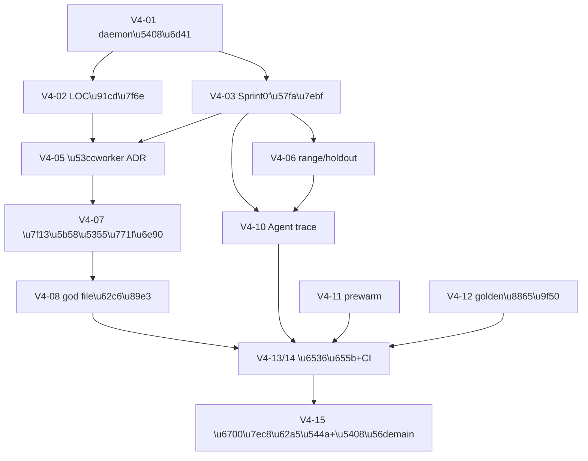

# Java Intelligence V4 全面升级与底层架构收敛计划

> 文档状态：`APPROVED`（用户已于 2026-08-17 批准三项关键决策与整体方案）
> 日期：2026-08-17
> 适用范围：V3.2 Sprint0–5 收尾之后的 Java-only 架构（分支 `codex/java-intelligence-v3`）+ `main` 分支共享 HTTP daemon 架构
> 前置真源：`docs/deep/codex-java-lsp-mcp-java-intelligence-v3-value-realization-optimization-development-plan-2026-08-09.md`（V3.2 计划）、各 Sprint3/4/5 报告、2026-08-09 A–E 综合审计
> 目标：合流两条已分叉的架构线（daemon 运行时层 + Java 智能层），重置测量与治理地基，破除三个已定性的结构性瓶颈，并第一次用真实 Agent outcome 完成价值验证，最终完成复杂度收敛并合回 `main`。

---

## 0. 用户已确认的三项关键决策（2026-08-17）

1. **合流方向**：以 `codex/java-intelligence-v3` 为底座，把 `main` 的 daemon/生命周期层移植过来；完成后合回 `main`。不做反向 rebase（v3 的 146 个提交不可能反向重放）。
2. **LOC 治理重置**：合流后用 `scripts/count-production-ts.mjs` 重新冻结基线，上限 = 新基线 +5%；保留"新增复杂度必须由实测收益支付"原则与 Phase 3 净删除目标；V3.2-29 的 11 行旧债并入新基线清零。
3. **外部 Agent 凭据**：用户提供真实模型 API key，真实 Agent outcome gate（原 V3.2-30）从 `BLOCKED_EXTERNAL` 解除，纳入本次方案核心验收主线。

---

## 1. 诊断结论（为什么 Sprint5 之后效果不满意）

### 1.1 价值主线从未被验证

- V3.2-30（真实 Agent outcome）因环境缺外部模型 API key 一直 `BLOCKED_EXTERNAL`；`run-agent-trace-matrix.mjs` 从未存在。
- V3.2-26 的"standard bytes P50 相对 Sprint0 baseline −15%"门因 `artifacts/v3-baseline/` 全部是 0 字节文件（历史 `EPERM`）而**没有分母**，只能借 V3.2-02 退出条件关闭。
- 所有已报告的收益（7.7%–12.3% diagnostic estimatedTokens 等）都是代理指标，从未换算成真实 Agent input Token、MCP 调用数、补读次数。

### 1.2 三个结构性天花板（已有正式 exit decision 或量化缺口）

| 瓶颈 | 现状 | 已定性根因 | 正确修法（此前被阻塞的原因） |
|---|---|---|---|
| storm 前台延迟 | foreground P95 / quiet = 7.72×–13.24×（门槛 ≤1.10） | `DO_NOT_IMPLEMENT_SINGLE_WORKER_ARCHITECTURAL_CONTENTION`：单线程 worker 同时承担前台查询与后台 sweep | 第二 worker 线程（需 ADR，超出 V3.2 硬门第 8 条"不新增第二 scheduler"边界） |
| range 精度 | RangeLineRecall 0.5525/0.634/0.85（目标 1.0） | `candidateFromFacts()` 硬编码 `positions:[(1,1)]`，`hydrate:false` 时 `methods:[]`，命中 `fallbackReadRange()` 只读 lines 1–23 | 候选阶段 `hydrate:true` 取方法级位置（成本未量化 + LOC 无余量） |
| holdout 必读 | holdout `rReadMust` 0.4/0.5/0.55（门槛 1.0），old/new 一致 | 代码树固有未闭合，与 range 缺口同源 | 同上 + 逐场景归因 |

### 1.3 治理机制成为第一阻塞

- LOC 硬上限 33,219（31,638×1.05），当前 33,230，超编 11 行（V3.2-29 已授权突破、未偿还）。
- 任何需要真实新增代码的修复（range hydrate、双 worker、prewarm telemetry）都无法启动；V3.2-28 第 2 轮甚至需要用户逐次授权 +10 行实验。

### 1.4 两条架构线已严重分叉

- `main`（最近 5 提交，2026-08-11~14）：共享 HTTP daemon 隔离（`9691293`，60 文件 +9,356 行：`src/application.ts`、`src/http-server.ts`、`src/http-server-lifecycle.ts`、`src/mcp-server-factory.ts`、`src/repo-ownership-lease.ts`、`src/runtime-lifecycle-gate.ts`、`daemonctl.sh`、launchd plist、`install-runtime.sh` 全面改造）、断连 runtime 回收（`228f87c`）、安装器/hook 修复（`afb8949`/`a3ccb17`/`bc3ca3b`）。**全部建在旧架构上**（仍有 `src/source-index.ts`、旧 tools 面）。
- `codex/java-intelligence-v3`（146 提交）：删除 `source-index.ts`，重建 `src/java-index/`（Tree-sitter V2）、`src/agent-router/` providers、`SemanticGateway`、`SemanticEdgeStoreV2`、5 工具面。**没有 daemon 层**。
- merge-base 是 `48e665b`。两边共同修改（合并冲突面）约 21 个文件，核心是 `src/jdtls-session.ts`（v3 侧 2,496 行）、`src/repo-runtime-manager.ts`（892 行）、`src/server.ts`、`src/repo-resolver.ts`、`src/repo-layout.ts`、`src/worktree-cache-cleanup.ts`。

### 1.5 其余底层架构债（代码调研 2026-08-17）

- God files：`jdtls-session.ts` 2,496 行（生命周期 + LSP + 两套缓存 + SemanticBackend + hierarchy 遍历 + first-touch telemetry）、`java-index-worker.ts` 1,936 行、`router-java-index.ts` 1,436 行。
- 双路径残留：SemanticGateway complete-only cache 与 session 旧 `cached()` TTL 并存（`workspaceSymbols`/`documentSymbols` 仍走旧路径）；`materialize-candidates.ts` 的 `legacyCompatEntries`；`JAVA_LSP_RELATIONSHIP_FACTS_BATCH=off` 回滚开关；dual-write 过时注释/测试名；`src/agent-router/README.md`、`src/tools/README.md` 仍写 v5；空 `src/util/`。
- 三套世代时钟并存：coordinator `GenerationClock` / session `cacheGeneration` / JavaIndex `indexedGeneration`。
- `artifacts/` 约 4.4GB 已被 git 跟踪（742 文件），且实验脚本仍在往里堆。
- JDT `dataDir` 无版本/classpath fingerprint 失效（V3.2-24 §5.5(c) 确认的真实缺口，修复前需先验证 M2E/Buildship 自带过期检测）。

---

## 2. 基线身份（本计划新增的第五类身份）

| 身份 | SHA | 用途 |
|---|---|---|
| pre-V3 架构参照 | `48e665b` | 代码规模、旧架构缺陷（不变） |
| V3.2 优化基线 | `d7f23d5`（31,638 LOC） | V3.2 周期 LOC ledger 历史依据（本计划后归档） |
| v3 分支收尾 | `4b502b0`（Sprint5 关闭） | 合流的 v3 侧输入 |
| main daemon 线 | `bc3ca3b` | 合流的 main 侧输入 |
| **V4 合流基线（待冻结）** | Phase 0 完成时的合流树 | 本计划所有 LOC 门与百分比门的唯一分母 |

规则不变：不同身份、不同 deadline、不同 golden schema 的指标不得池化或相加。

---

## 3. Phase 0 — 合流与测量地基重置（一切的前置）

### V4-01 daemon 层移植合流

- **实施**：把 `main` 的 5 个提交移植到 v3 架构。以 `git merge origin/main` 起手，冲突面按以下原则解决：
  - main 侧对 `src/source-index.ts`、旧 `src/tools/`（references/restart/shutdown 等）的改动**全部丢弃**——v3 已用 `src/java-index/` 与 5 工具面替代；
  - daemon 新增文件（`application.ts`、`http-server.ts`、`http-server-lifecycle.ts`、`mcp-server-factory.ts`、`repo-ownership-lease.ts`、`runtime-lifecycle-gate.ts`、`smoke-http.ts` 等）保留，但其对旧 runtime 的接线点（`server.ts` 注册、`repo-runtime-manager` 生命周期、`jdtls-session` 回收钩子、`repo-resolver`/`repo-layout` 路径）全部重接到 v3 实现；
  - `install-runtime.sh`、`daemonctl.sh`、launchd plist、`run-daemon.sh`/`run-stdio.sh`、`scripts/runtime-artifacts.test.mjs` 等部署面以 main 版本为准，指向 v3 的构建产物；
  - v3 侧 `worktree-identity`/`cross-process-lease` 与 main 侧 `repo-ownership-lease` 若职责重叠，保留 v3 的 lease 语义为真源，daemon 的 ownership 语义作为其上层消费者，不允许出现第三个 lease truth。
- **验收**：
  - 全量隔离回归绿：`sh scripts/run-isolated-node.sh scripts/run-isolated-validation.mjs --profile full`（`JDTLS_BIN=/usr/bin/false`）；
  - `smoke-http` 通过（daemon 模式 5 工具可用、stdio 模式行为不变）；
  - multiprocess gate（slot bounds、duplicate 0、owner-safe cleanup）与 storm gate `staleCount=0` 不回归；
  - daemon canary runbook（`docs/shared-http-daemon-canary-runbook.md`）逐步走通或逐条标注 v3 侧等价物。
- **禁止**：合并时顺手改 v3 的排名/readPlan/索引行为；一切行为变更留给后续 Phase。

### V4-02 LOC 治理重置

- 合流树上运行 `scripts/count-production-ts.mjs` 冻结**V4 生产 LOC 基线**；周期上限 = 基线 +5%；最终目标 = Phase 3 结束时不高于基线（净下降由删除任务偿还）。
- `scripts/run-v32-optimization-matrix.mjs` 的 `productionLocGatePassed` 判定切换到新基线；V3.2 的 33,219/33,230 记录归档，不再作为门禁。
- task-level LOC ledger 机制保留：每笔新增记录偿还项。

### V4-03 可测量证据基线（Sprint0'）

- 在合流树上重新产出**非 0 字节**的基线并入库校验（`ls -la` + SHA256 断言写进 verifier）：
  - 三仓 cold matrix（`run-three-repo-cold-matrix.mjs --runs 5`，AB/BA/AB）；
  - standard/compact/diagnostic 三口径 bytes（V3.2-02 工具复用）；
  - progressive readiness（`T_open`/`T_anchor_ready`/`T_module_ready`/`T_complete`/`T_snapshot_durable`）；
  - JDT first-touch 分段（记录主机 load；三仓质量矩阵按 `docs/phase-v4/three-repo-host-load-policy.md`，load < 20 必须执行、不得因 load 拒绝）。
- **验收**：每个基线文件非空、有 SHA256、有 run manifest；后续所有"相对基线 ±X%"门禁一律指向 Sprint0'。

### V4-04 artifacts 治理

- 新增 benchmark 产物一律写到 git 外（或 `.gitignore` 覆盖的目录），git 只入 manifest + SHA256 + 摘要 JSON。
- 历史已跟踪（约 4.4GB）与未跟踪 artifacts **一律不动**——HANDOFF 明确其归属其它并行会话（含 `.task30-debug.mjs`、`artifacts/v3-phase3/4/5`、`model-eval` 等）。
- **验收**：`.gitignore` 覆盖新产物路径；本计划各 Phase 产物只有 manifest 入库。

---

## 4. Phase 1 — 底层架构修复

### V4-05 ADR-01：JavaIndex 双 worker 并发模型

- **背景**：V3.2-17 exit decision 已定性单 worker 前台/后台争用是 storm P95 7.7×–13.2× 的主因；V3.2 硬门第 8 条禁止新增第二 scheduler，本计划以 ADR 正式解除该边界（这是新增 worker **线程**，不是新增第二套调度语义——sweep 调度逻辑不变，只是搬到独立线程）。
- **实施**：前台查询 worker 与后台 sweep worker 分离；改造点 `src/java-index/java-index-worker.ts`、`java-index-client.ts`、`router-java-index.ts`；共享 store 采用单写者（sweep worker 写、查询 worker 读快照/世代校验）或消息移交，ADR 里二选一并记录理由。
- **门禁**：
  - storm foreground P95 / quiet ≤ 1.10（原 V3.2-17 验收线，`scripts/run-storm-gate.mjs`）；
  - `staleCount=0`；最终 facts/edges/snapshot digest 与单 worker 逐位等价；
  - `T_complete` 相对 Sprint0' 不退化 >10%；峰值 RSS 增幅 ≤10%（第二线程的内存代价必须量化）。
- **回滚**：feature flag 保留单 worker 路径直至门禁通过两轮，之后删除旧路径（计入 Phase 3 偿还）。

### V4-06 range 精度与 holdout 必读闭合

- **状态（2026-08-19）**：`CLOSED_WITH_RESIDUAL_STRUCTURAL_MISSES`。通用刀已落地并经正式三仓矩阵确认；RangeLineRecall=1.0 / holdout rReadMust=1.0 未达到。继续凑 1.0 只能走已否决路径（全量 IMPLEMENTS 2.65、放宽 maxFiles、save 猜 Mapper、type-header +1、caller-scan）。过程与残差分类：`docs/phase-v4/v4-06-range-holdout-progress-2026-08-19.md`。
- **实施**：
  1. `collectTypeGraphCandidates`/`collectImportGraphCandidates`（`candidate-collectors.ts`）强制 `hydrate:true`，`candidateFromFacts()` 用命中原因所在方法/字段的真实位置替换 `(1,1)`；
  2. 先用 V3.2-03 telemetry 量化 hydrate 的 RPC/延迟成本；若 cold P95 超门禁，把 hydration 合并进 `QUERY_READ_RANGES`/`factsForFiles` 批量路径；
  3. 逐类关闭其余 miss：near-miss-boundary、budget-truncation、second-position-not-queried；out-of-scope 类先修 golden 标注再谈代码；
  4. holdout `rReadMust` 逐场景归因（当前 0.4/0.5/0.55），与 range 修复同一 PR 序列闭合。
- **门禁**：三仓 `RangeLineRecall=1.0`、`RangeCoordinateRecall=1.0`（有 V2 坐标的场景）；tuning+holdout `rReadMust=1.0`；recall/pRead/rTaskBlocking 非劣；cold P95 ≤ max(old×1.25, old+50ms)；read bytes P50 相对 Sprint0' 下降（目标 −15%，硬门为非劣）。
- **纪律**：不重复已证伪的 type-header 变体；`maxFiles` vs `maxReadBytes` 哪个 binding 先核实再动预算。

### V4-07 缓存与新鲜度单真源

- 退役 `jdtls-session.ts` 旧 `cached()` TTL 路径：`workspaceSymbols`/`documentSymbols` 切到 `SemanticGateway`（补 `workspaceSymbol`/`documentSymbol` 操作键，complete-only 语义不变）。
- 世代时钟对齐：coordinator `GenerationClock` 为唯一对外真源；session `cacheGeneration` 与 JavaIndex `indexedGeneration` 改为其派生视图或消费侧对齐断言；任何 `JAVA_*` batch 保证 gateway generation bump（审计 P1-01 终验：新增跨文件 stale 回归测试——改 B 后查 A 不得命中旧 COMPLETE）。
- **门禁**：determinism 30×20 stable；mutation 9/9 `staleCount=0`；warm-auto 质量非劣。

### V4-08 god file 拆解（行为零变更）

- `src/jdtls-session.ts` 拆出：`jdtls-semantic-backend.ts`（raw-LSP 后端 + `createJdtlsSemanticBackend`）、`jdtls-first-touch.ts`（telemetry recorder）、`jdtls-hierarchy-walk.ts`（BFS 遍历）；目标主文件 <1,200 行。
- `java-index-worker.ts` 按命令域拆 handler（maintain/query/mybatis 三组）；`router-java-index.ts` 冷路径补全拆到独立模块。
- **纪律**：每次拆解独立提交 + 全量隔离回归；拆解提交里禁止任何行为/签名语义变更；测试文件同步搬移。

### V4-09 JDT workspace fingerprint 缺口

- **第一步（实验）**：安静主机上验证 M2E/Buildship 对外部 `pom.xml`/`build.gradle` 变更是否自带过期检测（会话停止期间变更 → 重启 → 观察是否重新 import）。
- **第二步（条件实施）**：若确认无覆盖，给 `dataDir` key 增加 JDTLS 版本 + build fingerprint；不匹配拒绝 reuse 并安全清理。若已覆盖，记录证据关闭此项，不写新失效层。
- **门禁**：sibling worktree 隔离三条核查（dataDir 独立 / lease 独立 / 不匹配拒绝 reuse）全绿。

---

## 5. Phase 2 — 价值兑现主线

### V4-10 真实 Agent outcome gate（原 V3.2-30 解除阻塞）

- **实施**：按 V3.2-07a 冻结合同新建 `scripts/run-agent-trace-matrix.mjs`：6 个冻结任务 × old/new × AB/BA，wire-level 事件哈希、精确 usage（input/cached/output）、锁定 model 版本/temperature/seed；old side = Sprint0' 基线树，new side = Phase 1 完成树。
- **硬门**（V3.2-30 原文）：TaskSuccess 非劣；实际总 input Token P50 −10%；MCP/file-read 次数 −15%；paired bootstrap 95% CI 报告。
- 同时关闭 V3.2-26 的"Agent 使用质量"半场；若 estimatedTokens 与真实 Token 不同向，停止为代理指标调参（计划原文条款保留）。
- **依赖**：用户提供 API key（已确认）；任何产生外部调用成本的运行仍以用户提供的凭据范围为界。

### V4-11 idle prewarm 决策落地（原 V3.2-23 解冻）

- 新增会话级预热命中率 telemetry（`impact-metrics.ts` 聚合字段：预热会话数、预热后首个真实语义请求间隔、从未被查询的预热比例）。
- telemetry 有数据后正式跑试验门：first-touch P95 −30% 且 peak RSS/CPU 增幅 ≤10%；通过则 opt-in 配置进默认发行（仍非默认开启），不通过则关闭并删除实验代码。
- 受益面依据：`java_symbol`/`java_diagnostics` 硬编码 `semanticPolicy:"required"`，V3.2-21 关闭 `auto` 不影响这两个工具。

### V4-12 golden 覆盖补齐

- 新增一个含真实 MyBatis XML mapper 的 golden 仓（优先真实业务仓；否则扩展 `fixtures/framework-mybatis` 为可标注 golden），使 V3.2-29 的 MyBatis adapter 有公平第二轮。
- Spring 配额问题换细粒度假设（仅特定证据组合降级，非全局移出 Set），先核实 binding 约束再上正式矩阵；不重复两条已证伪规则。

---

## 6. Phase 3 — 复杂度收敛与发布（只能在 Phase 1/2 价值门禁后执行）

### V4-13 过渡路径删除（原 V3.2-31/32/33）

- 三段式删除 evidence transitional score：producer typed evidence → consumer 迁 `plannerEvidence` → `rg` 证明无 caller 后删 `scoreBase`/merge score/compat IDs（含 `materialize-candidates.ts` 的 `legacyCompatEntries`）。
- framework shared helper 收敛（只抽纯逻辑，无新 DSL）；删除 shadow planner 决策路径（`shadow-ranking.ts` 及关联 matrix/report 测试）。
- 清理双路径残留：relationship batch 回滚开关（batch 成为唯一路径）、dual-write 过时注释/测试名、v5 旧 README、空 `src/util/`、V4-05 的单 worker 旧路径。
- **验收**：candidate 结果/顺序/reasons/readPlan/Agent trace parity；生产 LOC 相对 V4 基线净下降。

### V4-14 CI 分层门禁（原 V3.2-34）

- PR 快门：build、targeted tests、schema、multi-anchor、RPC 上界、fixture。
- nightly：三仓 cold/warm-auto、fault、mutation、determinism、resource smoke。
- release：source-locked 全 cell、first-touch、storm、multiprocess、Agent trace、manifest/receipt。
- 所有 gate 输出 raw hash；失败 artifact 保留（按 V4-04 只入 manifest）。

### V4-15 最终价值报告 + 合回 main

- `docs/phase-v3/v4-value-realization-final-report.md`：分列 strict A/B、policy、historical；standard/diagnostic/actual Agent Token；T_open/T_anchor/T_complete；cold/warm/first-touch；资源与复杂度（LOC 曲线）。第一次给出可信的"总收益"回答（分母 = Sprint0'）。
- 合回 `main` 并发布：daemon + Java 智能统一后的首个 release；发布决策只能是 `KEEP / MODIFY / REMOVE / KEEP_EXPLICIT`。

---

## 7. 不变约束（延续既有结论，不重开）

1. `semanticPolicy` 默认保持 `KEEP_EXPLICIT`——三轮独立证伪（审计 Phase5、V3.2-21、V3.2-25），除非 V4-10 真实 Agent 数据给出新证据。
2. 不重开已关闭 exit decision：V3.2-21/22/24/25、"SPRING_CALL_PATH 整体移出 verified 配额"、"anchor∪protectedPaths 放宽 maxFiles"两条已证伪规则。
3. 所有验证走隔离合同：`sh scripts/run-isolated-node.sh scripts/run-isolated-validation.mjs`，`JDTLS_BIN=/usr/bin/false`；真实 JDT 走 `run-isolated-jdt-benchmark.mjs`；不得接触在线 checkout/LSP/JDT/JavaIndex 缓存。
4. 三仓配对矩阵（AB/BA/AB × 5 runs）仍是唯一性能真源；tuning/holdout 纪律不变。
5. 三仓 cold matrix：1 分钟 load < 20 必须执行，load 不是拒绝门（`docs/phase-v4/three-repo-host-load-policy.md`）。first-touch/storm 记录 load，不得用 per-CPU 0.7 阻断三仓质量门。
6. 本机 PATH 陷阱：先 `export PATH="/opt/homebrew/bin:$PATH"` 再跑任何 worktree/git 相关验证（`/usr/local/bin/git` 是 2.3.1 残留）。

---

## 8. 执行顺序与依赖

可并行：V4-03 基线测量与 V4-02 治理重置；V4-06 range 修复与 V4-05 双 worker（不同层，各自独立矩阵）；V4-10 harness 编写可在 Phase 1 期间先行。
禁止并行：三仓 matrix 的 runs 不并行；V4-13 清理必须在全部价值门禁后。

---

## 9. 成功标准（V4 收口）

1. daemon 与 Java 智能统一在同一棵树上，stdio 与 HTTP 两种模式行为一致且全部门禁绿。
2. storm foreground P95/quiet ≤1.10（此前 7.7×–13.2×）。
3. 三仓 RangeLineRecall=1.0、holdout rReadMust=1.0（此前 0.55–0.85 / 0.4–0.55）。
4. 真实 Agent outcome：TaskSuccess 非劣、实际 input Token P50 −10%、MCP/file-read −15%（此前从未测量）。
5. 单一缓存真源、单一世代真源；`jdtls-session.ts` <1,200 行。
6. 生产 LOC 相对 V4 合流基线净下降；无未测量 adapter、无 shadow planner、无双路径残留。
7. 全部结论由非 0 字节、SHA256 绑定的 Sprint0' 基线支撑。
