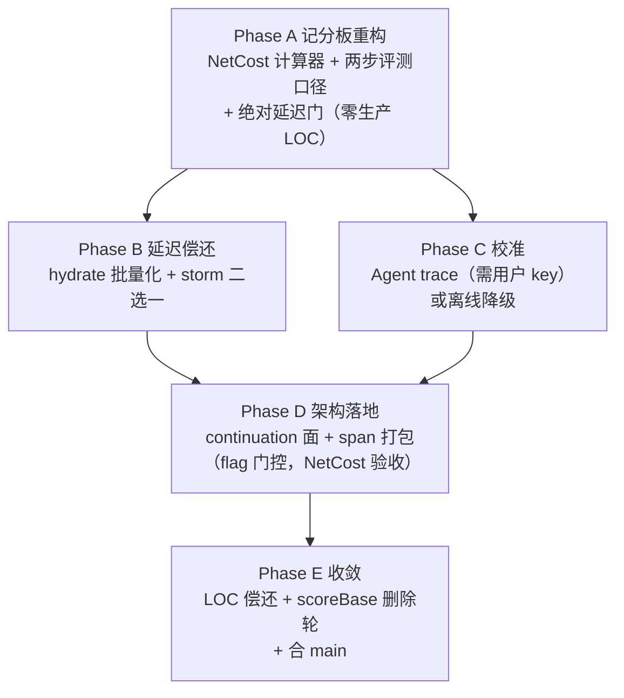

# Java Intelligence V5：净成本目标函数与交互式检索重构方案

> 文档状态：`DRAFT`（待用户批准）
> 日期：2026-08-19
> 前置真源：`docs/deep/codex-java-lsp-mcp-java-intelligence-v4-consolidation-plan-2026-08-17.md`（V4 计划）、`docs/phase-v4/v4-final-three-repo-cold-20260819.md`（最终矩阵）、`docs/phase-v4/v4-06-range-holdout-progress-2026-08-19.md`（残差分类）、`docs/phase-v3/v4-value-realization-final-report.md`（价值报告）、`HANDOFF.md`
> 身份：Sprint0' 分母 = `63a80a2`（`docs/phase-v4/v4-sprint0-manifest.json`）；被评估树 = `4130e3a` + patch（executableTree `a56af2f9`）；最终树 = `73d1161`
> 调查方法：git 历史（`63a80a2..73d1161` 共 19 提交）+ 最终矩阵摘要 JSON 逐 split 拆解 + 门禁脚本实现核对 + V4 计划逐条执行偏差审计

---

## 1. 调查结论（TL;DR）

**"测试效果很不理想"的主因是方案问题，次因是实现问题。产品本身在它被测量的维度上是真实变好的。**

三句话版本：

1. **方案层**：V4 给自己定了一组结构性不可达且互相矛盾的硬门（RangeLineRecall=1.0 + holdout rReadMust=1.0 + estimatedTokens 非劣 + p95 相对门），导致最终矩阵**无论产品好坏都必然 exit 1**；同时唯一能仲裁"多花 token 是否值得"的真实 Agent outcome（V4-10）整个周期结束仍是 `UNMEASURED`——V3.2 的头号诊断（"价值主线从未被验证"）在 V4 原样复发。
2. **架构层**：最终矩阵的 tuning/holdout 泛化缺口（tuning range 两仓已到 **1.000**，holdout 停在 0.263–0.543，exam holdout **一分未动**）证明"单发 readPlan 预测"这个架构在 `maxFiles=6` 预算下已经打到天花板。剩余 miss（第二跳、反向调用方、预算挤出）不是"排名不够聪明"，是**一次调用内本来就装不下**。继续加排名刀只会重复 V4-06 后半程"tuning 涨、holdout 不动、token 涨"的模式。
3. **实现层**：延迟回归是真的（cold-nolsp p50 翻 2–4.8 倍），根因是 V4-06 各刀逐次增加 worker 往返、且方案原文要求的"hydration 合并进批量路径"欠账未做；V4-05 双 worker 只落了 default-off flag，storm gate 两轮从未跑，storm 7.7×–13.2× 这个 V4 §9 头号成功标准实际上没有推进。

**后续方向**：不再为绝对 1.0 加刀。换目标函数（NetAgentCost，离线可测、自动内化 token/recall 交换率）、把架构从"单发预测"升级为"预算内检索 + 显式续读（continuation）"、把预算从"文件数主导"换成"字节主导的方法级 span 打包"、真实 Agent trace 升为 P0 校准项。详见 §4。

---

## 2. 证据链

### 2.1 最终矩阵按 split 拆解：泛化缺口是决定性证据

`docs/phase-v4/v4-final-three-repo-cold-20260819-summary.json`（SHA-256 `95aa6e0f…`）按 tuning/holdout 拆开后，画面与总表完全不同：

| 仓 | tuning range old→new | tuning rReadMust | holdout range old→new | holdout rReadMust old→new | holdout tokens P50 |
|---|---|---|---|---|---|
| lishuedu | 0.750→**0.917** | 1.0 | 0.171→0.543 | 0.50→0.625 | 5057→5872（+815） |
| cipherlink | 1.000→**1.000** | 1.0 | 0.250→0.375 | 0.55→0.55（不动） | 3857→4664（+807） |
| exam-parent-v3 | 0.625→**1.000** | 1.0 | 0.263→**0.263（一分未动）** | 0.40→0.40（不动） | 3578→3869（+291） |

三个事实：

1. **tuning 侧已经打满或接近打满**：cipherlink/exam 的 tuning range 是字面意义的 1.000，rReadMust 三仓 tuning 全是 1.0。V4-06 的七把通用刀（hydrate 方法位、sibling cap=2、type-ref 定位、Primary-keep、positionsFromFacts、helper continuation、IMPLEMENTS 2.45）在它们能覆盖的问题类上**全部生效了**。
2. **holdout 侧几乎不迁移**：exam holdout 六项指标（range/rReadMust/recall/pRead）全部与 old 逐位相同或更差（pRead 0.500→0.417）。每仓仍有 2 个 must-fail holdout 场景，old/new 完全一致。
3. **token 涨幅集中在两个 split 同时发生**：多读的方法体/实现类/兄弟 callee 对 tuning 是"付了钱、拿到了货"（range→1.0），对 holdout 是"付了钱、没拿到货"（range 不动）。

这不是实现 bug，是**架构选择的泛化上限**：对"已知问题形状"（tuning 上归纳出来的类）单发预测可以做到满分；对"新问题形状"（holdout 的第二跳、反向调用方）单发预测在同样预算下无解。V4-06 的收口判断（`CLOSED_WITH_RESIDUAL_STRUCTURAL_MISSES`）是正确的，但 V4 计划没有为"正确收口之后怎么办"留出路径——它只有"继续凑 1.0（被禁止）"和"FAIL"两个出口。

### 2.2 门禁互相矛盾：最终 FAIL 里有多少是门本身造成的

逐条核对最终矩阵 `projects[].gate`（12 项 × 3 仓 = 36 格，18 格 false）：

| false 的门 | 性质 | 判定 |
|---|---|---|
| `rangeLineRecall`/`rangeCoordinateRecall`/`rReadMust`/`holdoutRReadMust`（12 格） | 绝对 1.0 门 | **门槛设计问题**。V4-06 已正式论证 1.0 不可达且所有到达路径均被证伪为过拟合；V4 计划在收口后未撤销这些门，导致每轮矩阵必然 FAIL。"FAIL"不再携带任何信息量。 |
| `estimatedTokens`（3 格） | 相对非劣门 | **门槛设计问题 + 真实成本**。range 提升与 token 下降在固定口径下是 Pareto 对立方向（读方法体必然多字节）；方案未定义交换率，把两个反向目标都设为硬门等于预先决定 FAIL。token 上涨本身是真实的（+8.2%/+22.6%/+14.0%），但**当前口径无法回答它是否值得**（见 §2.3）。 |
| `p95`（cipherlink 2.035、exam 1.777） | 相对 1.25 门（实现为 `max(old×1.25, old+50ms)`，`verify-three-repo-cold-matrix.mjs:48`） | **真实回归 + 门槛量级错位**。回归是真的（见 §2.4），但绝对量级是 cold-nolsp p95 95→194ms / 128→227ms——对 Agent 工具调用（秒级往返）不可感知。在几十毫秒的分布上做相对门，把"真实但无关紧要"判成硬 FAIL。 |
| exam `recall`（−0.0125）、cipherlink/exam `rTaskBlocking`、exam holdout `pRead` | 相对非劣门 | **部分是反过拟合的正确代价**（Primary-keep 让无 `@Primary` 的实现离开 plan，V4-06 文档已记录为预期）、部分是 token 挤出效应。量级都在噪声与单场景波动范围。 |

结论：36 格里至少 15 格 false 是**门槛体系自身**造成的必然结果。这直接回答了"为什么测试效果看起来很不理想"——记分板坏了一半。

### 2.3 estimatedTokens 口径无法度量真实价值

`estimatedTokens = ceil((resultBytes + 400) / 4)`（`output-v6.test.ts:57` 验证的合同）。它只计**本次响应**的体积，不计 miss 的代价。而 miss 的真实代价是：Agent 发现缺一个 must-read 文件 → 追加一轮工具调用（一次往返 + 新的响应开销）→ 通常整文件读入（比 readPlan 的方法级 range 贵好几倍）。

用本次数据做个量级判断：cipherlink token P50 +816 ≈ 3.3KB 响应增量。它的 holdout miss（如 `client-release-storage-presign-holdout` 的 PublishAppService）若由 Agent 补读，一个典型 200 行服务类 ≈ 6–7KB ≈ 1600+ token，还不计定位它所需的额外调用。**也就是说：如果这 816 token 换来了哪怕一半场景少一次补读，净效应就是省的**。但当前门禁把它记为纯亏损。

这就是为什么 V4-10（真实 Agent outcome）不是"锦上添花"而是**仲裁者**：没有它，token 门的方向都定不了。V4 计划 §0 决策 3 明确写了"用户提供真实模型 API key，V4-10 纳入核心验收主线"，但最终报告记录 V4-10 `UNMEASURED`、harness 从未跑过 live cell。这是本周期最大的单点执行偏差，也是 V3.2→V4 连续两个周期的同一个坑。

### 2.4 延迟回归归因：实现欠账，不是主机噪声

最终矩阵绝对延迟（cold-nolsp，attempt 级）：

| 仓 | p50 old→new | p95 old→new |
|---|---|---|
| lishuedu | 20.7→41.8ms（2.0×） | 212.8→224.1ms |
| cipherlink | 22.4→39.3ms（1.8×） | 95.1→193.7ms |
| exam-parent-v3 | 19.1→**91.4ms（4.8×）** | 127.7→226.9ms |

p50 系统性翻倍到近 5 倍，这不是噪声（噪声打不动中位数）。归因到提交序列：V4-06 的每把刀都增加 worker 往返——`hydrate:true`（`1aabd31`）、整型 DTO 读取与 methodRangeEnd（`2fb2148`）、sibling callee 的 `QUERY_READ_RANGES` 扩展（`d00a3bd`）、type-ref implementer 的 callee 定位（`4d10d86`/`599a4d1`）、`findTypeDefinitions(hydrate:true)`（`bc5ec9f`）。V4-06 计划原文第 2 步明确要求：*"若 cold P95 超门禁，把 hydration 合并进 `QUERY_READ_RANGES`/`factsForFiles` 批量路径"*——检查提交历史，**这一步没有做**。过程中各切片矩阵把 1.52×/1.936× 的 p95 归为"主机噪声（质量格子未动）"，逐刀放行，累计到最终矩阵变成 2.0×。

判定：**实现纪律缺口**——单刀矩阵只看质量格子对不对，没有为延迟设累计预算，方案里写好的批量化欠账被静默跳过。修法明确且已在方案原文里：一次 worker 往返带回该 anchor 全部候选的方法级位置（见 §4.4）。

### 2.5 执行偏差审计：V4 计划 vs 实际

| 任务 | 计划角色 | 实际状态 | 偏差定性 |
|---|---|---|---|
| V4-01/02/03/04（合流、LOC、Sprint0'、artifacts） | Phase 0 地基 | ✅ 完成且质量高（非 0 字节、SHA256 绑定） | 无 |
| V4-05 双 worker | Phase 1，storm ≤1.10 是 §9 头号指标 | ⚠️ flag 落地（`df2ca1f`）+ ADR + digest 测试，**storm gate 两轮从未跑**，默认关 | **半途而废**。主瓶颈（7.7×–13.2×）原样 |
| V4-06 range/holdout | Phase 1，门禁 1.0 | ⚠️ 七把通用刀 KEEP、纪律优秀、诚实收口 residual；但 1.0 门不可达 | 实现做到了架构上限；**门是错的** |
| V4-07 缓存单真源 | Phase 1 | ✅ 完成（`bea01ab`，symbol/documentSymbol 切 SemanticGateway） | 无 |
| V4-08 god file 拆解 | Phase 1 | ✅ 完成（jdtls-session 1,013 行 < 1,200） | 无 |
| V4-09 JDT fingerprint | Phase 1 | ✅ 实验完成，未加失效层（有据） | 无 |
| V4-10 真实 Agent outcome | **Phase 2 价值主线核心** | ❌ harness 存在，live cell 从未跑，`UNMEASURED` | **最大偏差**。§0 决策 3 承诺的 key 未兑现/未催办 |
| V4-11 prewarm | Phase 2 | ⚠️ telemetry 落地；正式实验因 load 22.49 放弃，P95/RSS `UNMEASURED` | 未完成 |
| V4-12 golden 补齐 | Phase 2 | ⚠️ MyBatis golden fixture 落地（`c6733a7`）；Spring 配额细粒度假设未做 | 半完成 |
| V4-13 复杂度收敛 | Phase 3，**"必须在全部价值门禁后"** | ⚠️ 提前部分执行（`cbee169`）；scoreBase/legacyCompatEntries 未删；LOC 36,770 > 基线 35,472，净下降未达成 | **顺序违反计划自己的依赖图** |
| V4-14 CI 分层 | Phase 3 | ✅ 完成（`8ad4271`） | 顺序同上 |
| V4-15 报告+合 main | Phase 3 | ⚠️ 报告完成；未合 main（价值门禁未过，不合是对的） | 无 |

模式：**低风险的工程任务（07/08/09/12/13/14）全部完成，两个高风险高价值任务（05 的验证半程、10 的全部）没有完成**。Phase 2 价值主线整体缺席的情况下，Phase 3 清理提前做了。这是执行排序问题：难的、依赖外部条件的任务被自然推后，而计划没有硬性的"Phase 2 不过不准进 Phase 3"检查点执行力。

---

## 3. 判定：方案问题 vs 实现问题的分账

### 方案问题（主因）

| # | 问题 | 后果 |
|---|---|---|
| P1 | 绝对 1.0 门（RangeLineRecall / holdout rReadMust）与"三仓是样本不是目标函数"的反过拟合纪律**自相矛盾**：达到 1.0 的所有路径都被纪律正确否决，则 1.0 永远 FAIL | 每轮矩阵必然 exit 1，"FAIL"失去信息量，最终报告呈现为"效果很不理想" |
| P2 | token 非劣门与 range 提升门是 Pareto 对立方向，未定义交换率 | 任何 range 改进都自动触发 token FAIL |
| P3 | estimatedTokens 是"单响应体积"代理，不含 miss 的补读代价 | 无法判断 +816 token 是亏是赚；调参方向盲飞 |
| P4 | p95 相对门工作在几十毫秒量级 | 真实但无关紧要的回归被判硬 FAIL |
| P5 | V4-10 排在 Phase 2 且无强制检查点；05 的 storm 验证无截止 | 价值主线连续第二个周期缺席；主瓶颈无推进 |
| P6 | 计划没有"正确收口 residual 之后怎么办"的出口 | V4-06 收口后剩余工作失去方向，退回执行低风险清理 |

### 实现问题（次因，真实存在）

| # | 问题 | 后果 |
|---|---|---|
| I1 | V4-06 各刀逐次增加 worker 往返，方案要求的批量化欠账未做；单刀矩阵无累计延迟预算 | cold p50 2–4.8×、cipherlink p95 2.0× |
| I2 | V4-05 storm gate 两轮从未执行 | storm 7.7×–13.2× 原样，dual worker 价值未知 |
| I3 | V4-11 正式实验未跑（load 22.49 时放弃；三仓 load 政策只约束 cold 矩阵，JDT 实验无对应政策，属于流程缺口而非违规） | prewarm 决策继续悬空 |
| I4 | token 挤出效应未管理：新证据进入后，plan 内旧文件被挤出的二阶效应只在个别切片被注意（exam pRead 0.6067→0.6000） | holdout pRead 回归、recall 微降 |

### 不是问题的部分（应明确保留）

- V4-06 的**过程纪律是本周期最大资产**：每刀正式三仓矩阵、REJECT 过拟合刀（IMPLEMENTS 2.65、caller-scan、type-header +1、save 猜 Mapper）、诚实收口。
- range 从 0.634/0.850/0.553 到 0.842/0.875/0.853 是真实产品改进；tuning 侧 1.0 证明刀本身有效。
- Phase 0 的测量地基（非 0 字节 Sprint0'、SHA256、manifest）第一次让"相对基线"的所有声明可信。
- 隔离合同、AB/BA/AB 配对、frozen scenarios 的方法论没有任何问题。

---

## 4. V5 方案

### 4.0 一句话定位

**停止"把单发预测调到满分"，转向"让一次调用的净成本最低、让第二次调用几乎免费"。**

### 4.1 决策 A：目标函数换成 NetAgentCost（净代理成本）

**定义**（离线可测，不需要 API key）：

```
NetAgentCost(scenario) = estimatedTokens(readPlan 响应)
  + Σ_{f ∈ missed must-read files} [ fullFileTokens(f) + CALL_OVERHEAD ]
  + Σ_{r ∈ missed must-read ranges（文件命中但 range 未覆盖）} [ fullFileTokens(file(r)) − plannedTokens(file(r)) + CALL_OVERHEAD ]
```

- `fullFileTokens(f) = ceil(fileBytes(f)/4)`——Agent 补读时没有方法级 range 信息，按整文件计；
- `CALL_OVERHEAD = 100`（一次 MCP 往返的固定 token 开销，Phase C 用真实 trace 校准，初值取响应信封 400 字节/4）；
- must-read 与 range 覆盖判定沿用现有 golden 口径，零新标注成本。

**为什么它解决 P1–P3**：miss 一个 must-read 的代价（1500–3000 token）远大于多读几个方法体（+200–800 token），所以 range/召回改进在 NetCost 下自动变成收益、无效的多读自动变成亏损——token/recall 交换率被数据内化，不再需要人为定两个反向硬门。绝对 1.0 不再是门：一个结构性 miss 在 NetCost 里就是一笔固定罚金，罚金账本替代"全对/全错"的二值门。

**门禁**：三仓 NetCost P50/P95 相对 Sprint0'（同口径重算分母，纯离线重放，不需要重跑矩阵）**下降为 PASS**；tuning/holdout 分开报告；file recall / pRead 降级为非劣观测门（回归防护，不做优化目标）。

**实施**：`scripts/` 新增 NetCost 计算器（消费现有 matrix cell JSON 与 golden jsonl，纯后处理，**零生产 LOC**）；`verify-three-repo-cold-matrix.mjs` 增加 netCost 字段与门；旧 estimatedTokens 门与绝对 1.0 门保留为报告字段、撤销 FAIL 效力。

### 4.2 决策 B：交互式检索——readPlan 附带显式 continuation

**依据**：§2.1 泛化缺口 + V4-06 残差分类。四类残差（第二跳 `paper-task` MeQueryService、反向调用方 `presign` PublishAppService、预算挤出 `candidate-pay` Impl、错方法 `audit-order`）的共同本质是**信息在索引里有、在预算内装不下、或单发无法预判**。java-index 的边数据（IMPLEMENTS/CALLS/REFERENCES）在 readPlan 裁剪时被整体丢弃——Agent 拿到的响应里没有任何"我还知道什么但没给你"的线索，只能盲目补读。

**实施**：

1. readPlan 响应新增 `continuations[]`：入选边界外、评分最高的 K 个候选句柄（`{file, memberRange, relation, reason, estTokens}`，K≤8，只含元数据不含代码，成本 ≈ 每条 40–60 字节）。数据全部来自现有 ranking pipeline 的落选集合，**不新增索引查询**。
2. 五工具面增加一个廉价兑现路径：`java_context`/`java_impact` 接受 `expand: [continuationId]`，直接按句柄返回方法级 range 内容，跳过重新排名（一次 worker 批量读，目标 p50 <20ms）。
3. **评测同步升级为两步口径**：模拟 Agent 策略"若 must-read 不在第一响应且 continuations 中存在对应文件，则以 `expand` 兑现"，计入 NetCost（第二次调用的真实 token + CALL_OVERHEAD）。新指标 `rReadMust@2calls` / `RangeLineRecall@2calls` 作为产品门；单发口径继续报告作为对照。

**预期**：残差四类中"第二跳/挤出"两类（占 holdout miss 的大多数）在两步口径下闭合——它们的候选**本来就在落选集合里**（V4-06 记录：exam-score 的 SchoolQueryService "1.75 进不了已满的 2.5 CALLS 核心"、candidate-pay 的 Impl 被挤出 6 文件）。反向调用方类需要 continuation 源扩展到 reverse-CALLS 边（索引已有，排名从未消费）；错方法类（audit-order save vs listTodo）维持 `DO_NOT_SPECIALIZE`，作为 NetCost 罚金留账。

**这不违反已证伪规则**：不放宽 maxFiles（第一响应预算不变）、不抬 IMPLEMENTS 排名、不做 caller-scan 启发式——反向边只出现在 continuations 元数据里，由 Agent 决定是否兑现。

### 4.3 决策 C：字节主导的方法级 span 打包（第一响应内的结构性优化）

**依据**：V3.2-28 第 1 轮已核实"全部 6 个 holdout 场景文件数上限（6）打满、字节预算只用 30%–69%"——**binding 约束是文件数，真实成本是字节**。V4-06 落地方法级位置后，选择单元有条件从"文件"细化为"方法级 span"：同样 14KiB 字节预算下，8–10 个精确 span 可以覆盖比 6 个文件更多的 must-read。

**与已证伪规则的区别声明**（这是结构不同的新假设，不是重跑）：V3.2-28 第 2 轮否决的是"anchor∪protectedPaths 放宽 maxFiles"——在**粗粒度 range**（当时大量 (1,1) fallback 读 1–23 行或整文件）下多放文件 = 多读噪声字节，pRead 必然崩。现在（a）range 是方法级的，（b）选择单元是 span 不是文件，（c）目标函数是 NetCost 不是 pRead。三个前提都变了。

**实施**：`read-plan.ts` 的 `selectTokenAwarePlan` 增加 span 打包模式（flag 门控）：预算主维度切到 `maxReadBytes`，`maxFiles` 上调为软护栏（如 10），BUCKET_RULES 按 span 计数。正式三仓矩阵 + NetCost 门验收；若 NetCost 不降或 pRead 显著回归，REJECT 并留档。

### 4.4 决策 D：延迟收口（偿还 I1，回应 P4）

1. **批量化欠账**：把 V4-06 引入的逐候选 hydrate/type-def/sibling 查询合并为**每 anchor 一次 worker 批量往返**（扩展现有 `QUERY_READ_RANGES`/`factsForFiles` 批量命令，方案 V4-06 原文第 2 步的既定路径）。验收：三仓 cold-nolsp p50 回到 ≤ 2× Sprint0'（即 ≤40ms 量级），p95 绝对值 ≤ 500ms。
2. **门槛重定义**：cold-nolsp 延迟门改为**绝对门**（p95 ≤ 500ms，p50 ≤ 100ms）；相对比率仅报告。理由：Agent 工具调用往返以秒计，几十 ms 级差异不构成产品信号，相对门只制造噪声 FAIL（§2.2）。
3. **累计延迟预算**：后续任何单刀矩阵，除质量格子外必须报告相对**Sprint0'**（不是相对上一刀）的 p50/p95，防止"逐刀噪声、累计回归"复发。

### 4.5 决策 E：真实 Agent trace 升为 P0 校准项（回应 P5）

- **入口条件只有一个：用户提供 API key 并授权外发**（`--authorize-external`）。这是本方案对用户的唯一硬请求。harness（`scripts/run-agent-trace-matrix.mjs`）已存在。
- **用途重定位**：不只是验收门，更是 **NetCost 模型的校准器**——用 6 个冻结任务 × old/new 的真实 input token / 调用次数 / 补读行为，校准 `CALL_OVERHEAD` 与 `fullFileTokens` 假设，并验证 NetCost 与真实成本**同向**。若不同向，NetCost 系数修正后重算；连续两轮不同向则 NetCost 降级、停止依据它调参（继承 V3.2-26 的代理指标纪律）。
- **降级路径**（key 持续不可得时）：用本地录制的 Agent 会话 trace（无外发成本）做粗校准；明确标注 `CALIBRATED_OFFLINE`，精度受限但方向可用。
- **纪律**：在 NetCost 至少完成一次校准（在线或离线）之前，**除 §4.4 延迟偿还外，不落地任何新的排名/预算刀**。

### 4.6 遗留收口（不新增方向，只清欠账）

1. **V4-05**：主机安静窗口跑 `run-storm-gate.mjs` 两轮（flag on）。过（P95/quiet ≤1.10、staleCount=0、T_complete/RSS ≤+10%）→ 默认开 + 删单 worker 路径（LOC 偿还）；不过 → 删 flag 与 sweep 线程代码（同样是 LOC 偿还），storm 结论回到 `DO_NOT_IMPLEMENT` 并记录。**两周内必须二选一，不允许继续悬空。**
2. **V4-11**：prewarm 正式实验补跑（给 JDT 实验类比三仓政策定一条明确主机门，不再临时判断）；门槛不变（first-touch P95 −30%、RSS/CPU ≤+10%）。
3. **LOC**：36,770 → 净下降路径 = V4-05 二选一的删除 + scoreBase/legacyCompatEntries 删除轮（后者改变 candidate identity，需按 V4-13 三段式走 parity 验证，安排在 NetCost 门稳定之后，避免同时动目标函数和身份）。
4. **合 main**：条件改为"NetCost 门 PASS + 延迟绝对门 PASS + storm 二选一完成"，不再等绝对 1.0。

---

## 5. Phase 计划与依赖



| Phase | 内容 | 硬门 | 备注 |
|---|---|---|---|
| A | NetCost 计算器、两步评测、门禁重构（撤 1.0 门/token 非劣门/相对 p95 门的 FAIL 效力） | Sprint0' 分母离线重算完成、新旧口径并行报告一轮 | 纯 scripts/ 后处理，最快见效，先修记分板再动产品 |
| B | hydrate 批量化；storm gate 两轮二选一 | cold p50 ≤2× Sprint0'、p95 ≤500ms；storm 结论落地 | 与 A 并行；B 是 D 的前置（不能在慢路径上加 continuation） |
| C | Agent trace 校准 | NetCost 与真实成本同向 ≥1 轮 | **需要用户 key**；不可得则离线降级并标注 |
| D | continuations[] + expand 兑现路径 + span 打包 | 三仓 NetCost P50 下降；`rReadMust@2calls` ≥ 0.9（观测目标，非绝对门）；file recall/pRead 非劣 | 每刀正式矩阵，继承 V4-06 全部反过拟合禁令 |
| E | 删单/双 worker 败者路径、scoreBase 三段式、合 main | LOC ≤ 35,472；candidate parity 或已授权的 identity 变更；全门绿 | 严格在 D 的价值门后 |

**执行力检查点**（修 P5/P6）：每个 Phase 收口必须产出"完成/放弃"二值决定入 HANDOFF；高风险任务（B 的 storm、C 的 key）设两周决定期限，到期未决自动升级给用户，不允许静默滑入下一 Phase。

---

## 6. V5 成功标准

1. 三仓 NetAgentCost P50 相对 Sprint0'（同口径分母）**下降 ≥15%**；tuning/holdout 都下降（holdout 允许更小幅度，但方向必须一致）。
2. 两步口径 `rReadMust@2calls` 三仓 ≥0.9（残差账本解释剩余罚金，不设 1.0）。
3. cold-nolsp 绝对延迟：p50 ≤100ms、p95 ≤500ms；storm 前台 P95/quiet 结论二选一落地（≤1.10 默认开，或删除线程代码）。
4. NetCost 与真实 Agent 成本至少一次同向校准（在线优先，离线降级需标注）。
5. 生产 LOC ≤ 35,472（V4 基线），败者路径与 transitional score 已删。
6. 合回 `main`。

## 7. 不变约束（全部继承，不重开）

- 隔离合同、AB/BA/AB × 5 runs、frozen scenarios、三仓 load < 20 必须执行（`docs/phase-v4/three-repo-host-load-policy.md`）。
- 全部已证伪规则与 exit decision 维持：不为三仓凑 1.0、禁场景特判、禁 save 猜 Mapper、禁 type-header +1、禁 caller-scan 启发式、禁重跑 SPRING_CALL_PATH 整体降级与 anchor∪protectedPaths 放宽 maxFiles（§4.3 已声明结构差异）、`semanticPolicy` 维持 `KEEP_EXPLICIT`。
- 外发模型调用必须用户显式授权，未授权状态 = `BLOCKED_EXTERNAL`，指标 = `UNMEASURED` 不得写 0。
- `export PATH="/opt/homebrew/bin:$PATH"` 后再跑 worktree/git 相关验证。

## 8. 风险与开放问题

| 风险 | 缓解 |
|---|---|
| NetCost 的补读模型假设（整文件、CALL_OVERHEAD=100）偏差大 | Phase C 校准是硬依赖；校准前只用于相对比较（old/new 同模型），不做绝对声明 |
| continuation 面改变工具输出契约，现有 Agent prompt/schema 需适配 | `continuations[]` 为新增字段（向后兼容）；`expand` 为新可选参数；schema 测试先行 |
| 两步评测的"模拟 Agent 策略"本身成为新的代理偏差 | 策略刻意保守（只兑现 must-read 对应句柄）；Phase C 用真实 trace 验证 Agent 是否真的会兑现 |
| span 打包重蹈 V3.2-28 第 2 轮覆辙 | 先离线用现有 matrix 原始数据重放 span 打包的 NetCost（零成本预筛），为正才上正式矩阵 |
| 用户 key 仍不可得，Phase C 长期降级 | 离线校准 + 明确标注；D 的落地门只依赖 NetCost 相对改善，不依赖绝对校准精度 |
| 三仓 golden 被连续两个周期开采，隐性过拟合累积 | V4-12 的 MyBatis golden 已入库；建议 Phase D 期间引入第四仓（或轮换 holdout 场景集）作为未开采验收集 |

---

**附：本次调查的原始依据**

- 最终矩阵：`docs/phase-v4/v4-final-three-repo-cold-20260819-summary.json`（split 级拆解见 §2.1，本文数字均出自该文件）
- 残差分类与七把刀的逐刀矩阵：`docs/phase-v4/v4-06-range-holdout-progress-2026-08-19.md`
- 执行状态：`docs/phase-v3/v4-value-realization-final-report.md`、`HANDOFF.md`
- 门禁实现：`scripts/verify-three-repo-cold-matrix.mjs`（p95 门 `max(×1.25, +50ms)`、绝对 1.0 门）、`src/agent-router/read-plan.ts`（balanced `maxFiles:6 / 14KiB`、`BUCKET_RULES`）
- 提交序列：`63a80a2..73d1161`（19 提交，V4-05 flag `df2ca1f`、V4-06 七刀 `1aabd31..1242b05`、V4-07/08 `bea01ab`/`5f0b666`、V4-09 `5c28ed5`、V4-11 `c9cc6d3`、V4-12 `c6733a7`、V4-13 `cbee169`、V4-14 `8ad4271`）
