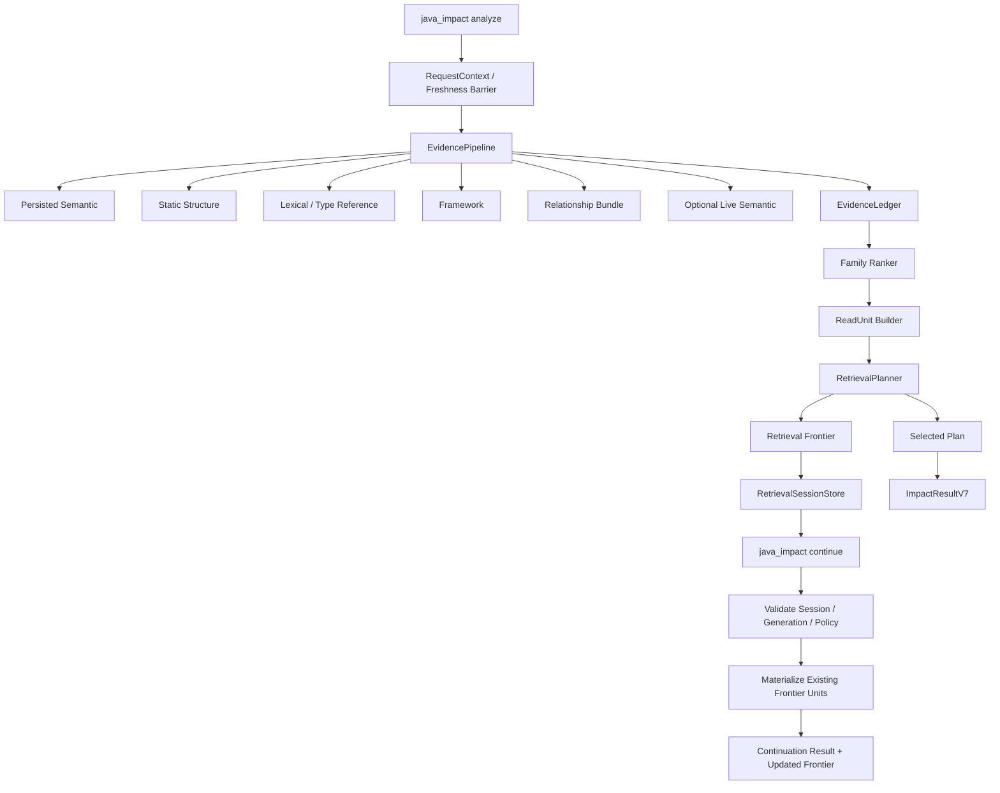

# Codex Java LSP MCP — Java Intelligence V5R 全面评估与架构改造方案

> **日期**：2026-08-19（同日修订版 R1）  
> **评估对象**：`lkyprogramer/codex-java-lsp-mcp` / `codex/java-intelligence-v3`  
> **分支 HEAD**：`a917d9ced265a3122e9724299c7a0b54e51f36de`  
> **被评估新方案**：`docs/deep/codex-java-lsp-mcp-java-intelligence-v5-net-cost-interactive-retrieval-plan-2026-08-19.md`（诊断部分 §1–§3 仍为诊断真源；其实施设计已由本文档取代）  
> **文档状态**：`ADOPTED — 本文档是后续开发的唯一实施真源`  
> **修订说明（R1，2026-08-19）**：原稿五个 P0 指控已逐条经本地源码核实属实（token 公式、工具面、gate 名实不符、提交数、RC tree），原稿评估结论全部保留。R1 在原稿基础上新增第 0 章（执行者必读背景与防偏离守则）并落入 5 处修正：λ 校准提前到 Phase 3（修依赖倒挂）、每 Phase 二值决定期限、V4-11/V4-09 遗留欠账处置、`expectedGain` 不对外暴露、stdio session 生命周期语义。修订处均以 **【R1 修订】** 标注。  
> **版本名**：产品演进阶段称 **Java Intelligence V5R**；公开返回协议版本使用 **ImpactResultV7**，避免把产品阶段与协议版本混为一谈。

---

## 目录

0. [执行者必读：背景、约束与防偏离守则【R1 新增】](#0-执行者必读背景约束与防偏离守则r1-新增)
1. [执行结论](#1-执行结论)
2. [评估范围、证据边界与可复现性](#2-评估范围证据边界与可复现性)
3. [最近提交与当前工程状态审计](#3-最近提交与当前工程状态审计)
4. [现有架构全面评估](#4-现有架构全面评估)
5. [原 V5 方案逐项评审](#5-原-v5-方案逐项评审)
6. [V5R 的目标函数与成本模型](#6-v5r-的目标函数与成本模型)
7. [V5R 目标架构](#7-v5r-目标架构)
8. [交互式检索与 continuation 协议](#8-交互式检索与-continuation-协议)
9. [ReadUnit、Span Packing 与检索前沿](#9-readunitspan-packing-与检索前沿)
10. [JavaIndex 与 Relationship 查询底层改造](#10-javaindex-与-relationship-查询底层改造)
11. [并发、freshness、缓存与故障语义](#11-并发freshness缓存与故障语义)
12. [公开 MCP 协议与兼容策略](#12-公开-mcp-协议与兼容策略)
13. [测试、评估与门禁体系重构](#13-测试评估与门禁体系重构)
14. [文件级改造清单](#14-文件级改造清单)
15. [分阶段实施计划与退出条件](#15-分阶段实施计划与退出条件)
16. [风险登记与回滚策略](#16-风险登记与回滚策略)
17. [立即执行清单](#17-立即执行清单)
18. [最终判断](#18-最终判断)
19. [附录 A：建议类型定义](#附录-a建议类型定义)
20. [附录 B：建议测试矩阵](#附录-b建议测试矩阵)
21. [附录 C：证据索引](#附录-c证据索引)

---

# 0. 执行者必读：背景、约束与防偏离守则【R1 新增】

> 本章是为后续执行本计划的 AI/开发者准备的完整上下文。任何会话在开始本计划的任何任务之前，必须先读完本章。本章的禁止清单（§0.5）优先级高于本文档其余所有章节——如果后文任何设计与 §0.5 冲突，以 §0.5 为准并升级给用户。

## 0.1 一分钟项目背景

本仓库是一个面向 AI Agent 的 **Java 代码智能 MCP 服务器**（macOS-only，TypeScript/Node）。核心价值主张：Agent 修改 Java 代码前调用一次 `java_impact`，拿到"需要读哪些文件、哪些精确行区间"的 readPlan（含证据与置信度），替代盲目 `rg`/整文件阅读，从而降低 Agent 的 token 消耗与工具往返次数。

- **公开工具面（严格 5 个）**：`java_status`、`java_impact`、`java_symbol`、`java_diagnostics`、`java_runtime`（注册处 `src/mcp-server-factory.ts`）。没有 `java_context`，任何文档提到它都是错的。
- **运行模式**：stdio（每会话一进程）与共享 HTTP daemon（`src/application.ts`/`src/http-server.ts`，含 repo ownership lease 与 runtime 回收）。
- **底层主干**（评级见 §3.3，整体可信，不要推翻）：repo identity/generation → Tree-sitter JavaIndex（冷启动事实源，worker 进程）→ 有界 JDT/SemanticGateway（增强，complete-only cache）→ typed evidence providers → family ranker → byte-aware readPlan → 5 工具。
- **质量真源**：三个真实业务仓的配对矩阵（lishuedu / cipherlink / exam-parent-v3，位于 `/tmp/codex-java-v3-golden-20260809/`），golden scenarios 分 **tuning / holdout** 两个 split，`scripts/run-three-repo-cold-matrix.mjs --runs 5` AB/BA/AB。
- **分支**：`codex/java-intelligence-v3`。**尚未合回 `main`**，合并条件见 §15 Phase 7。

## 0.2 历史因果链：我们为什么走到 V5R

执行本计划时如果不理解这段历史，几乎必然重蹈覆辙。

1. **V3.2 周期（2026-08-09~16）**：大量优化以代理指标（estimatedTokens、diagnostic bytes）验收；真实 Agent outcome（V3.2-30）因无 API key 全程 `BLOCKED_EXTERNAL`。周期结束审计的头号诊断是"**价值主线从未被验证**"。
2. **V4 周期（2026-08-17~19）**：合流 daemon（V4-01）、重置测量地基（Sprint0' 分母 = `63a80a2`，非 0 字节 + SHA256 绑定）、V4-06 落地七把通用排名/定位刀（hydrate 方法位、sibling cap=2、type-ref 定位、Primary-keep、positionsFromFacts、helper continuation、called-port IMPLEMENTS 2.45），全部经正式矩阵逐刀验证并 REJECT 了过拟合刀。
3. **V4 最终矩阵（2026-08-19，`docs/phase-v4/v4-final-three-repo-cold-20260819-summary.json`）暴露架构天花板**——把 tuning/holdout 拆开看：

| 仓 | tuning range old→new | tuning rReadMust | holdout range old→new | holdout rReadMust | tokens P50 | cold p50 |
|---|---|---|---|---|---|---|
| lishuedu | 0.750→**0.917** | 1.0 | 0.171→0.543 | 0.50→0.625 | +8.2% | 2.0× |
| cipherlink | 1.000→**1.000** | 1.0 | 0.250→0.375 | 0.55 不动 | +22.6% | 1.8× |
| exam-parent-v3 | 0.625→**1.000** | 1.0 | 0.263→**0.263 一分未动** | 0.40 不动 | +14.0% | **4.8×** |

   tuning 侧已打满（两仓字面 1.000），holdout 几乎不迁移——**单发 readPlan 预测在 `maxFiles=6` 预算下已到泛化上限**。剩余 miss（第二跳、反向调用方、预算挤出、同文件错方法）不是排名不够聪明，是一次调用内装不下或单发无法预判。
4. **根因分账**（详见 V5 诊断文档 §1–§3，仍是诊断真源）：**方案问题为主**（绝对 1.0 门与反过拟合纪律自相矛盾、token 门与 range 门 Pareto 对立且无交换率、代理指标当真值、V4-10 真实 trace 又一次全程缺席）；**实现问题为次**（V4-06 各刀逐次增加 worker 往返、方案要求的批量化欠账未做 → 延迟真实回归；V4-05 双 worker 只落 flag、storm gate 两轮从未跑）。
5. **V5 草案**（同日）给出正确方向：净成本仲裁、交互式检索、方法级 span、trace 升 P0。但含 5 个 P0 级事实/设计错误（token 公式、`java_context`、continuation 无一致性模型、gate 名实不符未察觉、RC tree 未区分），已在其文档头勘误并标记 `SUPERSEDED_BY_V5R`。
6. **本文档（V5R）**：保留 V5 方向，修正其错误，给出工程规格。R1 修订再补 5 处（见文档头）。

**一句话教训**：连续两个周期的失败模式都是——先加复杂度 → tuning 变好 → holdout 不动 → token/延迟上涨 → 最后才发现目标函数无法仲裁。本计划的 Phase 顺序（先修记分板与事实、再偿还延迟债、先 shadow 证明收益上限、最后才实现 continuation）就是为了阻断这个模式，**不得跳序执行**。

## 0.3 真源文档地图

| 文档 | 角色 | 什么时候读 |
|---|---|---|
| 本文档 | **实施真源**（架构、协议、Phase、门禁） | 每个任务开始前对应章节 |
| `docs/deep/...v5-net-cost-interactive-retrieval-plan-2026-08-19.md` | 诊断真源（§1–§3 证据链）；§4–§6 已被本文档取代，注意其文档头勘误 | 需要理解"为什么"时 |
| `docs/deep/...v4-consolidation-plan-2026-08-17.md` | 历史（V4 计划原文，含已确认的三项用户决策） | 追溯 V4 任务定义时 |
| `docs/phase-v4/v4-06-range-holdout-progress-2026-08-19.md` | **残差分类与已证伪刀清单**（KEEP/REJECT 逐刀记录） | 动任何 ranking/readPlan 前必读 |
| `docs/phase-v4/v4-final-three-repo-cold-20260819{-summary.json,.md}` | V4 最终矩阵数据 | 需要基线数字时 |
| `docs/phase-v4/v4-sprint0-manifest.json` + `v4-sprint0-summaries/` | Sprint0' 分母身份（`63a80a2`） | 任何"相对基线"声明 |
| `docs/phase-v4/three-repo-host-load-policy.md` | 主机 load 政策（load<20 必须执行） | 跑三仓矩阵前 |
| `docs/phase-v3/v4-value-realization-final-report.md` | V4 收口状态（含 UNMEASURED 清单） | 核对遗留欠账 |
| `HANDOFF.md` | 会话交接状态 + 历史坑清单 | 每个新会话开始 |

## 0.4 关键代码地图

| 文件 | 职责 | V5R 相关性 |
|---|---|---|
| `src/mcp-server-factory.ts` | 注册 5 个公开工具 | §8 `action=analyze\|continue` 落点 |
| `src/tools/impact.ts` | `java_impact` 入参校验与调度 | §8 输入协议 |
| `src/agent-router/index.ts` | `impactWithinRequest()` 顺序编排（§4.2 有完整阶段列表） | 拆 EvidencePipeline/RetrievalPlanner |
| `src/agent-router/read-plan.ts` | 预算（balanced=6 文件/14KiB）、`BUCKET_RULES`（anchor:1, core:4, framework:2, support:1, lexical:1）、marginal utility 选择 | §9 ReadUnit/planner 迁移源 |
| `src/agent-router/read-plan-budget.ts` | legacy evidence-class 配额 + `finalize.*` scoreBreakdown IDs | §14.2 待 parity 后降级 |
| `src/agent-router/providers/relationship-provider.ts` | 关系证据（正在 god 化，见 §3.2.1） | §10.4 拆分对象 |
| `src/agent-router/output-v6.ts` | `estimatedTokens = ceil((resultBytes + readBytes)/4)`，`readBytes` 已含 readPlan 字节 | §6 成本分解基础事实 |
| `src/java-index/java-index-worker*.ts`、`router-java-index.ts`、`java-index-client.ts` | JavaIndex worker（query worker 是 store 唯一 writer）；dual worker flag `JAVA_LSP_JAVA_INDEX_DUAL_WORKER` 默认关 | §10 `QUERY_RELATIONSHIP_BUNDLE` 落点 |
| `src/semantic-gateway.ts` | singleflight、per-caller deadline、complete-only cache | §11 session 设计的参照（复用模式不复用类） |
| `src/jdtls-session.ts`（1,013 行）+ 已拆出的 `jdtls-lsp-io/first-touch/semantic-backend/hierarchy-walk` | JDT 生命周期 | 不要把逻辑塞回去 |
| `scripts/run-three-repo-cold-matrix.mjs` / `verify-three-repo-cold-matrix.mjs` | 正式矩阵与门禁（p95 门 = `max(old×1.25, old+50ms)`） | §13 corrected cost/@2calls 落点 |
| `scripts/run-v4-gates.mjs` | gate profile（当前三个 profile 执行相同内容，P0 bug） | §13.2 重写对象 |
| `scripts/run-isolated-node.sh` + `run-isolated-validation.mjs` | 唯一合法的验证入口 | 所有验证 |
| `scripts/run-agent-trace-matrix.mjs` | 真实 Agent trace harness（已存在，从未跑 live cell） | §6.2 λ 校准 / Phase 3·7 |

## 0.5 硬性禁止清单（违反任何一条 = 立即停止、回滚、记录）

**反过拟合（三仓是验收样本，不是目标函数；用户还有很多其它仓库）**：

1. 禁止任何场景 id / 文件名 / taskKeywords 特判。
2. 禁止用 `save` 锚点去猜 Mapper `listTodo`（`audit-order` 类，已定性 `DO_NOT_SPECIALIZE`）。
3. 禁止 type-header +1 修 77–93 vs 77–94 类 near-miss。
4. 禁止发明 caller-scan 启发式；反向调用方只能走 §7.3 原则 3 的 `DEFERRED_QUERY` 显式合同。
5. 禁止重跑已证伪规则：`SPRING_CALL_PATH` 整体移出 verified 配额（V3.2-28 R1）、anchor∪protectedPaths 放宽 `maxFiles`（V3.2-28 R2）、全量 IMPLEMENTS 提到 2.65（V4-06）。§9 的 span packing 与这些规则的结构性区别在于：选择单元、目标函数、range 粒度都已改变——但落地前仍必须先做离线重放预筛。
6. 禁止为凑 holdout 1.0 加任何刀——绝对 1.0 已从门禁移除，residual 走罚金账本。

**测量与身份**：

7. 所有验证走隔离合同：`sh scripts/run-isolated-node.sh scripts/run-isolated-validation.mjs`，`JDTLS_BIN=/usr/bin/false`；不得在活动 checkout 直接 `npm run build`/`node --test`/benchmark。
8. 三仓矩阵：1 分钟 load < 20 **必须执行**，load 不是拒绝门；唯一主机硬门是可用内存 ≥ 4 GiB。真实 JDT 实验（first-touch/prewarm）另按 §15 Phase 0 的新政策执行，不得挪用三仓政策互相阻断。
9. 先 `export PATH="/opt/homebrew/bin:$PATH"`（本机 `/usr/local/bin/git` 是 2.3.1 残留，会让 worktree 验证假失败）。
10. 不同身份、不同 deadline、不同 golden schema 的指标不得池化或相加；每次矩阵 frozen scenarios + AB/BA/AB × 5 runs；报告必须写 base/head/countingMode（历史教训：19 vs 27 提交数口径不一致）。
11. "主机噪声"结论必须有 paired evidence 或重复实验支撑（V4-06 的教训：逐刀把 1.5–1.9× p95 归为噪声，累计成真实 2×）。任何单刀矩阵必须同时报告**相对 Sprint0'（或 corrected baseline）的累计延迟**，不只相对上一刀。

**外部调用与诚实报告**：

12. 无用户显式授权（API key + `--authorize-external`）不得产生任何外部模型调用成本；未测量 = `UNMEASURED`，**永远不得写成 0 或估算成通过**。

**freshness 与安全**：

13. partial 不得伪装 complete；任何 stale（generation/build/session 不匹配）fail-closed，不得静默重跑后返回。
14. 标准输出不得含绝对路径、raw worker ID、planner 内部评分、cache 位置。
15. query worker 保持 store 唯一 writer；不得在 V4-08 拆解或本计划任何重构中顺手改调度语义。

**资产保护**：

16. 不改变、删除、暂存历史 untracked artifacts（`artifacts/v3-phase3/4/5`、`artifacts/v3-final/task36-remediation-20260809`、`artifacts/model-eval`、`.workflow/`、`.task30-debug.mjs` 等）——归其它并行会话所有。
17. 不重开已关闭的 exit decision：V3.2-21/22/24/25、`semanticPolicy` 默认 `KEEP_EXPLICIT`（三轮独立证伪），除非 Phase 7 真实 Agent 数据给出新证据。

## 0.6 防偏离自检（每个任务开始前逐条回答）

1. 这个任务属于 §15 哪个 Phase？该 Phase 的退出条件和期限是什么？前置 Phase 的退出条件是否已满足（不得跳序）？
2. 我要改的行为是否被 §0.5、`v4-06-range-holdout-progress` 的 REJECT 清单、或 `HANDOFF.md` 坑清单覆盖？
3. 这个改动是否触碰 ranking/readPlan/预算/证据行为？是 → 必须正式三仓矩阵 + 离线重放预筛；否（纯重构/telemetry）→ 隔离全量回归 + parity。
4. 成功指标是什么口径、分母是谁？（Sprint0' / corrected baseline / @2calls——不得混用）
5. 是否会产生第三套 selector、第二个 session truth、新的 god module（单文件 >500 行新逻辑要警惕）？
6. 是否需要外部模型调用？是 → 检查授权，无授权即 `BLOCKED_EXTERNAL`。
7. 完成后要更新哪些真源：本文档对应 Phase 的状态、`HANDOFF.md`、benchmark manifest。

## 0.7 R1 修订记录（相对 GPT Pro 原稿的 5 处修正及理由）

| # | 修正 | 落点 | 理由 |
|---|---|---|---|
| 1 | λ 权重校准从 Phase 7 提前到 Phase 3 退出条件（最小规模 live trace 或显式 `CALIBRATED_OFFLINE` 降级） | §6.2、§15 Phase 3 | 原稿 Phase 3 的标量 `J(π)` 依赖 λ，而 λ 校准排在 Phase 7——依赖倒挂，Phase 3–6 全部决策将再次由未校准 proxy 裁决，正是 V3.2/V4 连续两周期的头号败因 |
| 2 | 每 Phase 增加二值决定期限与升级规则 | §15 执行纪律 | V4 教训：高风险任务（storm gate、live trace）无限期滑动，低风险清理反而提前完成 |
| 3 | V4-11 prewarm / V4-09 fingerprint 遗留欠账在 Phase 0 显式处置 | §15 Phase 0 | 原稿完全未提；悬空项会被永久遗忘 |
| 4 | `expectedGain` 数值不对外暴露，降级为 `confidence` 枚举；数值留 diagnostic metrics | §4.1 原则 D、§8.3、附录 A | 未校准数值是伪精度，且与原稿自己的原则 D（不暴露 planner 内部评分）矛盾 |
| 5 | stdio 模式 session 生命周期语义显式化 | §8.5 | stdio 每会话一进程，TTL/LRU 语义与 daemon 不同，协议必须写明 |

---

# 1. 执行结论

## 1.1 总体判断

**当前项目不需要推翻重写。**

现有分支已经形成了一套可信度较高的主干：

```text
Repo identity / generation
    → Tree-sitter JavaIndex
    → bounded JDT / SemanticGateway
    → typed evidence providers
    → family ranker
    → byte-aware readPlan
    → five MCP tools
```

这条主干在以下方面明显成熟：

- canonical repo 边界、worktree identity 和 generation 一致性；
- watcher、JavaIndex、JDT cache 的 freshness 联动；
- JavaIndex 作为冷启动事实源，JDT 作为有界精确增强；
- typed evidence 与 family saturation；
- 文件级和范围级双预算；
- stdio / HTTP 共用 application 与 runtime ownership；
- complete-only cache、deadline、lease、degraded completion；
- 基准产物具备 tree、patch、scenario、SHA-256 等 provenance。

因此，后续应采取的是：

> **保留可信主干，替换单发规划的上层检索模型，偿还 Relationship 查询往返债务，并重建成本评估与门禁。**

## 1.2 对原 V5 方案的结论

原 V5 方案的**问题诊断大体正确，实施设计尚未达到可直接编码的程度**。

综合评分：

| 维度 | 评分 | 结论 |
|---|---:|---|
| 对 V4 症结的识别 | 8.5 / 10 | 准确识别绝对 1.0 门、单发规划上限、真实 Agent outcome 缺失 |
| 演进方向 | 8 / 10 | 交互式检索、方法级 span、批量查询方向正确 |
| 成本模型准确性 | 4.5 / 10 | 对当前 `estimatedTokens` 的事实描述错误，存在重复计费风险 |
| continuation 协议完整性 | 4 / 10 | 缺 generation、session、幂等、失效、容量、并发和返回边界 |
| 与现有公开工具面的匹配 | 3.5 / 10 | 引用了并不存在的 `java_context`，还默认返回源代码内容 |
| 测试与门禁可实施性 | 6 / 10 | 指标方向正确，但标量、延迟门、真实 trace 和 CI 分层仍需重构 |
| 底层架构落点 | 6 / 10 | 识别 batching 债务，但“合并到 QUERY_READ_RANGES”过于粗糙 |
| 总体 | **6.4 / 10** | **方向通过，方案退回修改；以本 V5R 方案替代原稿实施** |

## 1.3 必须先修正的五个 P0 问题

### P0-1：成本基线事实错误

当前生产实现不是：

```text
ceil((resultBytes + 400) / 4)
```

而是：

```text
ceil((resultBytes + readBytes) / 4)
```

其中 `readBytes` 是当前 `readPlan` 所选范围的总估算字节数。测试里的 `400` 只是 fixture 参数，不是固定调用开销。

因此，原 V5 的 NetAgentCost 不能直接基于当前 `estimatedTokens` 再叠加 planned/missed read 成本，否则容易重复计费。

### P0-2：公开协议边界错误

当前公开工具严格是：

```text
java_status
java_impact
java_symbol
java_diagnostics
java_runtime
```

不存在 `java_context`。当前 `java_impact` 返回候选、证据和精确范围，不返回方法源码。

原 V5 写的：

> `java_context/java_impact` 接受 `expand:[continuationId]`，直接返回方法内容

会同时改变工具面、输入协议、输出协议和源码读取边界，不能作为“小改动”落地。

### P0-3：continuation 缺少一致性模型

continuation 不是一个简单的候选 ID。它必须绑定：

- canonical `repoHash`；
- worktree / family identity；
- request generation；
- anchor digest；
- options / policy digest；
- ranker / planner version；
- executable build SHA；
- TTL、容量、消费状态；
- stale / changed-during-request 语义。

否则 edit-between-calls 会让第二次读取悄悄基于旧候选继续执行，破坏当前项目最重要的 freshness 保证。

### P0-4：门禁分层目前只是名字分层

`gate:pr`、`gate:nightly`、`gate:release` 当前都调用同一个：

```text
run-isolated-validation.mjs --profile full
```

三者只有 description 不同，执行内容没有真正分层。`release` 的描述写了 HTTP smoke，但 wrapper 本身没有调用 `smoke:http`；`nightly` 也没有调用三仓矩阵、storm 或 mutation suite。

此外，当前分支未发现 `.github/workflows`。因此当前只能称为：

> **本地 gate profile 命令存在**

不能称为：

> **远端 CI 分层已经完成**

### P0-5：最终矩阵不是当前最终分支树的直接测量

最终矩阵记录的 candidate 是：

```text
4130e3a + working-tree patch
executableTree = a56af2f9
```

而当前代码基线是：

```text
73d1161
```

随后又增加了：

```text
a917d9c（仅加入 V5 文档）
```

这不代表矩阵无效，但必须区分：

- **测量执行树**；
- **文档收口 commit**；
- **当前分支 HEAD**。

进入 V5R 前应建立一个干净 RC tree，并证明它与测量树在生产代码上的等价关系，或重新跑一次 admission matrix。

## 1.4 V5R 的最终目标

V5R 不是“继续把第一轮 readPlan 调到更聪明”，而是把系统升级为：

> **有 freshness 保证、预算受控、可续读、可停止、可度量的 Java 任务检索系统。**

核心能力应变为：

1. 第一轮返回最小可行动上下文；
2. 同时返回受控的检索前沿；
3. Agent 可在同一 generation/session 内续读；
4. 续读不重新执行完整 evidence/rank pipeline；
5. 每一步都有独立 wire/source/call/latency 成本；
6. 测试评价真实的两步策略，而不是只评价一次输出；
7. 任何 edit、generation 变化或 session 失效都 fail-closed。

---

# 2. 评估范围、证据边界与可复现性

## 2.1 审计对象

本次评估覆盖：

- `codex/java-intelligence-v3` 当前 HEAD；
- `63a80a2..73d1161` 的 V4 改造区间；
- 当前 HEAD 新增的 V5 draft；
- 现有生产路径、工具协议、JavaIndex、JDT、Evidence、ReadPlan；
- V4 最终三仓矩阵与 holdout 分类；
- 测试、benchmark、gate scripts、handoff 和文档治理。

## 2.2 提交身份

| 角色 | Commit / Tree |
|---|---|
| Sprint0' 分母 commit | `63a80a2a0b4e9947bbf94a454ae1d14ece64dca9` |
| V4 文档收口 commit | `73d11616b66986c861e6a873322f5b21582450be` |
| V5 draft commit / 当前 HEAD | `a917d9ced265a3122e9724299c7a0b54e51f36de` |
| 最终矩阵 candidate commit | `4130e3a6ad6e5a6d0af3edb6c5731a6d316cdcd6` |
| 最终矩阵 executable tree | `a56af2f9d469f8f0e7b47dd7bbc54d3f98778159` |

`73d1161 → a917d9c` 只有一项变化：新增 V5 draft 文档，生产代码未变化。

## 2.3 提交数口径不一致

V5 文档写：

```text
63a80a2..73d1161 共 19 提交
```

GitHub 完整 DAG compare 返回：

```text
ahead_by = 27
```

这通常意味着 full DAG、first-parent 或筛选条件混用了。

后续所有报告必须把如下字段写入 manifest：

```json
{
  "base": "63a80a2...",
  "head": "73d1161...",
  "mergeBase": "63a80a2...",
  "countingMode": "full-dag",
  "commitCount": 27
}
```

不能再只写“最近 N 个提交”。

## 2.4 本次评估限制

本次结论来自：

- GitHub 分支源码；
- commit diff；
- 已提交 benchmark summary；
- run manifest；
- source-level static review。

本次没有在本地重新 clone、构建或执行矩阵，因此：

- 对源码结构、协议、指标公式、脚本行为的判断为高置信度；
- 对最终性能数字的判断以仓库内已提交产物为准；
- 对“当前 HEAD 实际运行是否完全通过”不作无证据声明；
- 进入实现前仍需以干净 RC tree 重新执行规定门禁。

---

# 3. 最近提交与当前工程状态审计

## 3.1 最近改造中做对的事情

### 3.1.1 JDT 会话大类拆分是正确的

`jdtls-session.ts` 从超大实现中抽出了：

- `jdtls-lsp-io.ts`；
- `jdtls-first-touch.ts`；
- `jdtls-semantic-backend.ts`；
- `jdtls-hierarchy-walk.ts`；
- `jdtls-lsp-types.ts`。

这是一次有效的 ownership 重构：

- 会话生命周期不再同时承担所有 LSP request/response 细节；
- semantic backend 与 transport 边界更明确；
- hierarchy walk 可单独测试；
- first-touch 行为可单独测量；
- `JdtlsSession` 已回落到约 1,013 行量级。

**建议保留，不要因为 V5R 再把逻辑塞回 session。**

### 3.1.2 V4-06 的“通用刀 / 拒绝过拟合”纪律是正确的

已有过程明确做了：

- hydrate method line；
- methodless DTO 整型读取；
- sibling callee cap；
- type-reference implementer 定位；
- `@Primary` keep；
- caller-site `positionsFromFacts`；
- helper continuation；
- called-port implementation 优先级；
- 拒绝 `IMPLEMENTS=2.65` 这种会伤害其他仓的优化。

这说明现有开发过程已经具备：

- 场景归因；
- 通用性判断；
- rollback；
- holdout 约束；
- 避免场景名特判。

这个纪律应继续保留。

### 3.1.3 benchmark provenance 做得好

最终矩阵具备：

- old/new commit；
- commit tree；
- executable tree；
- candidate patch SHA；
- untracked input 列表；
- repo HEAD/tree/status hash；
- scenario file/hash；
- AB/BA/AB rounds；
- frozen scenario IDs；
- input/output SHA。

这是项目中最有价值的工程资产之一。

### 3.1.4 dual worker 先 default-off 是正确的

V4-05 没有在未跑 storm gate 的情况下默认开启第二 worker，这个保守决策正确。

当前设计保持：

- query worker 是 store owner；
- sweep worker 只做 AST parse；
- parsed bundle 回到主 worker 落库；
- feature flag 默认关闭。

问题不是“为什么没默认开”，而是：

> 缺少明确完成 admission 或正式拒绝的闭环。

## 3.2 最近改造中暴露的问题

### 3.2.1 `relationship-provider.ts` 正在成为新的 god module

当前 relationship provider 同时负责：

- facts batch 预加载；
- anchor 级 orchestration；
- direct call reconstruction；
- implementation dispatch continuation；
- same-owner helper continuation；
- signature candidate；
- FQN / arity / argument type 校验；
- framework fact hydration；
- evidence materialization；
- degradation / deadline / cancellation。

这不是“文件长”本身的问题，而是同时拥有：

```text
query planning
RPC choreography
semantic validation
candidate projection
evidence policy
degradation policy
```

V5R 若继续把 continuation 直接加进该文件，会重现原 `jdtls-session.ts` 的问题。

### 3.2.2 ReadPlan 有两套仍然活跃的预算语义

当前同时存在：

- `read-plan.ts` 的 bucket、protected core、marginal utility、byte-aware selection；
- `read-plan-budget.ts` 的 evidence class、quota、legacy score IDs。

后者仍被兼容路径使用，且依赖 `finalize.*` scoreBreakdown ID。

这带来三个风险：

1. 同一个候选在不同路径下可能受到不同预算语义；
2. 删除 legacy 时容易改变候选身份和顺序；
3. V5R 再加入 frontier / span packing 后会出现第三套选择逻辑。

应先抽象单一的：

```text
ReadUnit → SelectionPolicy → SelectionResult
```

然后逐步切掉 legacy selector。

### 3.2.3 V4-06 的延迟债务已经从局部变成结构性

现有关系提取虽然加入了 `factsForFiles` batch，但一个 anchor 仍可能继续触发：

- `factsFor`；
- `resolvedCallees`；
- `frameworkFactsFor(anchor)`；
- `findTypeDefinitions`；
- `frameworkFactsForFiles`；
- implementation continuation；
- helper continuation；
- signature definitions；
- candidate structural facts。

这说明“batch 已经存在”不等于“每个 anchor 已经批量化”。

正确目标不是简单把更多参数塞进 `QUERY_READ_RANGES`，而是增加一个面向 relationship workload 的 worker command。

### 3.2.4 gate profile 实际没有分层

当前三个 profile：

```text
pr
nightly
release
```

都执行相同 full isolation。

这会产生两个坏结果：

- PR 过重，开发反馈慢；
- nightly/release 又没有覆盖它们名字承诺的矩阵、storm、HTTP、release canary。

脚本的描述和真实执行内容不一致，应作为 P0 测试基础设施 bug 修复。

### 3.2.5 文档与公开契约有漂移

当前 README 明确写 public surface 是 5 个工具，但同一 README 的 HTTP activation attestation 文本又出现“七个工具可用”。

再叠加 V5 文档引入不存在的 `java_context`，说明：

> 工具列表没有单一真源。

应从 MCP registration 生成或校验 README/tool snapshot，避免手工数字漂移。

### 3.2.6 公开仓库的 HANDOFF 混入了个人运行环境

`HANDOFF.md` 包含：

- `~/.claude/...` memory 路径；
- 本地会话授权说明；
- 用户个人环境中的长期授权边界；
- `/tmp`、本机路径和工作区状态说明。

这些内容适合个人 agent memory，不适合成为公开仓库的长期项目协议。

建议拆成：

```text
docs/decisions/          # 可公开 ADR
docs/runbooks/           # 环境无关操作说明
.local/ 或外部 memory    # 个人授权和机器状态，不提交
HANDOFF.md               # 仅保留当前 branch/task/repro identity
```

## 3.3 当前工程评分

| 能力域 | 评价 | 主要理由 |
|---|---|---|
| Repo identity / freshness | A | generation、watcher barrier、negative answer gate、worktree isolation 完整 |
| JavaIndex 静态事实层 | A- | snapshot、coverage、batch facts 较强；foreground/background 争用未完全闭环 |
| JDT 生命周期与语义 | A- | 已完成合理拆分，singleflight/complete-only 很强；first-touch 仍昂贵 |
| Evidence 模型 | B+ | typed evidence 与 family saturation 正确；兼容分数语义仍存 |
| Relationship 提取 | B- | 质量能力强，但 RPC choreography 与职责过重 |
| ReadPlan | B | 已有精确 range 和双预算；单发上限、双 selector、硬编码优先级增多 |
| 公开 MCP 协议 | B+ | 小而稳，repo-relative；但不支持续读，文档有漂移 |
| Benchmark provenance | A- | 可追溯性强；current-tree parity 和 raw artifact 管理需加强 |
| 评价目标函数 | C+ | 仍以单发 recall/token 为中心，不能度量完整 Agent 检索成本 |
| CI / gate orchestration | C | profile 名称有，实际不分层；未发现远端 workflow |
| 文档治理 | C+ | 资料丰富，但真源过多、个人环境信息混入、产物体积偏大 |

---

# 4. 现有架构全面评估

## 4.1 应继续冻结的架构原则

以下原则是项目的可信基础，V5R 不应破坏。

### 原则 A：generation 是事实时钟

任何检索结果必须绑定固定 generation，不能在一个逻辑请求里混合：

- generation G 的 anchor；
- generation G+1 的 candidate；
- generation G 的 cache；
- generation G+1 的 range。

continuation 也必须遵守同一原则。

### 原则 B：JavaIndex 是冷启动事实源，JDT 是有界增强

不应为了 continuation 把所有第二跳转移给 live JDT。

正确顺序仍应是：

```text
JavaIndex / static exact facts
    → framework-resolved facts
    → persisted semantic
    → bounded live semantic when policy explicitly permits
```

### 原则 C：partial 不能伪装成 complete

所有新 bundle、session、frontier 都必须传播：

- `COMPLETE`；
- `PARTIAL_LIMIT`；
- `PARTIAL_TIMEOUT`；
- `CANCELLED`；
- `FAILED`；
- per-item degraded reason。

不能用“没返回候选”代表“确认不存在候选”。

### 原则 D：标准输出不泄漏绝对路径和内部评分

continuation ID 必须 opaque，不能编码 absolute path。

标准输出可以暴露：

- repo-relative path；
- relation；
- range；
- confidence（枚举 `high|medium|low`）；
- estimated bytes；
- stale / stop reason。

**【R1 修订】**：数值型 `expectedGain` 不对外暴露——未经 λ 校准的数值 gain 是伪精度，会诱导 Agent 过度信任，且与本原则（不暴露 planner 内部评分）矛盾。对外只用 `confidence` 枚举表达优先级；数值 gain 保留在 diagnostic metrics 供离线评估。

不应暴露：

- absolute path；
- raw worker IDs；
- planner internal score breakdown；
- cache location；
- local JDT workspace path。

### 原则 E：工具默认只读

交互式检索仍是 read-only，不修改 Java repo。

## 4.2 当前 AgentRouter 的核心问题

`AgentRouter.impactWithinRequest()` 已经成为一个长的顺序 orchestration：

```text
status before
build fingerprint
resolve anchors
persisted semantic
static structure
lexical
type reference
framework
relationship
protected paths
live semantic
support
normalize
rank
buildReadPlan
truncate
lombok completeness
status after
format
```

这个顺序很多地方是 load-bearing 的，贸然并行会改变证据面。

问题不是“顺序太长”，而是：

- 没有显式 pipeline stage contract；
- provider 之间通过 `existingCandidatePaths` 和全量 ranked candidate 隐式耦合；
- first-shot selection 和未来 continuation frontier 没有独立 owner；
- internal candidate window 在 `buildReadPlan` 后被丢弃；
- router 同时承担 policy orchestration、metrics、freshness、read plan 和 output assembly。

### 建议

不重写整个 router，而是增加三个清晰 owner：

```text
EvidencePipeline
RetrievalPlanner
RetrievalSessionService
```

`AgentRouter` 只做：

```text
resolve request
→ execute EvidencePipeline
→ call RetrievalPlanner
→ optional register RetrievalSession
→ assemble result
```

## 4.3 当前 ReadPlan 的边界

当前 ReadPlan 已经不是简单的“按文件选前六个”，它有：

- exact `queryReadRanges` batch；
- AST/XML method/member range；
- exact UTF-8 byte budget；
- anchor retention；
- core/framework/support/lexical buckets；
- protected structural evidence；
- multi-anchor coverage；
- marginal utility；
- overlap penalty；
- module/layer diversity；
- byte density。

因此，V5R 不应把它描述成“从文件预算升级为 span 预算”的完全重写。

更准确的演进是：

> 将现有 CandidateWindow 正式提升为 ReadUnit，并把 selected / frontier 统一在一个 planner 中。

## 4.4 当前成本字段的含义

现有 `ImpactCostV6`：

```ts
type ImpactCostV6 = {
  resultBytes: number;
  readBytes: number;
  estimatedTokens: number;
  suppressedRawBytes: number;
}
```

生产实现：

```text
resultBytes = 最终 JSON wire bytes
readBytes = readPlan 所选 ranges 的估算字节
estimatedTokens = ceil((resultBytes + readBytes) / 4)
suppressedRawBytes = 被压缩/抑制的 rg raw bytes
```

这个字段的问题不是“完全没算读取内容”，而是：

- 把 wire output 和 planned source reads 混在一个标量里；
- 没有记录后续工具调用；
- 没有记录实际 Agent 是否读取 readPlan；
- 没有区分 exact span / whole file repair；
- 没有 round-trip / latency；
- 没有 task success；
- byte/4 是 proxy，不是 model tokenizer；
- 对多步 session 没有 step/cumulative 语义。

## 4.5 当前测试体系的优势与缺口

### 优势

- 大量 unit / integration test；
- isolated detached clone；
- isolated HOME/cache/XDG/JDTLS；
- candidate patch capture；
- deterministic / mutation / progressive / three-repo matrix；
- tool output shape tests；
- generation / lease / worker / JDT lifecycle tests；
- frozen tuning / holdout；
- provenance manifest。

### 缺口

- 真实 PR/nightly/release 没分层；
- 没有 continuation mutation 测试；
- 没有 multi-step cost evaluator；
- golden 主要描述单个固定 must-read 集合；
- 缺少 accepted alternatives / disjunctive evidence group；
- 三仓经过多轮调试，holdout 也已被反复观察；
- 缺少真正未参与设计的第四仓或 leave-one-repo-out；
- Agent trace 仍是 `UNMEASURED`；
- latency 聚合主要看 p95 ratio，缺少 paired delta / confidence interval；
- 没有把 worker RPC count 当一等指标。

---

# 5. 原 V5 方案逐项评审

## 5.1 决策矩阵

| 原 V5 主张 | 结论 | V5R 处理 |
|---|---|---|
| 不再追求单发绝对 1.0 | **保留** | 单发指标改为诊断，任务成功和多步成本成为主线 |
| 用 NetAgentCost 仲裁 token 与 miss | **修改** | 改成分解成本向量；标量必须经 trace 校准 |
| `CALL_OVERHEAD=100 tokens` | **拒绝固定值** | round-trip 单独计量；权重由真实 trace 校准 |
| missed file 按 whole-file token 计 | **修改** | 同时报告 exact-span lower bound、default policy、whole-file upper bound |
| top-K 被挤出候选作为 continuation | **修改** | 使用多样性、relation、hop、uncertainty 约束的 retrieval frontier |
| continuation 最多 K=8 | **保留为上限思路** | 同时增加 response byte cap、family cap、per-file cap |
| `java_context/java_impact` expand | **拒绝原写法** | 不存在 `java_context`；优先扩展现有 `java_impact` action |
| expand 直接返回方法内容 | **暂不默认** | 默认返回精确 ranges；inline content 需通过 trace 证明净收益 |
| maxFiles 变软约束 | **修改** | bytes 主导，但 files/spans/per-file spans 仍是硬安全阀 |
| 方法级 span packing | **保留** | 引入 ReadUnit 与 context closure，而不是裸方法体 |
| batching 合入 `QUERY_READ_RANGES` | **修改** | 新增 purpose-built `QUERY_RELATIONSHIP_BUNDLE` |
| p50≤100ms、p95≤500ms | **保留为 SLO** | 再叠加 paired regression guard 和 RPC count gate |
| 相对 p95 只报告 | **不完全同意** | 相对门不能单独做主门，但不能完全删除回归约束 |
| Agent trace 是 P0 | **保留但分层** | 真实 trace 决定 release/value claim；未授权时状态必须是 `BLOCKED_EXTERNAL` |
| dual worker 两轮通过后删单 worker | **修改** | 默认化后保留一个 release rollback，再删除 |
| LOC 回到 35,472 | **拒绝硬门** | LOC 只做 guardrail；不以删仍有语义的兼容路径换数字 |
| 立即合并 main | **修改** | 先建立 clean RC tree、release gate、rollback evidence |

## 5.2 对“单发规划上限”的判断

原 V5 对以下残差的判断正确：

- 第二跳调用；
- 反向 caller；
- 同文件第二方法；
- 端口实现被同级 CALLS 挤出；
- 预算与第二跳叠加；
- 未知问题形状无法靠 tuning 上的 ranking 刀迁移。

但“单发装不下”不等于：

> 所有 miss 都应进入同一种 continuation。

至少应区分：

| miss class | 典型处理 |
|---|---|
| `BUDGET_EVICTED` | 已知高置信候选，适合直接 frontier |
| `SECOND_HOP_EXACT` | 已有 exact edge，适合 frontier |
| `REVERSE_CALLER_UNDISCOVERED` | 需要新查询，不是简单保留 dropped candidate |
| `WRONG_MEMBER_SAME_FILE` | 需要 member alternative，不是新文件 |
| `AMBIGUOUS_DISPATCH` | 需要显式 uncertainty / alternatives |
| `INDEX_PARTIAL` | 应返回 degraded，不应伪装 continuation |
| `LABEL_ALTERNATIVE` | 可能是 golden 过约束，不应强行增加读取 |

## 5.3 对 NetAgentCost 的判断

原 V5 最大的概念进步是：

> miss 有后续成本，不能只把首轮 token 增量记成亏损。

这个方向正确。

但当前公式仍有四个问题。

### 问题 1：输入字段理解错误

如前所述，当前 `estimatedTokens` 已包含 `readBytes`。

### 问题 2：把调用延迟折算成固定 token 没有依据

100 token 不能同时代表：

- MCP request envelope；
- model deliberation；
- tool selection；
- network / process scheduling；
- Codex file read；
- wall-clock latency；
- 上下文污染。

### 问题 3：默认 whole-file repair 过于悲观

Codex 可能读取：

- exact range；
- enclosing method；
- symbol definition；
- whole file；
- 一次 `rg`；
- 一次 `java_symbol`；
- 一次 continuation。

应至少报告多个 repair policy，而不是锁死 whole file。

### 问题 4：没有 task success 惩罚

一个成本低但遗漏 task-blocking 文件的计划，不应因为 token 少而胜出。

## 5.4 对 continuation 的判断

方向正确，但缺失的协议问题很多：

- continuation ID 是否可猜；
- 是否包含路径；
- edit 后如何处理；
- session 由谁持有；
- stdio / HTTP 是否共享；
- TTL / LRU；
- 多个并发 continuation；
- 重复调用幂等；
- 一次扩多个 ID 是否原子；
- partial item 是否返回；
- 是否允许跨 generation 重排；
- 是否返回源码；
- cumulative cost；
- stop reason；
- 最大调用次数；
- 是否支持 replay；
- build/version 升级后旧 session 如何处理。

这些不是实现细节，而是 continuation 的核心合同。

## 5.5 对 Span Packing 的判断

方法级 span 是正确方向，但不能只返回裸方法体。

一个 Java 方法的最小可理解上下文往往包括：

- package/import；
- owner type header；
- class annotations；
- field / constructor injection；
- generic bounds；
- method annotation；
- method signature；
- body；
- 与 body 中 receiver 对应的 field declaration；
- 对 XML mapper 的 namespace/statement/resultMap。

因此应定义：

```text
ReadUnit = primary member range + context closure ranges
```

而不是：

```text
ReadUnit = one method body
```

## 5.6 对延迟门的判断

V5 提议：

```text
cold p50 ≤ 100ms
cold p95 ≤ 500ms
```

这比在 20–100ms 基线附近只用比例门更合理，但完全删除相对/paired 约束也会放过明显回归。

例如：

```text
19ms → 91ms
```

虽然仍低于 100ms，但已经是 4.8×，说明 worker 往返或调度发生了结构变化。

V5R 应使用双门：

1. 产品 SLO；
2. paired regression guard。

## 5.7 对真实 Agent trace 的判断

真实 trace 必须成为价值校准主线，但不能让所有底层改造永久卡在 API key 上。

正确分层：

- **PR / architecture phase**：离线 record/replay、golden、simulated policy；
- **nightly / admission**：冻结 trace replay；
- **release / value claim**：经用户明确授权的真实模型 trace；
- 未授权时：`BLOCKED_EXTERNAL`，不得写成 0，不得估算成通过。

---

# 6. V5R 的目标函数与成本模型

## 6.1 不再用一个混合字段承载全部意义

建议新增：

```ts
type RetrievalCostVectorV1 = {
  wireBytes: number;
  wireTokensProxy: number;

  plannedSourceBytes: number;
  plannedSourceTokensProxy: number;

  additionalWireBytes: number;
  additionalWireTokensProxy: number;

  additionalSourceBytes: number;
  additionalSourceTokensProxy: number;

  toolCalls: number;
  sourceReadCalls: number;

  serviceMs: number;
  cumulativeServiceMs: number;

  tokenEstimator: "BYTE_DIV_4" | "MODEL_TOKENIZER";
  modelId?: string;

  taskSuccess?: boolean;
  blockingMisses?: number;
}
```

为了兼容，旧字段可以在一个过渡版本保留：

```text
estimatedTokens
    = wireTokensProxy + plannedSourceTokensProxy
```

但所有新 gate 必须使用分解字段。

## 6.2 多步策略成本

对给定检索策略 `π`：

```text
ProxyTokenCost(π)
  = Σ step.wireTokensProxy
  + Σ step.sourceTokensProxy
```

round-trip 与 wall time 不应无依据地硬塞成 100 token，而应单独报告：

```text
CallCost(π) = toolCalls + sourceReadCalls
LatencyCost(π) = cumulativeServiceMs / wallMs
```

只有在真实 trace 校准后，才允许形成 tokens-equivalent 标量：

```text
J(π)
  = TokenCost(π)
  + λ_call × CallCost(π)
  + λ_ms × WallMs(π)
  + λ_fail × (1 - TaskSuccess)
```

其中：

- `λ_call` 来自真实 Agent 每次工具回合产生的平均额外 token；
- `λ_ms` 来自对时延价值的明确产品权重；
- `λ_fail` 必须显著高于普通 token 波动；
- 权重必须写入 benchmark manifest；
- 未校准时只能叫 `proxy score`，不能叫真实 Agent 成本。

**【R1 修订】λ 校准的时间要求**：λ 校准不得等到 Phase 7。Phase 3 退出前必须完成一次最小规模校准，二选一：

1. **优先**：经用户授权的最小 live trace（2–3 个冻结任务即可，用 `scripts/run-agent-trace-matrix.mjs`，只为测 λ_call/λ_ms 的量级，不是完整价值验收）；
2. **降级**：本地录制的 Agent 会话 trace 离线校准，manifest 标注 `CALIBRATED_OFFLINE`。

在任一校准完成前，Phase 3–6 的所有 gate 只能使用**分解向量的逐字段比较**（token、calls、latency 各自非劣/改善），禁止用未校准的合成标量 `J(π)` 做任何 KEEP/REJECT 决策。这是为了阻断 V3.2/V4 连续两周期"未校准代理指标裁决一切"的失败模式（见 §0.2）。

## 6.3 Repair Policy

离线评估至少同时报告：

| Policy | 说明 | 用途 |
|---|---|---|
| `EXACT_RANGE_ORACLE` | 读取 gold range 的最小成本 | 理论下界 |
| `CONTINUATION_DEFAULT` | 按产品 frontier + stopping policy 续读 | 主要离线指标 |
| `MEMBER_READ` | 读取 enclosing member | 常见 Codex 行为代理 |
| `WHOLE_FILE_UPPER_BOUND` | 读取整文件 | 悲观上界 |

这样可以避免一个任意的 whole-file 假设决定所有方案。

## 6.4 评价策略而不是只评价候选集合

至少定义两种 policy：

### 默认策略

```text
读取首轮 P0/P1
→ 若 blocking evidence 未闭合
→ 按 planner 内部 gain / bytes 选择 continuation（内部诊断值，不对外暴露，见 §4.1 R1 修订）
→ 最多 2 次 impact 调用
→ 达到 stop reason 后停止
```

### Oracle 策略

在 frontier 中选择能最快覆盖 golden required group 的 continuation。

两者差距表示：

- frontier 本身是否包含正确答案；
- 默认选择策略是否足够好。

## 6.5 Golden 语义升级

当前固定 must-read 文件可能把“可接受替代证据”误判成 miss。

建议 Golden V2 支持：

```json
{
  "requiredGroups": [
    {
      "id": "persistence-contract",
      "weight": 1.0,
      "anyOf": [
        {
          "file": "A.java",
          "ranges": [{"startLine": 10, "endLine": 30}]
        },
        {
          "file": "B.xml",
          "ranges": [{"startLine": 40, "endLine": 70}]
        }
      ]
    }
  ]
}
```

同时保留：

- `taskBlockingGroups`；
- `supportingGroups`；
- `forbiddenSpecializationNotes`；
- `rationale`；
- `evaluationSplit`。

## 6.6 报告方式

每次矩阵至少输出：

- paired scenario delta；
- win / tie / loss；
- median；
- p90；
- CVaR / worst-tail；
- bootstrap confidence interval；
- tuning / holdout；
- first call / second call；
- per-relation miss class；
- per-repo；
- aggregate；
- estimator type；
- repair policy。

不能只看一个跨仓 P50。

---

# 7. V5R 目标架构

## 7.1 总体架构



## 7.2 新增的核心模块

### `EvidencePipeline`

责任：

- 保留现有 provider 顺序；
- 显式定义 stage input/output；
- 统一 completion/degradation；
- 不负责 read selection；
- 不持有 continuation session。

### `RetrievalPlanner`

责任：

- 将 ranked candidate 转成 `ReadUnit`；
- 在硬约束下选择 first plan；
- 生成 retrieval frontier；
- 输出确定性的 selection trace；
- 不读取/写入 session。

### `RetrievalSessionService`

责任：

- 创建和验证 session；
- 存储未消费 frontier；
- 处理 continuation；
- generation/build/policy 检查；
- TTL/LRU；
- 幂等；
- 累计成本；
- 不重新执行完整 ranking。

## 7.3 关键原则

### 原则 1：first plan 与 frontier 必须由同一个 planner 产生

否则会出现：

- first plan 用一套 utility；
- continuation 用另一套 top-K；
- 同一候选在两条路径下排序含义不同。

### 原则 2：continuation 不做全量 rerank

同 generation 的 continuation 应当：

- 从已冻结 frontier 中消费；
- 必要时只做被授权的 exact materialization；
- 不重新跑 lexical / framework / relationship 全链；
- 不把第二次调用变成另一次 `java_impact`。

### 原则 3：reverse caller 属于显式扩展查询

对于首轮候选池里完全不存在的反向 caller，系统可以定义一类：

```text
DEFERRED_QUERY continuation
```

但它必须明确标注：

- 会发起额外 worker query；
- 预算；
- query type；
- completion；
- 不是零成本 dropped candidate。

### 原则 4：任何 stale 都 fail-closed

不允许“发现 generation 变了，于是悄悄重跑后返回”。

正确行为：

```json
{
  "code": "CONTINUATION_STALE",
  "message": "Repository generation changed; run a new java_impact analysis.",
  "requestGeneration": 42,
  "currentGeneration": 43
}
```

---

# 8. 交互式检索与 continuation 协议

## 8.1 工具面决策

当前 README 明确把 5 工具作为设计边界，且当前没有证据证明增加第六个工具能改善 Agent 选择。

因此 V5R 默认选择：

> **保留 5 个工具，在 `java_impact` 中增加 `action=analyze|continue`。**

不创建 `java_context`。

只有在以下实验同时通过后，才考虑专门的 `java_expand`：

- `tools/list` schema token 增量可接受；
- 真实 Agent 对 union schema 的误用率明显高于专用工具；
- 专用工具能降低至少一个稳定的 round-trip 或 task failure；
- README 和 MCP tool snapshot 同步更新。

## 8.2 建议输入协议

### Analyze

```json
{
  "action": "analyze",
  "projectId": "lishuedu",
  "anchors": [
    {
      "file": "src/main/java/demo/OrderService.java",
      "line": 120,
      "column": 9
    }
  ],
  "mode": "balanced",
  "semanticPolicy": "fast",
  "retrieval": {
    "enabled": true,
    "maxSteps": 2,
    "frontierMaxItems": 8,
    "additionalReadBytes": 16384
  }
}
```

### Continue

```json
{
  "action": "continue",
  "projectId": "lishuedu",
  "continuation": {
    "sessionId": "opaque-session-id",
    "ids": ["C2", "C4"],
    "maxAdditionalReadBytes": 8192
  }
}
```

必须校验：

```text
action=analyze   → anchors/file/line/column 必须存在
action=continue  → continuation 必须存在，anchors 禁止出现
```

## 8.3 建议输出协议

### Initial result

```json
{
  "version": 7,
  "kind": "analysis",
  "target": {},
  "freshness": {},
  "semantic": {},
  "files": [],
  "readPlan": [],
  "retrieval": {
    "sessionId": "opaque",
    "generation": 42,
    "step": 0,
    "maxSteps": 2,
    "expiresAt": "2026-08-19T10:00:00Z",
    "frontier": [
      {
        "id": "C1",
        "fileId": "F8",
        "path": "src/main/java/demo/PaymentGatewayImpl.java",
        "ranges": [
          {
            "startLine": 35,
            "endLine": 82,
            "estimatedBytes": 1800
          }
        ],
        "relation": "SECOND_HOP_EXACT",
        "expectedEvidence": ["CALLS", "IMPLEMENTS"],
        "confidence": "high",
        "estimatedReadBytes": 1800
      }
    ],
    "stopReason": "FRONTIER_AVAILABLE"
  },
  "cost": {}
}
```

### Continuation result

```json
{
  "version": 7,
  "kind": "continuation",
  "target": {},
  "freshness": {},
  "files": [],
  "readPlan": [],
  "retrieval": {
    "sessionId": "opaque",
    "generation": 42,
    "step": 1,
    "consumed": ["C1"],
    "frontier": [],
    "stopReason": "NO_HIGH_VALUE_FRONTIER"
  },
  "cost": {
    "step": {},
    "cumulative": {}
  }
}
```

## 8.4 Session 内容

建议内部 session：

```ts
type RetrievalSession = {
  sessionId: string;
  repoHash: string;
  worktreeFamilyHash?: string;

  generation: number;
  anchorDigest: string;
  optionsDigest: string;

  routingVersion: number;
  plannerVersion: number;
  runtimeBuildSha: string;

  createdAtMs: number;
  expiresAtMs: number;

  step: number;
  maxSteps: number;

  selectedUnitIds: Set<string>;
  consumedContinuationIds: Set<string>;
  frontier: ContinuationEntry[];

  cumulativeCost: RetrievalCostVectorV1;
}
```

## 8.5 Session Store

建议：

- application-owned；
- stdio / HTTP 共用；
- in-memory；
- bounded LRU；
- 不落磁盘；
- 默认上限可配置，例如 128 session；
- TTL 可配置，例如 180 秒；
- 单 session frontier 硬上限；
- shutdown 清空；
- runtime shutdown/repo change 可按 `repoHash` 批量失效。

不要把 continuation 写进 SemanticGateway；二者可以复用设计模式，但语义不同。

**【R1 修订】stdio 模式的生命周期语义**：stdio 是每 Agent 会话一进程，session store 随进程存亡——这是**预期行为**，协议必须写明：

- stdio 下 session 天然只对当前 Agent 会话可见，TTL/LRU 仍生效（防单会话内堆积），但跨进程恢复**不支持也不需要**；
- HTTP daemon 下 session 由 application 持有，多 MCP client 各自隔离（sessionId 绑定 client identity 或按 repoHash+random 保证不可猜），daemon 重启 = 全部失效；
- 两种模式对外错误一致：进程/daemon 重启后收到旧 sessionId 一律返回 `SESSION_EXPIRED`，Agent 重新 analyze。测试矩阵（附录 B.1）必须同时覆盖两种模式。

## 8.6 ID 安全与稳定性

- `sessionId` 使用随机 128-bit 以上 opaque ID；
- continuation ID 只在 session 内有效；
- 不把 path、line、repoHash 编进明文 ID；
- 同一请求重试必须幂等；
- 已消费 ID 再调用返回相同结果或明确 `ALREADY_CONSUMED`，不能产生不同 plan；
- 不接受跨 session ID；
- 不接受过期 session。

## 8.7 是否直接返回源码内容

V5R 默认：

```text
返回精确 ranges，不直接 inline 源码
```

理由：

- 保持当前 `java_impact` 的职责；
- 避免 MCP payload 变成大段源代码；
- 避免重复实现文件读取、编码、截断和安全边界；
- Codex 本身已有文件读取能力；
- 成本模型可以精确记录 planned source bytes。

可增加实验性：

```json
{
  "contentMode": "ranges" | "inline"
}
```

但 `inline` 必须满足：

- 严格 byte cap；
- repo containment；
- UTF-8；
- 不读二进制；
- 不读被删除/变化文件；
- generation/content fingerprint 校验；
- 真实 trace 证明它减少了净调用成本。

---

# 9. ReadUnit、Span Packing 与检索前沿

## 9.1 ReadUnit

```ts
type ReadUnit = {
  id: string;

  absolutePath: string;      // internal only
  relativePath: string;
  fileId: string;

  memberId?: string;
  ownerTypeId?: string;

  primaryRanges: SourceRange[];
  contextRanges: SourceRange[];
  mergedRanges: SourceRange[];

  estimatedBytes: number;

  priority: "P0" | "P1" | "P2";
  confidence: "high" | "medium" | "low";

  evidenceKeys: CandidateEvidenceKey[];
  evidenceFamilies: string[];

  module?: string;
  layer?: string;
  sourceSet?: string;

  relationClass: ContinuationRelation;
  hop: 0 | 1 | 2 | "reverse" | "unknown";

  utility: number;
}
```

## 9.2 Context Closure

对 Java member，context closure 可包含：

- package/import；
- owner type declaration；
- class annotations；
- relevant field declaration；
- constructor injection；
- method annotation；
- signature；
- body。

对 MyBatis：

- mapper namespace；
- statement；
- referenced resultMap；
- parameter/result type declaration；
- 必要 XML fragments。

closure 必须是规则驱动，不得为了具体 golden 文件特殊扩展。

## 9.3 硬约束

bytes 主导不等于放弃其他上限。

建议 planner 同时满足：

```text
maxReadBytes
maxFiles
maxSpans
maxSpansPerFile
maxFrontierItems
maxFrontierBytes
maxCrossModuleUnits
maxTestUnits
```

初始值应通过当前 matrix 重新校准，不能直接把 `maxFiles≈10` 当成既定答案。

建议把当前 mode 映射成一个显式 budget profile：

```ts
type RetrievalBudget = {
  maxReadBytes: number;
  maxFiles: number;
  maxSpans: number;
  maxSpansPerFile: number;

  frontierMaxItems: number;
  frontierMaxBytes: number;

  additionalReadBytes: number;
  maxSteps: number;
}
```

## 9.4 Selection 算法

继续使用 deterministic greedy，不需要引入复杂 knapsack solver。

候选边际收益可以是：

```text
base rank utility
+ uncovered evidence family
+ uncovered anchor
+ direct collaborator bonus
+ exact-hop closure bonus
+ module/layer diversity
+ uncertainty-reduction bonus
- overlap penalty
- byte penalty
- ambiguity penalty
- degraded evidence penalty
```

所有 tie-break 必须稳定：

```text
utility
→ relation priority
→ estimated bytes
→ relative path
→ range start
```

## 9.5 Frontier 不能只是 dropped top-K

如果 frontier 直接取被首轮挤出的 top-K，它会继承首轮 ranking 的同一偏差。

建议按 relation bucket 保留多样性：

```text
exact second hop
closed-port implementation
signature collaborator
reverse caller query
framework support
test verification
cross-module alternative
ambiguous dispatch alternative
```

并设置：

- 每 bucket 上限；
- 同文件上限；
- 同 evidence family 上限；
- overlap 去重；
- expected gain / bytes；
- response byte cap。

## 9.6 Stop Reason

每个结果必须解释为什么停止：

```ts
type RetrievalStopReason =
  | "NO_FRONTIER"
  | "NO_HIGH_VALUE_FRONTIER"
  | "MAX_STEPS_REACHED"
  | "READ_BUDGET_EXHAUSTED"
  | "FRONTIER_BYTE_CAP"
  | "INDEX_PARTIAL"
  | "DEADLINE_EXCEEDED"
  | "REPOSITORY_CHANGED"
  | "SESSION_EXPIRED"
  | "USER_SELECTED_STOP";
```

这比一个泛化的 `evidenceGaps` 更适合多步检索。

---

# 10. JavaIndex 与 Relationship 查询底层改造

## 10.1 不建议把所有 hydration 塞进 `QUERY_READ_RANGES`

`QUERY_READ_RANGES` 的职责应该继续是：

> 对已知文件和位置，批量给出可读范围与精确字节数。

Relationship workload 需要的是：

- anchor facts；
- anchored method；
- callees；
- owner field receiver；
- implementation type；
- implementation override；
- signature type definitions；
- framework facts；
- candidate facts；
- method ranges；
- per-item completion。

这是不同的查询语义。

## 10.2 建议新增 worker command

```text
QUERY_RELATIONSHIP_BUNDLE
```

### 输入

```ts
type RelationshipBundleRequest = {
  generation: number;

  anchors: Array<{
    anchorId: string;
    file: string;
    line: number;
    column: number;
    methodId?: string;
  }>;

  candidateFiles: string[];

  needs: {
    anchorFacts: boolean;
    candidateFacts: boolean;
    directCallees: boolean;
    implementationOverrides: boolean;
    signatureDefinitions: boolean;
    frameworkFacts: boolean;
    readRanges: boolean;
  };

  limits: {
    maxCandidateFiles: number;
    maxDefinitions: number;
    maxCallees: number;
    maxImplementations: number;
  };
}
```

### 输出

```ts
type RelationshipBundleResult = {
  generation: number;
  completion: Completion;

  anchors: Array<{
    anchorId: string;
    facts?: JavaSourceFacts;
    method?: FrameworkMethodDeclaration;
    directCalls: ResolvedCall[];
    implementations: ResolvedImplementation[];
    signatureTypes: ResolvedType[];
  }>;

  files: Array<{
    path: string;
    facts?: JavaSourceFacts;
    frameworkFacts?: FrameworkFileFacts;
    readRanges?: IndexedReadRangeResult;
    state: "FOUND" | "MISSING" | "DEGRADED";
    reason?: string;
  }>;

  metrics: {
    parsedFiles: number;
    hydratedFiles: number;
    cacheHits: number;
    queryCount: number;
  };
}
```

## 10.3 Worker 约束

- query worker 继续是 store 唯一 writer；
- generation 在 worker 端再次校验；
- per-item degraded；
- 不返回任意全仓 bundle；
- request candidates 和 output files 都有硬上限；
- compact IDs，避免 IPC payload 膨胀；
- deadline / abort signal 贯穿；
- stale generation 返回结构化错误；
- request-local memoization；
- bundle parity test 与旧多调用路径逐位比较。

## 10.4 Relationship provider 拆分

建议拆成：

```text
providers/relationship/
  relationship-provider.ts          # provider facade
  relationship-query-plan.ts        # 决定本次需要哪些 facts
  relationship-bundle-client.ts     # 调 JavaIndex bundle
  relationship-evidence-projector.ts# facts → EvidenceSignal
  call-closure.ts                    # direct/helper/implementation hop
  signature-collaborators.ts
  relationship-types.ts
```

目标：

- provider facade 只负责编排；
- query plan 不知道最终分数；
- projector 不发 RPC；
- call closure 不组装 MCP 输出；
- degradation 统一。

## 10.5 dual worker 决策

dual worker 与 continuation 不是一个问题，不应绑成同一阶段的成败条件。

建议 admission：

1. single/dual digest bitwise parity；
2. 两轮独立 storm；
3. `staleCount=0`；
4. foreground p50/p95；
5. background T_complete；
6. RSS/CPU；
7. worker crash / restart；
8. query worker backpressure；
9. snapshot durability。

通过后：

- 一个 release 默认开启，保留 flag rollback；
- soak 通过后再删除 single-worker path。

不要在两轮 benchmark 后立即删除唯一回滚路径。

**【R1 修订】决定期限**：dual worker admission（两轮 storm gate）必须在 Phase 1 结束前完成二值决定——PASS 进 rollout 流程，FAIL 记录 exit decision 并删除 sweep 线程代码（LOC 偿还）。不允许继续悬空（V4 教训：flag 落地后 storm gate 无限期未跑，storm 7.7×–13.2× 的 V4 §9 头号指标零推进）。若主机条件持续不满足（内存 <4GiB），到期升级给用户而不是静默顺延。

---

# 11. 并发、freshness、缓存与故障语义

## 11.1 Continuation 的 freshness 规则

Analyze 时冻结：

```text
requestGeneration = G
indexedGeneration = G
repoHash = R
plannerVersion = P
buildSha = B
```

Continue 时必须重新经过轻量 freshness barrier，并验证：

```text
currentRepoHash == R
currentGeneration == G
currentPlannerVersion == P
currentBuildSha == B
session not expired
```

任一不满足：

```text
fail closed
```

## 11.2 `changedDuringRequest`

如果 continuation 执行过程中 generation 发生变化：

- 当前 step 返回 `changedDuringRequest=true`；
- 不注册新的 frontier；
- session 标记 invalid；
- 已 materialize 的范围只作为 degraded evidence；
- 调用方必须重新 analyze。

## 11.3 并发 continuation

同一 session 两个并发 continue：

- 对完全相同 ID 集合：singleflight；
- 对重叠 ID 集合：按 session mutex 串行或 compare-and-swap；
- 不允许一个 continuation 被重复计入累计成本；
- 不允许 frontier 消费状态丢失；
- 每 caller 的 deadline 独立；
- shared operation 不应被短 caller 取消。

可借鉴 SemanticGateway 的：

- same-key singleflight；
- caller-specific deadline；
- no-waiter abort；
- complete-only cache；

但不直接复用类。

## 11.4 Session cache 写入规则

只有以下状态可写 session：

```text
freshness = NORMAL
generation stable
planner completion acceptable
frontier materialization complete
```

以下情况不写：

- watcher degraded；
- index partial 且 frontier 依赖 negative answer；
- deadline/cancelled；
- generation changed；
- outside repo；
- build identity mismatch。

## 11.5 容量与清理

必须有：

- global max sessions；
- per-repo max sessions；
- per-session max bytes；
- TTL；
- LRU；
- shutdown clear；
- generation invalidation；
- metrics：
  - active；
  - created；
  - continued；
  - expired；
  - stale；
  - evicted；
  - singleflight joins；
  - rejected writes。

---

# 12. 公开 MCP 协议与兼容策略

## 12.1 协议版本

建议：

- 产品阶段：V5R；
- 公开结果：`ImpactResultV7`；
- routing algorithm：独立 `routingVersion`；
- planner：独立 `plannerVersion`；
- retrieval session：独立 schema version。

不要继续让一个数字同时代表：

```text
产品阶段
输出 shape
ranking 版本
benchmark 版本
```

## 12.2 兼容策略

### 输入

`action` 默认 `analyze`，所以旧请求继续有效。

### 输出

可采用两步 rollout：

#### Shadow 阶段

仍返回 `version:6`，仅 diagnostic metrics 内生成 frontier shadow，不对外。

#### Additive 阶段

返回 `version:7`，保留 V6 核心字段，新增：

- `kind`；
- `retrieval`；
- 分解 cost。

不建议在一个长期版本里让同一 `version:6` 有时带完全不同的 continuation 语义。

## 12.3 工具 schema 成本

当前项目强调低 token，任何新增字段都要测：

- `tools/list` serialized bytes；
- schema token proxy；
- tool description 长度；
- Agent 首次工具选择准确率；
- compact / standard / diagnostic；
- frontier response bytes。

原 V5 对每 continuation “40–60 bytes”的估算不可信。

一个包含：

```text
relative path + ranges + relation + reason + confidence + bytes
```

的 JSON item 通常远高于 60 bytes。

因此 frontier 必须有：

```text
maxItems + maxBytes
```

双上限。

## 12.4 文档单一真源

建议增加自动测试：

```text
registered tool names
    == README generated tool list
    == smoke expected tool list
    == activation attestation expected tool list
```

不再手工写“五个”“七个”。

---

# 13. 测试、评估与门禁体系重构

## 13.1 测试金字塔

### 第一层：纯函数单元测试

覆盖：

- cost decomposition；
- no double counting；
- span merge；
- context closure；
- frontier diversity；
- deterministic tie-break；
- session ID；
- stale validation；
- stop reason；
- budget monotonicity；
- schema normalization。

### 第二层：property / fuzz

不变量：

1. 任意输入顺序不改变结果；
2. 所有 relative path 都在 repo 内；
3. selected bytes 不超过预算；
4. selected files/spans 不超过硬上限；
5. 增加预算不能丢失已选 P0，除非显式 policy version 变化；
6. 相同 session/ID 重试幂等；
7. generation 变化必定 stale；
8. partial 不能写 session；
9. frontier item 不与 selected unit 重复；
10. output 不含 absolute path。

### 第三层：worker contract

- old multi-call vs bundle parity；
- one bundle RPC per anchor；
- per-item degraded；
- stale generation；
- deadline；
- cancellation；
- large candidate list truncation；
- worker crash；
- malformed response；
- single/dual worker digest parity。

### 第四层：router integration

- analyze → continue；
- analyze → edit → continue stale；
- analyze → delete candidate → continue stale；
- same session concurrent continue；
- session expiration；
- LRU eviction；
- HTTP / stdio；
- multi-anchor；
- degraded watcher；
- partial index；
- generated/Lombok；
- MyBatis XML；
- cross-module；
- testReadMode。

### 第五层：golden / mutation

- 三仓 tuning；
- 三仓 holdout；
- 第四未调参仓；
- leave-one-repo-out；
- mutation between steps；
- required group alternatives；
- second-hop exact；
- reverse caller；
- wrong member same file；
- budget eviction；
- ambiguous implementation；
- support/config evidence。

### 第六层：Agent trace

冻结：

- repo tree；
- prompt；
- model ID/version；
- tool schemas；
- server build SHA；
- retry policy；
- cache/warm state；
- timeout；
- task tests；
- trace；
- token usage；
- tool calls；
- patch outcome。

## 13.2 PR / Nightly / Release 真正分层

### PR

目标：快速证明正确性和协议稳定性。

```text
compile
unit
property
schema snapshot
targeted worker contract
targeted analyze/continue integration
determinism
no-absolute-path
cost replay on small frozen set
```

### Nightly

```text
PR gates
full isolated tests
three/four-repo offline matrix
mutation matrix
progressive index
worker bundle parity
single/dual digest
storm
resource sample
session concurrency/eviction
HTTP smoke
```

### Release

```text
Nightly gates
clean RC tree provenance
full cold matrix
install/runtime canary
stdio + HTTP
crash recovery
worktree concurrency
real Codex CLI/Desktop task
authorized live Agent trace
rollback attestation
```

## 13.3 建议 GitHub workflow

当前分支未发现 `.github/workflows`。建议增加：

```text
.github/workflows/pr.yml
.github/workflows/nightly.yml
.github/workflows/release.yml
```

注意：

- 项目当前只支持 macOS，workflow 必须使用 macOS runner；
- live model trace 需要显式 environment approval 和 secret；
- fork PR 不运行外部模型；
- raw benchmark 作为 compressed artifact，不全部提交到 git；
- summary + manifest + SHA 可提交。

## 13.4 质量门分类

### 不可妥协的正确性门

- no stale result；
- no outside-repo path；
- no false negative under partial coverage；
- no partial-as-complete cache；
- deterministic；
- generation monotonic；
- session stale fail-closed；
- worker digest parity；
- public schema compatibility。

### 产品质量门

在重新计算 corrected baseline 前，阈值先标记 `PROVISIONAL`。

建议：

```text
first-call task-blocking recall 不显著回归
rReadMust@2calls ≥ 0.90（目标，不作为唯一门）
default-policy proxy token cost paired median 改善
tail CVaR 不恶化超过容忍线
TaskSuccess 不回归
工具调用/repair read 数下降
```

### 延迟门

建议双门：

```text
absolute:
  cold service p50 ≤ 100ms
  cold service p95 ≤ 500ms

paired regression:
  p50 delta ≤ 25ms 或 ratio ≤ 2.0
  p95 delta ≤ 75ms 或 ratio ≤ 1.5
```

如果超 regression guard，但任务成本/成功率有显著收益，必须通过显式 waiver，不能静默放行。

### RPC 门

新增：

```text
relationship bundle RPC / anchor
read-range RPC / request
total JavaIndex RPC / request
IPC request bytes
IPC response bytes
```

这是定位 V4-06 延迟债务最直接的指标。

## 13.5 统计方法

- paired AB/BA/AB；
- 同场景、同仓、同 warm state 配对；
- 不把不同 host load 的非配对数据直接比较；
- bootstrap CI；
- p50/p95/p99；
- per-scenario delta；
- wins/ties/losses；
- tail CVaR；
- report exact sample count；
- host telemetry 记录但不随意解释成噪声；
- 任何“主机噪声”结论必须有重复实验或 paired evidence。

## 13.6 真实 Agent trace 的最小要求

每个任务至少记录：

```text
task ID
repo tree
prompt hash
model ID
tool schema hash
server build SHA
tool sequence
source reads
tool output tokens
model input/output tokens
wall time
patch
compile/test result
task success
```

只统计 token 不够；必须包含可执行 task outcome。

---

# 14. 文件级改造清单

## 14.1 新增目录

```text
src/agent-router/retrieval/
  cost-model.ts
  read-unit.ts
  read-unit-builder.ts
  selection-policy.ts
  plan-selector.ts
  frontier-builder.ts
  retrieval-session-store.ts
  retrieval-session-service.ts
  retrieval-types.ts
```

## 14.2 现有文件调整

| 文件 | 改造 |
|---|---|
| `src/agent-types.ts` | 增加 V7、Retrieval、CostVector、StopReason；保留 V6 兼容类型 |
| `src/tools/impact.ts` | 增加 `action=analyze|continue`，互斥参数校验，step/cumulative cost |
| `src/mcp-server-factory.ts` | 更新 `java_impact` 描述；默认不新增工具 |
| `src/application.ts` | 持有 application-scoped RetrievalSessionStore |
| `src/repo-runtime-manager.ts` | repo shutdown/change 时触发 session invalidation |
| `src/agent-router/index.ts` | 抽 EvidencePipeline / RetrievalPlanner；不直接持有 session |
| `src/agent-router/read-plan.ts` | 迁移成 ReadUnit builder + selector；保留 adapter |
| `src/agent-router/read-plan-budget.ts` | 通过 parity 后删除或降级为 legacy adapter |
| `src/agent-router/format.ts` | 输出 V7、分解 cost、retrieval section |
| `src/agent-router/output-v6.ts` | 保留兼容；新增 output-v7，避免继续膨胀 |
| `src/agent-router/providers/relationship-provider.ts` | 拆 query plan / bundle / projector / closure |
| `src/java-index/worker-protocol.ts` | 增加 `QUERY_RELATIONSHIP_BUNDLE` |
| `src/java-index/java-index-client.ts` | 增加 bundle client method 和 telemetry |
| `src/java-index/java-index-worker-query.ts` | 实现 bundle 查询 |
| `src/java-index/router-java-index.ts` | 暴露 typed bundle facade，request memoization |
| `src/agent-router/impact-metrics.ts` | 增加 RPC、frontier、session、multi-step metrics |
| `scripts/verify-three-repo-cold-matrix.mjs` | 增加 corrected cost、@2calls、paired/tail report |
| `scripts/run-v4-gates.mjs` | 替换为真正不同的 V5R profiles |
| `package.json` | 新增真实 gate commands |
| `README.md` | 工具列表单一真源、V7/continuation 说明 |
| `HANDOFF.md` | 移除个人路径/授权，保留可复现状态 |
| `.github/workflows/*` | 增加真正的远端 CI |

## 14.3 代码体积原则

不建议把：

```text
production LOC ≤ 35,472
```

设为硬 merge gate。

原因：

- 新增 session、协议、cost model、worker bundle 必然有合理 LOC；
- 强行净零会诱导删除仍有生产语义的 `scoreBase` / `legacyCompatEntries`；
- LOC 不是复杂度或维护性的充分指标。

改为：

- 每个新增模块有单一 owner；
- 单文件建议上限；
- 无重复 selector；
- 无新 god module；
- legacy 删除有 parity evidence；
- production LOC 增长必须有功能映射；
- raw benchmark data 不计 production LOC。

建议目标：

```text
relationship-provider facade < 300 lines
retrieval planner core < 500 lines
session store/service 分离
单个 policy table 有集中真源
```

这些是方向性约束，不应为了行数拆出无语义碎片。

---

# 15. 分阶段实施计划与退出条件

## 【R1 修订】Phase 执行纪律（对所有 Phase 生效）

V4 的执行失败模式是：低风险任务先做完，高风险、依赖外部条件的任务（storm gate、live trace）无限期滑动，且价值门禁未过时 Phase 3 清理提前执行（违反计划自己的依赖图）。为阻断复发：

1. **不得跳序**：进入 Phase N 前，Phase N−1 的退出条件必须逐条满足或获得用户显式豁免；Phase 4 的退出决策（frontier oracle coverage 不足 → 不实施 continuation）是硬检查点，不是建议。
2. **二值决定期限**：每个 Phase 启动时在 `HANDOFF.md` 记录预期完成日期（建议单 Phase ≤ 2 周）；到期必须产出"完成 / 放弃 / 升级用户"三选一的显式决定，禁止静默顺延。依赖外部条件的项（API key、主机窗口）到期未决自动升级给用户。
3. **收口产物**：每 Phase 收口 = 退出条件逐条核对表 + 关键数据入库（manifest + SHA256）+ `HANDOFF.md` 更新。没有收口产物的 Phase 视为未完成。
4. **改动分类纪律**：触碰 ranking/readPlan/预算/证据行为 → 正式三仓矩阵（先离线重放预筛）；纯重构/telemetry/协议脚手架 → 隔离全量回归 + parity 即可，不烧矩阵预算。

## Phase 0：证据与基线修正

### 交付

- ~~修正 V5 对 `estimatedTokens` 的描述~~（已完成：V5 文档头勘误，2026-08-19）；
- 增加 `wireTokensProxy` / `plannedSourceTokensProxy` 报告；
- commit count manifest；
- clean RC tree；
- 证明 RC 与最终矩阵 tree 的生产差异；
- 修复 gate profile 名实不符；
- 工具列表一致性测试；
- **【R1 修订】遗留欠账显式处置**（每项一个二值决定，写入 `HANDOFF.md`）：
  - **V4-11 idle prewarm**：telemetry 已落地（`IdlePrewarmTracker`，flag 默认关）但正式实验 `UNMEASURED`。决定：给真实 JDT 实验定一条明确主机门（建议：可用内存 ≥4GiB 且 1 分钟 load < 核数×1.5，写入 host-quiet 政策文档），窗口出现时补跑一次（first-touch P95 −30% 且 RSS/CPU ≤+10%）；或正式 `DEFERRED` 并从本计划移除，不得悬空。
  - **V4-09 JDT dataDir fingerprint**：实验已完成、未加失效层（有据）。决定：正式 `CLOSED`，除非未来出现 stale-workspace 实证。
  - **V4-05 dual worker**：处置移至 Phase 1（见 §10.5 R1 期限），Phase 0 只登记期限。

### 退出条件

- corrected baseline 可重算；
- 没有 double counting；
- PR/nightly/release profile 实际不同；
- RC provenance 完整；
- **【R1 修订】三项遗留欠账的处置决定已入 `HANDOFF.md`**。

### 不做

- 不新增 continuation；
- 不调 ranking；
- 不删 legacy。

---

## Phase 1：Relationship batching debt

### 交付

- `RelationshipQueryPlan`；
- `QUERY_RELATIONSHIP_BUNDLE`；
- old/new parity observer；
- RPC telemetry；
- relationship provider 拆分第一步。

### 退出条件

- candidate/evidence/readPlan identity 在冻结集上保持；
- 每 anchor relationship RPC 显著下降；
- cold p50/p95 不回归或有明确归因；
- partial/deadline/cancel 语义一致。

### 回滚

- bundle feature flag；
- 保留旧路径至 release soak。

---

## Phase 2：ReadUnit 与统一 planner

### 交付

- CandidateWindow → ReadUnit；
- context closure；
- 统一 selected/frontier utility；
- legacy selector shadow parity；
- hard files/spans/bytes caps。

### 退出条件

- current first-call quality 不回归；
- deterministic；
- no budget overflow；
- no absolute path；
- `read-plan-budget.ts` 的剩余调用全部可解释。

---

## Phase 3：成本向量与离线策略模拟

### 交付

- RetrievalCostVector；
- repair policies；
- default/oracle policy；
- paired/tail scorecard；
- Golden V2 required groups；
- corrected three-repo baseline。

### 退出条件

- 旧 V6 estimatedTokens 可从新字段重建；
- 不重复计费；
- first/second-call 报表稳定；
- tuning/holdout 分开；
- proxy 明确标注；
- **【R1 修订】λ 权重完成一次最小校准**（授权 live trace 2–3 任务，或离线录制降级并标注 `CALIBRATED_OFFLINE`，见 §6.2）。校准未完成时 Phase 4–6 只能用分解向量逐字段 gate，禁止合成标量裁决——该限制随校准完成自动解除。

---

## Phase 4：Retrieval frontier shadow

### 交付

- frontier builder；
- shadow metrics；
- 不对外返回；
- frontier coverage / bytes / diversity；
- reverse-query continuation 只做设计，不立即开放。

### 退出条件

- frontier oracle coverage 明显高于 first plan；
- response byte 预算可控；
- frontier 不是单一 family/top-K 复制；
- 无 first plan 行为变化。

### 退出决策

如果 frontier oracle 都覆盖不了主要 holdout miss：

> 不实施 continuation，先补 candidate discovery。

---

## Phase 5：Continuation session

### 交付

- session store/service；
- `java_impact action=continue`；
- stale/TTL/LRU/幂等；
- analyze→continue integration；
- mutation/concurrency tests；
- V7 output。

### 退出条件

- `rReadMust@2calls` 达到阶段目标；
- default-policy cost 改善；
- no stale；
- no partial session write；
- tool schema 增量可接受；
- session memory 有界。

---

## Phase 6：Span packing 和策略优化

### 交付

- multi-span per file；
- per-file context closure；
- overlap merge；
- source byte / wire byte 联合优化；
- mode profiles；
- stopping policy。

### 退出条件

- corrected cost 优于固定文件计划；
- tail 不恶化；
- no extreme-method runaway；
- no context-starved method snippets。

---

## Phase 7：真实 Agent 校准、第四仓与 release

### 交付

- 经授权的 live trace；
- 第四仓；
- leave-one-repo-out；
- install/HTTP/stdin canary；
- crash/worktree/rollback；
- release attestation；
- main merge plan。

### 退出条件

- TaskSuccess 非劣；
- repair calls 减少；
- token/latency 权重已校准；
- clean RC tree；
- release gates 全绿；
- rollback 已验证。

未获得外部模型授权时：

```text
状态 = BLOCKED_EXTERNAL
```

可以继续完成离线架构工作，但不能声称 Agent value 已验证。

---

# 16. 风险登记与回滚策略

| 风险 | 等级 | 触发信号 | 缓解 |
|---|---|---|---|
| cost proxy 再次被当成真实成本 | 高 | 报告不写 estimator/model | 强制 manifest 字段与命名 |
| frontier 复制首轮 ranking 偏差 | 高 | oracle coverage 不提升 | relation/hop diversity，先 shadow |
| continuation stale | 极高 | edit 后仍返回旧范围 | generation/build/session fail-closed |
| session memory 泄漏 | 高 | active session 持续增长 | TTL/LRU/per-repo cap/shutdown clear |
| bundle IPC payload 过大 | 高 | p50/p95 与 response bytes 上升 | compact IDs、needs mask、hard limits |
| relationship 再形成 god module | 高 | provider 同时 query/project/session | 按 query/bundle/projector/closure 拆分 |
| inline 源码导致 token 暴涨 | 中高 | wire bytes 激增 | 默认 ranges，inline 实验性 |
| maxFiles 变软后文件爆炸 | 高 | small spans 覆盖大量文件 | files/spans/per-file hard caps |
| 过拟合三仓 | 高 | tuning 提升、第四仓不动 | 第四仓、leave-one-repo-out、禁止场景特判 |
| dual worker stale/durability | 极高 | digest/staleCount 异常 | 默认关、两轮 storm、一个 release rollback |
| LOC 门诱导误删 | 中高 | 为净零删除活跃兼容逻辑 | LOC 改 guardrail，删除需 parity |
| CI 名实不符 | 高 | profile 执行相同命令 | profile contract test + workflows |
| raw artifact 膨胀仓库 | 中 | JSON summary 持续数千行 | raw compressed CI artifact，git 只留 summary/manifest |
| 公开 HANDOFF 泄漏个人环境 | 中 | 出现个人路径/授权 | repo-local ADR/runbook，个人 memory 外置 |

---

# 17. 立即执行清单

按优先顺序：

1. ~~**修正原 V5 文档的 token 公式和 `java_context` 描述。**~~ **已完成**（2026-08-19：V5 文档头勘误 + 状态 `SUPERSEDED_BY_V5R`）。
2. **建立 clean RC commit/tree，明确最终矩阵 executable tree 与 RC 的生产差异。**
3. **把 commit count 口径写入 manifest，修复 19/27 不一致。**
4. **重写 `run-v4-gates.mjs`，让 PR/nightly/release 真正执行不同内容。**
5. **增加 tool-list 单一真源测试，修复 README 的 5/7 工具漂移。**
6. **增加成本字段分解，不改变当前 ranking/readPlan。**
7. **为 Relationship 记录每请求 RPC count、IPC bytes、phase wall time。**
8. **【R1 新增】完成 V4-11 prewarm / V4-09 fingerprint / V4-05 dual-worker 期限的三项处置决定，写入 `HANDOFF.md`。**
9. **【R1 新增】向用户申请最小规模 live trace 授权（2–3 任务，仅校准 λ）；被拒或无回应则准备离线录制降级方案。**
10. **设计并实现 `QUERY_RELATIONSHIP_BUNDLE` shadow parity。**
11. **将 CandidateWindow 提升为 ReadUnit，并统一 selected/frontier planner。**
12. **先做 frontier shadow/oracle coverage，再决定 continuation 是否入场。**
13. **continuation 入场时先完成 stale/TTL/LRU/幂等测试（stdio 与 HTTP 两种模式），再开放 MCP。**
14. **移除 HANDOFF 中的个人 memory/授权路径。**
15. **将大体积 raw benchmark 转移为压缩 CI artifact。**
16. **第四仓在任何新调参前冻结。**
17. **真实 Agent trace 未授权时始终报告 `BLOCKED_EXTERNAL`。**

---

# 18. 最终判断

## 18.1 对当前项目

当前项目已经具备一个个人开发工具很难得的基础：

- 不把 JDT 当万能答案；
- 认真处理 freshness；
- 有 worktree / process ownership；
- 有真实仓库和 holdout；
- 有 benchmark provenance；
- 能诚实记录 `UNMEASURED`；
- 有明确的过拟合拒绝过程。

主要问题已经不再是“有没有架构”，而是：

> **架构主干已经成立，但上层优化目标和多步检索合同还停留在单发时代。**

## 18.2 对原 V5

原 V5 不应废弃，它准确完成了方向转换：

```text
绝对 1.0
    → 净成本
单发预测
    → 交互式检索
文件数
    → 方法级 span
只看离线 recall
    → Agent outcome
```

但它目前更像一份战略 memo，不是一份可以直接交给 AI 自动开发的工程规格。

## 18.3 决策（R1 已生效）

> **批准 V5 的方向，不批准 V5 原稿直接实施；以本 V5R（R1 修订版）作为后续开发的唯一实施真源。** V5 文档已标注 `SUPERSEDED_BY_V5R`，其 §1–§3 诊断部分继续作为诊断真源。

执行路径（λ 校准按 R1 提前，与 Phase 3 并行争取授权）：

```text
修正事实和基线 + 遗留欠账处置（Phase 0）
→ 偿还 Relationship batching + dual worker 二选一（Phase 1）
→ 统一 ReadUnit planner（Phase 2）
→ 分解成本 + λ 最小校准（Phase 3）
→ shadow frontier，证明 frontier 有上限收益（Phase 4，硬检查点）
→ 再实现 session continuation（Phase 5）
→ span packing 与策略优化（Phase 6）
→ 完整真实 Agent 校准、第四仓与 release（Phase 7）
```

任何新会话接手本计划：先读第 0 章，再按 §0.6 自检后开工。

这条顺序能避免再次发生：

```text
先加复杂度
→ tuning 变好
→ holdout 不动
→ token/延迟上涨
→ 最后才发现目标函数无法仲裁
```

---

# 附录 A：建议类型定义

```ts
export type ImpactAction = "analyze" | "continue";

export type RetrievalStopReason =
  | "NO_FRONTIER"
  | "NO_HIGH_VALUE_FRONTIER"
  | "MAX_STEPS_REACHED"
  | "READ_BUDGET_EXHAUSTED"
  | "FRONTIER_BYTE_CAP"
  | "INDEX_PARTIAL"
  | "DEADLINE_EXCEEDED"
  | "REPOSITORY_CHANGED"
  | "SESSION_EXPIRED"
  | "USER_SELECTED_STOP";

export type ContinuationRelation =
  | "BUDGET_EVICTED"
  | "SECOND_HOP_EXACT"
  | "CLOSED_PORT_IMPLEMENTATION"
  | "SIGNATURE_COLLABORATOR"
  | "WRONG_MEMBER_ALTERNATIVE"
  | "REVERSE_CALLER_QUERY"
  | "FRAMEWORK_SUPPORT"
  | "TEST_VERIFICATION"
  | "AMBIGUOUS_DISPATCH"
  | "CROSS_MODULE_ALTERNATIVE";

export type RetrievalBudgetV1 = {
  maxReadBytes: number;
  maxFiles: number;
  maxSpans: number;
  maxSpansPerFile: number;

  frontierMaxItems: number;
  frontierMaxBytes: number;

  maxSteps: number;
  additionalReadBytes: number;
};

export type RetrievalCostStepV1 = {
  wireBytes: number;
  wireTokensProxy: number;

  sourceBytes: number;
  sourceTokensProxy: number;

  toolCalls: number;
  sourceReadCalls: number;

  serviceMs: number;

  tokenEstimator: "BYTE_DIV_4" | "MODEL_TOKENIZER";
  modelId?: string;
};

export type RetrievalCostV1 = {
  step: RetrievalCostStepV1;
  cumulative: RetrievalCostStepV1;
  taskSuccess?: boolean;
  blockingMisses?: number;
};

export type ContinuationItemV1 = {
  id: string;
  fileId: string;
  path: string;
  ranges: Array<{
    startLine: number;
    endLine: number;
    estimatedBytes: number;
  }>;

  relation: ContinuationRelation;
  expectedEvidence: string[];
  confidence: "high" | "medium" | "low";

  estimatedReadBytes: number;
  // 【R1 修订】数值 gain 不进公开协议；planner 内部与 diagnostic metrics 可用
};

export type RetrievalStateV1 = {
  sessionId: string;
  generation: number;

  step: number;
  maxSteps: number;

  expiresAt: string;

  consumed?: string[];
  frontier: ContinuationItemV1[];
  stopReason: RetrievalStopReason;
};

export type ImpactResultV7 = {
  version: 7;
  kind: "analysis" | "continuation";

  target: ImpactTargetV6;
  freshness: ImpactFreshnessV6;
  semantic: ImpactSemanticV6;

  files: ImpactFileV6[];
  readPlan: ReadPlanItemV6[];

  retrieval?: RetrievalStateV1;
  evidenceGaps: string[];

  cost: RetrievalCostV1;
  metrics?: ImpactDiagnosticMetrics;
};
```

---

# 附录 B：建议测试矩阵

## B.1 Session

| Case | 预期 |
|---|---|
| analyze 后立即 continue | 成功 |
| analyze 后 edit anchor | `CONTINUATION_STALE` |
| analyze 后 edit candidate | `CONTINUATION_STALE` |
| session 过期 | `SESSION_EXPIRED` |
| session 被 LRU 淘汰 | 明确 not found/expired |
| 同 ID 重试 | 幂等 |
| 两个并发相同 ID | singleflight |
| 两个并发重叠 ID | 不重复消费 |
| 跨 repo session | 拒绝 |
| 伪造 ID | 拒绝 |
| server shutdown | session 清空 |
| repo runtime shutdown | repo sessions 失效 |

## B.2 Planner

| Case | 预期 |
|---|---|
| 输入随机打乱 | 输出不变 |
| byte budget 增加 | P0 不丢失 |
| 同文件多个 method | span 合并受控 |
| extreme method | bounded + gap |
| imports/header closure | 上下文存在 |
| MyBatis resultMap | statement + resultMap closure |
| frontier top-K 同 family | diversity cap 生效 |
| small spans 跨很多文件 | maxFiles 生效 |
| one file many spans | per-file span cap 生效 |
| partial range | 不进入 high-confidence session |

## B.3 Cost

| Case | 预期 |
|---|---|
| V6 fixture readBytes=400 | 新字段可重建旧 estimatedTokens |
| continuation step | initial planned bytes 不重复计 |
| inline/ranges mode | wire/source 成本分开 |
| exact/member/whole-file policy | 分别报告 |
| tokenizer unavailable | 标记 BYTE_DIV_4 |
| tokenizer available | 记录 model/tokenizer identity |
| task failure | 标量有明确 fail penalty，vector 保留原值 |

## B.4 Worker Bundle

| Case | 预期 |
|---|---|
| old calls vs bundle | facts/evidence parity |
| generation mismatch | structured stale |
| one item missing | 其他 item 可 complete |
| deadline | partial timeout |
| candidate cap | truncated + reason |
| malformed worker response | fail-safe |
| dual worker crash | query path不污染 store |
| bundle cache hit | telemetry 正确 |
| multi-anchor | attribution 不串 |

## B.5 Benchmark

| Matrix | PR | Nightly | Release |
|---|---:|---:|---:|
| Unit/property | ✓ | ✓ | ✓ |
| Schema snapshot | ✓ | ✓ | ✓ |
| Small replay | ✓ | ✓ | ✓ |
| Three-repo |  | ✓ | ✓ |
| Fourth repo |  | ✓ | ✓ |
| Mutation | targeted | ✓ | ✓ |
| Storm |  | ✓ | ✓ |
| Dual worker parity | targeted | ✓ | ✓ |
| HTTP smoke | targeted | ✓ | ✓ |
| Install canary |  |  | ✓ |
| Live Agent |  | optional replay | explicit authorization |
| Rollback |  |  | ✓ |

---

# 附录 C：证据索引

以下均为 `codex/java-intelligence-v3` 分支上的源码或提交。

| ID | 证据 |
|---|---|
| S01 | Branch HEAD `a917d9c`：新增 V5 draft，状态 DRAFT |
| S02 | `docs/deep/codex-java-lsp-mcp-java-intelligence-v5-net-cost-interactive-retrieval-plan-2026-08-19.md`，SHA `3aeeedf...` |
| S03 | `src/README.md`：单一 Java V3 生产路径与模块 ownership |
| S04 | `README.md`：五层架构、5 public tools、freshness / cache / design boundaries |
| S05 | `src/agent-types.ts`，SHA `0830b3f...`：ImpactResultV6 / cost / readPlan contract |
| S06 | `src/agent-router/output-v6.ts`，SHA `c8d21bd...`：`estimatedTokens=(resultBytes+readBytes)/4` |
| S07 | `src/agent-router/output-v6.test.ts`，SHA `6075ff9...`：400 是 fixture readBytes |
| S08 | `src/agent-router/format.ts`，SHA `2473f2a...`：readPlan bytes 进入 cost |
| S09 | `src/tools/README.md`，SHA `275732a...`：当前 5 tools，无 `java_context` |
| S10 | `src/tools/impact.ts`，SHA `2370b8e...`：当前 flat analyze schema |
| S11 | `src/mcp-server-factory.ts`，SHA `fce8708...`：实际注册 5 个工具 |
| S12 | `src/agent-router/index.ts`，SHA `21a10c2...`：provider pipeline、rank、readPlan、freshness |
| S13 | `src/agent-router/read-plan.ts`，SHA `5fcdbc1...`：双硬预算、bucket、marginal utility |
| S14 | `src/agent-router/read-plan-budget.ts`，SHA `8388439...`：legacy class quota / finalize IDs |
| S15 | `src/agent-router/providers/relationship-provider.ts`，SHA `b59cce3...`：batch preload + 多阶段 RPC choreography |
| S16 | `src/java-index/router-java-index.ts`，SHA `bb31dcd...`：factsForFiles、generation cache、request memo |
| S17 | `src/semantic-gateway.ts`，SHA `7288b1a...`：singleflight、per-caller deadline、complete-only cache |
| S18 | `src/repo-runtime-manager.ts`，SHA `cef0d96...`：freshness barrier、negative answer gate、runtime ownership |
| S19 | `src/java-index/java-index-dual-worker.ts`，SHA `b6737a9...`：dual worker default-off |
| S20 | `src/java-index/java-index-sweep-host.ts`，SHA `3b44ba9...`：sweep worker host |
| S21 | `scripts/run-v4-gates.mjs`，SHA `5caf7d0...`：三个 profile 实际相同 |
| S22 | `scripts/run-isolated-validation.mjs`，SHA `3c63beb...`：full 执行 compile/tests/stdio smoke，不含 matrix/HTTP release canary |
| S23 | `scripts/verify-three-repo-cold-matrix.mjs`，SHA `df24eaf...`：绝对 1.0、token 非劣、p95 gate |
| S24 | `docs/phase-v4/v4-06-range-holdout-progress-2026-08-19.md`：残差与 KEEP/REJECT 决策 |
| S25 | `docs/phase-v4/v4-final-three-repo-cold-20260819-summary.json`：old/new/executable tree/scenarios/patch provenance |
| S26 | Commit `73d1161`：V4 value report、159 tests、残差、p95/token、Agent UNMEASURED、dual worker default-off |
| S27 | `HANDOFF.md`：storm 未测、V4-06 收口、外部 Agent 授权边界及个人环境信息 |

---

**文档结束**
