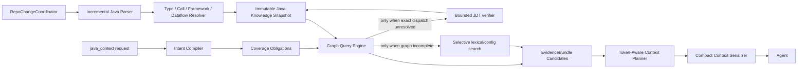

# `codex-java-lsp-mcp` V5R 完成后架构上限评估与 Java Intelligence Next Clean-Slate 改造方案

> **评估日期**：2026-08-20  
> **评估分支**：`codex/java-intelligence-v3`  
> **重点基线**：Sprint0' `63a80a2`、V4-final、V5R 当前默认树  
> **兼容性原则**：不保留旧协议、旧排序身份、旧输出合同或旧开关；以真实效果为唯一约束  
> **最终判定**：当前默认架构已到达**局部架构上限**；底层 JavaIndex、增量更新、隔离与测量基础设施没有触顶。要同时实现“更准、更快、更省 token”，必须替换默认查询与上下文规划主链，而不是继续优化 V5R 外围模块。
>
> **文档状态：ADOPTED（R1 修订版，2026-08-20）**。本文档是 JIN 改造的唯一开发真源，取代所有 V4/V5/V5R 方案文档（后者仅作历史证据保留）。
>
> **R1 修订摘要**（经仓库证据与外部调研复核后修订，原诊断结论全部保留）：
> 1. **新增第 0A 章「执行者必读」**：项目背景地图、硬禁令、测试分级、自主决策守则。AI 执行者必须先读第 0A 章再动手。
> 2. **新增 Phase N0.5**：紧凑输出合同 + 无锚点实体入口，打在**现有链**上先兑现 token 收益，与图重写解耦（依据 §12.4：wire JSON 与 planned source 同量级）。
> 3. **N2 拆分为 N2a/N2b**：反向调用 + 持久化/框架边（N2a，残差直指，硬做）与 statement 级数据流（N2b，重且险，挂按需准入门）。依据：`v5r-phase4-holdout-oracle.json` 的 6 条残差没有一条需要 def-use 边。
> 4. **§8 intent 改为 Agent 显式声明**（必填 enum），`auto` 推断降级为 fallback。理由：调用方是 LLM，自动推断是 V4 关键词启发式泥潭的翻版。
> 5. **§11 增加无锚点 task-first 入口**（LocAgent 式分层实体索引），覆盖「Agent 还不知道锚点在哪」的真实首问。
> 6. **N3 出口增加可独立使用的导航基元**：live trace 证明多轮导航能闭合单发预测闭不上的缺口（`MeQueryService`，5 轮覆盖 10/10），一次性 bundle 是增值层而非唯一形态。
> 7. **N1/N2 增加索引期预算数字门**（构建时间/RSS），防止把请求期成本平移到索引期。
> 8. **N5 live A/B 增加 Serena 第三臂**作外部诚实锚点；commit-derived 任务集前移至 N3 之前建成。
> 9. **新增第 15A 章「任务级开发手册」**：每个任务的边界、开发细节、测试验证方式、测试分级（哪些阶段跑三仓矩阵、哪些只跑单元/回放）、二元决策默认值与升级规则，使 AI 可自主执行全程而无需用户参与决策。

---

## 0. 决策摘要

### 0.1 直接结论

当前项目不是“完全没有提升空间”，但必须把两个层次分开：

| 层次 | 判定 | 说明 |
|---|---|---|
| Java 解析、索引、generation、快照、隔离、完整性合同 | **没有触顶** | 这些是可复用资产，仍可以增加方法级、反向、框架和数据流事实 |
| 当前 `java_impact` 的 provider → file ranking → V6 readPlan 主链 | **已基本触顶** | 再调权重只能在固定候选池和固定文件预算中做重新分配 |
| V5R ReadUnit/frontier/continuation/span packing | **没有成为新的主链** | 大部分是旧选择器外面的 adapter、shadow、post-process 或默认关闭路径 |
| 当前 token 输出合同 | **远未触底** | `files[]` 与 `readPlan[]` 双重表达，wire payload 与 planned source 体积接近 |
| 当前延迟 | **远未触底** | 请求时串行运行多个 provider，并在 relationship 阶段进行多次补充查询 |
| 当前准确率 | **仍可提升** | 已知 holdout 中仍有候选池外 discovery gap，索引图还缺少数据流、持久化和完整反向关系 |

因此：

> **当前架构还能做“小修小补”，但已不适合承担三轴同时提升的目标。工程上应把它视为局部最优并停止继续调参。**

### 0.2 推荐决策

1. 冻结当前 V5R 为测量基线，不合并为最终架构真源。
2. 保留 JavaIndex、Tree-sitter、generation、快照、SemanticGateway、隔离运行和 benchmark 基建。
3. 删除 V6/V7 双协议、文件级排序、ReadUnit round-trip、frontier shadow、in-pool FIFO continuation、post-selection span packing、relationship bundle 开关及全部默认关闭实验路径。
4. 新建 **Java Intelligence Next（下文简称 JIN）**：
   - 索引期构建多粒度 Java 知识图；
   - 请求期使用一次图查询完成定位；
   - 以“关系路径/证据束/statement span”为选择单元；
   - 使用真实 token 预算，而不是文件数预算；
   - 使用选择性检索、显式停止和按缺口扩展；
   - 输出唯一、紧凑、可直接消费的上下文合同。
5. 新实现达到三轴门槛后，一次性替换旧主链并删除旧代码，不长期维护双路径和 feature flag。

---

# 0A. 执行者必读：背景地图、硬禁令与自主决策守则【R1 新增】

> 本章是 AI 执行者的入口。任何 Phase 的任何任务动手前，先确认本章内容已装载进上下文。

## 0A.1 项目背景 60 秒版

- 本项目是一个 **Java-only 的 MCP 服务器**（Node 22 + TypeScript + Tree-sitter + 可选 JDTLS），给 Codex/Claude 这类 Agent 提供 Java 代码影响分析。公开工具面：`java_status` / `java_impact` / `java_symbol` / `java_diagnostics` / `java_runtime`（注册处 `src/mcp-server-factory.ts`）。
- 历史脉络：V3 → V4（consolidation）→ V5R（机制建设 + 正式证伪）。V5R 证明：围绕旧 file selector 的所有外围优化（bundle/packing/frontier/FIFO continuation）都无法产生三轴收益（证据见 §2.3）。本方案（JIN）是在保留 JavaIndex/隔离/测量底座上的主链重建。
- 质量真源链：Sprint0' `63a80a2` → V4-final → V5R 默认树，同一冻结场景三仓配对矩阵（lishuedu / cipherlink / exam-parent-v3）。`main` 分支没有可比矩阵，不得引用。
- 关键既有报告：`docs/phase-v5r/`（矩阵、四场战役 T/B/P/C、live trace、holdout oracle、各 phase closeout）；关键脚本：`scripts/run-three-repo-cold-matrix.mjs`、`scripts/verify-three-repo-cold-matrix.mjs`、`scripts/run-agent-trace-matrix.mjs`、`scripts/host-quiet.mjs`、`scripts/count-production-ts.mjs`。
- 用户画像：**个人使用，Java 方向，Spring Boot / MyBatis / JPA 多模块单体为主**。消费方是 LLM Agent（Codex CLI / Claude / 本地 Qwen via OpenAI-compatible endpoint）。价值函数是「Agent 完成任务的真实 token 消耗与成功率」，不是任何单一代理指标。

## 0A.2 硬禁令（违反任何一条即任务作废）

1. **禁止 scene-id / golden 特判**。任何以冻结场景 id、golden 文件名、mustHit 列表为条件的生产代码或排序逻辑，一律不允许（含变相形式：按场景关键词硬编码）。
2. **三仓矩阵主机政策**：1 分钟 load < 20 **必须执行**，不得以主机不够安静为由跳过或缩样本；load ≥ 20 只记录不拒绝；唯一硬门是可用内存 ≥ 4 GiB。真源 `docs/phase-v4/three-repo-host-load-policy.md`，常量 `scripts/host-quiet.mjs`。
3. **禁止未经校准的合成标量 J(π) 做 KEEP/REJECT**。λ 目前仅 `LIVE_TRACE_MEASURED`（n=6，量级 ≈4.6k token/轮），`scalarAllowed=false` 不撤销。决策用分解成本向量 + 分轴门。
4. **不合 `main`**，直到 §16.3 三轴门 + 第四仓 + leave-one-repo-out 全部通过（Phase N6 出口）。
5. **调参集与 holdout 严格隔离**：三仓冻结场景中的 holdout 子集与第四仓、commit-derived 隐藏集，任何阶段不得用于调参；第四仓在 N5 终验前不得查看逐场景结果。
6. **不长期维护双生产路径**。JIN 在 N1–N5 期间只能以 benchmark-only 入口存在（环境变量 `JAVA_LSP_ENGINE=jin`，仅测量脚本可设置，生产默认路径不读取）；N6 一次性切换并删除旧链与该变量。
7. **禁止重开已证伪路线**：dual worker、FIFO continuation、post-selection packing、file bucket 调参、`protectedCorePriority` 常量调整（详见 §17）。
8. **候选隔离测试必须全绿**才能提交：`npm test`（isolated full profile）。矩阵/报告类产物遵循既有惯例：raw cell 不入库，入库摘要 + SHA-256。
9. **密钥与外部 endpoint**：只经进程环境传递；报告只保留 host + model + 窗口参数。live 测量必须显式 `--authorize-external`。

## 0A.3 测试分级（每个任务卡引用此表）

| 级别 | 内容 | 命令 | 耗时 | 何时跑 |
|---|---|---|---|---|
| **T0** 单元/属性 | 新模块的 `*.test.ts`，`node --test dist/<模块>.test.js` | `npm run build` + 定向 node --test | 秒级 | 每个任务的每次迭代 |
| **T1** 隔离全量 | 候选隔离验证 full profile（dist + scripts 全部测试） | `npm test` | 分钟级 | 每个任务收口、每次提交前 |
| **T2** 冻结金标回放 | 在三仓冻结场景上做**离线回放/oracle 对照**（候选池覆盖、图可达性、token 估算），单侧、无配对轮次、不做性能结论 | `npm run benchmark:agent-impact` 系 + 任务卡指定的专用回放脚本 | 分钟级 | 图/查询/planner 的中间验证 |
| **T3** 三仓 cold 配对矩阵 | `--runs 5`，AB/BA/AB，cold-nolsp，独立 verifier 复验 | `npm run benchmark:three-repo-matrix -- --runs 5` + `benchmark:three-repo-verify` | ≈10 分钟 | **仅在改变默认行为的 Phase 出口**：N0、N0.5、N4、N6 |
| **T4** live agent A/B | 对外 OpenAI-compatible endpoint 真实消耗，old/new（/Serena 臂）配对 | `scripts/run-agent-trace-matrix.mjs --authorize-external --execute-live` | 小时级 | 仅 N5 |

原则：**T3 很贵，只有默认输出/默认选择真的变了才跑**；N1–N3 的所有验证靠 T0/T1/T2。跑 T3 前先按 0A.2 第 2 条检查主机政策。

## 0A.4 自主决策守则（用户不参与决策）

1. **二元决策 + 默认值**：每个任务卡（第 15A 章）给出可预见分叉的默认决策。遇到卡内未覆盖的分叉时，按以下顺序自决：(a) 选择不改变已冻结合同/门槛的选项；(b) 选择可逆、可删除的选项；(c) 选择与 §17「不做清单」不冲突的选项。决策与理由写入对应 phase 的 closeout JSON（`docs/phase-jin/jin-phase<N>-closeout.json`，沿用 V5R closeout 格式）。
2. **时限纪律**：单任务默认时限 = 任务卡标注值；超时 1.5 倍仍未达退出条件 → 强制二元裁决：按任务卡的「失败处置」执行（通常是回滚该任务、记录 FAIL、继续下一任务），**不允许**无限延长或悄悄缩小验收口径。
3. **门槛不可协商**：§16.3 的数字门与各任务卡的退出条件只能整体达成或整体记 FAIL，不允许「接近达标视为达标」。FAIL 不是灾难，是证据——V5R 的四场战役 FAIL 全部按期记录，这是本项目的核心纪律。
4. **升级（escalate）仅限三种情况**：(a) 需要新的外部资源（新模型 endpoint、新硬件）；(b) 发现本方案的诊断性事实错误（需修订文档本身）；(c) 三仓私有仓库内容本身异常（损坏/权限）。除此之外一律自决。
5. **进度记录**：每个 Phase 出口写 closeout JSON + 简短 markdown 报告到 `docs/phase-jin/`，格式对齐 `docs/phase-v5r/` 的同类产物（判定表、身份表、产物 SHA-256、怎么读）。HANDOFF.md 在每个 Phase 出口同步一次。

## 0A.5 动手前自检五问

1. 我要动的模块在 §13 的保留/重写/删除清单里属于哪一类？
2. 本任务的测试级别是 T 几？需要跑三仓矩阵吗（只有 N0/N0.5/N4/N6 出口才需要）？
3. 我的改动是否触碰任何硬禁令（尤其 scene-id 特判与双生产路径）？
4. 退出条件是数字门还是 identity 门？验收命令是什么？
5. 失败处置是什么？回滚点（git tag / 分支）在哪？

---

# 1. 证据边界与比较对象

## 1.1 不能把“相对 main”写成性能结论

仓库当前没有 `main` 与 V5R 在同一冻结场景、同一 runner、同一 host policy 下完成的正式三仓 cold 配对矩阵。

可作为性能真源的链只有：

```text
Sprint0' 63a80a2
    ↓ 同一冻结场景、正式三仓
V4-final
    ↓ 同一冻结场景、正式三仓
V5R 当前默认树
```

因此本报告区分：

- **产品能力相对 main**：可以比较工具面、daemon、JavaIndex、freshness、测试体系；
- **质量/延迟/token**：只使用 Sprint0'、V4-final、V5R 的配对数据；
- 不把未配对的 main 结果包装成性能结论。

## 1.2 8 月 19 日至 20 日的实际工作分层

### 8 月 19 日：V5R 机制建设

主要完成：

- dual-worker 正式实验并删除失败路径；
- Relationship Bundle；
- ReadUnit、统一 utility；
- RetrievalCostVector；
- frontier shadow 与 oracle；
- retrieval session / V7 continuation；
- span packing；
- gate profile、release attestation、leave-one-repo-out 协议；
- 完整 closeout、manifest、SHA256 和测试。

### 8 月 20 日：正式验证与证伪

主要完成：

- V5R 三仓 cold 正式矩阵；
- 战役 T：frontier shadow；
- 战役 B：relationship bundle；
- 战役 P：span packing；
- 战役 C：两次调用 continuation；
- live agent trace；
- 当前默认路径与 V4-final 深入对比。

### 最新提交的意义

live-trace 后的增量主要是报告、台账和实验脚手架收口，没有形成新的默认生产查询算法。因此，当前架构结论已经稳定，不存在“还差一个最后 commit 就会三轴翻转”的证据。

---

# 2. 实测结果到底说明了什么

## 2.1 V5R 默认树相对 Sprint0'

| 仓库 | recall | RangeLineRecall | holdout rReadMust | token P50 | cold p95Ratio |
|---|---:|---:|---:|---:|---:|
| lishuedu | 0.7923 → 0.7986 | 0.634 → 0.842 | 0.500 → 0.625 | 4308 → 4683 | 1.095 |
| cipherlink | 0.8158 → 0.8390 | 0.850 → 0.875 | 0.550 → 0.550 | 3606 → 4443 | 2.115 |
| exam-parent-v3 | 0.7095 → 0.6970 | 0.553 → 0.853 | 0.400 → 0.400 | 3395 → 3890 | 1.828 |

事实非常明确：

1. **range 精度显著提高**，尤其 lishuedu、exam。
2. 文件级 recall 只有小幅增长，exam 甚至略降。
3. 三仓 token P50 全部升高：
   - lishuedu：约 +8.7%；
   - cipherlink：约 +23.2%；
   - exam：约 +14.6%。
4. cipherlink、exam cold p95 仍明显高于 Sprint0'。
5. 三仓 gate 均未通过。

## 2.2 V5R 相对 V4-final

V5R 默认树的：

- recall；
- pRead；
- rReadMust；
- RangeLineRecall；
- holdout 指标；
- must-fail 场景；
- readPlanBytes；

与 V4-final **逐位相同**。

差异只有：

- standard/search payload 约增加 85 字节；
- `estimatedTokens` P50 系统性增加 21；
- 延迟只有主机波动，没有结构性改善。

所以应当准确表述为：

> **真正把默认 first-plan 读准的工作集中在 V4-06；V5R 的核心价值是完成机制、测量和证伪，而不是继续提升默认 first-plan。**

## 2.3 V5R 各开关的正式结论

| 机制 | 正确性 | 性能/价值 | 结论 |
|---|---|---|---|
| Frontier shadow | first-plan identity | 关掉后质量、token 不变 | 只是诊断，不是生产优化 |
| Relationship Bundle | 质量 identity | RPC 10632→10662，exam p95 1.349 | 阶段内 bundle，没有减少完整请求链 |
| Span Packing | 质量 identity | readPlanBytes/ranges 不变 | 选完文件后再 pack，无法释放选择预算 |
| FIFO continuation | 真正执行 420/450 次 | holdout 不动，pRead 显著下降，token 上升 | 协议成立，策略失败 |
| Dual worker | 数据一致、无 stale | storm 3.9×–37× | 正确删除 |
| ReadUnit planner | 构建 ReadUnit | 再 round-trip 回旧 V6 selector | 抽象存在，未替换主算法 |

这批结果不是失败的开发过程，而是非常有价值的架构证据：

> **所有“围绕旧 file selector 的外围优化”都没有转化成三轴收益。**

---

# 3. 为什么当前架构已经到局部上限

## 3.1 当前真实请求链

当前 `java_impact` 大致执行：

```text
resolveAnchors
  → persisted semantic evidence
  → static structure evidence
  → lexical/rg evidence
  → type-reference evidence
  → framework evidence
  → 第一次 candidate ranking
  → relationship evidence
      → facts
      → anchored framework method
      → direct call definitions
      → implementation continuation
      → helper continuation
      → signature definitions
      → per-candidate structural deltas
  → optional live JDT semantic
  → support evidence
  → 最终 family ranking
  → shortlist files
  → QUERY_READ_RANGES
  → CandidateWindow
  → ReadUnit
  → 转回 CandidateWindow
  → 旧 selectTokenAwarePlan
  → 可选 frontier shadow
  → 可选 post-selection span packing
  → files[] + readPlan[] + gaps + cost
```

这条链的主要问题不是 TypeScript 执行速度，而是：

- 请求时工作过多；
- provider 之间存在顺序依赖；
- 同一事实被多次投影和重新排序；
- 新抽象没有成为选择真源；
- 选文发生在 span 压缩之前；
- continuation 只能消费首轮已发现的池；
- 输出重复表达同一上下文。

## 3.2 上限一：候选发现和候选选择被混在一起

当前体系先通过多个 provider 生成 `CandidateFile`，然后统一按文件排序。

这导致两个不同问题被混为一个“分数问题”：

1. **候选已经在池里，但被预算挤出**；
2. **候选根本没有进入池**。

Phase 4 oracle 已经把残差分清：

- 多数 holdout 至少有部分 golden 已在池中；
- `MeQueryService`、部分 exam-data repository/entity 等属于 candidate discovery gap；
- continuation 只能改善第一类，无法改善第二类。

继续调 `2.45`、`2.4`、bucket cap 或 filename score，不可能创造候选池外的节点。

## 3.3 上限二：优化单元仍然是“文件”

虽然 V5R 引入 ReadUnit，但代码合同已经明确：

```text
ReadUnit → windowsFromReadUnits → selectTokenAwarePlan
```

而 `selectTokenAwarePlan` 仍然使用：

- `selectedPaths`；
- `maxFiles`；
- 每文件一个 slot；
- bucket 按文件计数；
- protected core 按文件排序；
- 最后才输出该文件的多个 ranges。

这意味着：

> **方法级 span 只是文件被选中后的载荷描述，不是预算竞争单元。**

后果是：

- 一个 20 行精确方法和一个 300 行类都占一个 file slot；
- 字节预算未耗尽时，`maxFiles=6` 仍提前停止；
- span packing 即使省出 50% 字节，也不能把第 7 个文件补进 first-plan；
- V3.2/V4 已知的“文件数打满、字节预算未满”不会被真正解决。

## 3.4 上限三：ReadUnit、frontier、packing 都在旧选择之后

### ReadUnit

`plan-selector.ts` 的定位不是新 selector，而是：

> `Does not replace selectTokenAwarePlan; shadow proves identity.`

### Frontier

`frontier-builder.ts` 明确在 first-plan 之后，从已经物化但未入选的单位生成，且只做诊断 shadow。

### Span Packing

`span-packer.ts` 输入是 **Selected ReadUnit**。它只能：

- 合并已选文件里的 overlap；
- 裁剪 extreme method；
- 丢 context span。

它不能：

- 重新选择文件；
- 用节省出的 token 换入新的高价值 span；
- 修复 candidate discovery。

因此，V5R 的结构实际上是：

```text
旧 selector 决定价值
    ↓
新模块只能证明 identity、报告上限或处理已决定的结果
```

这解释了为什么开发量很大，但默认 first-plan 不动。

## 3.5 上限四：Relationship Bundle 只优化了一个局部阶段

Relationship Bundle 可以一次取回：

- anchor facts；
- candidate facts；
- direct callees；
- implementations；
- signature lookup；
- read ranges。

但 relationship provider 后续仍然执行：

- `frameworkFactsFor`；
- `findTypeDefinitions`；
- `frameworkFactsForFiles`；
- implementation/helper continuation 解析；
- candidate structural delta；
- 其他 provider 的独立查询。

所以它不是“一次请求完成 context query”，而是：

> **把 relationship 阶段中的一部分 RPC 换成 bundle，再继续跑原有流水线。**

正式结果 RPC 几乎不降，是设计结果，不是偶然实现 bug。

## 3.6 上限五：continuation 的策略没有“缺口模型”

当前 continuation：

- 只消费 in-pool 项；
- 按 FIFO；
- 不执行 reverse query；
- 不理解当前 first-plan 缺了哪一种证据；
- 不知道哪些 relation 能关闭任务风险；
- 不依据 token/信息增益决定停止。

因此它会消费“看起来相关但不关闭 must gap”的文件，结果是：

- taskBlocking 可能上升；
- mustHit 不动；
- pRead 被稀释；
- 两次调用 token 必然增加。

正确的 continuation 需要回答：

```text
当前证据还缺什么？
哪个关系路径能关闭这个缺口？
该路径的预期价值是否高于 token 与延迟成本？
```

FIFO 无法回答这三个问题。

## 3.7 上限六：输出合同本身非常昂贵

标准 `ImpactResultV6` 同时返回：

- `target`；
- `freshness`；
- `semantic`；
- `files[]`：
  - path；
  - role；
  - confidence；
  - evidence；
  - locations；
- `readPlan[]`：
  - fileId；
  - ranges；
  - reason；
  - expectedEvidence；
  - estimatedBytes；
- `evidenceGaps`；
- `cost`；
- 最小 metrics。

`files[]` 和 `readPlan[]` 通过 `fileId` 再关联，实际上重复传输了：

- 文件身份；
- 证据解释；
- 位置信息；
- 角色语义。

按当前公式：

```text
estimatedTokens = ceil((resultBytes + readBytes) / 4)
```

结合三仓代表性的 `readPlanBytes` 反推，标准 wire payload 大约仍有：

| 仓 | estimatedTokens | readPlanBytes | 反推 wire bytes（近似） |
|---|---:|---:|---:|
| lishuedu | 4683 | 8597.3 | 10134.7 |
| cipherlink | 4443 | 7235.5 | 10536.5 |
| exam | 3890 | 7428.7 | 8131.3 |

即：

> **wire JSON 本身约 8–10.5 KiB，和真正计划阅读的源码字节处于同一量级。**

这说明 token 还远未触底。当前最大机会不是继续压 200 字节 method range，而是删除重复协议和低价值描述。

## 3.8 上限七：静态图缺少“最后一公里”语义

当前 `StaticEdgeKind` 主要包括：

- DECLARES；
- EXTENDS / IMPLEMENTS；
- IMPORTS；
- FIELD/PARAM/RETURN/LOCAL TYPE；
- CALLS；
- CONSTRUCTS；
- METHOD_REFERENCE；
- ANNOTATED_WITH。

但仍缺少：

- 字段读写；
- 局部 def-use；
- 参数到 callee 参数的流；
- callee return 到 assignment/return 的流；
- repository/mapper/entity/SQL 绑定；
- Spring bean 到具体实现的稳定绑定；
- event publish/consume；
- inter-procedural method summary；
- task-specific upstream/downstream path。

这正是：

- `MeQueryService`；
- `PayAccount`；
- repository/template/entity；
- async audit；
- 跨模块持久化链；

仍会成为 discovery gap 的原因。

## 3.9 上限八：排序是大量全局常量，而不是关系路径

当前 family ranker 和 read-plan planner仍依赖：

- family cap；
- diversity bonus；
- same-module bonus；
- cross-module penalty；
- sourceSet delta；
- protected core priority；
- CALLS/IMPLEMENTS 的细粒度常量；
- bucket min/max；
- file score；
- byte penalty。

这些分数只能回答：

> “这个文件总体看起来有多相关？”

但代码影响分析真正需要回答：

> “从 anchor 到这个方法/字段/XML statement，有哪条可证明的关系路径？它关闭了哪个任务风险？”

文件总分无法稳定表达：

- 第二跳是否必要；
- 上游 caller 还是下游 callee；
- interface 与唯一实现；
- DTO 只是包装器还是业务 contract；
- repository 与 entity 是否是同一持久化闭环；
- 某个 span 是否只是同文件噪声。

---

# 4. 架构是否还有提升空间：分层判定

| 层 | 是否触顶 | 处理 |
|---|---|---|
| Tree-sitter Java AST | 否 | 保留并增强 method summary、字段读写和局部数据流 |
| FQN/import/type resolution | 否 | 保留，补全 overload、receiver 和 inheritance dispatch |
| JavaIndex Store/Snapshot | 否 | 演化为多粒度 Java Knowledge Graph |
| generation/freshness | 否 | 保留 |
| complete-only SemanticGateway | 否 | 保留给显式 symbol/JDT fallback |
| worker isolation | 否 | 保留单 worker；不再做双 worker |
| provider pipeline | 是 | 删除，改为索引期事实构建 + 单次图查询 |
| CandidateFile/file score | 是 | 删除 |
| family rank/bucket weights | 是 | 删除 |
| V6 readPlan file selector | 是 | 删除 |
| ReadUnit round-trip | 是 | 删除 |
| post-selection span packing | 是 | 删除 |
| frontier shadow | 是 | 删除生产路径，oracle 留 benchmark |
| FIFO continuation | 是 | 删除 |
| V6/V7 双输出合同 | 是 | 删除 |
| 当前 benchmark 场景规模 | 是 | 扩到第四仓、commit-derived tasks 和 paired live A/B |

---

# 5. 外部方法论核对

外部研究不直接证明本项目一定成功，但与仓库证据高度一致：

1. **LocAgent** 使用文件、类、函数和依赖组成的异构有向图，让 Agent 通过多跳关系定位代码，说明“关系图 + 多跳导航”比平面文件排序更适合复杂定位。
2. **RepoCoder** 的收益来自 query-aware 的迭代检索，而不是无反馈的第二次固定读取。
3. **Repoformer** 与 **RLCoder** 都强调：
   - 不是每次都应继续检索；
   - 无效上下文可能伤害准确率；
   - 检索器需要显式 stop/abstain。
4. **ARISE** 进一步表明，仅有结构图仍不足，statement-level def-use/data-flow slice 能显著改善函数和行级定位；结构化 slice 可以直接供模型消费，不需要额外自然语言总结。
5. Aider 的 repo map 说明全仓结构可以用非常紧凑的 symbol/signature 表达，不需要把候选文件的多套自然语言证据重复塞入每次响应。

对本项目的含义是：

> **下一代架构应把“图路径、数据流、选择性检索、紧凑结构化输出”作为主链，而不是作为旧文件排序器的外围增强。**

【R1 补充：2026-08-20 外部调研与本仓 live 证据的两点修正】

1. **导航基元本身就有实测价值，不只是 bundle 的配角。** 本仓 live trace 中，`paper-task` 的 `MeQueryService` 是 first-plan oracle 判死的 discovery gap，但模型用 5 轮工具调用自行闭合（10/10 路径覆盖）；Serena（LSP 基元 MCP）与 Codebase-Memory（tree-sitter 图 MCP，论文实测 10× 更少 token、2.1× 更少调用换 83% vs 92% 答案质量）代表的「便宜基元 + Agent 多跳」路线在外部也被反复验证。因此 R1 把导航基元列入 N3 出口，并在 N5 用 Serena 做第三臂诚实对照。
2. **竞争格局确认了差异化边界。** 通用图 MCP（codebase-memory-mcp、CodeGraphContext 等）与 Serena 都不做 Spring DI / MyBatis XML / JPA 持久化闭环、token 预算证据束与 generation 新鲜度合同——这正是 JIN 该重投入的部分；反之，通用符号导航能力不值得重新发明超出必要的部分。Joern 的 CPG 证明 statement 级数据流图是重活（其 Java 增量更新至今是 prototype），佐证 N2b 挂按需准入门；jQAssistant Spring 插件的概念模型可作框架边 schema 参照。

---

# 6. 推荐的新架构：Java Intelligence Next（JIN）

## 6.1 产品定位

JIN 只做一件事：

> **在固定 Java 仓库快照上，以一次低延迟查询，返回对当前任务最有价值、可证明、token 受控的代码证据束。**

不再把目标定义为：

- 找一批高分文件；
- 尽可能把它们塞入 6 个 file slot；
- 输出一份 read plan 让 Agent 自己继续猜。

## 6.2 总体架构



核心改变：

- 重工作从 request-time 移到 index-time；
- 从 7 个 provider 串行收集改成 1 个 graph query；
- 从 file score 改成 relation path；
- 从 file slot 改成 evidence bundle / statement span；
- 从 always retrieve 改成 obligation-driven selective retrieval；
- 从双重输出改成单一 context bundle。

---

# 7. Java Knowledge Graph 设计

## 7.1 节点

```text
REPOSITORY
MODULE
SOURCE_ROOT
FILE
TYPE
METHOD
CONSTRUCTOR
FIELD
PARAMETER
LOCAL
STATEMENT
JAVA_RESOURCE
MYBATIS_NAMESPACE
MYBATIS_STATEMENT
JPA_ENTITY
CONFIG_KEY
TEST_CASE
```

不要求所有 statement 永久暴露为大对象。可以：

- snapshot 中保存紧凑 statement id、range、kind；
- 只对存在 data-flow/call/persistence 关系的 statement 建节点；
- 普通 statement 不入图。

## 7.2 边

### 结构边

```text
CONTAINS
DECLARES
EXTENDS
IMPLEMENTS
PERMITS
IMPORTS
ANNOTATED_WITH
MODULE_DEPENDS_ON
```

### 调用边

```text
CALLS_EXACT
CALLS_VIRTUAL
DISPATCHES_TO
CONSTRUCTS
METHOD_REFERENCE
CALLED_BY              // 反向索引，不是请求时扫描
```

### 数据流边

```text
READS_FIELD
WRITES_FIELD
DEFINES_LOCAL
USES_LOCAL
ARGUMENT_FLOWS_TO
PARAMETER_FLOWS_TO_RETURN
CALL_RESULT_ASSIGNED_TO
CALL_RESULT_RETURNED_BY
THROWS_TO
```

### 框架与持久化边

```text
SPRING_INJECTS
SPRING_BEAN_BINDS_TO
PUBLISHES_EVENT
CONSUMES_EVENT
MAPSTRUCT_SOURCE_TO_TARGET
MAPSTRUCT_USES
MYBATIS_METHOD_BINDS_STATEMENT
MYBATIS_STATEMENT_USES_ENTITY
REPOSITORY_MANAGES_ENTITY
JPA_RELATION
SQL_TOUCHES_TABLE
```

### 测试边

```text
TESTS_TYPE
TESTS_METHOD
MOCKS_TYPE
USES_FIXTURE
```

## 7.3 Method Summary

为每个 method 生成紧凑 summary：

```ts
type MethodSummary = {
  methodId: string;
  directCalls: CallEdge[];
  virtualCalls: CallEdge[];
  fieldsRead: EntityId[];
  fieldsWritten: EntityId[];
  parameterFlows: ParameterFlow[];
  returnSources: ValueSource[];
  thrownTypes: EntityId[];
  persistenceTouches: EntityId[];
  frameworkTouches: EntityId[];
  lexicalFingerprint: number[];
};
```

目的不是构建完整 Java 编译器，而是提供足以支持影响分析的保守、可解释 summary。

## 7.4 解析策略

1. Tree-sitter 负责稳定、快速、增量 AST。
2. 本地符号表负责：
   - parameter；
   - field；
   - local；
   - receiver；
   - name + arity；
   - 简单 argument type hint。
3. FQN resolver 负责 import/package/generic。
4. inheritance index 负责 virtual dispatch 候选。
5. 只有歧义关系才触发 JDT，JDT 结果作为高置信边持久化。
6. 不在请求期重新做大范围 framework hydration。

---

# 8. Intent Compiler 与 Coverage Obligations

## 8.1 为什么需要 intent

同一个 anchor 可以有不同任务：

- 修改实现；
- 检查调用影响；
- 追踪数据来源；
- 修改 DTO；
- 修改 repository；
- 找测试；
- 找上游入口。

如果所有任务都走相同的 file ranking，必然：

- 多读无关上下文；
- 漏掉方向相反的 caller/callee；
- 对 token 和准确率做错误交换。

## 8.2 Intent 类型

```text
IMPLEMENTATION_CHANGE
DOWNSTREAM_BEHAVIOR
UPSTREAM_IMPACT
CONTRACT_CHANGE
PERSISTENCE_FLOW
DATAFLOW_TRACE
FRAMEWORK_WIRING
TEST_PLANNING
DIAGNOSTIC_ONLY
```

【R1 修订】**intent 由 Agent 显式声明，`auto` 推断只是 fallback**：

- `intent` 是请求的**必填参数**，由调用方 Agent 从上述 enum 中选择。工具描述中用一行一个 intent 写清语义与适用场景（控制 schema token，总描述预算见 15A 任务卡）。
- 理由：调用方是 LLM，它比任何关键词启发式更清楚自己的任务。anchor kind + taskKeywords 自动推断 intent 正是 V4 bucket rules / task keyword 启发式膨胀的翻版，推错会整体带偏 obligations。策略归模型，机制归工具（Repoformer 的分工结论）。
- `intent="auto"` 保留为兼容 fallback：仅当 Agent 未给出时按下列信号推断，且响应中必须回显 `resolvedIntent` 让 Agent 可纠正。

`auto` fallback 的推断信号（仅此用途）：

- anchor kind/profile；
- taskKeywords；
- module/layer；
- method signature；
- 是否是 interface/controller/repository/DTO/entity。

## 8.3 通用 Coverage Obligations

示例：`IMPLEMENTATION_CHANGE` + service method

```text
O1 anchor method body
O2 direct business callees
O3 interface/implementation closure
O4 fields/repositories written or read
O5 return/request contract types
O6 framework binding that changes dispatch
O7 highest-value verification test
```

示例：`UPSTREAM_IMPACT`

```text
O1 direct callers
O2 externally reachable controller/job/listener
O3 event consumers/producers
O4 cross-module caller boundary
O5 affected tests
```

示例：`PERSISTENCE_FLOW`

```text
O1 repository/mapper method
O2 MyBatis XML/JPA mapping
O3 entity/record
O4 SQL/table or query identifier
O5 transaction boundary
```

obligation 是通用任务结构，不包含场景 id，不是 golden 特判。

---

# 9. Graph Query Engine

## 9.1 单次 worker 命令

替换当前大量查询为：

```ts
type QueryContextRequest = {
  generation: number;
  anchors: EntityAnchor[];
  intent: CompiledIntent;
  maxGraphExpansions: number;
  maxHops: number;
  maxCandidateBundles: number;
  tokenBudget: number;
};

type QueryContextResponse = {
  generation: number;
  coverage: "COMPLETE" | "PARTIAL" | "DEGRADED";
  bundles: EvidenceBundleCandidate[];
  unresolved: UnresolvedObligation[];
  metrics: QueryMetrics;
};
```

worker 内部一次完成：

- anchor 定位；
- forward/reverse graph traversal；
- framework/persistence closure；
- method summary/data-flow slice；
- exact source ranges；
- token 估算；
- candidate bundle 生成。

不再先输出一批 facts，回到主线程后再调用其他 API 补齐。

## 9.2 Path Search

状态不是 `CandidateFile`，而是：

```ts
type SearchState = {
  node: EntityId;
  path: TypedEdge[];
  obligationsClosed: ObligationId[];
  confidence: number;
  estimatedTokens: number;
};
```

建议使用受限 beam/Dijkstra 混合：

```text
pathCost =
    relationPrior
  + hopPenalty
  + ambiguityPenalty
  + crossModulePenaltyWhenIrrelevant
  + tokenCostPenalty
  - exactEdgeBonus
  - taskLexicalMatch
  - obligationClosureBonus
```

与当前文件分数的本质区别：

- 每个候选必须带可证明 path；
- 不同方向关系不混在一个总分里；
- candidate discovery 与 final context selection分离；
- reverse caller 是正常索引边，不是请求时“开启危险扫描”。

## 9.3 选择性 fallback

执行顺序：

```text
1. Graph exact path
2. 若 obligation 已满足 → stop
3. 若 graph coverage complete 但任务词未命中 → symbol/text inverted index
4. 若涉及配置/日志/字符串 → bounded rg/resource search
5. 若 exact dispatch/overload 歧义影响关键 obligation → JDT verify
6. 重新规划
7. expected gain <= cost → stop
```

不再每次都执行：

- lexical；
- framework runtime hydration；
- relationship补查；
- live semantic；
- support provider。

---

# 10. EvidenceBundle：真正的选择单元

## 10.1 定义

```ts
type EvidenceBundle = {
  id: string;
  role:
    | "ANCHOR"
    | "CHANGE_SITE"
    | "CONTRACT"
    | "CALLEE"
    | "CALLER"
    | "IMPLEMENTATION"
    | "PERSISTENCE"
    | "DATAFLOW"
    | "FRAMEWORK"
    | "TEST";
  path: TypedEdge[];
  spans: CodeSpan[];
  closes: ObligationId[];
  confidence: number;
  tokenCost: number;
  latencyCost: number;
};
```

一个 bundle 可以包含：

- anchor call site 的 5 行；
- target method signature；
- target method 中与任务相关的 statement slice；
- MyBatis statement；
- entity 字段；
- 关系证明。

它不等于一个文件。

## 10.2 Statement-first，而不是 file-first

选择过程应为：

```text
graph paths
  → minimal proof spans
  → context closure
  → token cost
  → bundle selection
  → 最后按文件合并 transport
```

当前过程正好相反：

```text
select files
  → query ranges
  → optional pack selected ranges
```

只有反转顺序，才能做到：

- 省出的 token 真正换入第 7/8/9 个高价值 span；
- 同一文件多个不相关方法不互相绑架；
- 多个文件各取一个精准 statement；
- file count 不再是主约束。

## 10.3 Planner 目标函数

不建议恢复一个未经校准的单一 `J(π)`，而是做受约束优化：

```text
maximize
    obligationCoverage(S)
  + pathConfidence(S)
  + relationDiversity(S)
  + changeSiteValue(S)
  - evidenceRedundancy(S)

subject to
    exactTokenCost(S) <= tokenBudget
    estimatedServiceMs(S) <= latencyBudget
    maxBundles <= safetyLimit
```

file count 只作为异常保护，例如 `maxDistinctFiles=20`，不能是正常 binding constraint。

## 10.4 Planner 算法

个人项目不需要引入复杂神经模型。

第一版建议：

1. obligation-aware greedy submodular knapsack；
2. 每次选择 `marginal obligation gain / token` 最大的 bundle；
3. P0 anchor/change-site 强制；
4. 同一 obligation 的重复 bundle 递减；
5. 歧义分支最多保留 2 个；
6. expected marginal gain ≤0 立即停止。

后续有足够 commit-derived 数据后，可用简单 pairwise linear ranker 学习 relation prior，不需要在线 LLM。

---

# 11. 新工具与输出合同

## 11.1 删除 `java_impact` V6/V7 双合同

建议将主工具改为：

```text
java_context
```

其职责是：

- 定位；
- 图遍历；
- span 规划；
- 必要时返回最小源码；
- 告知未解决的不确定性；
- 提供有语义的下一步扩展。

其他工具可保留：

```text
java_status
java_context
java_symbol
java_diagnostics
java_runtime
```

## 11.2 请求

```json
{
  "repoRoot": "...",
  "anchors": [
    {"file": "...", "line": 42, "column": 17}
  ],
  "task": "修改支付订单准入逻辑并检查持久化影响",
  "intent": "PERSISTENCE_FLOW",
  "direction": "auto",
  "tokenBudget": 3200,
  "includeSource": true,
  "includeTests": "best-one"
}
```

【R1 修订】**支持无锚点 task-first 入口**（`anchors: []` 或省略）：

个人使用中 Agent 的第一个问题常是「支付准入在哪处理」——此时还没有锚点。若强制锚点，Agent 只能退回 grep，token 优势全部蒸发。因此：

- `anchors` 允许为空。为空时引擎先做**实体入口解析**：按 LocAgent 的四层分层索引（FQN 实体 ID 精确匹配 → 同名字典 → BM25 倒排 → chunk-to-entity 倒排）从 `task` 文本解析出候选入口实体，取 top-k（默认 3）作为 anchors 继续正常图遍历。
- 响应回显 `resolvedAnchors[]`（含每个的匹配层级与置信度），Agent 可用其中任一实体重发精确请求。
- 无锚点模式的 obligations 自动收敛为「入口定位」子集（anchor 本体 + 直接关系一跳），不做全量 intent obligations，防止入口猜错时浪费预算。
- 实体索引在索引期构建（复用 JavaIndex 的符号表 + 新增 BM25 倒排），请求期零额外解析。

## 11.3 响应

```json
{
  "version": 1,
  "generation": 128,
  "coverage": "COMPLETE",
  "anchor": {
    "path": "src/.../ApplyPayService.java",
    "symbol": "admit"
  },
  "contexts": [
    {
      "role": "CHANGE_SITE",
      "path": "src/.../ApplyPayServiceImpl.java",
      "proof": [
        "IMPLEMENTS",
        "DISPATCHES_TO"
      ],
      "spans": [
        {
          "start": 81,
          "end": 117,
          "text": "..."
        }
      ]
    },
    {
      "role": "PERSISTENCE",
      "path": "exam-data/.../PayAccount.java",
      "proof": [
        "WRITES_FIELD",
        "REPOSITORY_MANAGES_ENTITY"
      ],
      "spans": [
        {
          "start": 21,
          "end": 49,
          "text": "..."
        }
      ]
    }
  ],
  "unresolved": [],
  "next": [],
  "cost": {
    "modelTokens": 2874,
    "serviceMs": 38
  }
}
```

## 11.4 为什么该合同更省

删除：

- `files[]`；
- `readPlan[]`；
- `fileId` 二次关联；
- humanized evidence phrase；
- score/reason 的重复表达；
- 同一路径的 locations 与 ranges 双表达；
- standard 路径中的诊断信息。

只保留：

- 被选中的 context；
- 关系 path；
- 精确 span；
- 未解决缺口；
- 实际成本。

## 11.5 source delivery 两种模式

### `includeSource=true`

适合：

- 独立 MCP Agent；
- 当前 live trace 这类只有一个工具的环境；
- 需要减少 5–9 次重复 `java_impact` 调用的场景。

planner 按最终 JSON 的真实 token 选择 snippet。

### `includeSource=false`

适合：

- Codex 已有原生文件读取工具；
- 只需要路径与 ranges；
- 希望由 Agent 自己按需读取。

两种模式使用同一 EvidenceBundle，不维护两套定位算法。

---

# 12. 如何同时实现“更准、更快、更省”

## 12.1 更准

来源不是“多塞文件”，而是：

1. candidate discovery 改为多跳 graph search；
2. reverse caller 预索引；
3. method summary；
4. 字段读写与 def-use；
5. repository/mapper/entity/SQL 闭环；
6. obligation coverage；
7. span-first 选择；
8. 歧义时才 JDT 精确确认。

直接针对当前残差：

| 残差 | 新能力 |
|---|---|
| `MeQueryService` | CALLED_BY / reverse path + upstream obligation |
| `PayAccount` | repository/entity + data-flow/persistence edge |
| ExamRoomPrintBundleJob/Template | persistence closure |
| PublishAppService 被预算挤出 | span-first knapsack，无 6 文件硬门 |
| audit wrong member | statement/method path，而非文件总分 |
| helper/implementation second hop | 预计算 call summary 和 dispatch path |

## 12.2 更快

1. framework、relationship、dataflow 在 index-time 构建。
2. request-time 只发一个 `QUERY_CONTEXT` worker RPC。
3. 默认不跑 JDT。
4. 默认不跑 rg；只在 obligation 未闭合时 fallback。
5. 不做 sourceBefore/sourceAfter 多次状态 round-trip；使用 RequestContext generation 和 local snapshot。
6. 不做 first rank → relationship → final rank 两轮文件排序。
7. cache key：

```text
repoHash + generation + anchorEntityIds + intentHash + budgetProfile
```

8. query engine 只读 immutable snapshot，不与 background parser 争写锁。
9. 继续保持单 worker；dual-worker 已经被正式证伪，不再重开。

## 12.3 更省 token

1. 删除 `files[] + readPlan[]` 双表达。
2. 删除 human evidence phrase。
3. 只输出 selected EvidenceBundle。
4. 用 statement/call-site/data-flow slice 替代完整 method body。
5. retrieval 有显式 stop，不总是继续。
6. first call 内自动闭合高收益 obligation，减少 Agent 重复工具调用。
7. 使用真实 endpoint tokenizer 或可插拔 tokenizer；`bytes/4` 只作 fallback。
8. live trace 按最终 prompt usage 计费，不再把 planned bytes 当真实模型成本的唯一代理。

## 12.4 当前数据说明三轴同时提升并非物理上不可能

当前标准响应按公式反推，wire JSON 约 8–10.5 KiB，planned source 约 7.2–8.6 KiB。

即使完全不减少 planned source，只把 wire 压到约 2 KiB，理论 token 就会显著下降。更重要的是，statement-level slice 还能继续减少 source bytes，并把节省预算换成当前缺失的高价值路径。

所以：

> **当前问题不是准确率与 token 存在不可突破的物理矛盾，而是现有协议和 planner 浪费了大量预算。**

---

# 13. 保留、重写、删除清单

## 13.1 保留

| 模块 | 处理 |
|---|---|
| RepoChangeCoordinator | 保留 |
| GenerationClock / freshness barrier | 保留 |
| JavaIndex incremental parsing | 保留并升级 |
| atomic snapshot / worktree seed | 保留 |
| single worker lifecycle | 保留 |
| cross-process lease | 保留 |
| SemanticGateway complete-only cache | 保留给 `java_symbol`/JDT fallback |
| DocumentLru / JDT lifecycle | 保留 |
| MyBatis XML parser | 保留并转成索引图边 |
| Spring/MapStruct/JPA 事实提取 | 保留逻辑，迁移到 index-time |
| HTTP/stdio application ownership | 保留 |
| isolated validation | 保留 |
| three-repo matrix | 保留并升级 |
| live trace harness | 保留并做 old/new 配对 |

## 13.2 重写

| 当前模块 | 新模块 |
|---|---|
| `agent-router/index.ts` | `context-engine/context-service.ts` |
| providers | index-time graph builders + selective fallback |
| relationship-provider | graph traversal / method summaries |
| family-ranker | typed path search |
| read-plan | EvidenceBundle planner |
| output-v6/v7 | single ContextBundle serializer |
| cost-model | actual serialized/model token cost |
| continuation session | obligation-aware expansion session |
| benchmark required groups | commit-derived + hidden holdout evaluation |

【R1 补充】重写 expansion session 时，**继承而非重新发明** V5R 已验证的会话语义：`sessionId + generation + repoHash + plannerVersion` 四元组、TTL/LRU、stale 时 fail-closed（返回明确的 `STALE_SESSION` 而不是静默重算）、stdio 模式按进程天然隔离不做跨进程恢复。这些语义在战役 C 中被证明协议可用（450 次消费无一致性事故），失败的是 FIFO 选择策略，不是会话机制。

## 13.3 删除

最终切换后删除：

```text
src/agent-router/retrieval/*
src/agent-router/read-plan.ts
src/agent-router/read-plan-budget.ts
src/agent-router/family-ranker.ts
src/agent-router/rank-candidates.ts
src/agent-router/providers/relationship-provider.ts
src/agent-router/providers/relationship/*
src/agent-router/output-v6.ts
src/agent-router/output-v7.ts
旧 ImpactResultV6/V7 类型
JAVA_LSP_FRONTIER_SHADOW
JAVA_LSP_RELATIONSHIP_BUNDLE
JAVA_LSP_SPAN_PACKING
JAVA_LSP_READUNIT_PLANNER
retrieval.enabled
FIFO continuation
CandidateFile.score / scoreBreakdown
BUCKET_RULES
protectedCorePriority 常量体系
```

历史实验结果保留在 docs/artifacts，不保留在生产路径。

---

# 14. 建议代码布局

```text
src/
  java-knowledge/
    schema.ts
    entity-id.ts
    edge-kinds.ts
    method-summary.ts
    graph-store.ts
    graph-snapshot.ts
    graph-builder.ts
    type-resolver.ts
    call-resolver.ts
    dataflow-summary-builder.ts
    framework-edge-builder.ts
    persistence-edge-builder.ts
    query-protocol.ts
    query-engine.ts

  context-engine/
    context-service.ts
    intent/
      intent-types.ts
      intent-compiler.ts
      obligations.ts
    search/
      graph-search.ts
      path-cost.ts
      lexical-fallback.ts
      semantic-escalation.ts
    planner/
      evidence-bundle.ts
      context-closure.ts
      statement-slicer.ts
      token-estimator.ts
      context-planner.ts
    output/
      context-contract.ts
      context-serializer.ts

  tools/
    context.ts
    symbol.ts
    diagnostics.ts
    status.ts
    runtime.ts
```

JavaIndex worker新增唯一主查询：

```text
QUERY_CONTEXT_GRAPH
```

旧的细粒度 query 可以继续供 `java_symbol` 或内部测试使用，但 `java_context` 不再拼装几十个 RPC。

---

# 15. 实施阶段【R1 重排】

> 阶段顺序（R1）：**N0 → N0.5 → N1 → N2a →（N2b 按需）→ N3 → N4 → N5 → N6**。
> 每个阶段的任务级开发细节、边界、测试验证方式见第 15A 章任务卡；测试分级定义见 0A.3。
> **Phase 执行纪律**：严格按序；每个 Phase 出口写 closeout（0A.4 第 5 条）；单 Phase 默认时限 2 周（挂钟），超时按 0A.4 第 2 条二元裁决。

## Phase N0：冻结与减债（测试级别：T0/T1 + 出口 T3）

- 给当前 V5R 结果建立不可变 tag（`v5r-evidence-baseline`）与 manifest。
- 固定 current V5R、Sprint0'、V4-final 指标。
- 把默认关闭且已证伪的 V5R runtime 模块从生产编译路径删除。
- 保留测试报告与 benchmark oracle 脚手架，不保留 feature flag。
- 新建 clean-slate 开发分支；不要继续在 200 commit 历史上叠开关。

退出条件：

- 当前 V5R baseline 可一键复现；
- **T3 配对矩阵**（old=`v5r-evidence-baseline`，new=删除后树）：质量字段逐位 identity；
- production LOC 明显下降（记录删除前后 `measure:production-ts` 数字）。

## Phase N0.5：紧凑合同 + 实体入口（现有链上，测试级别：T0/T1 + 出口 T3）【R1 新增】

不等图重写，先在**现有 V6 链**上兑现两刀确定性收益：

- **紧凑输出合同**：删除 `files[] + readPlan[]` 双表达、humanized evidence phrase、`fileId` 二次关联；排序与选择逻辑**一个字节不动**，只换 serializer（§12.4 论证：wire JSON 8–10.5 KiB ≈ planned source 同量级）。
- **无锚点实体入口索引**：LocAgent 式四层分层索引（§11.2 R1 修订），索引期构建，先以 benchmark 可测形态落地（正式工具面暴露在 N5）。

退出条件：

- **T3 配对矩阵**（old=N0 出口树，new=紧凑合同树）：recall/pRead/rReadMust/RangeLineRecall/holdout 逐位 identity；`estimatedTokens` P50 三仓下降 ≥ 20%；p95 不劣化（配对 ≤ 1.10）；
- 实体入口：三仓冻结场景的 task 文本做 T2 回放，top-3 实体命中 anchor 所在文件 ≥ 80%；
- 若 token 降幅 < 10% → 记 FAIL 并调查 serializer 是否有遗漏的重复表达；10–20% → 接受并记录，继续 N1。

## Phase N1：Knowledge Graph Schema（测试级别：T0/T1 + T2）

- 新 node/edge schema；
- reverse index（`CALLED_BY` 等反向边为一等公民）；
- method summary 骨架；
- snapshot version；
- deterministic ids；
- incremental invalidation。

退出条件：

- 同一 repo/generation graph digest deterministic；
- edit-to-visible（沿用 `benchmark:edit-to-visible` 口径）；
- snapshot round-trip；
- no stale edge（mutation 测试）；
- **索引期数字门【R1 新增】**：三仓全量图构建每仓 ≤ 60s（cold，含解析）、增量单文件 ≤ 500ms、进程 RSS 增量 ≤ 512 MiB/仓（在 lishuedu 最大仓上测）。超门 → 先裁剪 statement 节点物化范围（§7.1 本来就允许普通 statement 不入图），不放宽门。

## Phase N2a：Reverse Call + 持久化/框架边（测试级别：T0/T1 + T2）【R1 拆分：残差直指，硬做】

- exact/direct/virtual call + `CALLED_BY` 反向索引；
- Spring binding/event（`SPRING_INJECTS`/`SPRING_BEAN_BINDS_TO`/`PUBLISHES_EVENT`/`CONSUMES_EVENT`）；
- MyBatis/JPA/persistence 闭环（`MYBATIS_METHOD_BINDS_STATEMENT`/`REPOSITORY_MANAGES_ENTITY` 等）；
- module dependency；
- method summary 的 call/persistence/framework 部分。

退出条件：

- **T2 discovery oracle 回放**：`v5r-phase4-holdout-oracle.json` 中 5 个 `notInPool` 文件（`MeQueryService`、`ExamRoomPrintBundleJob`、`ExamRoomPrintBundleJobTemplate`、`ApplyPayTemplate`、`OrderRepository`）全部通过图边（≤3 跳）从对应 anchor 可达，且不依赖 scene id；
- live trace 两条 false 的缺口文件（`ClientReleaseMapper`、`PayAccount`）同样图可达；
- mutation tests 证明边能随编辑正确增删；
- 索引期数字门不回退（N1 同口径复测）。

## Phase N2b：Statement 级数据流（按需准入，默认不做）【R1 拆分】

- field read/write、local def-use、parameter/return flow summary。

**准入门（先满足才开工）**：N3/N4 的 T2 回放中出现**具体的、可命名的**失败案例，其闭合被证明必须依赖 def-use/参数流边（当前 6 条残差没有一条需要——见 §12.1 映射表）。无准入证据则本阶段跳过，直接进 N3。若开工，继承 N1 的索引期数字门。

## Phase N3：Intent + Graph Search + 导航基元（测试级别：T0/T1 + T2）

- Agent 声明式 intent（§8 R1 修订）+ `auto` fallback；
- generic obligations；
- forward/reverse path search；
- selective lexical fallback；
- bounded JDT escalation；
- 单 RPC `QUERY_CONTEXT_GRAPH`；
- **可独立使用的导航基元【R1 新增】**：`direction=callers|callees`、persistence-closure、bounded typed traversal，作为 `java_context` 的低预算模式可单独调用（live trace 证明多轮导航自身有价值）。

前置依赖【R1】：commit-derived 任务集（15A 的 JIN-N3-00）与第四仓选定必须在本阶段调参开始**之前**完成冻结。

退出条件：

- T2 回放：三仓候选池 mustHit 文件可达率显著高于当前 first-call pool（oracle 分母 0.825 → 目标 ≥ 0.95）；
- cold 单查询 p95（T2 微基准，非配对矩阵）相对当前默认链下降 ≥ 35%；
- no provider pipeline；no per-file score；
- 导航基元可独立返回且单次响应 wire ≤ 2 KiB（不含 source text）。

## Phase N4：EvidenceBundle Planner（测试级别：T0/T1 + T2 + 出口 T3）

- statement-first spans；
- context closure；
- actual token estimator（可插拔 tokenizer，`bytes/4` 仅 fallback）；
- obligation-aware greedy submodular knapsack；
- stop/abstain；
- source/no-source delivery。

退出条件：

- planner property tests 全绿（§16.2）；no hard `maxFiles` binding；
- **T3 配对矩阵**（old=当前默认链，new=JIN 全链，benchmark-only env `JAVA_LSP_ENGINE=jin`）：token P50 相对当前下降 ≥ 25% 且不高于 Sprint0'；RangeLineRecall 不回退；holdout rReadMust 三仓均值 ≥ 0.75；p95 达 §16.3 延迟门。

## Phase N5：新工具与真实 Agent A/B（测试级别：T4）

- `java_context` 正式工具面（含无锚点入口与导航基元模式）；
- old（current V5R 默认链）vs JIN 同模型 AB/BA，顺序平衡；
- **第三臂【R1 新增】：Serena（或等价 LSP 基元 MCP）**跑同一批任务，作为「通用导航基元」外部诚实锚点——若 Serena 臂在 token/TaskSuccess 上不劣于 JIN 臂，这是对 bundle 规划层的 kill 信号，必须如实记录并触发 §17 式的裁决；
- 记录实际 prompt/completion、tool rounds、wall time、TaskSuccess（路径覆盖 + patch 生成 + compile/test，见 §17.8）；
- 三臂使用相同模型、prompt 模板、上下文窗与轮次上限。

退出条件：

- Agent 质量不劣（TaskSuccess_new ≥ TaskSuccess_current）；
- tool rounds 和模型 token 显著下降（§16.3 Agent 门）；
- 两条当前 live false 至少一条闭合；
- 无 context cap/runtime 丢弃。

## Phase N6：一次性切换（测试级别：T1 + T3 + 全部门禁）

- 删除完整旧 `agent-router` 主链；
- 删除 V6/V7；
- 删除 flags（含 `JAVA_LSP_ENGINE`）；
- 更新 README/HANDOFF/architecture；
- squash 或清晰合并到 main。

退出条件：

- 只有一条生产智能路径；
- 生产 LOC ≤ 32,000（`measure:production-ts`）；
- release gate 全绿；
- 第四仓和 leave-one-repo-out 完成且过 §16.3 门；
- rollback 使用 git release，不保留旧 runtime branch。

---

# 15A. 任务级开发手册（AI 自主执行）【R1 新增】

> 本章是可执行的任务卡集合。每张卡包含：目标、边界（做/不做/涉及文件）、开发要点、测试与验证（级别引用 0A.3）、退出条件、时限、失败处置。按卡顺序执行；卡内未覆盖的分叉按 0A.4 自决。

## 15A.0 通用约定

- **分支**：clean-slate 分支命名 `codex/jin-main`；每个 Phase 允许短生命子分支，Phase 出口合回 `codex/jin-main`。
- **新代码位置**：严格按 §14 布局（`src/java-knowledge/`、`src/context-engine/`、`src/tools/`）。图构建的 worker 侧代码放 `src/java-index/`（复用现有 worker 进程与协议扩展点 `worker-protocol.ts`）。
- **每张卡收口动作**：T0 定向测试绿 → `npm test`（T1）绿 → git commit（一卡一提交或少量提交，message 前缀 `feat(jin):` / `chore(jin):` / `docs(jin):`）。
- **closeout**：Phase 出口写 `docs/phase-jin/jin-phase<N>-closeout.json` + `jin-phase<N>-<yyyymmdd>.md`，格式对齐 `docs/phase-v5r/` 同类产物（判定表 / 身份表 / 产物 SHA-256 / 怎么读）。
- **T3 产物纪律**：矩阵 raw cell 不入库；`matrix-summary.json` 副本 + SHA-256 入库到 `docs/phase-jin/`。
- **基准环境**：所有 T2/T3 保持 cold-nolsp（`JDTLS_BIN=/usr/bin/false`）、cache 在 checkout 外，与 V5R 口径一致。

## 15A.1 Phase N0 任务卡

### JIN-N0-01 冻结基线

- **目标**：当前树打不可变 tag `v5r-evidence-baseline`；写 manifest（HEAD SHA、executableTree、三仓 golden SHA、V5R/V4-final/Sprint0' 指标快照路径）。
- **边界**：只加 tag 与 `docs/phase-jin/jin-baseline-manifest.json`，不改任何代码。
- **验证**：T1；`git tag -v` 可查；manifest 中的指标数字与 `docs/phase-v5r/v5r-three-repo-cold-20260820-summary.json` 一致。
- **时限**：0.5 天。失败处置：无（纯记录任务，不可失败）。

### JIN-N0-02 删除已证伪的 default-off 生产模块

- **目标**：从生产编译路径删除 §13.3 清单中**默认关闭且已证伪**的部分：`src/agent-router/retrieval/`（frontier-builder、span-packer、plan-selector、read-unit-builder、retrieval-session-service）、`src/java-index/relationship-bundle*.ts`、相关 flag 读取点（`JAVA_LSP_FRONTIER_SHADOW`/`JAVA_LSP_RELATIONSHIP_BUNDLE`/`JAVA_LSP_SPAN_PACKING`/`JAVA_LSP_READUNIT_PLANNER`）与 `--candidate-continue` benchmark 分支。
- **边界**：**不动**默认路径的任何选择/排序/输出代码（`read-plan.ts`、`family-ranker.ts`、`output-v6.ts` 等此阶段保留）；**保留** oracle/战役报告与 `docs/`；benchmark 脚本中仅删除对已删模块的引用，脚本框架保留。战役 C 验证过的会话语义（generation fail-closed）在删除前把关键测试用例摘录到 `docs/phase-jin/jin-session-semantics-notes.md` 备 N3 继承。
- **开发要点**：先 `rg` 找全引用再删；每删一组跑 `npm run build` + 定向测试；删完跑 `measure:production-ts` 记录 LOC 前后值。
- **验证**：T0/T1 全绿；`rg "JAVA_LSP_FRONTIER_SHADOW|JAVA_LSP_RELATIONSHIP_BUNDLE|JAVA_LSP_SPAN_PACKING|JAVA_LSP_READUNIT_PLANNER" src/ scripts/` 零命中。
- **时限**：2 天。失败处置：某模块与默认路径耦合超预期 → 该模块暂缓删除并记录耦合点，不阻塞 Phase 出口（在 N6 一并删）。

### JIN-N0-03 N0 出口 T3 identity 矩阵

- **目标**：证明删除没有改变默认行为。
- **执行**：检查主机政策（0A.2 第 2 条）→ `npm run benchmark:three-repo-matrix -- --runs 5`（old=`v5r-evidence-baseline`，new=删除后树）→ `npm run benchmark:three-repo-verify`。
- **退出**：三仓 recall/pRead/rReadMust/RangeLineRecall/holdout/tokens 逐位 identity（绝对 1.0 residual 照旧 FAIL 属预期，不是本卡杀死条件）；写 Phase N0 closeout。
- **时限**：1 天。失败处置：任何质量字段不 identity → 定位差异来源，回滚对应删除，重跑；identity 恢复前不得进 N0.5。

## 15A.2 Phase N0.5 任务卡

### JIN-N05-01 紧凑输出合同（现有链）

- **目标**：新 serializer 替换默认 wire 形态：单一 `contexts[]`（path/role/ranges/proof 短码），删除 `files[]+readPlan[]` 双表达、humanized evidence 文案、`fileId` 关联、standard 路径诊断字段。
- **边界**：**排序与选择逻辑一个字节不动**（`read-plan.ts`/`family-ranker.ts`/`rank-candidates.ts` 禁改）；新文件 `src/agent-router/output-compact.ts`，由 `index.ts` 输出端调用；`format.ts` 的人类可读文案仅保留 verbose/diagnostic 模式。role/proof 用固定短码枚举，不输出自然语言解释。
- **配套边界**：benchmark 采分器（`benchmark-agent-impact.ts` 与矩阵 runner 的解析层）适配新形态，**指标定义零改动**（recall/pRead/rReadMust/RangeLineRecall/estimatedTokens 公式不变，estimatedTokens 仍按 `ceil((resultBytes+readBytes)/4)`，resultBytes 取新 wire 的真实字节）。
- **验证**：T0（serializer 单测：同一内部结果 → 新旧形态的文件集/ranges 完全一致、新 wire 字节 < 旧的 60%）；T1；T2 单侧回放抽 3 个场景人工核对 JSON。
- **时限**：3 天。失败处置：若发现某字段被 Agent 消费必需而无法删（以 live trace prompt 构造为准）→ 保留该字段并记录，不追求极限压缩。

### JIN-N05-02 实体入口索引

- **目标**：LocAgent 式四层索引：(1) FQN 实体 ID 精确表；(2) simpleName → 实体列表字典；(3) 实体 ID 的 BM25 倒排（identifier 按 camelCase/下划线分词，含中文 task 词直通）；(4) chunk-to-entity 倒排（方法体词 → 实体）。
- **边界**：构建在 `src/java-index/entity-search.ts`（worker 内，索引期构建，随 snapshot 持久化）；查询走新 worker query `QUERY_ENTITY_SEARCH`；本阶段仅 benchmark 入口消费，不改公开工具 schema。BM25 自实现或用零依赖实现，**不引入新 npm 依赖**（0A.2 第 9 条精神：生产依赖面不扩）。
- **验证**：T0（分词/打分/四层回退顺序单测）；T2 回放：三仓全部冻结场景（159 条）的 task 文本查询，top-3 实体命中 anchor 文件比例 ≥ 80%，输出 `docs/phase-jin/jin-entity-entry-replay.json`。
- **时限**：4 天。失败处置：< 80% → 分析 miss 类别一次、调分词/权重一次（禁止按场景加词表），复测后无论结果如实记录；≥ 70% 可带案例清单进 N1，< 70% 记 FAIL 并在 N3 重审入口设计。

### JIN-N05-03 N0.5 出口 T3 矩阵

- **执行**：主机政策检查 → T3（old=N0 出口树，new=紧凑合同树）→ verifier。
- **退出**：质量字段逐位 identity；`estimatedTokens` P50 三仓下降 ≥ 20%；配对 p95 ≤ 1.10；写 closeout（含 token 降幅表）。
- **时限**：1 天。失败处置：见 §15 N0.5 条目（<10% 调查 serializer；10–20% 接受并继续）。

## 15A.3 Phase N1 任务卡

### JIN-N1-01 Schema 与确定性 ID

- **目标**：`src/java-knowledge/schema.ts`/`entity-id.ts`/`edge-kinds.ts`/`method-summary.ts`：§7 的节点/边类型定义、`file#type#member#signatureHash` 形态的确定性实体 ID、紧凑 typed-array 存储布局。
- **边界**：纯类型与 ID 构造，不做解析；statement 节点按 §7.1 只为「存在 call/data-flow/persistence 关系」的 statement 预留 kind，不全量物化。
- **验证**：T0（ID 确定性：同输入同 ID、跨平台稳定；edge kind 枚举完整性对照 §7.2）。
- **时限**：2 天。

### JIN-N1-02 Graph Store + Snapshot

- **目标**：`graph-store.ts`/`graph-snapshot.ts`/`graph-builder.ts`：从现有 JavaIndex AST 事实构建结构边（CONTAINS/DECLARES/EXTENDS/IMPLEMENTS/IMPORTS/ANNOTATED_WITH/MODULE_DEPENDS_ON），快照序列化 + digest。
- **边界**：只做结构边（调用/框架/数据流边归 N2a/N2b）；复用 `ast-extractor.ts` 的输出，不重写解析；挂进现有 worker 生命周期与 generation 时序（`java-index-worker.ts` 扩展，不新开进程）。
- **验证**：T0；T2：三仓各全量构建一次，graph digest 跨两次构建 deterministic；snapshot round-trip 后 digest 不变。
- **时限**：4 天。

### JIN-N1-03 增量失效

- **目标**：单文件编辑 → 该文件贡献的节点/边删除重建 → 反向边同步修正 → generation 单调。
- **验证**：T0 mutation 测试（增删方法/类/import 各向：边正确增删，无 stale 边）；`benchmark:edit-to-visible` 口径下增量单文件 ≤ 500ms。
- **时限**：3 天。失败处置：超时 → 缩小重建单元（按 type 而非 file）一次；仍超 → 记录并带数字进 N2a（不阻塞，但 N2a 出口必须闭合）。

### JIN-N1-04 索引期预算微基准

- **目标**：新脚本 `scripts/run-jin-index-benchmark.mjs`：三仓 cold 全量构建时间、增量时间、RSS 增量，输出 JSON。
- **退出（Phase N1 出口）**：每仓 cold ≤ 60s、增量 ≤ 500ms、RSS 增量 ≤ 512 MiB/仓；digest deterministic；T1 全绿；写 closeout。
- **失败处置**：RSS 超门 → 裁剪 statement 物化与 lexicalFingerprint 精度，不放宽门；时间超门 → 并行分片解析一次；两措施后仍超 → escalate（0A.4 第 4 条 (b)，属方案假设错误）。

## 15A.4 Phase N2a 任务卡

### JIN-N2A-01 调用边 + CALLED_BY 反向索引

- **目标**：`call-resolver.ts`：CALLS_EXACT/CALLS_VIRTUAL/DISPATCHES_TO/CONSTRUCTS/METHOD_REFERENCE + 构建期物化的 CALLED_BY 反向表；method summary 的 directCalls/virtualCalls。
- **边界**：dispatch 候选用 inheritance index 保守封闭（候选集允许多个，标 ambiguity），**不做**指针分析；歧义留给 N3 的 bounded JDT escalation，本卡不调 JDT。
- **验证**：T0（重载/泛型/嵌套类/lambda/method-ref 各向单测，含保守性属性：真实调用必在候选集内）；T2：`MeQueryService` 从 `paper-task` anchor 经 CALLED_BY ≤ 2 跳可达。
- **时限**：5 天。

### JIN-N2A-02 Spring/事件边

- **目标**：`framework-edge-builder.ts`：SPRING_INJECTS（字段/构造器注入 → 唯一实现绑定，多实现标 ambiguity）、SPRING_BEAN_BINDS_TO、PUBLISHES_EVENT/CONSUMES_EVENT（`ApplicationEventPublisher`/`@EventListener`）。
- **边界**：迁移现有 `src/framework/` 与 `framework-index-view.ts` 的事实提取逻辑到索引期图边，**不新增**注解覆盖面（现有覆盖已经过三仓验证）；jQAssistant Spring 插件的概念模型仅作 schema 参照。
- **验证**：T0；T2：cipherlink `backend-operation-log`（async audit）链路上的注入/事件边可达。
- **时限**：3 天。

### JIN-N2A-03 MyBatis/JPA 持久化闭环

- **目标**：`persistence-edge-builder.ts`：MYBATIS_METHOD_BINDS_STATEMENT（mapper 接口方法 ↔ XML statement id）、MYBATIS_STATEMENT_USES_ENTITY（resultType/resultMap/parameterType）、REPOSITORY_MANAGES_ENTITY（Spring Data/自研 Template 泛型参数）、JPA_RELATION、SQL_TOUCHES_TABLE（statement 内表名词法提取，保守）。
- **边界**：复用 `mybatis-xml-extractor.ts`；自研 Template 模式（exam-parent-v3 的 `*Template`）按「类名以 Template/Repository 结尾 + 泛型实参是 entity」的通用规则建边，**禁止**按具体类名单点特判。
- **验证**：T0；T2：oracle 5 个 `notInPool` 文件 + `PayAccount`/`ClientReleaseMapper` 全部 ≤ 3 跳图可达（Phase N2a 出口核心断言，输出 `docs/phase-jin/jin-n2a-discovery-replay.json`）。
- **时限**：5 天。失败处置：某文件不可达 → 允许新增**通用**边类型或放宽跳数到 4 一次；仍不可达 → 该文件记为 N2b 或 N3 fallback 的准入证据，不特判。

### JIN-N2A-04 N2a 出口

- **执行**：mutation 测试全绿；JIN-N2A-03 的 T2 回放断言全过；`run-jin-index-benchmark.mjs` 复测数字门不回退；T1 全绿；写 closeout。
- **时限**：1 天。

## 15A.5 Phase N3 任务卡

### JIN-N3-00 commit-derived 任务集 + 第四仓（前置，调参开始前冻结）

- **目标**：(1) 新脚本 `scripts/generate-commit-tasks.mjs`：从 git 历史生成任务——非 merge、message ≥ 20 字符、改动 2–15 个 `.java` 文件、排除纯格式/重命名（相似度启发）；task 文本 = commit message；gold = 变更文件 + 变更方法 ranges（tree-sitter 对 parent/child 两版 diff）；输入快照 = parent commit。三仓各生成 ≥ 30 条，按时间序 70/30 切 train/holdout，冻结 JSON + SHA-256 入 `docs/phase-jin/`。(2) 选定第四仓：标准=开源、Spring Boot 多模块、MyBatis 或 JPA、≥ 5 万行 Java、近一年活跃；**默认选 `macrozheng/mall`**，不合适则依次 `YunaiV/ruoyi-vue-pro`、其他满足标准者（自决，记录理由）；pin SHA，用同一脚本生成任务集，**逐场景结果 N5 终验前不得查看**。
- **边界**：生成器是纯脚本（无 LLM 依赖）；生成规则通用，禁止按仓库定制过滤器。
- **验证**：T0（生成器单测：merge 排除、gold 提取正确性用手工核对的 5 条固定 commit）；抽 10 条人工 sanity（task 可读、gold 合理），比例 ≥ 8/10。
- **时限**：4 天。失败处置：某仓有效 commit 不足 30 → 降到 20 并记录；第四仓构建失败 → 换下一候选。

### JIN-N3-01 Intent + Obligations

- **目标**：`intent-types.ts`/`intent-compiler.ts`/`obligations.ts`：9 种 intent enum（§8.2）、每种 intent 的通用 obligation 模板（§8.3）、`auto` fallback 推断 + `resolvedIntent` 回显。
- **边界**：obligation 只引用图 schema 概念（边类型/节点角色/模块边界），零场景词表；intent 数量冻结为 9，新增 intent 需修订本文档（0A.4 第 4 条 (b)）。
- **验证**：T0（每种 intent 的 obligation 展开快照测试；auto 推断在 159 冻结场景上与场景标注方向一致率仅做记录不做门）。
- **时限**：3 天。

### JIN-N3-02 Path Search + 单 RPC

- **目标**：`graph-search.ts`/`path-cost.ts` + worker 命令 `QUERY_CONTEXT_GRAPH`（§9.1 请求/响应类型）：受限 beam/Dijkstra、§9.2 成本项、obligation 闭合追踪、hop/expansion/token 三重预算强约束。
- **边界**：一次 RPC 内完成 anchor 定位 → 遍历 → span 定位 → token 估算；**不做**planner 选择（N4）；不调用任何旧 provider。
- **验证**：T0（预算强约束属性测试：任何输入不超 maxHops/maxExpansions；确定性：同输入同输出；取消/deadline）；T2 候选池回放（JIN-N3-05）。
- **时限**：6 天。

### JIN-N3-03 Selective Fallback + JDT Escalation

- **目标**：`lexical-fallback.ts`（obligation 未闭合且任务词未命中时的 bounded 倒排/rg 检索）+ `semantic-escalation.ts`（关键 obligation 上 dispatch 歧义时的 bounded JDT verify，结果作为 COMPLETE 边写回图）。
- **边界**：严格按 §9.3 顺序；cold-nolsp 基准下 JDT 分支必须自然跳过（`JDTLS_BIN=/usr/bin/false` 时零调用）；fallback 触发率在 T2 回放中记录（预期 < 30% 场景触发，仅记录不做门）。
- **验证**：T0（触发条件矩阵单测；obligations 已闭合时零 fallback 调用的属性测试）。
- **时限**：3 天。

### JIN-N3-04 导航基元

- **目标**：`QUERY_CONTEXT_GRAPH` 的低预算模式：`mode=navigate`，支持 `direction=callers|callees`、`closure=persistence|framework`、bounded typed traversal（≤ 2 跳），返回实体列表 + 精确位置，不含 source text。
- **边界**：与主查询共享遍历代码，只是 obligations 收敛为单一方向 + 输出裁剪；单次响应 wire ≤ 2 KiB。
- **验证**：T0；T2：live trace 两条 false 场景手工构造导航序列（anchor → persistence closure → 缺口文件），≤ 3 次 navigate 调用可达 `PayAccount` 与 `ClientReleaseMapper`。
- **时限**：2 天。

### JIN-N3-05 N3 出口回放与延迟微基准

- **执行**：新脚本 `scripts/run-jin-candidate-replay.mjs`：159 冻结场景 + commit-derived train 集，跑 `QUERY_CONTEXT_GRAPH`（benchmark-only env），统计 mustHit 文件可达率、cold 单查询延迟分布、fallback 触发率。
- **退出**：三仓 mustHit 可达率 ≥ 0.95（对照 oracle 分母 0.825）；cold p95 相对当前默认链下降 ≥ 35%（同机同轮对照，微基准口径）；无 provider pipeline 残留调用；导航基元验收过；T1 全绿；写 closeout。
- **时限**：2 天。失败处置：可达率 0.90–0.95 → 分析 miss 类别，若集中于 def-use 类 → 作为 N2b 准入证据开 N2b；< 0.90 → 图边覆盖回 N2a 补课一轮（≤ 1 周），复测。

## 15A.6 Phase N4 任务卡

### JIN-N4-01 Statement Slicer + 真实 Token 估算

- **目标**：`statement-slicer.ts`（method 内与 obligation 相关的 statement slice + 签名 + 必要上下文行）、`token-estimator.ts`（可插拔 tokenizer 接口；默认 `bytes/4` fallback；live 用 endpoint tokenizer）。
- **边界**：slice 保守——不确定相关性时倾向包含整个 method body；slice 不越界（属性测试）；tokenizer 插件不进生产依赖（接口 + 注入）。
- **验证**：T0（span 边界属性测试；估算误差：对 20 个真实 payload 与 endpoint 实测 token 偏差 ≤ 15%）。
- **时限**：4 天。

### JIN-N4-02 Obligation-aware Knapsack Planner

- **目标**：`context-planner.ts`/`evidence-bundle.ts`/`context-closure.ts`：§10.4 的 greedy submodular 算法、P0 强制项、歧义分支 ≤ 2、marginal gain ≤ 0 停止、`maxDistinctFiles=20` 仅作异常保护。
- **边界**：无任何 per-file score / bucket / family cap；输入只有 EvidenceBundle 候选 + 预算。
- **验证**：T0 属性测试（§16.2 Planner 全清单：预算单调性、冗余删除不变性、超预算永拒、anchor 不饿死、确定性、no file-count binding）。
- **时限**：5 天。

### JIN-N4-03 Context 合同与 Serializer

- **目标**：`context-contract.ts`/`context-serializer.ts`：§11.3 响应形态（含 `resolvedIntent`/`resolvedAnchors`/`unresolved`/`next`）；`includeSource` 两模式共用同一 bundle；会话语义按 §13 R1 补充继承 V5R 四元组 + fail-closed。
- **验证**：T0（单 schema、compact/source 模式 parity、no score leakage、stale session fail-closed）。
- **时限**：3 天。

### JIN-N4-04 N4 出口：benchmark 接入 + T3

- **目标**：矩阵 runner 支持 `JAVA_LSP_ENGINE=jin`（benchmark-only，生产默认路径不读取）；跑 T3（old=当前默认链，new=JIN 链）。
- **退出**：§15 Phase N4 退出条件全项（token P50 ↓ ≥ 25% 且 ≤ Sprint0'；RangeLineRecall 不回退；holdout rReadMust 均值 ≥ 0.75；p95 门）；commit-derived train 集同步回放通过（holdout 不看）；写 closeout。
- **时限**：2 天（矩阵本身）+ 达门迭代预算 2 周。失败处置：2 周内未全达 → 二元裁决：达标 ≥ 3/4 轴则记 PARTIAL 并进 N5（live 数据可能改判），< 3/4 轴 → 停止 JIN 主链开发，写 postmortem，escalate（属方案核心假设失败）。

## 15A.7 Phase N5 任务卡

### JIN-N5-01 `java_context` 工具面

- **目标**：`src/tools/context.ts` + `mcp-server-factory.ts` 注册；工具 schema 含 intent enum（一行一个语义）、无锚点模式、navigate 模式；schema token 预算：`measure:tool-schema` 下 `java_context` 描述 ≤ 600 token。
- **边界**：`java_impact` 本阶段保留（old 臂需要）；两工具并存仅限 N5 测量期。
- **验证**：T0/T1；`npm run smoke` 通过；`measure:tool-schema` 数字入 closeout。
- **时限**：2 天。

### JIN-N5-02 三臂 live A/B

- **目标**：扩展 `run-agent-trace-matrix.mjs`：三臂（A=current V5R `java_impact`、B=JIN `java_context`、C=Serena 等价 LSP 基元）× 6 条 holdout × AB/BA 顺序平衡；记录 prompt/completion token、tool rounds、wall time、TaskSuccess（路径覆盖 + patch 生成 + compile/test 三层，§17.8）。
- **边界**：同模型（live trace 既有 endpoint）、同 prompt 模板、同轮次上限（8）、同上下文窗（112K/cap 100K）；Serena 臂用其公开工具原样，不定制；`--authorize-external` 显式授权；密钥纪律按 0A.2 第 9 条。
- **退出**：§15 Phase N5 退出条件全项；**若 C 臂（Serena）在 token 与 TaskSuccess 上均不劣于 B 臂 → 如实记录为 bundle 规划层 kill 信号**，N6 改为「切换到导航基元为主 + planner 降级为可选模式」的裁决（自决并记录，不 escalate）；写 closeout。
- **时限**：3 天。失败处置：endpoint 不可用 → 按 0A.4 第 4 条 (a) escalate（唯一合法的用户介入点）。

## 15A.8 Phase N6 任务卡

### JIN-N6-01 一次性切换与删除

- **目标**：§15 Phase N6 全部动作 + §13.3 删除清单收尾（含 N0-02 暂缓项、`JAVA_LSP_ENGINE`、`java_impact` 工具）。
- **执行顺序**：第四仓 + leave-one-repo-out（`scripts/leave-one-repo-out.mjs` 口径）终验 → 全部 §16.3 门核验 → 删除旧链 → T1 + T3（new=切换后树，确认无意外回归）→ release gate（`gate:release`）→ 合 main → tag release。
- **退出**：§15 Phase N6 退出条件全项；HANDOFF/README/architecture 更新；写最终 closeout 与合并报告。
- **时限**：1 周。失败处置：第四仓/leave-one-repo-out 未过门 → **不合 main**，写差距分析，回到对应 Phase 补课；此为硬门（0A.2 第 4 条）。

---

# 16. 测试与验收体系

## 16.0 测试分级与各 Phase 适用矩阵【R1 新增】

测试级别定义见 0A.3（T0 单元/属性、T1 隔离全量、T2 冻结金标回放、T3 三仓配对矩阵、T4 live A/B）。各 Phase 适用：

| Phase | T0/T1 | T2 | T3 三仓矩阵 | T4 live |
|---|---|---|---|---|
| N0 冻结减债 | 每任务 | — | **出口跑**（identity 验证） | — |
| N0.5 紧凑合同 | 每任务 | 实体入口回放 | **出口跑**（token 门 + identity） | — |
| N1 图 schema | 每任务 | digest/索引期微基准 | 不跑 | — |
| N2a 反向/持久化边 | 每任务 | discovery oracle 回放 | 不跑 | — |
| N2b 数据流（按需） | 每任务 | 准入证据回放 | 不跑 | — |
| N3 查询引擎 | 每任务 | 候选池回放 + 延迟微基准 | 不跑 | — |
| N4 planner | 每任务 | train 集回放 | **出口跑**（三轴门核心测量） | — |
| N5 工具 + A/B | 每任务 | — | 不跑 | **三臂 A/B** |
| N6 切换 | 每任务 | — | **出口跑** + 第四仓 + leave-one-repo-out | — |

理由：T3 成本高（≈10 分钟 + 主机政策约束），只在默认行为改变的边界上测量；N1–N3 的图与查询正确性用 T0 属性测试 + T2 单侧回放即可证明，不需要配对矩阵。

## 16.1 数据集必须扩张

当前三仓已经被连续用于调参与验收，不能继续作为唯一目标函数。

必须包含：

1. 当前三仓冻结场景；
2. 第四个完全未开采 Java 仓；
3. leave-one-repo-out；
4. commit-derived tasks：
   - 使用真实 commit message/issue 作为 task；
   - 使用变更前代码作为输入；
   - changed file/method/range 作为 gold；
5. framework 专项：
   - Spring DI/event；
   - MyBatis；
   - JPA；
   - MapStruct；
   - Lombok；
6. mutation tasks；
7. 大方法、重载、泛型、nested class、multi-module。

建议把主要质量集扩大到至少百级 task，而不是继续围绕 30 条手工场景调常量。

## 16.2 单元与属性测试

### Graph

- every edge endpoint exists；
- forward/reverse symmetry；
- generation monotonic；
- stale edge invalidation；
- snapshot deterministic；
- call overload resolution；
- virtual dispatch bounded；
- framework edge idempotence；
- data-flow summary conservativeness。

### Query

- maxHops/maxExpansion 强约束；
- cancellation/deadline；
- partial coverage honesty；
- one request one generation；
- no lexical/JDT when obligations already closed；
- JDT result only admits COMPLETE edge。

### Planner

- 增加 token budget，已选 obligation coverage 不应下降；
- 删除一个 redundant bundle，覆盖不应变化；
- token 超预算永远拒绝；
- anchor/change-site 不得被饿死；
- statement span 不越界；
- 相同输入 deterministic；
- no file-count binding；
- duplicate path saturation。

### Output

- 单一 schema；
- actual serialized tokens；
- no duplicate file identity；
- no score leakage；
- compact/source mode parity；
- stale session fail-closed。

## 16.3 三轴硬门

以下是建议门槛，不是当前已经实现的结果。

### 准确率

每仓单独满足：

```text
recall_new >= recall_current
RangeLineRecall_new >= RangeLineRecall_current
pRead_new >= pRead_current - 0.01
holdout rReadMust_new > holdout rReadMust_current
```

组合目标：

```text
三仓 holdout rReadMust 均值 >= 0.75
当前 6 条 holdout first-call discovery gap 至少关闭 4 条
@2calls rReadMust >= 0.90
```

不再设绝对 1.0。

### token

```text
三仓 estimated/model token P50 相对当前下降 >= 25%
且不高于 Sprint0'
tail P95/CVaR 不恶化
live agent total tokens/task 相对当前下降 >= 35%
```

### 延迟

```text
三仓 cold static query p95 相对当前下降 >= 35%
且 p95Ratio vs Sprint0' <= 1.0
warm p95 <= 50ms
single QUERY_CONTEXT RPC 占主路径
```

### Agent

```text
同模型 old/new 配对
TaskSuccess_new >= TaskSuccess_current
median tool rounds <= 3
当前 6 条至少 5/6 路径覆盖
无 context-cap/runtime 丢弃
```

### 复杂度

```text
production LOC <= 32,000
stretch target <= 30,000
无 default-off 实验代码
无双生产协议
无旧 planner fallback
```

## 16.4 统计纪律

- latency 至少多轮，报告 p50/p95/CVaR 和 bootstrap CI；
- 质量按 repo、intent、relation、framework 分层；
- 不允许三仓均值掩盖单仓回退；
- 调参仓和 holdout 仓严格隔离；
- 新 knife 只看训练 folds；
- hidden repo 到最终 gate 才开启；
- live A/B 使用相同模型、prompt、工具、上下文窗和顺序平衡。

---

# 17. 不建议做的方向

## 17.1 不再调 `protectedCorePriority`

拒绝。

原因：

- 无法发现池外候选；
- 每次提升一种关系都会挤出另一种关系；
- 已经出现 tuning 上升、holdout 不迁移。

## 17.2 不再增加 file bucket

拒绝。

原因：

- 真实成本是 token/span，不是文件；
- 放宽 file slot 会重复 V3.2/V4 的 pRead 问题。

## 17.3 不再做新的 post-selection packer

拒绝。

原因：

- 选文已经结束；
- 节省的字节无法重新分配；
- P 战役已证明当前 ranges 几乎无 overlap。

## 17.4 不再优化 FIFO continuation

拒绝 FIFO；保留“按 obligation/信息增益扩展”的思想。

## 17.5 不重启 dual worker

拒绝。

正式 storm 已证伪。下一代使用：

- 单写者；
- immutable snapshot；
- 一次 query；
- background index 与 foreground query 的明确调度。

## 17.6 不先重写 Rust

暂不建议。

当前 200ms 级问题主要来自：

- 多阶段请求；
- 多 RPC；
- 重复投影；
- always-run provider；
- 输出膨胀。

语言不是主因。只有新查询链完成后，profile 证明 graph traversal/serialization 本身是主耗时，才考虑 Rust native core。

## 17.7 不先引入向量数据库

暂不建议。

Java-only 项目已有：

- 精确 AST；
- FQN；
- call/type/framework edges；
- task keyword；
- module/layer。

应先把可解释图检索做完。向量只能作为 graph/lexical 失败后的低优先级 fallback，否则会增加延迟、内存和不可解释性。

## 17.8 不把当前 live 4/6 当任务成功

当前 TaskSuccess 是 required path 覆盖，不是：

- patch 正确；
- 测试通过；
- 行为正确。

下一轮 live eval 必须同时记录：

- localization coverage；
- patch generation；
- compile/test；
- model/tool tokens。

---

# 18. 风险与控制

| 风险 | 控制 |
|---|---|
| graph edge 数膨胀 | method summary、紧凑 typed arrays、只存有用 statement |
| Tree-sitter dataflow 不精确 | 保守 summary + ambiguity 标记 + selective JDT |
| obligation 变成新规则泥潭 | intent 数量固定、跨仓验证、禁止 scene id |
| graph search过宽 | relation whitelist、beam、hop/expansion/token 三重预算 |
| source inline 增 token | planner 对最终 JSON 做真实 token 预算 |
| hidden repo 仍过拟合 | commit-derived tasks + leave-one-repo-out |
| 新旧双路径再次膨胀 | 新引擎 benchmark-only；通过后一次切换并删旧 |
| 第四仓长期缺失 | 把第四仓设为 N3 之前的硬依赖 |
| live endpoint变化 | 固定 model/window/template/hash，保存 usage 与 prompt digest |
| JDT重新拖慢默认路径 | 默认完全不启动；只在关键 ambiguity 才 escalation |

---

# 19. 最终推荐的执行顺序【R1 修订】

1. **停止 V5R 新刀**，不再增加 ranking/flag/continuation 变体。
2. tag 当前树为 `v5r-evidence-baseline`（JIN-N0-01）。
3. 删除已证伪且默认关闭的生产模块，先把 39,280 LOC 降下来；T3 验 identity（N0）。
4. **【R1 前移】在现有链上换紧凑输出合同 + 建实体入口索引，T3 兑现 token ↓ ≥ 20%（N0.5）**。
5. 扩展 JavaIndex schema：结构边 + 确定性 ID + 增量失效 + 索引期数字门（N1）。
6. **【R1 拆分】先做 reverse call + persistence/framework edge（N2a，残差直指）；field read/write、def-use 等数据流边挂按需准入门（N2b）**。
7. commit-derived 任务集 + 第四仓选定冻结（JIN-N3-00，调参开始前）。
8. 实现 `QUERY_CONTEXT_GRAPH`（Agent 声明式 intent + obligation-driven graph search + 导航基元），在 benchmark-only 路径验证候选池（N3）。
9. 实现 EvidenceBundle 和 statement-first planner；T3 测三轴门（N4）。
10. 实现单一 `java_context` 输出（N5 前段）。
11. 用当前三仓 train 集训练/诊断，不看第四仓与各 holdout。
12. 运行 **old / JIN / Serena 三臂** live AB/BA（N5）。
13. 运行第四仓、leave-one-repo-out、commit-derived holdout 终验。
14. 三轴门全部通过后，删除整个旧 `agent-router` 主链并合 main（N6）。

---

# 20. 最终判断

V5R 的开发并没有白费。它完成了三个非常重要的工作：

1. 证明 V4-06 的 range 提升是真实的；
2. 证明继续围绕旧 first-plan 做 bundle、packing、frontier 和 FIFO continuation 不会产生三轴提升；
3. 建立了可以证伪自己的正式测量体系。

但从产品架构上说，V5R 已经给出了停止信号：

- ReadUnit 没有替换 selector；
- frontier 不参与 first-plan；
- packing 发生得太晚；
- continuation 没有缺口模型；
- relationship bundle 没有减少完整请求链；
- candidate discovery 仍有明确缺口；
- 输出合同仍然昂贵；
- 默认质量相对 V4-final 没有增加；
- production LOC 却继续增长。

因此下一步不应称为“V5R 后续优化”，而应明确为：

> **以现有 JavaIndex 和运行基础设施为底座，重建一条 graph-native、intent-driven、span-first、selective-retrieval 的 Java Intelligence Next 主链。**

只有这个级别的改造，才有合理机会同时做到：

- **更准**：补齐多跳、反向、持久化和数据流关系；
- **更快**：请求期一次图查询，避免串行 provider 与多 RPC；
- **更省 token**：单一紧凑合同、statement slice、选择性停止、减少 Agent 轮次。

继续在当前 file ranking + V6 readPlan 上调参数，不值得再投入。

【R1 收尾】本文档经 R1 修订后即为可自主执行状态：AI 执行者从第 0A 章进入，按 §15 阶段序与第 15A 章任务卡推进，测试分级按 16.0，遇分叉按 0A.4 自决并记录 closeout。唯一需要用户介入的合法场景见 0A.4 第 4 条（新外部资源 / 方案性事实错误 / 私有仓异常）。

---

# 附录 A：仓库核心证据索引

- `docs/phase-v5r/v5r-three-repo-cold-20260820.md`
- `docs/phase-v5r/v5r-flag-campaign-t-20260820.md`
- `docs/phase-v5r/v5r-flag-campaign-b-20260820.md`
- `docs/phase-v5r/v5r-flag-campaign-p-20260820.md`
- `docs/phase-v5r/v5r-flag-campaign-c-20260820.md`
- `docs/phase-v5r/v5r-live-trace-20260820.md`
- `docs/phase-v5r/v5r-phase4-holdout-oracle.json`
- `docs/phase-v5r/v5r-dual-worker-decision.json`
- `docs/phase-v5r/v5r-phase7-closeout.json`
- `src/agent-router/index.ts`
- `src/agent-router/read-plan.ts`
- `src/agent-router/retrieval/plan-selector.ts`
- `src/agent-router/retrieval/read-unit-builder.ts`
- `src/agent-router/retrieval/frontier-builder.ts`
- `src/agent-router/retrieval/retrieval-session-service.ts`
- `src/agent-router/retrieval/span-packer.ts`
- `src/agent-router/providers/relationship-provider.ts`
- `src/java-index/relationship-bundle-query.ts`
- `src/java-index/index-types.ts`
- `src/agent-router/format.ts`
- `src/agent-router/output-v6.ts`
- `src/agent-types.ts`

# 附录 B：外部研究依据

- RepoCoder: Repository-Level Code Completion Through Iterative Retrieval and Generation, arXiv:2303.12570
- Repoformer: Selective Retrieval for Repository-Level Code Completion, arXiv:2403.10059
- RLCoder: Reinforcement Learning for Repository-Level Code Completion, arXiv:2407.19487
- LocAgent: Graph-Guided LLM Agents for Code Localization, arXiv:2503.09089
- ARISE: A Repository-level Graph Representation and Toolset for Agentic Fault Localization and Program Repair, arXiv:2605.03117
- Aider Repository Map documentation
