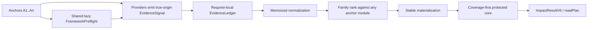

# Java Intelligence V3.2 Sprint 1 多锚点合同与证据收敛报告

> 日期：2026-08-10
> 适用范围：V3.2-08～V3.2-10
> Sprint 决策：`CONTRACT_ACCEPTED_WITH_INHERITED_GAPS`
> 正式机器结果：`BASELINE_RECORDED_WITH_GAPS`
> 正式证据：`/var/folders/yt/10k_hqkn30x18d7lbn28_gnc0000gn/T/codex-java-lsp-isolated-validation-ku4jAX/formal`
> Git 内收据：`docs/phase-v3/v32-sprint1-evidence-receipt.json`
> 独立复验：`docs/phase-v3/v32-sprint1-verification-receipt.json`
> LOC 台账：`docs/phase-v3/v32-sprint1-loc-ledger.json`

## 1. 结论

Sprint 1 已完成三个开发目标：修正公共多锚点合同、建立 request-local `EvidenceLedger`、把三个 framework adapter 的重复前置查询收敛到共享 `FrameworkPreflight`。本轮不是 Token 优化 Sprint；它先修复了会让后续质量和成本优化建立在错误归因上的底层合同。

本轮可确认：

1. relationship、static、persisted/live semantic、support、lexical 和 Spring/MyBatis/MapStruct evidence 都保留真实 `anchorId`，不再把 A2+ 统一冒充为 A1；
2. candidate 对任一 anchor 同模块即可免 cross-module penalty；多 profile 的候选上限采用确定性最大值并受 mode hard cap 约束；
3. anchor 输入顺序不再改变 candidate materialization 和 read plan；同一 candidate 可以覆盖多个 anchor，但同 kind 不会因复制 origin 而重复增加 family score；
4. protected core 先满足每个 anchor 的结构证据覆盖，再进行全局优先级选择；如果预算无法容纳，输出显式 evidence gap，不再静默丢掉 A2；
5. A2 provider 失败只降低对应 provider outcome，已经收集的 A1 evidence 保留；普通 semantic 错误、deadline 与 cancellation 分别聚合为 `FAILED`、`PARTIAL_TIMEOUT` 和 `CANCELLED`；
6. request 内只有一个 `EvidenceLedger` 负责 append、normalize 和缓存失效，避免同一批 typed evidence 被平行 fold；
7. FrameworkPreflight 对 status、build/repository marker 与 fact-marker 做 request-local lazy memoization；runner 另以同一 request 生命周期复用 bounded framework facts，三个 adapter 不再各自重复查询；
8. source-locked candidate 在隔离 clone 中通过 `898/898` 个 compiled tests 和 `71/71` 个 script tests；
9. 三仓 18-cell cold matrix 中，30 个冻结场景全部是单锚点。450 对 old/new attempts 的 candidate path 顺序、完整 read plan、completion 和 round-trip 数全部 0 差异；三仓 Recall、P_read、R_read_must、R_taskBlocking 和 estimatedTokens P50 也完全不变；
10. 三仓 P95 门都通过：lishuedu `1.009×`、cipherlink `1.059×`、exam-parent-v3 `1.010×`；
11. 总体 cold gate 仍为 FAIL，但失败项与 Sprint 0 相同：三仓 aggregate/holdout `R_read_must < 1` 以及 exact range recall 不足。Sprint 1 没有恶化这些缺口，也没有把“保持不变”包装成质量提升；
12. production TypeScript 从 `33,208` 增至 `33,634 LOC`，净增 `426 LOC`（约 `+1.28%`），低于本 Sprint `+5%` 上限；所有净增均绑定 V3.2-31/V3.2-32 偿还门。

因此，Sprint 1 的正确评价是：**公共多锚点内部合同已经可用，单锚点生产结果保持严格选择层 parity，证据与 framework 前置查询有了唯一 request-local ownership；既有 must-read/range 泛化缺口仍需由后续 Sprint 修复。**

## 2. 为什么这一轮是必要的

改造前，公共 `java_impact` schema 接受最多五个 anchors，但内部链路并不真正支持：

- relationship provider 只消费 `anchors[0]`；
- semantic collector 虽查询多个 anchor，却把合并后的 candidate 统一标成 A1；
- support 与三个 framework adapter 同样使用 A1 作为 blanket origin；
- ranker 只以 A1 module 判断 same/cross-module；
- materializer 与 read-plan 按调用者输入顺序插入 anchor；
- protected core 是全局竞争，A1 的高分 evidence 可以吃掉全部 quota，A2 的 must evidence 被静默遗漏。

这意味着多锚点请求存在三类实际风险：

1. **召回错误**：A2 的 relation/framework evidence 根本不生成；
2. **归因错误**：A2 证据被记录为 A1，family saturation、planner protection 和诊断都建立在错误 origin 上；
3. **顺序错误**：交换 A1/A2 会改变候选与 read plan，违反 anchors 作为集合输入的确定性合同。

如果不先修正这些问题，后续对 batch query、quality gain、Token 或 JDT skip 的任何测量都会混入错误归因，无法判断优化是真实收益还是漏算。

## 3. 最终数据流



关键边界：

- `EvidenceSignal.anchorId` 是内部 origin 真源；
- `ImpactResultV6.target` 继续只暴露 primary anchor，公共 wire schema 未扩张；
- `EvidenceLedger` 只存在于单个 request，不成为第三个持久化 cache；
- FrameworkPreflight 只缓存同一 request 内的查询，generation 与跨请求 freshness 仍由 JavaIndex 管理；
- read-plan 的 hard file/byte/core cap 保持有效，覆盖优先不等于绕过预算。

## 4. V3.2-08：多锚点合同修复

### 4.1 Provider origin

| 路径 | 改造后合同 |
|---|---|
| relationship | 对每个 anchor 独立收集；A2 失败时保留已完成的 A1 evidence；continuation path 也以当前 anchor 为上下文 |
| static | implementation dependencies 按 anchor round-robin 后再应用全局上限，避免 A1 宽依赖饿死 A2 |
| persisted semantic | 同一 candidate 按真实 anchor 和每种 semantic kind 发 signal；lookup failure 只降低对应 outcome |
| live semantic | JDT result 保留真实 anchor；普通错误与 deadline 分开聚合 |
| support | request-global support kind 为每个 anchor 复制 origin，但 family saturation 只按 kind 贡献一次 |
| lexical | RG section 必须携带有效 anchorId；未知或缺失 origin 返回 `INVALID_INPUT`，不再回退 A1 |
| framework | Spring/MyBatis/MapStruct pending/resolved evidence 携带真实 origin ids；共享 candidate 可以保留多个 anchor origin |

同一 `(candidate, anchorId)` 上的不同 semantic kind 现在分别进入 typed evidence，而不是只取 `verifiedBy[0]`。这是 V3.2-08 tuple 合同的有意修正；正式单锚点矩阵证明当前 30 个生产场景的 candidate/read-plan 选择没有因此漂移。

### 4.2 Ranking 与 materialization

- `RankContext` 接收所有 anchor modules；candidate 与任一已知 anchor module 相同即视为 same-module；
- 根模块 `module=""` 被保留为有效 identity，不因 truthy 过滤丢失；
- mixed profile candidate limit 采用各 anchor limit 的最大值，再受 mode hard cap 限制；
- anchors 先按 stable path、line、column、role 排序后 materialize；同文件位置也稳定排序；
- public primary target 仍是调用者传入的 `anchors[0]`，只有集合型候选/read-plan 保持交换不变。

### 4.3 Protected core

多锚点 protected-core 采用两阶段选择：

1. coverage phase：按 anchor 为 must/task-blocking structural evidence 预留可用候选；同一 candidate 可以同时覆盖多个 anchors；
2. utility phase：在剩余 quota 内按现有 protected priority、utility、density 和 stable path 继续选择。

若 anchor 文件本身超过 configured maxFiles，anchor 仍按既有强制合同保留；若非 anchor protected evidence 因 hard cap 无法进入，结果产生明确 evidence gap。此设计不通过无限扩展文件数或读取整文件伪造 RangeRecall。

### 4.4 完成语义

本轮明确了 semantic failure 优先级：

- 只有 deadline：`PARTIAL_TIMEOUT`；
- cancellation：`CANCELLED`；
- 发生非 timeout 的真实 backend/provider error：`FAILED`；
- 同时存在普通 error 与另一 anchor timeout：保留更严重的 `FAILED`，不被 timeout 掩盖；
- A2 failure 不删除 A1 已收集 evidence。

这是失败路径的正确性修复，不是正常单锚点成功路径 schema 变化。

## 5. V3.2-09：EvidenceLedger

新增 request-local `EvidenceLedger`，提供：

- typed evidence append；
- normalize-on-read；
- append 后自动失效 normalized snapshot；
- 同一 request 内重复读取复用规范化结果；
- invalid evidence 延迟到 normalize 边界统一失败。

AgentRouter 现在按 provider 顺序把 evidence 追加到 ledger，再从同一 normalized snapshot 进入 rank/materialize/read-plan。它不持久化、不跨 request 共享，也不拥有 JavaIndex 或 semantic edge store 的 freshness，因此没有形成第三个 authoritative truth。

## 6. V3.2-10：FrameworkPreflight

Spring、MyBatis、MapStruct adapter 现在通过共享 preflight 懒加载：

- framework status；
- build/repository markers；
- framework fact markers；
- 失败查询不永久污染后续不同调用。

bounded `frameworkFactsForFiles(files)` 的同参数复用由 runner 持有，生命周期同样严格限定为当前 request；它不是 `FrameworkPreflight` interface 的一部分，也不会跨 request 持久化。

preflight 保留 fail-soft 行为：某一项查询失败时 adapter 可以在已有 facts 上继续并输出降级，而不是把整个 AgentRouter 请求变成不可恢复失败。direct adapter 与 runner 的单锚点 evidence 合同由 Spring、MyBatis、MapStruct parity 测试锁定。

## 7. 测试与验证

### 7.1 正式结果

| Suite | 发现 | 通过 | 失败 | 隔离位置 |
|---|---:|---:|---:|---|
| compiled `dist/**/*.test.js` | 898 | 898 | 0 | detached candidate clone，串行 |
| `scripts/*.test.mjs` | 71 | 71 | 0 | detached candidate clone，串行 |
| three-repo cold matrix | 18 cells / 900 attempts | 全部完成 | 业务 gate 仍有继承缺口 | detached baseline/candidate + 三仓 clone |
| artifact/manifest replay | 1 | 1 | 0 | 第二个 detached candidate clone |

所有正式 TAP、stderr、candidate patch、task ledger、repo/scenario identity 与 raw cells 均由 manifest SHA-256 绑定。dist 和 scripts stderr 均为 0 bytes。

### 7.2 关键行为覆盖

source-locked 898-test suite 至少覆盖：

- relationship/static/persisted/live semantic 的 A1/A2 true-origin；
- A2 provider failure 保留 A1 evidence；
- 同一 anchor + candidate 的多个 semantic kinds；
- support origin 复制但 family score 不放大；
- any-anchor same-module 与 root-module identity；
- mixed profile candidate cap；
- anchor materialization 交换顺序稳定；
- second-anchor protected core、shared candidate 多 anchor coverage；
- unreadable/over-budget evidence gap；
- unknown RG anchor fail-fast；
- FrameworkPreflight 共享 status/marker，runner 共享 bounded facts；
- Spring/MyBatis/MapStruct direct-vs-runner parity；
- EvidenceLedger memoization、append invalidation 与 invalid evidence 边界。

### 7.3 验证过程中的真实失败

本轮没有通过削弱断言制造绿色：

1. 最终审查发现 request-global timeout 会把 A2 的超时错误施加到已完成的 A1 signal；实现改为逐 anchor settlement，并增加 `A1 COMPLETE + A2 deadline` 回归；
2. 第一轮定向验证为 `68/69`，唯一失败是新测试监听了后续 importGraph 的空批次而覆盖先前 24 项 dependency 批次；测试改为捕获真实批次，没有改生产上限或削弱断言；
3. 第二轮定向验证为 `69/69`；
4. 最终正式 source-locked run 为 `898/898`、`71/71`；
5. 独立 replay 在另一个全新 detached clone 中 exit 0，返回 `verificationStatus=PASS`。

## 8. 单锚点严格 parity

三仓冻结输入共 30 rows，均恰好一个 anchor。对 3 仓 × 3 rounds × 10 rows × 5 attempts 的 450 对 old/new 结果重算：

| 比较项 | mismatch |
|---|---:|
| row ids | 0 |
| determinism snapshot | 0 |
| candidate path 集合与顺序 | 0 |
| readPlan 文件、优先级、range 与 reason | 0 |
| completion/freshness snapshot | 0 |
| round trips | 0 |
| aggregate Recall/P_read/R_read_must/R_taskBlocking | 0 |
| project-level estimatedTokens P50 | 0 |

有两类不属于语义 parity 的原始计数字段发生变化：

- `rgRawBytesSuppressed` 在 390 attempts 不同；当前 raw metadata 的 old/new `repoRoot` 相同，差值同时存在正负，因此没有证据把它归因于 clone path 前缀；
- 16 attempts 的 `rawSearchPayload/totalAgentVisiblePayload` 相差 1 byte，其中 7 次导致单次 estimatedTokens 相差 1；另有 1 个 row-level estimatedTokens P50 相差 1。该诊断级 byte variance 的完整原因尚未证明，三仓 project-level Token P50 均保持不变。

这些字段不改变公共候选、read plan、completion、round trips 或质量结果，不能用它们否定选择层 parity，也不能把它们当成 Token 优化收益。

## 9. 三仓 cold 对比

每仓每侧 150 attempts；`standard`；deadline 2,000ms；JDT 强制 `/usr/bin/false`。

| 仓库 | P50 old → new | P50 变化 | P95 old → new | P95 变化 | Token P50 old → new |
|---|---:|---:|---:|---:|---:|
| lishuedu | 36.624 → 39.879ms | +8.88% | 253.008 → 255.369ms | +0.93% | 4,382 → 4,382 |
| cipherlink | 43.161 → 46.691ms | +8.18% | 174.844 → 185.222ms | +5.94% | 3,682 → 3,682 |
| exam-parent-v3 | 68.183 → 66.965ms | -1.79% | 184.851 → 186.769ms | +1.04% | 3,466 → 3,466 |

三仓 P95 都低于 `max(old×1.25, old+50ms)`；没有稳定证据表明 Sprint 1 本身带来性能收益。正确结论是“未观察到 P95 门禁回退”，而不是把 exam-parent-v3 的单次下降归因成 FrameworkPreflight 优化收益。

质量结果完全持平：

| 仓库 | Recall old/new | P_read old/new | R_read_must old/new | RangeCoordinate mean old/new |
|---|---:|---:|---:|---:|
| lishuedu | 0.7923 / 0.7923 | 0.7083 / 0.7083 | 0.9000 / 0.9000 | 0.6343 / 0.6343 |
| cipherlink | 0.8158 / 0.8158 | 0.6433 / 0.6433 | 0.9100 / 0.9100 | 0.8500 / 0.8500 |
| exam-parent-v3 | 0.7095 / 0.7095 | 0.5833 / 0.5833 | 0.8800 / 0.8800 | 0.5525 / 0.5525 |

## 10. 为什么总体 gate 仍失败

失败项与 Sprint 0 相同：

- aggregate `R_read_must < 1`；
- holdout `R_read_must < 1`；
- `RangeLineRecall < 1`；
- `RangeCoordinateRecall < 1`。

六个 holdout must failure 仍是：

| 仓库 | 场景 |
|---|---|
| lishuedu | `exam-score-export-cross-module-holdout`; `paper-task-claim-iam-holdout` |
| cipherlink | `client-release-storage-presign-holdout`; `backend-operation-log-aspect-async-audit-holdout` |
| exam-parent-v3 | `exam-room-print-download-types-persistent-bundle`; `candidate-pay-order-cross-module-admission` |

Sprint 1 的职责是修正归因合同并保证这些缺口不恶化；它没有修改冻结 golden 或调权来制造 PASS。后续 Sprint 必须通过更强的 facts/batch/semantic/read-plan 机制补齐它们。

## 11. Production LOC 与偿还门

| 指标 | Sprint 0 commit | Sprint 1 candidate | delta |
|---|---:|---:|---:|
| files | 130 | 132 | +2 |
| bytes | 1,338,710 | 1,355,798 | +17,088 |
| physical LOC | 33,208 | 33,634 | +426 |

| Task | added | removed | net | 偿还门 |
|---|---:|---:|---:|---|
| V3.2-08 multi-anchor | 352 | 145 | +207 | V3.2-31 |
| V3.2-09 EvidenceLedger | 42 | 8 | +34 | V3.2-31 |
| V3.2-10 FrameworkPreflight | 185 | 0 | +185 | V3.2-32 |

- Sprint 1 上限：34,868 LOC；当前低于上限 1,234 LOC；
- V3.2 最终目标：≤33,208 LOC；后续至少需要净偿还 426 LOC，且还要吸收后续 Sprint 的新增；
- V3.2-31 必须删除 remaining compatibility candidate folds/legacy score consumers；
- V3.2-32 必须根据真实 provider attribution 合并或删除无收益的 framework helpers/diagnostics。

## 12. 隔离合同

所有验证严格与在线 LSP 隔离：

- baseline/candidate 在临时 detached local clone 中构建；
- node_modules 是私有 content-verified copy，不链接或写回在线 checkout；
- 三个 Java repo 使用独立 detached clone；
- HOME、XDG、TMP、JavaIndex cache、JDT data/log、projects config 均位于临时根；
- cold matrix 明确 `JDTLS_BIN=/usr/bin/false`；
- 没有启动、停止、复用或清理在线 MCP/LSP/JDT/JavaIndex 进程、workspace、lease、cache 或 log；
- 当前 checkout 没有执行 `npm run build/clean` 或裸 `node dist/...`；
- 独立 replay 使用第二个临时 detached clone，只读取已生成的 hash-bound artifact。

本轮未运行真实 JDT，因此不能把这些结果外推为 real-JDT multi-anchor 或 first-touch PASS。

## 13. 已知限制与下一步

### 13.1 当前限制

1. 正式三仓 frozen rows 都是单锚点；多锚点真实仓 evidence 目前来自 source-locked tests，而不是 production-like matrix cell；
2. cold matrix 禁用 JDT，未验证 live JDT 多锚点、共享 semantic singleflight 或 first-touch；
3. 六个 holdout must-read 与 exact range 缺口仍未修；
4. raw artifact 只保留在本机临时目录，receipt 保存哈希但不是不可变对象存储；
5. framework preflight 的真实性能收益尚未以 adapter on/off counterfactual 单独测量；本轮只证明合同、复用和无冷态 P95 gate 回退。

### 13.2 Sprint 2 入口条件

下一 Sprint 应在当前合同上实现批量 JavaIndex 查询与边界：

- 定义 typed `FactsForFilesResult`，逐项表达 facts/missing/degraded、generation、completion、truncated；
- relationship facts 批量上限和 deadline 必须显式，不能把整个 pool 无界拉入 foreground refresh；
- implementer batch 保持 resolution/ambiguity/排序与单项路径 parity；
- generation change、malformed item、deadline、超上界必须有回归；
- 继续使用同一 isolated 3-repo matrix，单锚点 candidate/readPlan parity 和六个 inherited gaps 均不得恶化。

## 14. 复验命令

正式 source-locked matrix：

```bash
sh scripts/run-isolated-node.sh scripts/run-isolated-validation.mjs --keep --profile targeted -- \
  node scripts/run-v32-optimization-matrix.mjs \
    --baseline f7f080d \
    --output-dir '{state}/formal' \
    --lishuedu /tmp/codex-java-v3-golden-20260809/lishuedu \
    --cipherlink /tmp/codex-java-v3-golden-20260809/cipherlink \
    --exam-parent-v3 /tmp/codex-java-v3-golden-20260809/exam-parent-v3 \
    --task-ledger /Users/luo/Documents/github/codex-java-lsp-mcp/docs/phase-v3/v32-sprint1-loc-ledger.json \
    --allow-gate-failure
```

独立 artifact replay：

```bash
sh scripts/run-isolated-node.sh scripts/run-isolated-validation.mjs --profile targeted -- \
  node scripts/run-v32-optimization-matrix.mjs \
    --verify /var/folders/yt/10k_hqkn30x18d7lbn28_gnc0000gn/T/codex-java-lsp-isolated-validation-ku4jAX/formal/optimization-manifest.json
```

两条命令都必须通过隔离 wrapper 执行；禁止在在线 checkout 直接构建、运行当前 `dist` 或复用活动 JavaIndex/JDT cache。
