# Java Intelligence V3.2 Sprint 2 JavaIndex 热路径收敛报告

> 日期：2026-08-10
> 适用范围：V3.2-11～V3.2-15，并前置执行 V3.2-31/V3.2-33/V3.2-34 的确定性清理
> Sprint 决策：`BATCHING_ACCEPTED_WITH_INHERITED_GAPS`
> 正式机器结果：`BASELINE_RECORDED_WITH_GAPS`
> 正式证据：`/var/folders/yt/10k_hqkn30x18d7lbn28_gnc0000gn/T/codex-java-lsp-isolated-validation-iopsPv/formal`
> Git 内收据：`docs/phase-v3/v32-sprint2-evidence-receipt.json`
> LOC 台账：`docs/phase-v3/v32-sprint2-loc-ledger.json`

## 1. 直接结论

Sprint 2 达到了它真正负责的目标：在保持候选、read plan 与质量逐样本一致、project-level estimatedTokens P50/P95 不变的前提下，显著减少 JavaIndex 前台 RPC 与重复 hydration，并降低 cold 请求尾延迟。

正式 source-locked 结果如下：

1. JavaIndex RPC 总数从 `14,532` 降至 `8,088`，减少 `44.34%`，超过计划的 `30%` 门槛；
2. 所有存在 baseline JavaIndex RPC 的 30 个冻结场景，其 request P95 从 `225.507ms` 降至 `162.765ms`，改善 `27.82%`，超过计划的 `20%` 门槛；
3. CipherLink `typeReference` phase P95 从 `155ms` 降至 `4ms`，P50 从 `26ms` 降至 `1ms`；
4. 三仓 standard overall P95 均未退化：lishuedu `0.905×`、cipherlink `0.568×`、exam-parent-v3 `0.698×`；
5. 三仓 Recall、`P_read`、`R_read_must`、`R_taskBlocking` 与 project-level estimatedTokens P50/P95 old/new 完全相同；450 个配对样本中有 22 个 candidate estimatedTokens 各减少 1，不能表述为逐样本 Token 完全相同；
6. `QUERY_FILES` 从 `2,706` 降至 `612`（`-77.38%`），`STATUS` 从 `2,250` 降至 `900`（`-60%`），逐项 `QUERY_TYPE` 从 `2,520` 降至 `0`；
7. `QUERY_IMPLEMENTERS` 仍为 `1,680`，但预先冻结的准入测量显示 median fanout=`1`、caller wait P95=`1.113ms`，因此按 V3.2-12 退出条款不新增 `QUERY_IMPLEMENTERS_BATCH`；
8. detached candidate 通过 compiled tests `904/904`、script tests `91/91`，stderr 均为 0 bytes；
9. production TypeScript 相对 Sprint 1 从 `33,634` 降至 `32,850 LOC`（`-784`），回到整个 V3.2 周期固定上限 `33,219` 以下；
10. 相对不可变周期基线 `31,638 LOC` 仍净增 `1,212 LOC`，最终 Sprint 6 仍必须继续偿还，不能把“回到 +5% 内”误写成最终复杂度目标已达成。

因此，本 Sprint 的正确评价不是“所有 V3.2 质量门已通过”，而是：**JavaIndex batching/memo/evidence-native 热路径已经由真实三仓数据证明有价值，选择层严格 parity；继承的六个 holdout must-read/range 缺口仍使 cold 绝对质量门失败。**

## 2. 比较身份与证据边界

### 2.1 Source identity

| 身份 | Commit | Commit tree | Executable tree |
|---|---|---|---|
| V3.2 固定周期基线 | `94c4ebfb1c174b2ac3cab615d986c3061accd2ed` | `60ae785e8af9ac06012452ea41c6b1fe2d3606fd` | 同 commit tree |
| Sprint 2 old | `85a4102e7e34ee42a4b369d773805f4c45687f77` | `af79c0af4802e472b005f63883cda6d90f06ef34` | 同 commit tree |
| Sprint 2 new | base=`85a4102e7e34ee42a4b369d773805f4c45687f77` | `af79c0af4802e472b005f63883cda6d90f06ef34` | `055a8e846cc3df97b767b01a95265153b41a34a6` |

candidate patch SHA-256 为 `612bbf46cba8b86fee9505c6d94f3bb6c9fc42f209c94f428e0cf730f9aa9ab2`。报告不会把 base commit 当成完整 candidate identity；new 的唯一可执行身份是 `base commit + candidate patch + executable tree`。

本报告、机器回执和 LOC 台账是正式运行后的 evidence records，不属于 candidate executable input；它们不会被误算进上述 executable tree，也不会反向改变已运行代码。

cold manifest/verifier 版本为 v6，固定 `requestDeadlineMs=2000`。verifier 会同时拒绝 manifest deadline 漂移、任一 cell metadata deadline 漂移、standard/diagnostic runtime state 缺失或路径重叠，以及 telemetry mode 不是 standard=`0`、diagnostic=`1` 的证据包。

### 2.2 三仓身份

| 仓库 | Commit | Tree | Frozen rows |
|---|---|---|---:|
| lishuedu | `db63b1a7e393edd90449eb013d7d1c4d65c366f2` | `22f0ce444e4cac484de85c8a0bf02240ad70d712` | 8 tuning + 2 holdout |
| cipherlink | `fa433982e92e52dd610650d1e79f2d041179b1d3` | `21a1075c7b211932a4cdb2abf2742521b1eba31f` | 8 tuning + 2 holdout |
| exam-parent-v3 | `f90a0b475f7be2ed003703feecec8195bc7eb976` | `dcdb2024879686451859c64260c7e1f3a4721fa7` | 8 tuning + 2 holdout |

三仓均在私有 detached clone 中执行，source checkout cleanliness 与 status hash 写入 manifest。每个 standard/diagnostic cell 都绑定 repo HEAD、scenario SHA、row ids、runtime tree、candidate patch 和 stderr。

## 3. 最终数据流

```mermaid
flowchart LR
    A["RequestContext budget + generation"] --> M["Request-scoped JavaIndex memo"]
    M --> F["factsForFiles bounded to 70"]
    F --> Q["one refresh + one QUERY_FILES"]
    Q --> R["relationship/static/typeReference evidence"]
    R --> E["typed EvidenceSignal"]
    E --> K["production family rank"]
    K --> P["actual selected read-plan paths"]
    K --> O["internal production-ranking observer"]
    P --> O
    O --> D["diagnostic attribution only"]
```



设计边界：

- memo 只存在于当前 `AsyncLocalStorage` request scope，不进入跨请求 mutable cache；
- generation 是所有 memo key、facts 与 worker response 的一致性边界；
- `factsForFiles()` 的 item 保留调用者输入顺序，并显式表示 `FOUND/MISSING/DEGRADED`；
- diagnostic observer 读取真实 production rank 与真实 `selectedPaths`，不做第二次 shadow rerank；
- standard `ImpactResultV6` schema 与 Token 口径没有增加 RPC telemetry 字段。

## 4. V3.2-11：bounded `factsForFiles()`

### 4.1 合约

`FactsForFilesResult` 包含：

- `generation`；
- `completion`；
- `truncated`；
- 与规范化输入一一对应、保序的 `items[]`；
- 每个 item 为 `FOUND(facts)`、`MISSING(reason)` 或 `DEGRADED(reason)`。

relationship shortlist 的硬上限为 70。超过上限时显式 `truncated=true`；任一 item 非 authoritative、generation 变化或请求 terminal 时，provider 不得继续声称完整结果。

### 4.2 执行语义

新路径先统一规范化和去重，再按 generation 命中 request memo/事实 cache。真正缺失的文件执行一次 bounded foreground refresh，再通过一次 `QUERY_FILES` hydrate。晚到的旧 generation response 不进入 cache；batch 前后都检查 generation high-water。

旧逐文件路径只保留为一个发布周期的 `JAVA_LSP_RELATIONSHIP_FACTS_BATCH=off` 回滚开关。回滚路径也已修正 terminal 语义：首个 deadline/cancellation 后停止 method/framework/definition/facts 和后续 anchor 工作，不能在 worker retire 后重新启动 JavaIndex。

### 4.3 Fail-soft

单文件缺失、parse degraded、coverage 未完成或 malformed result 只降低对应 item，不拖垮健康文件。provider 汇总 typed completion；deadline、cancellation 与普通 backend failure 不互相掩盖。

## 5. V3.2-13：request-scoped query memo

`RouterJavaIndex.withRequestOptions()` 现在持有不可变的 `RequestQueryMemo`：

- key 包含 operation、effective generation 与完整输入；
- `QUERY_ANCHOR`、`QUERY_TYPE(S)`、`QUERY_IMPLEMENTERS`、`QUERY_TYPE_REFERENCERS`、`QUERY_FILES`、`STATUS`、facts/framework facts 等同 request 重复查询共享 in-flight promise；
- rejection 立即驱逐，避免把失败永久缓存；
- generation 改变时 key 不同，旧 Promise 不会被新 generation 复用；
- 不同 request 的 deadline/signal 不共享 memo，也不把某个 caller budget 写入 Router 的共享字段。

这些 operation 收敛与 request memo、facts hydration 合批及 metadata-only plan 的预期一致；正式 sidecar 证明总体 A/B 差异，但未对单个机制做独立消融。

## 6. V3.2-14：typeReference evidence-native

旧 collector 会逐 definition 查询 type、implementer 和 candidate bundle，再把可加分 `CandidateFile` 中间对象折回 evidence。新路径改为：

1. 先生成按 anchor/type priority 排序的 query plan；
2. 批量读取 anchor facts；
3. 使用已有 type id 与 metadata-only type lookup；
4. definitions、references、implementers 直接生成 typed evidence/metadata；
5. terminal outcome 立即停止当前及后续 anchor 工作；
6. 固定 evidence weight，不再让 retired controller/order bonus 泄漏到 family rank。

正式 CipherLink diagnostic phase：

| 指标 | old | new | 变化 |
|---|---:|---:|---:|
| typeReference P50 | 26ms | 1ms | -96.15% |
| typeReference P95 | 155ms | 4ms | -97.42% |
| typeReference max | 160ms | 4ms | -97.50% |

这是同一 10 rows × 3 rounds × 5 attempts、共 150 样本/侧的 source-locked 对比，不使用历史 `128ms` 作为不同时点的伪 paired baseline。

## 7. V3.2-12：明确不实现 implementer batch

计划不是“无条件新增一个命令”，而是先证明 fanout 和 wait 足够高。正式 sidecar 得到：

| 指标 | 结果 | 准入要求 |
|---|---:|---:|
| `QUERY_IMPLEMENTERS` per-request fanout P50 | 1 | 必须 >1 |
| fanout P95 | 12 | 仅用于观察长尾 |
| caller wait P50 | 0.149ms | — |
| caller wait P95 | 1.113ms | 必须 ≥10ms |
| caller wait max | 2.062ms | — |

因此正式退出决策为 `DO_NOT_IMPLEMENT_MEDIAN_FANOUT_LE_ONE`。`QUERY_IMPLEMENTERS` old/new 都是 `1,680`，但继续新增 protocol/client/worker/router command 会提高复杂度，且不能通过预定价值门。本轮没有用少数 fanout=12 的场景推翻总体准入规则。

## 8. V3.2-15：不进入 importGraph/rg 尾部优化

Sprint 2 已通过主要 RPC/P95 价值门，standard 三仓 P95 均改善；没有 source-locked 证据要求再对 importGraph 或 rg pattern 做仓库特化。该条件任务状态为 `NOT_ENTERED`。若后续 telemetry 显示通用 worker processing 或 pattern 重复超过阈值，再单独立项；不能为了继续追求数字而扩大本 Sprint。

## 9. 三仓 standard 结果

口径：`cold-nolsp`、standard、deadline 2,000ms、3 rounds（AB/BA/AB）、5 runs、10 rows/仓；每仓每侧 150 attempts。

| 仓库 | P50 old → new | P50 变化 | P95 old → new | P95 比值 | Token P50 old → new |
|---|---:|---:|---:|---:|---:|
| lishuedu | 39.079 → 21.542ms | -44.88% | 257.871 → 233.289ms | 0.905× | 4,382 → 4,382 |
| cipherlink | 45.675 → 22.838ms | -50.00% | 182.258 → 103.553ms | 0.568× | 3,682 → 3,682 |
| exam-parent-v3 | 69.518 → 20.284ms | -70.82% | 188.882 → 131.915ms | 0.698× | 3,466 → 3,466 |

project-level Token P95 也完全不变：lishuedu `5,813`、cipherlink `5,296`、exam-parent-v3 `6,189`。逐样本层面有 `22/450` 个 candidate 值各减少 1，其余 428 个相同；这不改变项目 P50/P95，也不被包装成 Token 收益。

## 10. Diagnostic RPC value gate

diagnostic pass 与 standard pass 使用不同 HOME/XDG/TMP/process-cache/JDT/cache roots；它不会预热 standard，也不参与 standard estimatedTokens。

| 指标 | old | new | 变化 | 门槛 | 判定 |
|---|---:|---:|---:|---:|---|
| JavaIndex RPC count | 14,532 | 8,088 | -44.34% | 至少 -30% | PASS |
| 30 场景 request P50 | 51.020ms | 23.286ms | -54.36% | 观察项 | MEASURED |
| 30 场景 request P95 | 225.507ms | 162.765ms | -27.82% | 至少 -20% | PASS |
| paired sample/row/quality parity | 450 | 450 | 0 mismatch | 必须一致 | PASS |

主要 operation：

| Operation | old | new | 变化 |
|---|---:|---:|---:|
| `QUERY_FILES` | 2,706 | 612 | -77.38% |
| `STATUS` | 2,250 | 900 | -60.00% |
| `QUERY_TYPE` | 2,520 | 0 | -100% |
| `QUERY_ANCHOR` | 900 | 450 | -50.00% |
| `QUERY_TYPES` | 2,040 | 2,010 | -1.47% |
| `QUERY_IMPLEMENTERS` | 1,680 | 1,680 | 0% |
| `QUERY_TYPE_REFERENCERS` | 840 | 840 | 0% |
| `QUERY_CALLEES_BATCH` | 855 | 855 | 0% |

这张表与 request memo、facts hydration 合批和 metadata-only type plan 的预期一致；它还证明 implementer/reference/callee RPC 未被跳过。由于候选同时包含多项改动，本报告不把总体收益拆分为未经消融的单机制因果贡献。

## 11. 质量门与继承缺口

三仓 old/new 质量完全一致：

| 仓库 | Recall | `P_read` | `R_read_must` | `R_taskBlocking` | quality delta |
|---|---:|---:|---:|---:|---:|
| lishuedu | 0.7923 | 0.7083 | 0.9000 | 0.5721 | 0 |
| cipherlink | 0.8158 | 0.6433 | 0.9100 | 0.4537 | 0 |
| exam-parent-v3 | 0.7095 | 0.5833 | 0.8800 | 0.4502 | 0 |

总体 cold gate 仍为 FAIL，失败项对三仓一致：

- aggregate `R_read_must < 1`；
- holdout `R_read_must < 1`；
- range line recall 未达到完整门；
- range coordinate recall 未达到完整门。

六个已知 holdout 为：

- lishuedu：`exam-score-export-cross-module-holdout`、`paper-task-claim-iam-holdout`；
- cipherlink：`client-release-storage-presign-holdout`、`backend-operation-log-aspect-async-audit-holdout`；
- exam-parent-v3：`exam-room-print-download-types-persistent-bundle`、`candidate-pay-order-cross-module-admission`。

这些缺口 old/new 相同，不能归因于 Sprint 2；也不能因没有回归就称绝对质量 gate PASS。因此 manifest 使用 `allowFailure=true` 记录同一 raw，结果状态为 `BASELINE_RECORDED_WITH_GAPS`，而不是伪造 `PASS`。

## 12. 复杂度与删除

### 12.1 LOC

| 口径 | Files | LOC | Bytes | Inventory SHA-256 |
|---|---:|---:|---:|---|
| 固定周期基线 | 129 | 31,638 | 1,273,211 | `8c3feaba965ca26a9f076608ad5c4e92dc3d074b3e657afbb32316bc17a6e9ea` |
| Sprint 2 old | 132 | 33,634 | 1,355,798 | `5ffc0bc090d38c1d39a58f10c67491124d52afb83f692bf89805cc91017f3b76` |
| Sprint 2 new | 125 | 32,850 | 1,312,822 | `83759618561081633d077afdaa492fb9de6a8842e55d14e9ba3973f73b1933db` |

即时变化：`-7 files / -42,976 bytes / -784 LOC`。累计相对周期基线：`-4 files / +39,611 bytes / +1,212 LOC`。固定周期上限 `33,219`，当前余量 369 LOC；最终目标仍是 `≤31,638`。

### 12.2 前置执行的清理

为避免以新增 telemetry/batching 层无限推高生产体积，本轮同时落地确定性删除：

- V3.2-33：删除 shadow reranker、旧 single-arm matrix/report 链，改用真实 production rank + actual selected paths observer；净 `-826 LOC`；
- V3.2-31：删除无 caller 的 `naming-recall.ts`；`-41 LOC`；
- V3.2-34：删除无 package/README/V3.2 入口的旧 `java-index-benchmark.ts`；`-863 LOC`。

Task 23 的 snapshot/seed/query microbenchmark 报告和 raw artifact 仍作为 Phase 3 历史证据保留。Task36 只替代 mutation 正确性，不能声称完整替代所有历史 microbenchmark；未来修改 snapshot/seed/query 本体时应新增隔离专项 benchmark。

## 13. 隔离验证

所有 build/test/matrix 都由 `run-isolated-node.sh` → `run-isolated-validation.mjs` 启动：

- 当前 checkout 未执行 `npm run build`、未写 `dist`、未启动或停止 MCP/LSP/JDT/JavaIndex；
- candidate 在 detached local clone 中 apply hash-bound patch；
- `node_modules` 是私有 content-verified copy，不回写在线 checkout；
- HOME、XDG、TMP、JDT data/log、Gradle/Maven、JavaIndex cache 全部指向私有临时根；
- cold JDT 明确为 `/usr/bin/false`；
- standard 与 diagnostic 使用两套 manifest v6 验证为完整、绝对且互不重叠的 runtime state；
- 每个 cell 固定 `balanced + fast + 2,000ms`，并由 verifier 对 manifest 与 cell metadata 双重校验；
- standard 禁用 JavaIndex RPC telemetry，diagnostic 启用；两种 mode 均写入 source lock；
- 三个业务仓也复制为 detached clean clone；
- 原始 stdout/stderr、candidate tests、18 standard cells、18 diagnostic cells、task ledger 与 sidecar 共有 81 个 artifact descriptor 被 optimization manifest hash 绑定。

验证结果：

| Gate | 结果 |
|---|---|
| compiled tests | 904/904 PASS |
| script tests | 91/91 PASS |
| standard cells | 18/18 完成，900 attempts |
| diagnostic cells | 18/18 完成，900 attempts |
| production LOC gate | PASS |
| diagnostic RPC value gate | PASS |
| strict cold absolute quality gate | FAIL（继承六 holdout/range 缺口） |
| manifest replay | PASS |

## 14. Artifact 与复验

| Artifact | SHA-256 |
|---|---|
| optimization manifest | `bb5af851723460a5059798785768eb43f4e9f4cd046138bc826b1357dbdc5472` |
| manifest payload | `aa76024ab05fb633e820d79ff0d63cbc32466a59a82b4905ece94558f0764412` |
| cold run manifest | `22d6b41e49f53a892738a0b454362e773ff01657c54d6109aa3525d078ce6442` |
| matrix summary | `c5af9fab3642343c57e8d9ae3d1299de353fb14d8e757d6570951f8fe182bee2` |
| diagnostic sidecar file | `81bdca332533b997c888e688d2da8c4b1a818d5a043de578f74bc8643c3f3c62` |
| diagnostic sidecar payload | `60ef5f2bce0e3dd184a1c5b1aedbe9cfe18bbbd1eaf62a7e9d05a622b1f6a1b0` |
| candidate patch | `612bbf46cba8b86fee9505c6d94f3bb6c9fc42f209c94f428e0cf730f9aa9ab2` |
| frozen task ledger | `6681f236edcf3acffe54830574178410d3ed546043f4eacf1d3de5b31fe40645` |
| compiled-test TAP | `f6590e703cd35fb621b722072e7173e4642611b8ff5641f9ea3c7af5f690ead1` |
| script-test TAP | `044bb3b8a7fa42b6b66abb12cd0b830fc3968235273a9ddf8ad19bfa26a43811` |

manifest replay 在 detached candidate 上返回：

```json
{
  "verificationStatus": "PASS",
  "resultStatus": "BASELINE_RECORDED_WITH_GAPS",
  "coldGatePassed": false,
  "diagnosticRpcGatePassed": true,
  "productionLocGatePassed": true,
  "manifestPayloadSha256": "aa76024ab05fb633e820d79ff0d63cbc32466a59a82b4905ece94558f0764412"
}
```

## 15. 下一步

1. Sprint 3 只针对 `T_anchor_ready/T_module_ready/T_complete` 建 progressive-index gate，不能把本 Sprint steady P95 当首次可用延迟；
2. 六个 holdout/range 缺口继续作为独立质量 debt，不允许后续性能 Sprint 用 `allowFailure` 隐藏新增回归；任何 new-old quality delta 非 0 都必须阻断；
3. relationship batch 回滚开关只保留一个发布周期，稳定后删除旧逐文件分支；
4. Sprint 6 继续执行 V3.2-31/V3.2-32，至少再偿还 1,212 production LOC，最终回到 `≤31,638`；
5. V3.2-12 保持 `DO_NOT_IMPLEMENT`，除非新的 source-locked telemetry 同时证明 median fanout>1 且 caller wait P95≥10ms。
